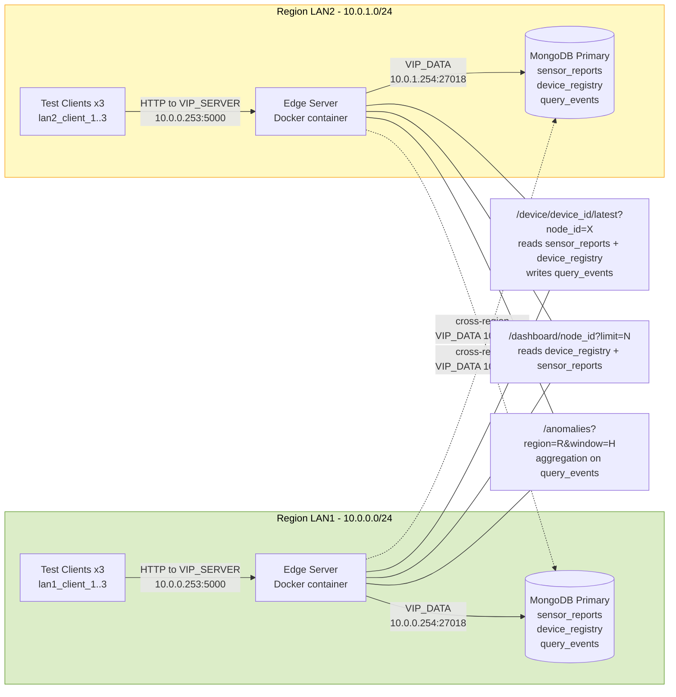

```mermaid
graph LR
    subgraph LAN1["Region LAN1 - 10.0.0.0/24"]
        C1["Test Clients x3\nlan1_client_1..3"]
        ES1["Edge Server\nDocker container"]
        DB1[("MongoDB Primary\nsensor_reports\ndevice_registry\nquery_events")]

        C1 -->|"HTTP to VIP_SERVER\n10.0.0.253:5000"| ES1
        ES1 -->|"VIP_DATA\n10.0.0.254:27018"| DB1
    end

    subgraph LAN2["Region LAN2 - 10.0.1.0/24"]
        C2["Test Clients x3\nlan2_client_1..3"]
        ES2["Edge Server\nDocker container"]
        DB2[("MongoDB Primary\nsensor_reports\ndevice_registry\nquery_events")]

        C2 -->|"HTTP to VIP_SERVER\n10.0.0.253:5000"| ES2
        ES2 -->|"VIP_DATA\n10.0.1.254:27018"| DB2
    end

    ES2 -.->|"cross-region\nVIP_DATA 10.0.0.254"| DB1
    ES1 -.->|"cross-region\nVIP_DATA 10.0.1.254"| DB2

    R1["/device/device_id/latest?node_id=X\nreads sensor_reports + device_registry\nwrites query_events"]
    R2["/dashboard/node_id?limit=N\nreads device_registry + sensor_reports"]
    R3["/anomalies?region=R&window=H\naggregation on query_events"]

    ES1 --- R1
    ES1 --- R2
    ES1 --- R3
    ES2 --- R1
    ES2 --- R2
    ES2 --- R3

    classDef lan1 fill:#dcedc8,stroke:#689f38,color:#000
    classDef lan2 fill:#fff9c4,stroke:#f9a825,color:#000

    class LAN1 lan1
    class LAN2 lan2
```
