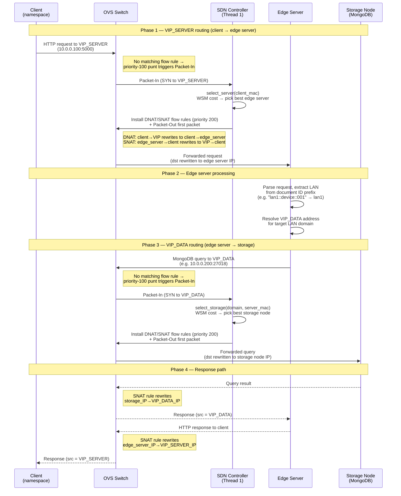

```mermaid
sequenceDiagram
    participant C as Client<br/>(namespace)
    participant S as OVS Switch
    participant Ctrl as SDN Controller<br/>(Thread 1)
    participant ES as Edge Server
    participant DB as Storage Node<br/>(MongoDB)

    Note over C,DB: Phase 1 — VIP_SERVER routing (client → edge server)

    C->>S: HTTP request to VIP_SERVER<br/>(10.0.0.100:5000)
    Note right of S: No matching flow rule →<br/>priority-100 punt triggers Packet-In
    S->>Ctrl: Packet-In (SYN to VIP_SERVER)
    Ctrl->>Ctrl: select_server(client_mac)<br/>WSM cost → pick best edge server
    Ctrl->>S: Install DNAT/SNAT flow rules (priority 200)<br/>+ Packet-Out first packet
    Note right of S: DNAT: client→VIP rewrites to client→edge_server<br/>SNAT: edge_server→client rewrites to VIP→client
    S->>ES: Forwarded request<br/>(dst rewritten to edge server IP)

    Note over C,DB: Phase 2 — Edge server processing

    ES->>ES: Parse request, extract LAN<br/>from document ID prefix<br/>(e.g. "lan1::device::001" → lan1)
    ES->>ES: Resolve VIP_DATA address<br/>for target LAN domain

    Note over C,DB: Phase 3 — VIP_DATA routing (edge server → storage)

    ES->>S: MongoDB query to VIP_DATA<br/>(e.g. 10.0.0.200:27018)
    Note right of S: No matching flow rule →<br/>priority-100 punt triggers Packet-In
    S->>Ctrl: Packet-In (SYN to VIP_DATA)
    Ctrl->>Ctrl: select_storage(domain, server_mac)<br/>WSM cost → pick best storage node
    Ctrl->>S: Install DNAT/SNAT flow rules (priority 200)<br/>+ Packet-Out first packet
    S->>DB: Forwarded query<br/>(dst rewritten to storage node IP)

    Note over C,DB: Phase 4 — Response path

    DB-->>S: Query result
    Note right of S: SNAT rule rewrites<br/>storage_IP→VIP_DATA_IP
    S-->>ES: Response (src = VIP_DATA)
    ES-->>S: HTTP response to client
    Note right of S: SNAT rule rewrites <br/>edge_server_IP→VIP_SERVER_IP
    S-->>C: Response (src = VIP_SERVER)
```
