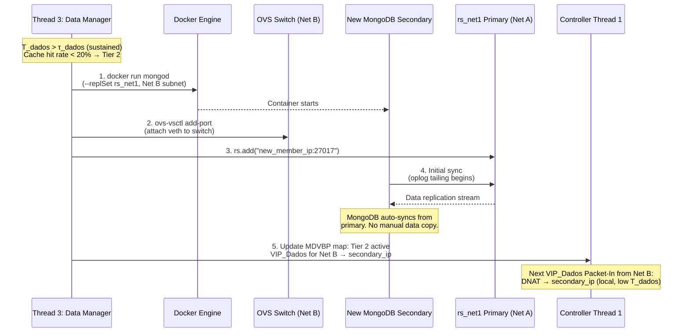
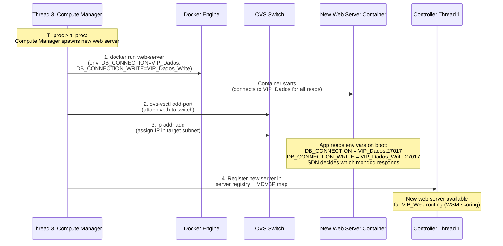

# Controller Scheduling Algorithms — Detailed Reference

This document covers the decision-making logic inside Thread 3 (Elasticity & Placement Manager): the WSM cost function, MBFD heuristic, delay-based scoring rationale, and the full scale-out/scale-in decision trees for both the Compute Manager and Data Manager.

See [system_mechanisms.md](../system_mechanisms.md) for the high-level overview.

---

## WSM Cost Function (VIP_Web Server Selection)

Thread 1 uses this formula on every `Packet-In` for `VIP_Web` to select the best web server:

$$
Cost_j^{web} = \theta \cdot \frac{T_{proc,j}}{T_{proc,max}} + (1 - \theta) \cdot \frac{Hops_j}{Hops_{max}}
$$

- $T_{proc,j}$: recent average compute delay for server $j$ (computed as $T_{total} - T_{dados}$ from sampled metrics).
- $Hops_j$: topological distance from the client's ingress switch to server $j$.
- $\theta$: weight parameter (default tunable). Higher $\theta$ prioritises CPU health; lower $\theta$ prioritises network proximity.

The server with the **lowest** $Cost_j^{web}$ is selected.

### Why Delay Over CPU Percentage

| Signal | Scenario A | Scenario B |
| :--- | :--- | :--- |
| CPU % | 90% — looks saturated | 10% — looks idle |
| $T_{proc}$ | 5 ms — cache-efficient work | 200 ms — thread blocked on slow DB call |
| User impact | None | Severe latency |

CPU percentage is invisible to QoE; $T_{proc}$ directly captures the user-observable compute cost. $T_{dados}$ provides the complementary data-access signal, making the two metrics together sufficient to identify *which* layer is the bottleneck.

---

## MBFD Heuristic — Compute Manager

Triggered when $\overline{T_{proc}} > \tau_{proc}$.

### Steps

1. **Collect** current state: active web servers with their remaining capacity vectors and recent $T_{proc}$ samples.
2. **Filter** eligible servers: only those where the new demand vector fits within remaining RAM/bandwidth and $T_{proc}$ is below saturation.
3. **Score** each candidate (smallest remaining capacity after assignment = tightest fit):

$$
Score_j = \|\vec{S}_{free,j} - \vec{u}_i\|
$$

4. **Assign** to the server with the smallest score. If no server fits → **scale out** (spawn new web server container).
5. When $\overline{T_{proc}}$ drops below $\tau_{proc}$ and a server is idle (no active flow rules) → **scale in** (remove container).

---

## MBFD Heuristic — Data Manager

Triggered when $\overline{T_{dados}} > \tau_{dados}$.

The Data Manager evaluates data placement tier rather than compute capacity. High $T_{dados}$ means web servers are waiting excessively for `VIP_Dados` — the SDN is routing to a remote primary and the cross-network RTT is degrading QoE.

### Tier Decision Table

| Metric | Threshold | Action | Mechanism |
| :--- | :--- | :--- | :--- |
| $T_{dados}$ | $< \tau_{dados}$ | Do nothing | Already routing to local resource or cross-network RTT acceptable |
| $T_{dados}$ | $\geq \tau_{dados}$ | **Deploy Selective Sync Node** | Seed hot collections from remote primary; open per-collection Change Streams; update VIP_Dados DNAT (Tier 1) |
| $T_{dados}$ persists high after Tier 1 | sustained | **Upgrade to full replica** | Decommission sync node; deploy secondary via `rs.add()`; update VIP_Dados DNAT (Tier 2) |
| $T_{dados}$ drops below threshold | — | **Decommission Tier 1 or Tier 2** | Close Change Streams (Tier 1: TTL expires remaining docs) or `rs.remove()` (Tier 2); revert to Tier 0 |

---

## Scale-Out Decision Trees

### Compute Manager Path ($T_{proc} > \tau_{proc}$)

1. Is $\overline{T_{proc}}$ above threshold across the majority of web servers?
   - **Yes** → Scale out compute: spawn a new web server container in the same network (or closest to demanding clients).
   - **When drops below threshold + server idle** → Scale in: remove the container.

### Data Manager Path ($T_{dados} > \tau_{dados}$)

1. Is $\overline{T_{dados}}$ above threshold?
2. **Tier 1 path (Selective Sync Node):** Does the requesting network already have a sync node for this data domain?
   - Yes → Update VIP_Dados routing only.
   - No → **Deploy** Selective Sync Node: access tracking identifies hot collections; seed via `mongodump | mongorestore`; open one Change Stream per hot collection on remote primary; Thread 1 routes `VIP_Dados` to the sync node.
3. **Tier 2 path (Full Replica):** Is $T_{dados}$ still high after the sync node stabilises (sustained demand)?
   - Yes → Decommission sync node; **`rs.add()`** a fresh secondary in the target network. Wait for initial sync. Thread 1 switches `VIP_Dados` DNAT to the secondary once replication lag $< \tau_{sync}$.
   - No → Demand was a transient burst; Tier 1 node decommissions when $T_{dados}$ drops.

---

## Scale-Out: Adding a Replica Set Secondary (Tier 2)



**Notes:**
- The new `mongod` only needs the `--replSet rs_net1` flag.
- `rs.add()` executes on the **primary** of `rs_net1`. The secondary discovers the primary via the replica set protocol and begins oplog tailing automatically.
- The MongoDB driver in web server containers never discovers the replica set topology — it sees only `VIP_Dados`, a single stable address.

---

## Scale-Out: Adding a Web Server Container (Compute Placement)



**Environment variables injected by Thread 3:**

```bash
# All MongoDB reads — single VIP address managed by SDN
DB_CONNECTION="mongodb://10.0.0.200:27017/"          # VIP_Dados

# Write target — always routes to primary (static rule)
DB_CONNECTION_WRITE="mongodb://10.0.0.201:27017/"    # VIP_Dados_Write
```

Using `VIP_Dados` as the single read connection point means:
- **Zero discovery traffic** — the driver never scans replica set members.
- **Zero heartbeat traffic** — no periodic pings to secondary members.
- **SDN retains full authority** — Thread 1 decides which physical `mongod` answers, at the network layer.

---

## Scale-In: Removing Resources

When an existing server has zero active sessions (all flow rules expired via `idle_timeout`), Thread 3 removes it:

1. Verify no active flows reference the server (via OpenFlow stats or session tracking).
2. `docker stop` and `docker rm` the container.
3. `ovs-vsctl del-port` the veth pair.
4. If the removed server was the only consumer of a local data resource (secondary or cache), evaluate `rs.remove()` or cache container shutdown.
5. Update the in-memory MDVBP map.

---

## Data-Coupled Task Scheduling

Both managers perform **Data-Coupled Task Scheduling**: compute and data placement are treated as an inseparable unit. A web server container is never placed on a node that lacks low-latency access to the data it needs. If no local data resource exists, the Data Manager is engaged *before* compute placement proceeds, ensuring the two layers move together to guarantee QoS.
