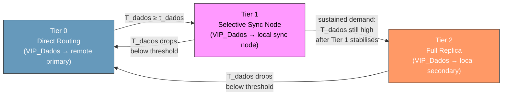
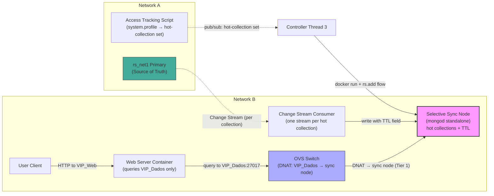
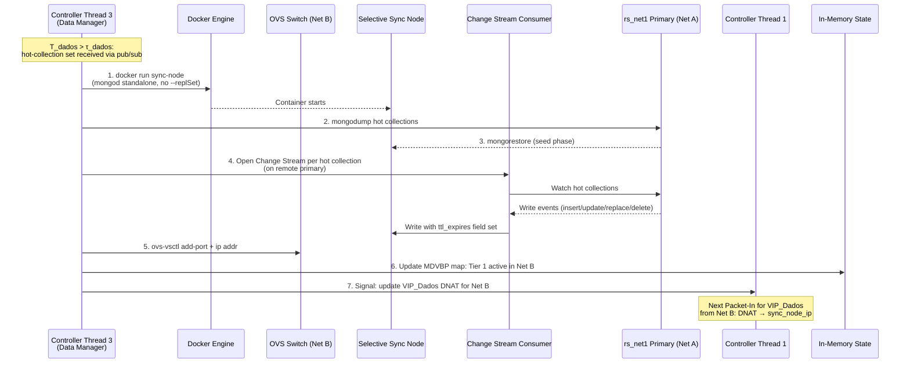

# Data Gravity Tiers — Detailed Reference

This document covers the full mechanics of the three-tier data placement hierarchy: Selective Sync Node deployment, VIP_Dados DNAT configuration per tier, tier transition rules, OpenFlow timeout enforcement, scientific justification, and the smart data retention mechanism.

See [system_mechanisms.md](../system_mechanisms.md) for the high-level overview.

---

## The Data Placement Hierarchy

Thread 3 selects a strategy based on the relationship between request origin and data origin:

| Scenario | Relationship | Strategy | Rationale |
| :--- | :--- | :--- | :--- |
| User A reads Data A | Intra-network | Direct read from primary | Primary is local. Latency is negligible. Syncing adds unnecessary complexity. |
| User B reads Data A (low volume) | Cross-network | Direct routing to remote primary | Demand too low to justify local infrastructure. SDN routes packets. |
| User B reads Data A (burst demand) | Cross-network | **Selective Sync Node** | Primary is remote. High latency. Only hot collections seeded locally; Change Streams keep them current. TTL auto-evicts when demand subsides. |
| User B reads Data A (sustained demand) | Cross-network | **Full replica** (`rs.add()`) | Demand sustained. Full autonomous replication justified; Selective Sync Node decommissioned. |

**Why topology-aware over generic replication:** Intra-network data is never synced because the primary is already <1ms away. The Selective Sync Node is only deployed when cross-network RTT actually degrades QoE, and it replicates only the collections that are actively being accessed — not the full dataset.

---

## Tier Transition State Machine



**Transition rules:**

- **Tier 0 → Tier 1:** $T_{dados} \geq \tau_{dados}$. Deploy Selective Sync Node; Thread 1 updates `VIP_Dados` DNAT to route to sync node.
- **Tier 1 → Tier 0:** $T_{dados}$ drops below threshold. Close all Change Streams; decommission sync node; Thread 1 reverts `VIP_Dados` DNAT to remote primary. Remaining documents expire via TTL.
- **Tier 1 → Tier 2:** $T_{dados}$ remains high after the sync node stabilises (sustained demand confirmed). Decommission sync node; execute `rs.add()` for a fresh full secondary; Thread 1 updates `VIP_Dados` DNAT to local secondary.
- **Tier 2 → Tier 0:** $T_{dados}$ drops consistently below threshold. Execute `rs.remove()`; Thread 1 reverts `VIP_Dados` DNAT to remote primary.

---

## VIP_Dados DNAT Configuration per Tier

The Data Manager updates the MDVBP map in memory; Thread 1 installs the correct DNAT flow on the next `Packet-In` for `VIP_Dados`. No web server containers need restart or reconfiguration:

```bash
# VIP_Dados resolution per network per tier (managed by Thread 1, driven by Thread 3)

# Net B web servers, Tier 0: remote primary
VIP_DADOS_NET_B_DST = "10.0.0.4:27017"     # rs_net1 primary in Net A

# Net B web servers, Tier 1: local selective sync node
VIP_DADOS_NET_B_DST = "10.0.1.15:27017"    # sync_node in Net B subnet

# Net B web servers, Tier 2: local secondary
VIP_DADOS_NET_B_DST = "10.0.1.20:27017"    # rs_net1 secondary in Net B subnet
```

The web server's MongoDB client never changes its connection string. The SDN DNAT rule changes beneath it.

---

## Selective Sync Node Deployment (Tier 1)

The Selective Sync Node is a standalone `mongod` that holds only the collections currently being accessed from the remote primary. It is not a replica set member — it has no `--replSet` flag and carries zero oplog overhead. Ongoing write propagation is handled by a consumer script that tails Change Streams on the primary, one per hot collection.

**Pre-deployment: Access Tracking**

Before Thread 3 provisions the sync node, an Access Tracking Script running alongside the Local MongoDB on the remote domain identifies which collections are hot:

- `db.setProfilingLevel(1)` captures all operations to `system.profile`
- The script aggregates per-collection hit counts over a sliding window
- When a collection’s hit rate from the requesting network crosses the threshold, it is added to the hot-collection set
- This set is published to the controller via pub/sub alongside the telemetry summary

**Deployment sequence:**

1. Thread 3 receives the hot-collection set from the access tracking pub/sub event
2. `docker run sync-node` — standalone `mongod`, no replica set
3. **Seed phase:** For each hot collection, `mongodump | mongorestore` from the remote primary
4. **Stream phase:** For each hot collection, open a dedicated Change Stream on the remote primary; consumer script writes received documents to the sync node with a `ttl_expires` field set
5. Thread 3 attaches the container to the network and updates the MDVBP map
6. Thread 1 installs the new DNAT rule on the next `VIP_Dados` Packet-In

**Dynamic collection management:**

- **New collection crosses threshold:** Seed it via `mongodump | mongorestore`, then open a new Change Stream. Existing streams are untouched.
- **Collection drops below threshold:** Close its Change Stream. Remaining documents expire automatically when their TTL elapses.

**Promotion to Tier 2:**

If $T_{dados}$ remains high after the sync node stabilises (demand is sustained, not a transient burst), Thread 3 decommissions the sync node and issues `rs.add()` for a fresh full secondary. The secondary does a full initial sync from the primary — MongoDB’s autonomous replication takes over from that point.

### Selective Sync Node Architecture



### Selective Sync Node Deployment Sequence



## TTL-Based Document Expiry on the Sync Node

Every document written to the Selective Sync Node by the Change Stream consumer carries a `ttl_expires` field set to the current time plus the configured TTL window. MongoDB’s background TTL thread deletes expired documents automatically:

```javascript
// TTL index created on node provisioning (per collection)
db.col_A.createIndex({ "ttl_expires": 1 }, { expireAfterSeconds: 0 })
// expireAfterSeconds: 0 means: delete as soon as ttl_expires <= now
```

The consumer sets the field on every write:

```python
# Change Stream consumer (per hot collection)
for event in change_stream:
    doc = event["fullDocument"]
    doc["ttl_expires"] = datetime.utcnow() + timedelta(seconds=TTL_WINDOW)
    sync_node_col.replace_one({"_id": doc["_id"]}, doc, upsert=True)
```

**Effect:** When a collection’s Change Stream is closed (demand dropped below threshold), no further writes arrive, and remaining documents expire within one TTL window. The sync node self-cleans without any external eviction daemon.

---

## Global Replication of the ID Index

One lightweight collection, `id_index`, is replicated to **all** primaries at all times. Each document contains only the document ID and its owner domain — no payload data. This allows any web server on any network to resolve the authoritative domain of an arbitrary document ID from a local read, with no cross-network round-trip.

Full document payloads are only replicated cross-network when a Tier 2 promotion occurs (`rs.add()`). This selective replication strategy minimises baseline cross-network traffic: the `id_index` travels everywhere; data travels only when demand justifies it.

---

## How OpenFlow Timeouts Drive Tier Transitions

Tier transitions can only take effect on **new TCP connections** — they cannot redirect established ones. The two timeout parameters on every DNAT flow rule are the enforcement mechanism:

| Timeout | Purpose |
| :--- | :--- |
| `idle_timeout` | Rule expires when no connections arrive within the window → the next connection triggers a fresh `Packet-In` that picks up the new tier. Naturally aligns with the short-lived per-request connection model: idle periods expire rules quickly. |
| `hard_timeout` | Forces rule expiry after a fixed wall-clock period regardless of connection rate → guarantees tier transitions propagate even under sustained, continuous load. Without `hard_timeout`, a high-traffic web server could keep renewing the old rule indefinitely, deferring the tier transition. |

---

## Scientific Justification

1. **Latency vs. completeness trade-off.** For remote data, serving only hot collections locally is sufficient to dramatically reduce $T_{dados}$ during burst demand. Cold collections continue to be served from the remote primary at Tier 0 cost.
2. **Resource bounding.** TTL indexes ensure the sync node self-cleans. Only recently written documents to active collections are retained — the footprint is bounded by the hot-collection write rate multiplied by the TTL window.
3. **Zero oplog overhead.** A full replica set secondary processes the oplog for every write on the primary, even for data never accessed in the target network. The sync node has zero oplog overhead: it receives only writes to collections that have been explicitly identified as hot, via individual Change Streams.
4. **Topology awareness.** Unlike generic caching or full replication that operate indiscriminately, the sync node is activated **only** when the SDN controller detects that `VIP_Dados` response times ($T_{dados}$) exceed the QoE threshold — meaning cross-network RTT is the bottleneck. Network topology is the trigger, not application-level access frequency alone.
5. **Selective replication over autonomous full replication.** The Tier 1 → Tier 2 model distinguishes burst demand (better served by selective sync) from sustained demand (better served by full `rs.add()` replication). This prevents the cost of full oplog replication from being incurred for what may be a transient demand spike.
6. **Controller simplicity.** Thread 3 issues `docker run`, seeds data, opens Change Streams, and updates the MDVBP map. No custom sync protocol, no coordinator: the Change Stream consumer handles ongoing consistency autonomously.
