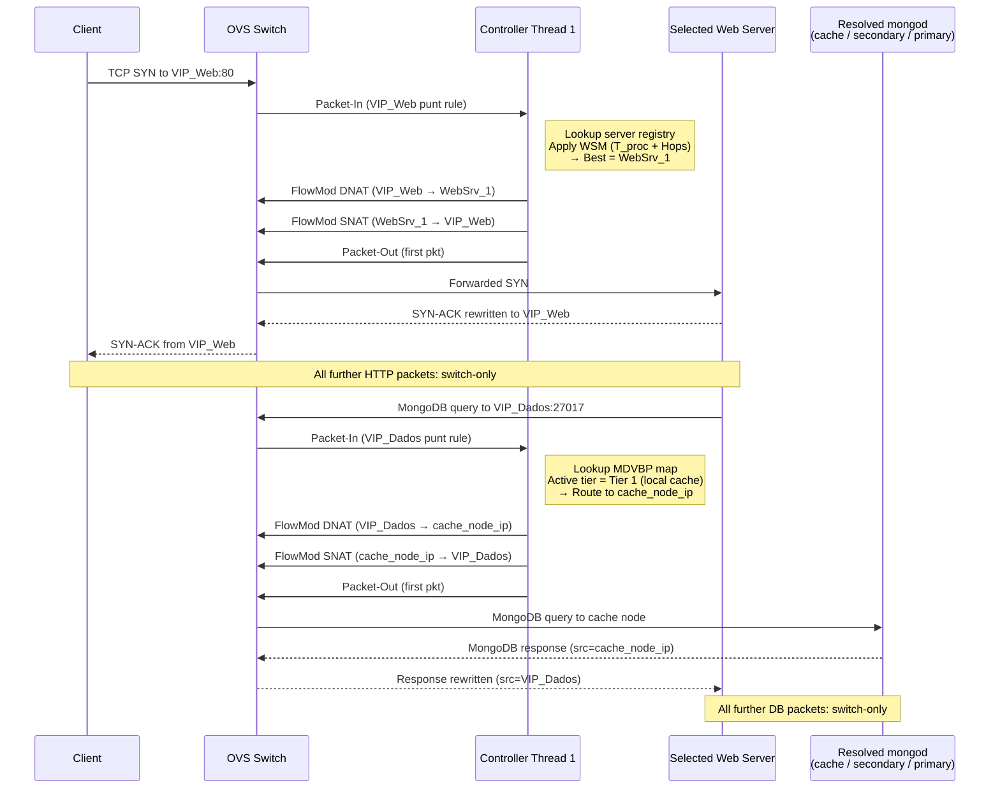
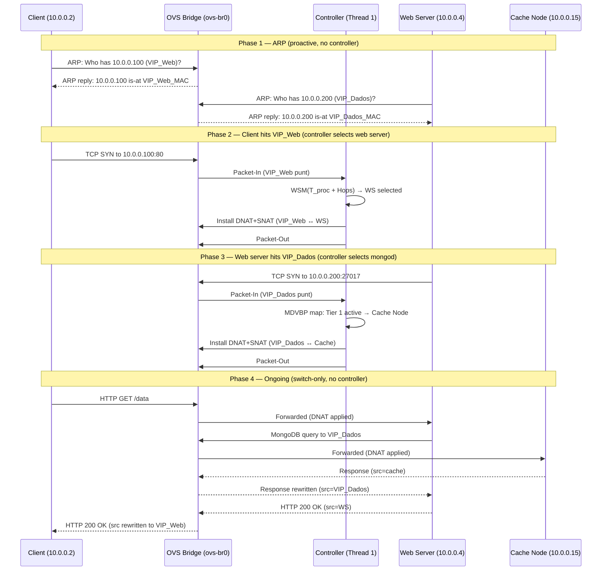

# Double-VIP Routing — Packet-Level Details

This document covers the low-level mechanics of the **Dual Virtual IP** model: how OpenFlow rules are installed, how DNAT/SNAT rewrites work, and the specific design decisions behind the VIP_Web and VIP_Dados traffic paths.

See [system_mechanisms.md](../system_mechanisms.md) for the high-level overview.

---

## VIP Model Overview

| VIP | Address | Traffic Plane | Routing Logic |
| :--- | :--- | :--- | :--- |
| **VIP_Web** | `10.0.0.100:80` | Client → Web Server | WSM cost function weighted by $T_{proc}$ and hop count |
| **VIP_Dados** | `10.0.X.200:27017` (one per domain) | Web Server → MongoDB | Data Gravity tier map (MDVBP) — Tier 0 / 1 / 2 |

The VIP address alone encodes the traffic plane. The SDN match rule is simply `nw_dst=<VIP>` — no deep packet inspection needed.

---

## ARP Handling (Proactive — No Controller Involvement)

Proactive OpenFlow rules answer ARP for both VIPs directly in the switch. The controller is not involved in ARP at any point.

```
ARP rule (VIP_Web):  match(arp, arp_tpa=10.0.0.100) → ARP reply with VIP_Web_MAC
ARP rule (VIP_Dados): match(arp, arp_tpa=10.0.X.200) → ARP reply with VIP_Dados_MAC
```

---

## VIP_Web Path — Step-by-Step

1. A client sends a `TCP SYN` to `VIP_Web:80`. The OVS switch has a punt rule (priority 100, `nw_dst=VIP_Web`) that sends unmatched VIP_Web traffic to the controller.
2. Thread 1 parses the packet headers (source IP/MAC, ingress DPID/port).
3. Thread 1 consults the in-memory server registry (populated by Thread 3) to get the list of active web server containers.
4. Thread 1 applies the $Cost_j^{web}$ formula. The server with the lowest cost is selected.
5. Thread 1 installs two OpenFlow rules (priority 200, `idle_timeout`):
   - **DNAT (forward):** `nw_dst=VIP_Web` → `set_field(server_ip/mac)`, output to next-hop port.
   - **SNAT (return):** `nw_src=server_ip` → `set_field(VIP_Web ip/mac)`, output to client port.
6. Thread 1 sends a `Packet-Out` for the first packet with the DNAT actions applied.
7. All subsequent packets are handled by the switch. When `idle_timeout` expires, the next packet triggers a new `Packet-In` and fresh server selection with updated $T_{proc}$ values.

---

## VIP_Dados Path — Step-by-Step

1. A web server reads the document ID prefix (e.g., `"net2::sensor_xyz_002"` → `"net2"`) and opens a TCP connection to the corresponding domain VIP (e.g., `VIP_Dados_Net2` = `10.0.1.200:27017`). The OVS switch has a punt rule (priority 100, `nw_dst=VIP_Dados_NetX`) that sends unmatched VIP_Dados traffic to the controller.
2. Thread 1 identifies the source web server and its network (DPID).
3. Thread 1 looks up the MDVBP map to determine the active data-gravity tier for the requesting network and domain.
4. Thread 1 selects the target `mongod` endpoint for the current tier (cache IP, secondary IP, or remote primary IP).
5. Thread 1 installs DNAT + SNAT rules (priority 200, match: `nw_src=<web_server_ip>`, `nw_dst=VIP_Dados_NetX` — **no `src_port`**) with both `idle_timeout` and `hard_timeout`.
6. The web server believes it is talking to `VIP_Dados_NetX:27017`. Physically, the bytes flow to whichever `mongod` best serves the current tier.

---

## Why `src_port` Is Intentionally Omitted from VIP_Dados Rules

The DNAT flow rule matches on `nw_dst=VIP_Dados_NetX` and `nw_src=<web_server_ip>` only. The TCP source port is deliberately excluded from the match.

**Rationale:** Omitting `src_port` means a single rule covers every simultaneous connection from one web server to one domain VIP. If `src_port` were included, different concurrent connections from the same web server could be installed at different points in the tier-transition cycle and land on different `mongod` instances — producing inconsistent reads. One rule per `(web server, domain VIP)` pair guarantees all concurrent connections from that server to that domain always reach the same physical endpoint.

---

## TCP Connection Lifecycle and Tier Transitions

Once OVS installs the DNAT rule and the TCP handshake completes, the connection pair `WebSrv:ephemeral_port ↔ mongod_A` is fixed for its lifetime. OVS **cannot** redirect an already-established connection mid-flight. Tier transitions only affect the *next* new connection after the current flow rules expire.

The two timeout parameters on every DNAT flow rule enforce this:

| Timeout | Purpose |
| :--- | :--- |
| `idle_timeout` | Rule expires when no connections arrive within the window → the next connection triggers a fresh `Packet-In` that picks up the new tier. Naturally aligns with the short-lived per-request connection model. |
| `hard_timeout` | Forces rule expiry after a fixed wall-clock period regardless of connection rate → guarantees tier transitions propagate even under sustained, continuous load. Without `hard_timeout`, a high-traffic web server could keep renewing the old rule indefinitely, deferring the tier transition. |

---

## Combined VIP_Web + VIP_Dados Sequence



---

## Full Lifecycle Example (with ARP)


