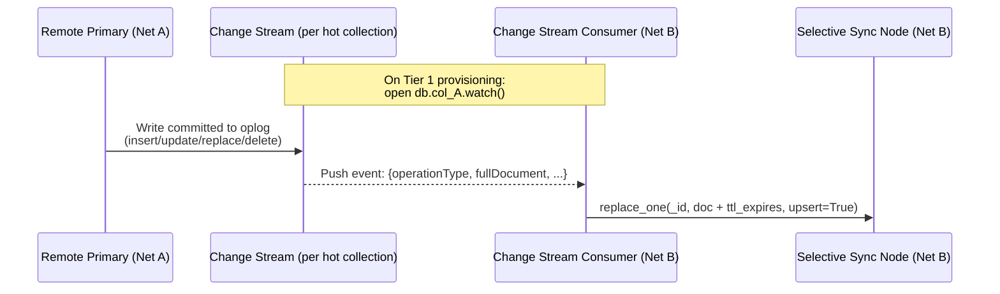
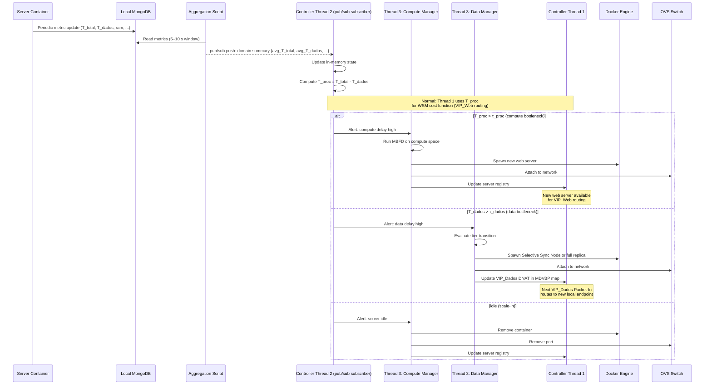

# MongoDB Role and Design — Detailed Reference

This document covers the specific role MongoDB plays in this architecture: why sharding was eliminated, MongoDB's utility as an active infrastructure component, the Local MongoDB metrics schema, Change Streams mechanics, and the full end-to-end data flow.

See [system_mechanisms.md](../system_mechanisms.md) for the high-level overview.

---

## Design Decision: Orchestrated vs. Sharded Design

The architecture was explicitly designed to eliminate MongoDB's native sharding infrastructure in favour of SDN-driven orchestration.

| Component | Sharded Design (Eliminated) | Orchestrated Design (Current) |
| :--- | :--- | :--- |
| Config Server | Required | **Not used** |
| `mongos` Router | Required per container | **Not used** — replaced by `VIP_Dados` SDN rule |
| Zone ranges | Required | **Not used** |
| Shard key | Required (`dpid`) | **Not used** |
| Per-network `mongod` | As shard member | As standalone replica set primary |
| Elasticity trigger | Chunk saturation / manual | **Delay threshold** ($T_{dados}$, $T_{proc}$) |
| Elasticity mechanism | `sh.moveChunk()` (heavy) | Selective Sync Node + `rs.add()` / `rs.remove()` |
| Client entry point | `mongos` URI per container | `VIP_Web:80` — SDN selects web server |
| DB entry point | `mongos` URI per container | `VIP_Dados:27017` — SDN selects `mongod` |
| Bootstrap | Config server + mongos + zones | Two `rs.initiate()` commands |

---

## MongoDB's Utility in This Architecture

MongoDB is leveraged not just as a static data store, but as an active, programmable infrastructure component:

1. **Unstructured data ingestion (Document Model):** The schema-less JSON/BSON document model maps perfectly to heterogeneous edge data (sensor telemetry, service payloads, configuration data) without requiring central schema migrations.

2. **Native TTL indexes:** Power the Tier 1 Selective Sync Node. Documents written by the Change Stream consumer carry a `ttl_expires` field; MongoDB's background TTL thread automatically evicts them when the field expires — providing a self-managing, bounded edge footprint without any external eviction daemon.

3. **Autonomous oplog and replica sets:** When the SDN controller identifies the need for Tier 2 (Full Replica), it simply issues an `rs.add()` command. MongoDB's autonomous oplog tailing immediately handles cross-network consistency — no manual data copy.

4. **VIP-based connection control (`VIP_Dados`):** Routing all server-to-MongoDB traffic through a Virtual IP controlled by the SDN structurally prevents the MongoDB driver from performing topology discovery or heartbeat scanning. The driver sees a single stable address; the SDN engine decides which physical `mongod` answers. This is architecturally stronger than application-level `directConnection=true` because the isolation guarantee is enforced at the network layer, independent of driver behavior or configuration drift.

5. **Change Streams for Tier 1 storage sync:** The Change Stream consumer on a Tier 1 Selective Sync Node opens one Change Stream per hot collection on the remote primary. Write events are received in real-time and applied locally with a TTL field — zero polling, ordered delivery, resumable on reconnect. This is also how the Access Tracking Script tails `system.profile` on the local MongoDB to identify hot collections.

6. **Concurrent read/write performance:** Handles diverse edge workloads (data-intensive reads and transactional writes) while maintaining high availability via local primary ownership.

---

## Local MongoDB — Metrics Schema

Each network’s Local MongoDB stores a `metrics` collection. Each document represents the latest delay and resource snapshot of one web server:

```json
{
    "_id": "server_1",
    "network": "net_1",
    "T_total_ms": 42.0,
    "T_dados_ms": 35.0,
    "ram_percent": 62.0,
    "storage_percent": 30.5,
    "active_connections": 12,
    "timestamp": "2026-02-28T10:30:00Z"
}
```

- `T_total_ms`: wall-clock time from HTTP request receipt to response sent.
- `T_dados_ms`: time the server spent blocked on `VIP_Dados:27017`.
- Thread 2 does **not** read this collection directly. The Aggregation Script reads it every 5–10 s, computes windowed averages, and pushes the summary to the controller via pub/sub.

Every server writes to this collection at a regular interval. Because the write uses `_id` as the key, the document is replaced in-place (not appended), keeping the collection size proportional to the number of active servers — never growing unboundedly.

---

## Change Streams — Tier 1 Storage Sync

MongoDB Change Streams are used by the Tier 1 Selective Sync Node to receive writes from the remote primary in real-time. One Change Stream is opened per hot collection; events are written to the local sync node with a TTL field.



**Key properties:**

- **Push-based:** Zero polling. The consumer blocks until the next event arrives.
- **Ordered:** Events arrive in oplog commit order.
- **Resumable:** On reconnect, resume from `resumeToken` without missing events.
- **Per-collection isolation:** Each hot collection has its own stream. Adding a collection opens a new stream; removing one closes it — no disruption to other streams.

---

## Full End-to-End Data Flow

The complete cycle from server metric generation to controller action:


