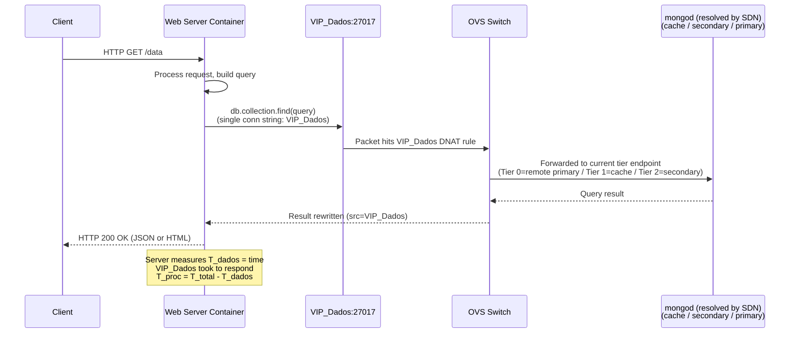
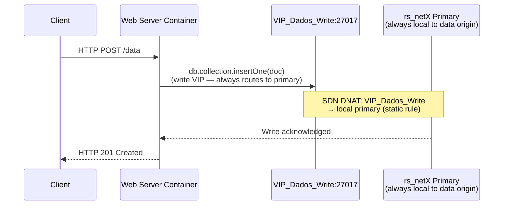
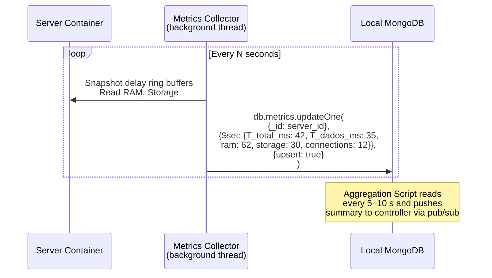
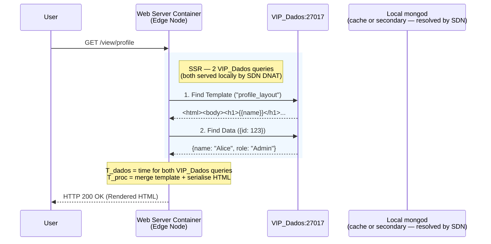
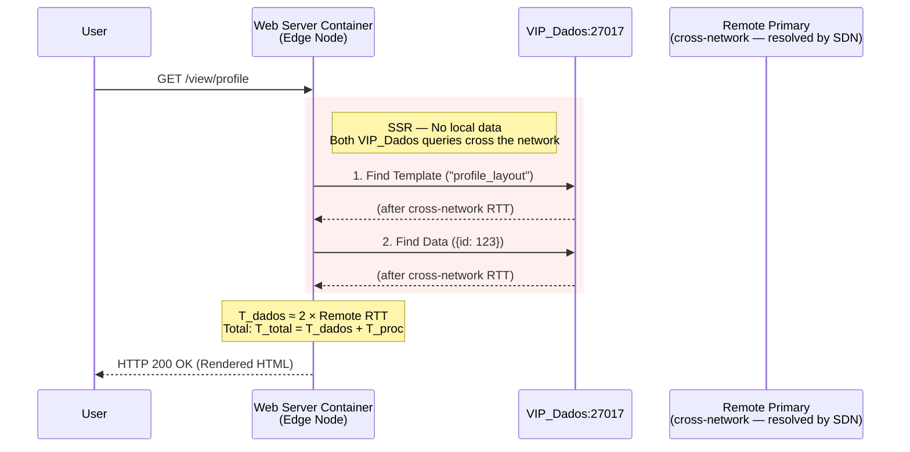

# Server Container Internals — Detailed Reference

This document covers the internal logic of the web server (application) containers: request processing flow, write path, metrics reporting, and the dual-mode operation (Data Proxy vs. Server-Side Rendering).

See [system_mechanisms.md](../system_mechanisms.md) for the high-level overview.

---

## Request Processing — Reads

When a web server container receives an HTTP request (routed via `VIP_Web` DNAT rules), it determines the authoritative data domain by reading the prefix embedded in the document ID:

```
"net2::sensor_xyz_002"  →  domain = "net2"  →  VIP_Dados_Net2 (10.0.1.200:27017)
```

This resolution is zero-cost: no directory query, no controller round-trip, no extra RTT — the routing information is baked into the document ID at write time.

The server opens a TCP connection to the resolved domain VIP and issues its MongoDB query. The SDN transparently routes this connection to the correct physical `mongod` based on the current data-gravity tier. **The application has no knowledge of which tier is active or of the physical `mongod` address.**



**Key insight:** The application code is identical regardless of which tier is active. No conditional connection string selection, no `DB_CONNECTION_REMOTE_A` vs `DB_SOURCE_REMOTE_A`. One query to `VIP_Dados`; the SDN decides where it goes. Routing intelligence lives in the network layer, not the application layer.

---

## Request Processing — Writes

Writes go to `VIP_Dados_Write:27017`. The SDN routes this VIP to the **primary** of the data-origin replica set via a static DNAT rule — no dynamic selection needed. Writes are always local to the data's origin network by design.



The separation of read VIP (`VIP_Dados`) from write VIP (`VIP_Dados_Write`) allows the two routing policies to evolve independently.

---

## Short-Lived Connection Model

Each server handles client requests in a **dedicated thread** following a short-lived connection model:

```
open connection → execute query → return response → close connection
```

Connection lifetime equals HTTP request lifetime. No connection pool management is required, and tier transitions take effect on the very next HTTP request after an OVS flow rule expires.

---

## Metrics Reporting

Each server container runs a background process (or periodic timer) that collects resource utilization and delay measurements and writes them to the **Local MongoDB** of its network domain.

### Metrics Collected

| Metric | Source | Unit |
| :--- | :--- | :--- |
| $T_{total}$ | Request timer (recv → send) | Milliseconds |
| $T_{dados}$ | MongoDB query timer (VIP_Dados) | Milliseconds |
| RAM usage | `/proc/meminfo` or `psutil` | Percentage (0–100) |
| Storage usage | `df` or `shutil.disk_usage` | Percentage (0–100) |
| Active connections | Application counter | Integer |

$T_{proc} = T_{total} - T_{dados}$ is computed by Thread 2 upon receiving the sample. The server only measures and reports the two raw timers.

### Reporting Flow



The server uses `updateOne` with `upsert: true` keyed by its own `server_id`. This ensures a single document per server (no unbounded growth). The Aggregation Script reads the collection on a windowed schedule and pushes summaries to the controller.

---

## Dual-Mode Operation (Data Proxy vs. SSR)

The server implements **dual-mode** operation based on the requested URL path. Since `VIP_Web` uses port 80 for all traffic, intent is encoded in the path rather than the destination port.

### Mode A — Raw Data Proxy (`GET /api/...`)

- **Action:** Single DB query to `VIP_Dados` → return JSON.
- **Use case:** IoT sensors, mobile app data sync, machine-to-machine APIs.
- **Bottleneck:** Strictly $T_{dados}$. $T_{proc}$ is negligible.

### Mode B — Dynamic HTML Composition (`GET /view/...`)

- **Action:** Server-Side Rendering (SSR).
- **Workflow:**
  1. **Fetch Template:** Query `VIP_Dados` for the HTML skeleton (e.g., `layout_main`) from the `templates` collection.
  2. **Fetch Content:** Query `VIP_Dados` for the specific data (e.g., `user_profile`) from the `data` collection.
  3. **Merge (Compute):** Lightweight templating engine injects data into HTML placeholders ($T_{proc}$ contribution).
  4. **Response:** Return `Content-Type: text/html`.

This dual-mode design generates **1–2 `VIP_Dados` queries per request**, keeping the system demonstrable and measurable.

---

## SSR Latency Amplification Effect

Dynamic rendering introduces a **latency amplification effect**. A single HTTP GET triggers 2 `VIP_Dados` queries. This makes the Data Gravity mechanism disproportionately more valuable for SSR workloads:

| Scenario | $T_{dados}$ | Effect |
| :--- | :--- | :--- |
| No Data Gravity (Tier 0) | $\approx 2 \times \text{Remote RTT}$ | Double cross-network penalty |
| Tier 1 (Selective Sync Node) | $\approx 2 \times \text{LAN latency}$ | Benefits compound |
| Tier 2 (Full Replica) | $\approx 2 \times \text{LAN latency}$, zero misses | Maximum benefit |

This amplification effect is the strongest empirical argument for topology-aware data placement: the system does not just move bytes — it enables **edge compute** that would otherwise be impractical at acceptable latency. The $T_{dados}$ metric directly measures this effect, and the SSR case amplifies the signal by a factor of 2, making tier transitions faster and more decisive.

### SSR Flow — With Local Data (Tier 1 or Tier 2)



### SSR Flow — No Local Data (Tier 0)

When no local data resource has been deployed, `VIP_Dados` routes to the remote primary. The latency penalty is clear and measurable:



The contrast between these two sequences — $T_{dados} \approx 2 \times \text{LAN latency}$ vs. $T_{dados} \approx 2 \times \text{Remote RTT}$ — is the measurable proof point for the Data Gravity mechanism and the direct trigger for the tier transition logic in Thread 2.
