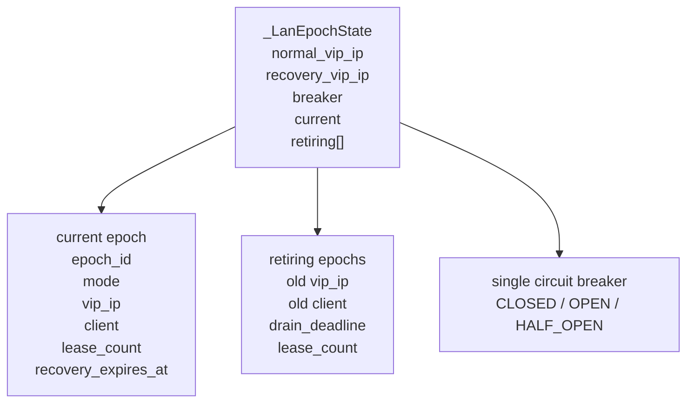
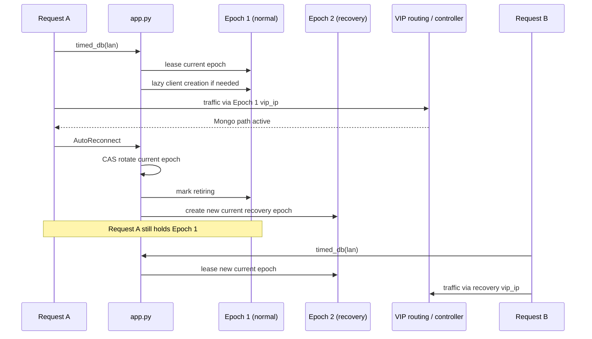
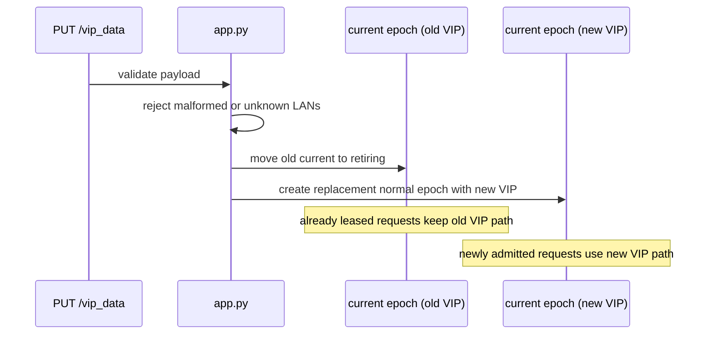
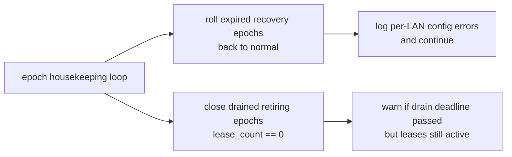

# Edge Storage Connection Epoch Visuals

This note captures the implemented edge-server epoch model visually so the
request boundary, cutover behavior, and housekeeping responsibilities stay easy
to reason about.

Related references:

- [vip_routing_overview.md](../vip_routing/vip_routing_overview.md)
- [system_mechanisms.md](../system_mechanisms.md)
- [vip_data_recovery_flow_session_plan.md](../vip_routing/implementation/vip_data_recovery_flow_session_plan.md)

## 1. LAN-Scoped Runtime Ownership

What this means:

- one LAN owns one breaker and one lifecycle lock
- the current epoch is the path for newly admitted requests
- retiring epochs keep old requests alive until their leases drain

## 2. Request Lease and Failure Rotation

Key property:

- old and new requests can overlap without sharing the same mutable client
  state after rotation

## 3. VIP Update Cutover

## 4. Housekeeping Ownership

The important separation is that request-end hooks no longer own recovery
rollback. They only accumulate and log `T_dados`; housekeeping owns bounded
recovery expiry and drained-epoch cleanup.

## 5. Rationale Snapshot

Epoch began as a way to reduce the blast radius of a damaged shared MongoDB
client. It became the owning abstraction for request attribution, bound VIP
selection, recovery lifecycle, `/vip_data` cutover, breaker installation, and
cleanup because those responsibilities have to move together for overlapping
failures and VIP updates to stay coherent.