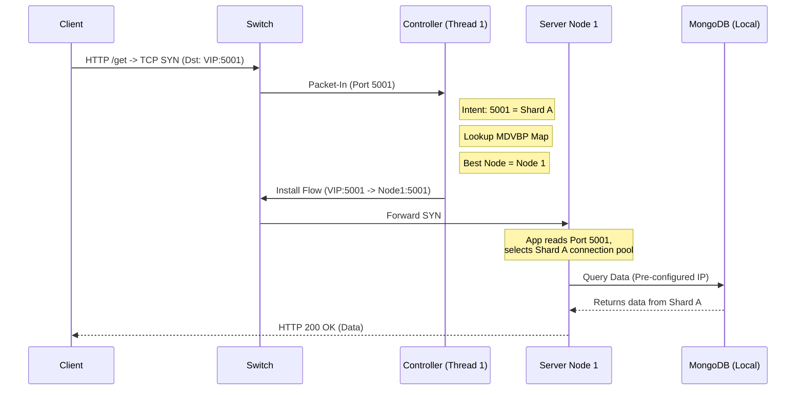
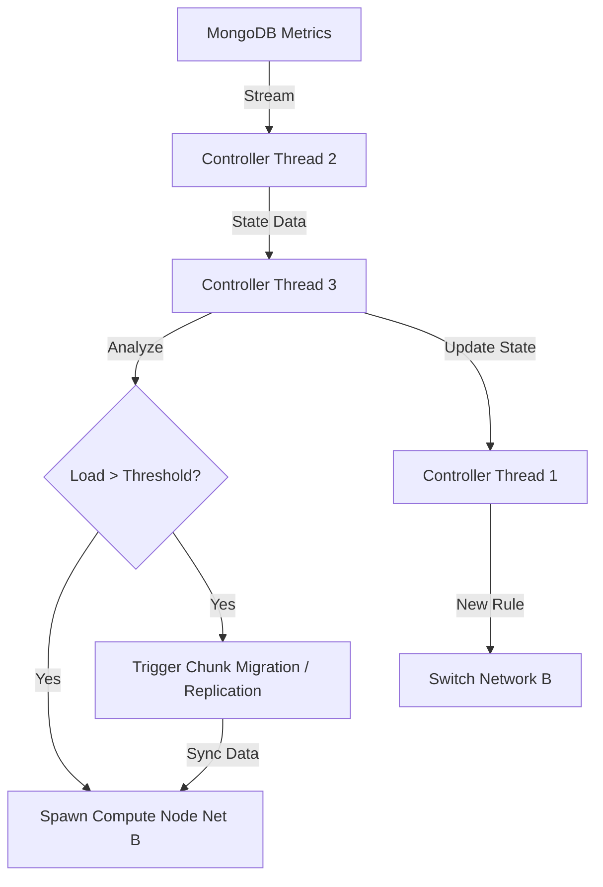
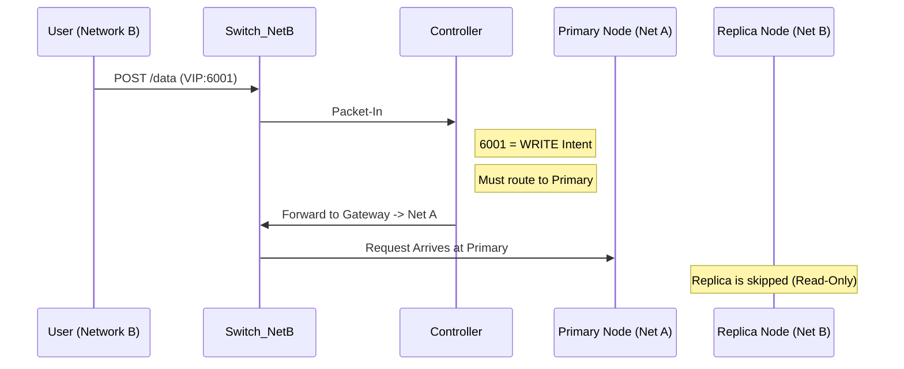

# System Architecture & Operational Logic

## Refined Project Title & Concept

**Thesis Title Proposal:**
*“Deterministic Cross-Layer Orchestration for Data-Gravity-Aware Edge Computing: A Low-Latency SDN Framework.”*

**Conceptual Definition:**
This is a **cross-layer orchestration framework** (Network Layer + Application Layer) designed to achieve **data-aware load balancing** and **scalable edge elasticity through SDN central view**. It prioritizes **deterministic latency** over stochastic optimization, ensuring predictable performance for real-time applications by decoupling the *decision plane* (SDN) from the *data management plane* (MongoDB).

---

## 1. Core Objectives

1. **Fast Decisions (Low Latency):** The network controller must route packets instantly without complex calculations. It should effectively "memorize" the best path rather than "thinking" about it every time.
2. **Smart Routing (Data Gravity):** Don't just send traffic to any free server. Send it to the server that *closest* to the data the user needs (e.g., the primary database or a local copy).
3. **Predictable Performance (Determinism):** Avoid unpredictable AI/ML "black boxes." Use clear, mathematical rules (Control Theory) to ensure the system behaves stably and predictably.
4. **Independent Scaling:** The "Brain" (Controller) and the "Memory" (Database) scale separately. The "Body" (Server Containers) grows or shrinks automatically based on how much data is being accessed.

---

## 2. Novelty vs. State of the Art (SoA)

| Feature                          | State of the Art (Typical Edge Approaches)                                                                                             | **Your Proposed System**                                                                                                                                                                            |
| :------------------------------- | :------------------------------------------------------------------------------------------------------------------------------------- | :-------------------------------------------------------------------------------------------------------------------------------------------------------------------------------------------------------- |
| **Routing Logic**          | Network-agnostic (Round-Robin) or purely Server-aware (Least-Connection). Ignores data location and network topology.                  | **Holistic Context-Aware Routing:** Routing decisions simultaneously evaluate Network Cost (latency/hops), Server Load (CPU/RAM), and Data Location (Shard mapping) without Deep Packet Inspection. |
| **Elasticity & Placement** | Reactive scaling of compute resources (VMs/Containers) independent of data storage. Data replication is static or handled out-of-band. | **Coupled Compute-Data Elasticity:** The system dynamically adjusts resources to demand while actively orchestrating data replication and placement strategies (Data Gravity) to minimize latency.  |
| **Optimization**           | Deep Reinforcement Learning (DRL) or Genetic Algorithms. Harder to implement for lower latency decision making.                        | **Deterministic Heuristics (MDVBP):** Uses Multi-Dimensional Vector Bin Packing for placement and Weighted Sum Model (WSM) for routing. Fast, transparent, and stable.                              |

---

## 3. System Components

### A. The Three-Thread Controller ( The "Brain" )

This is a Python-based Ryu SDN application running on the management plane.

* **Thread 1 (Real-Time Scheduler - The "Fast Path"):**

  * **Role:** Handles packet switching and real-time routing decisions using the **Weighted Sum Model (WSM)**.
  * **Input:** TCP SYN packets.
  * **Logic:** Consults the in-memory assignment map generated by Thread 3. Uses a lightweight cost function based on WSM ($Cost = \theta \cdot Load + (1-\theta) \cdot Latency$) to effectively tie-break among eligible nodes pre-selected by MDVBP.
  * **Action:** Installs OpenFlow rules (Flow Mod) to route the user to the selected server.
  * **Constraint:** Strictly Non-blocking. No DB queries or script executions; relies entirely on pre-computed in-memory state.
* **Thread 2 (Telemetry & State Monitor - The "Observer"):**

  * **Role:** Continuous monitoring of infrastructure and data state.
  * **Input:** MongoDB Change Streams (Server Metrics: CPU, RAM, DB load) and Config Server queries (Shard distribution).
  * **Logic:** Aggregates metrics and maintains a real-time, in-memory view of the global state (Network + Compute + Data) accessible by Thread 1.
  * **Action:** Triggers Thread 3 when thresholds are breached.
* **Thread 3 (Elasticity & Placement Manager - The "Slow Path"):**

  * **Role:** Infrastructure Mutation and Lifecycle Management using **Multi-Dimensional Vector Bin Packing (MDVBP)**.
  * **Input:** Threshold breach alerts from Thread 2.
  * **Logic:** Runs the MDVBP algorithm to determine scaling (spawn/kill containers), placement (where to put them), and data placement (add/move MongoDB Replicas) strategies to minimize active nodes and fragmentation.
  * **Action:** Spawns Docker containers; Adds/Moves MongoDB Replicas acting as the "Strategic Planner".

### B. The Infrastructure ( The "Body" )

* **Programmable Containers (Docker):** Lightweight server nodes that run the application logic.
* **MongoDB Sharded Cluster:**
  * **Config Servers:** Store metadata.
  * **Shards (Replica Sets):** The actual data storage units.
* **SDN Switches (OVS):** The data plane devices executing the flow rules.

### Notes:

- The controller maintains a mapping of which switch port allows for reaching each server.
- Server-to-database connections are pre-configured by Thread 3 during node spawning, ensuring Thread 1 never blocks to execute configuration scripts.

---

## 4. Operational Scenarios & Diagrams

### Scenario A: The "Low-Latency" Read Request (GET)

**Goal:** A client wants to read data from Shard A. The system must route them to the nearest valid replica without blocking the controller or causing concurrency race conditions.

1. **Client** sends `HTTP /get` which initiates a `TCP SYN` to `VIP:5001` (5001 indicates Intent: "Read Shard A").
2. **Switch** sends `Packet-In` to **Controller (Thread 1)**.
3. **Thread 1** identifies the intent (`Port 5001` $\rightarrow$ `Shard A`) and user vector. It consults the in-memory MDVBP map and selects `Best_Node = Node_1`.
4. **Thread 1** installs Flow Rule: `Match: Dst=VIP:5001` $\rightarrow$ `Action: Mod_Dst=Node_1_IP` (preserving the 5001 destination port).
5. **Node 1** receives the request on port 5001. Because the application inside Node 1 is "Context-Aware," it uses its pre-established connection pool for Shard A to retrieve the data, avoiding any runtime configuration or concurrency race conditions.
6. **Node 1** responds. Switch rewrites Source IP back to VIP (Reverse NAT).

---

### Scenario B: Data Gravity & Elasticity (The "Shift")

**Goal:** Too many users in Network B are requesting specific data (e.g., a specific chunk of Shard A). The system must move the data closer to the users to reduce latency.

1. **MongoDB** metrics show high read latency for a specific data chunk from Network B.
2. **Controller (Thread 2)** detects threshold violation via **Change Stream** and passes state to **Thread 3**.
3. **Thread 3** triggers **Infrastructure Mutation**:
   * Spawns `Node 2` (Compute) and a new `Mongo_Replica` in Network B.
   * Executes MongoDB commands to either add the new replica to the existing Shard (`rs.add()`) OR trigger a **Chunk Migration** (`sh.moveChunk()`) to a Shard already residing in Network B.
4. **MongoDB** replicates the data/chunk to Network B.
5. **Thread 3** updates the global state (accessible by Thread 1) to reflect that the specific data chunk is now available locally in Network B.

---

### Scenario C: Write Request (POST) - Consistency Guarantee

**Goal:** A client wants to *write* data (POST). Writes must always go to the **Master/Primary** node of the Replica Set to ensure consistency.

1. **Client** sends `TCP SYN` to `VIP:6001` (6001 indicates Intent: "Write Shard A").
2. **Controller (Thread 1)** identifies the intent (`Port 6001` $\rightarrow$ `Shard A Primary`) and calculates the cost function to find the best path to the Primary node.
3. Even if the User is in Network B, and there is a replica in Network B, the controller **must** route to the Primary in Network A (or wherever it currently is).
4. **Novelty:** The controller is "Data-State Aware." It distinguishes between *Read Replicas* (High Availability) and *Write Primaries* (Consistency).

---

## 5. Resource Allocation Strategy: Multi-Dimensional Vector Bin Packing (MDVBP)

To achieve the elasticity and placement goals defined in Thread 3, the system employs **Multi-Dimensional Vector Bin Packing (MDVBP)**. This approach allocates user requests (each with multiple resource requirements) to a minimum number of edge servers while respecting QoS constraints and data gravity.

### A. Objective and Rationale

- **Energy Efficiency:** Directly targets energy efficiency by minimizing the number of active edge servers while meeting per-user QoS.
- **Edge Characteristics:** Captures heterogeneous servers, multiple resource types (CPU, RAM, bandwidth, storage), and dynamic arrivals/departures.
- **Data Gravity Alignment:** Places compute close to where data resides, minimizing active infrastructure without sacrificing latency.
- **Multi-Dimensionality:** Unlike single-dimensional load balancing (e.g., least connections), MDVBP respects multiple dimensions simultaneously to avoid resource bottlenecks.
- **Differentiation from Routing:** MDVBP is the **Strategic Planner** (Thread 3) that builds the map of *where resources exist* and *where users can go* (Placement). The Weighted Sum Model (WSM) is the **Tactical Router** (Thread 1) that chooses *which specific valid resource to use* right now based on real-time conditions (Routing).

### B. Model: Vectors, Capacities, and Constraints

- **Items (User Requests/Sessions):** Demand vector $\vec{u} = [u_{\text{cpu}}, u_{\text{ram}}, u_{\text{bw}}, u_{\text{storage}}]$
- **Bins (Edge Servers):** Capacity vector $\vec{S}_j = [S_{\text{cpu},j}, S_{\text{ram},j}, S_{\text{bw},j}, S_{\text{storage},j}]$
- **Data Gravity Constraint:** A given shard or data context must be deliverable from the chosen server (i.e., the server hosts or can access the required data).
- **Decision Variable:** For each item $i$, assign to a server $j$ such that, for all dimensions $d \in \{\text{cpu}, \text{ram}, \text{bw}, \text{storage}\}$:
  $$
  \sum_{i \text{ assigned to } j} u_{i,d} \le S_{d,j}
  $$
- **Objective:** Minimize the number of active servers (primary) and minimize residual capacity fragmentation or QoS violation (secondary).

### C. Algorithmic Approach: Multi-Dimensional Best-Fit Decreasing (MBFD)

Since MDVBP is NP-hard, a deterministic heuristic is used for real-time edge environments:

1. **Filter:** Only consider servers $j$ where $\vec{u}_i \le \vec{S}_{\text{free},j}$ component-wise.
2. **Score:** Compute a "fit" score that prefers the tightest fit. For example, minimizing the remaining capacity:
   $$
   \text{Score}(j) = \|\vec{S}_{\text{free},j} - \vec{u}_i\|
   $$
3. **Assign:** Pick the $j$ with the smallest score. If no candidate exists, spawn a new edge server (elasticity).
4. **Update:** $\vec{S}_{\text{free},j} \leftarrow \vec{S}_{\text{free},j} - \vec{u}_i$.
5. **Optimize:** If a server becomes empty, power it down.

### D. System Integration

- **Thread 2 & 3 (Elasticity Manager):** Uses MDVBP as its core decision engine. It takes active servers, incoming demands, data gravity state, and QoS priorities as inputs.
- **Outputs:** Assignment decisions (which server hosts a session) and scaling actions (spawn containers, migrate data, turn off idle servers).
- **Data Plane Impact:** The in-memory map used by Thread 1 is updated to reflect the MDVBP assignment. If data moves, SDN rules are updated to route to the new server.

### E. Example Scenario

- **Servers:** A, B, C with capacities [vCPU, GB RAM, Mbps BW]
  - A: [8, 32, 100] | B: [4, 16, 50] | C: [8, 32, 100]
- **Requests:**
  - R1: [2, 4, 20]
  - R2: [1, 2, 10]
  - R3: [4, 8, 60]
- **Execution:** R1 fits on A. R2 fits on A or B; MBFD chooses A to consolidate capacity. R3 fills A further.
- **Outcome:** Fewer active servers (A is utilized, B and C can remain idle/powered down) while preserving QoS.

### F. Practical Considerations

- **Queues/Policing:** Even with MDVBP, switch-level meters/queues are useful to enforce per-flow bandwidth guarantees and protect against noisy neighbors.
- **Fragmentation vs. Consolidation:** Aggressive Best-Fit reduces active servers but can fragment capacity. Occasional re-optimization (repacking) mitigates this.
- **Migration Overhead:** Data gravity migrations incur latency/bandwidth costs. The system must weigh these against the energy savings of consolidation.

### G. Bridging the Semantic Gap: Vector Demand Acquisition

In a pure SDN environment, the controller's Fast Path (Thread 1) only sees L2-L4 headers (e.g., a TCP SYN packet) during a `Packet-In` event. It does not inherently know that a specific connection requires "2 vCPUs and 4GB of RAM." To feed the MDVBP algorithm without violating the strict "No Deep Packet Inspection (DPI)" and "Low-Latency" rules, the system uses a hybrid approach to bridge the gap between network packets and application-level resource demands.

For a thesis focused on **Deterministic Cross-Layer Orchestration**, a hybrid of **Intent-Based Port Mapping** and **IP SLA Tiering** is the strongest approach. It maintains strict determinism, requires zero DPI, and keeps the Fast Path (Thread 1) incredibly lightweight.

#### 1. Intent-Based Port Mapping (Implicit Profiling)

Extends the "Context-Port" novelty. Just as ports map to specific data shards, they can also map to predefined **Resource Profiles (Tiers)**.

- **How it works:**
  - Port `5001` = Shard A + "Lightweight IoT Telemetry" Vector `[0.1 CPU, 128MB RAM, 1Mbps BW]`
  - Port `5002` = Shard A + "Heavy Video Analytics" Vector `[2.0 CPU, 4GB RAM, 50Mbps BW]`
- **System Integration:** Thread 1 reads the destination port, instantly knows the required vector from an in-memory dictionary, and passes this to the MDVBP logic to find the best node.
- **Pros:** Zero added latency. No DPI required. Perfectly aligns with the existing architecture.
- **Cons:** Coarse-grained. Assumes all users hitting a specific port have identical resource footprints.

#### 2. IP/Subnet SLA Tiering (Pre-Provisioned Hashmaps)

Maps source IP addresses or subnets to specific Service Level Agreements (SLAs) or user tiers.

- **How it works:** The controller maintains a lightweight, in-memory hashmap populated by Thread 3 (e.g., `10.0.1.0/24` $\rightarrow$ Premium Tier Vector; `10.0.2.0/24` $\rightarrow$ Standard Tier Vector).
- **System Integration:** When Thread 1 receives a `Packet-In`, it checks the Source IP against the SLA hashmap. It combines this SLA vector with the Shard requirement (from the Destination Port) to make the MDVBP decision.
- **Pros:** Extremely fast L3 matching ($O(1)$ lookup). Allows differentiation between users accessing the same data shard.
- **Cons:** Requires static IP assignments or a pre-registration phase to populate the controller's hashmap.

---

## 6. Node Provisioning Lifecycle & Concurrency Management (Thread 3)

To maintain Thread 1's strict non-blocking nature and prevent race conditions, the system decouples routing from application state. Executing configuration scripts inside a container during a `Packet-In` event would introduce unacceptable latency (violating the Fast Path).

To solve this, the system uses **Context-Aware Applications** deployed via Thread 3:

1. **Controller (Thread 3)** determines a new node is needed via MDVBP and spawns a Server Node.
2. **Controller** injects the Topology Map (which Shard IPs serve which Data Ranges) into the container during initialization (via env vars).
3. **Server Node** starts up and internally configures its MongoDB driver or `mongos` router with this map.
4. **Context-Aware Routing:**
   * **L4 (SDN):** Thread 1 routes traffic based on Port (User Intent) to the correct Node.
   * **L7 (App):** The Node receives the HTTP request, parses the specific data key (e.g., User ID), and conceptually "routes" the query to the correct internal connection instructions based on the injected script configuration.
5. **Benefit:** Thread 1 never processes Application Layer data (keeping it fast), and the Node handles data specificity safely using standard local logic.

---

## 7. Summary of Benefits

1. **Efficiency:** The system reduces cross-network traffic by conditionally moving data (Shards) closer to users (Data Gravity). Shard migration or replica placement is only triggered when Thread 2 detects a QoS threshold violation (e.g., sustained high read latency from a specific network segment); under normal conditions, the existing placement is preserved to avoid unnecessary replication overhead.
2. **Latency:** The Fast Path (Thread 1) relies on a simple cost function calculation and $O(1)$ lookups based on in-memory state. It ensures low-latency by never waiting for a Database Query or script execution.
3. **Scalability:** The architecture can handle thousands of concurrent users. Thread 1 exclusively handles TCP headers and flow rules, while Threads 2 and 3 manage the complexity of monitoring and scaling the backend asynchronously.
4. **Energy Efficiency:** By routing to the *nearest* replica and using lightweight Containers (which have a significantly smaller footprint and faster boot times than traditional VMs, making them ideal for resource-constrained Edge environments), the system minimizes network hops (energy) and idle compute resources. Furthermore, the MDVBP algorithm actively evaluates the CPU/RAM load of the underlying nodes, preventing the system from routing traffic to overloaded nodes that would consume excess power struggling with I/O bottlenecks.
