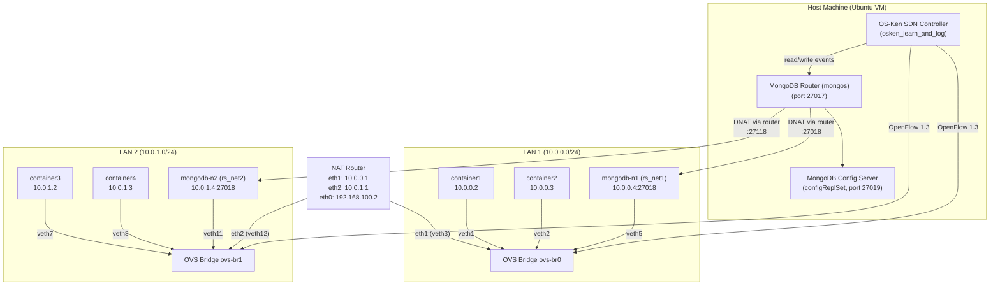
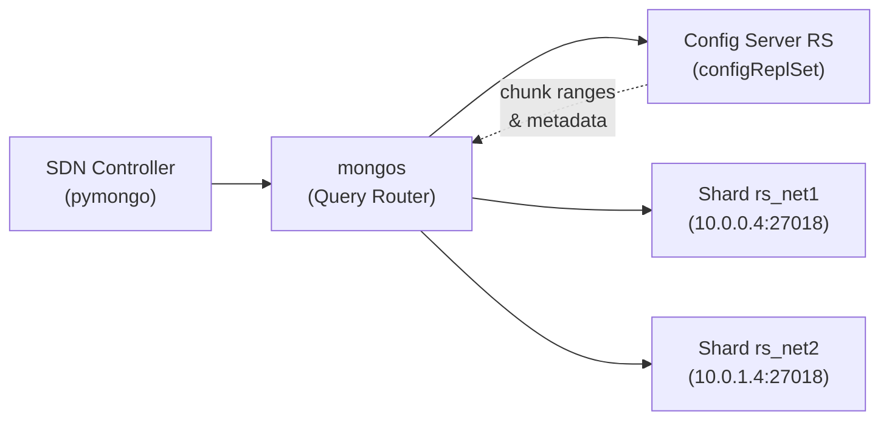
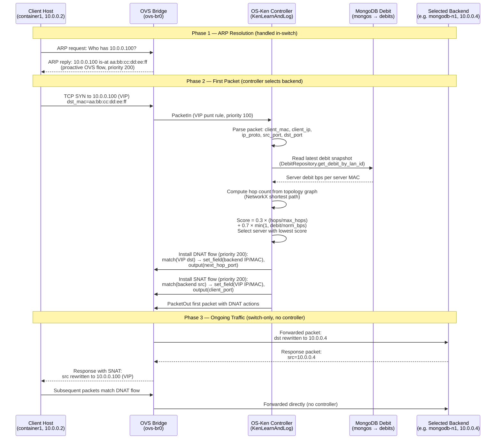

# System Architecture Design: Workflow, Sequence and MongoDB Mechanisms

## 1. Architecture Overview

The lab runs two isolated LAN segments inside Docker, each managed by an OpenFlow 1.3 SDN controller (OS-Ken). A sharded MongoDB cluster stores packet events and topology snapshots, while a NAT router interconnects the LANs and provides external connectivity. A Virtual IP (VIP) service allows clients to reach a server pool through a single address; the controller selects the best backend based on hop count and link debit.

### Docker Containers

| Container | Image | Role |
|---|---|---|
| `ovs` | `ovs-container` | Open vSwitch with bridges `ovs-br0` and `ovs-br1` |
| `container1` – `container4` | `ubuntu-host` | User/client hosts on each LAN |
| `mongodb-n1` | `ubuntu-mongodb` | Shard replica set `rs_net1` (LAN 1) |
| `mongodb-n2` | `ubuntu-mongodb` | Shard replica set `rs_net2` (LAN 2) |
| `mongodb-config-server` | `ubuntu-mongodb` | Config server replica set `configReplSet` |
| `mongodb-router` | `ubuntu-mongodb` | `mongos` query router |
| `nat-router` | `ubuntu-nat-router` | Inter-LAN routing, DNAT/SNAT for shard exposure |
| `ryu` | OS-Ken image | SDN controller (runs on host network) |

---

## 2. MongoDB Mechanisms

| Mechanism | Purpose in This System |
|---|---|
| **Sharding** | The `events` collection is sharded by `dpid` (datapath ID). Each switch's events land on the shard in the same LAN segment, keeping writes local. |
| **Shard Key (`dpid`)** | Integer datapath IDs are split into zone ranges (`_zone_size` chunks). `dpid` values are mapped to `rs_net1` or `rs_net2` so `mongos` routes writes to the correct shard without scatter-gather. |
| **Replica Sets** | Each shard (`rs_net1`, `rs_net2`) and the config server (`configReplSet`) run as single-node replica sets. This enables `replSetInitiate`, oplog replication, and automatic primary election. |
| **Config Server** | Stores chunk-to-shard mappings, database metadata, and zone definitions. `mongos` caches this metadata to route queries. |
| **mongos (Query Router)** | Single entry point for the controller. Routes reads/writes to the correct shard based on the shard key. The controller connects only to `mongos`, never directly to shards. |
| **Zone Sharding** | `dpid` ranges are assigned to zones (`rs_net1`, `rs_net2`) via `sh.updateZoneKeyRange()`. This guarantees data locality: LAN 1 switch events stay on `rs_net1`. |
| **Replace-by-ID** | `EventRepository` replaces documents by `_id == dpid` to keep shard keys stable and avoid unbounded collection growth. |

---

## 3. SDN Controller and OpenFlow Mechanisms

| Component | Mechanism | Description |
|---|---|---|
| **OS-Ken Controller** | `KenLearnAndLog` | Base learning-switch app. Learns MAC→port mappings reactively and logs packet events to MongoDB via `mongos`. |
| **OpenFlow 1.3 Table-Miss** | Priority 0, action `OUTPUT:CONTROLLER` | Installed on switch connect. Sends all unmatched packets to the controller for MAC learning. |
| **Reactive L2 Learning** | Priority 10, match `(in_port, eth_src, eth_dst)` | Once a MAC is learned, a flow rule is installed so subsequent frames are forwarded in hardware without controller involvement. |
| **Proactive Topology Flows** | `topology_n1.py` / `topology_n2.py` | Compute shortest paths via NetworkX on the local LAN topology and install host-to-host forwarding rules proactively. |
| **Port Stats Polling** | `OFPPortStatsRequest` / `OFPPortStatsReply` | Periodic polling computes per-port bitrate (rx/tx bps). Server-facing port debit is persisted to MongoDB (`debits` collection) via `DebitRepository`. |
| **VIP Punt Rule** | Priority 100, match `ipv4_dst=VIP, ICMP/TCP/UDP` | Ensures the first packet to the VIP address reaches the controller for backend selection. |
| **DNAT/SNAT Flows** | Priority 200, installed on client edge switch | After backend selection, the controller rewrites destination (DNAT) and source (SNAT) IP/MAC so the client sees only the VIP while traffic reaches the real server. |
| **ARP Reply Rule** | Priority 200, proactive (via `ovs-ofctl`) | The switch replies to ARP requests for the VIP directly, advertising `VIP_MAC`. No controller involvement needed for ARP. |

---

## 4. Scenario: Client HTTP Request to VIP Server Pool

A client host sends a request (e.g., TCP connection) to the **Virtual IP (VIP)** `10.0.0.100`. The SDN controller selects the best MongoDB backend server based on **hop count** and **server link debit**, installs NAT rewrite rules, and the client communicates transparently with the chosen backend.

### What Happens at Each Step

1. **ARP Resolution** — The client ARPs for the VIP (`10.0.0.100`). A proactive OpenFlow rule (installed via `ovs-ofctl` in the setup scripts) makes the switch reply with `VIP_MAC = aa:bb:cc:dd:ee:ff`. The controller is not involved.

2. **First Packet → Controller** — The client sends the first TCP SYN (or ICMP echo) to the VIP. The VIP punt flow (priority 100) sends this packet to the controller as a `PacketIn` event.

3. **Backend Selection** — The controller:
   - Reads the cached **server link debit** (bps) from MongoDB (`debits` collection via `DebitRepository`).
   - Looks up the **hop count** from the client to each server using the NetworkX topology graph.
   - Computes a weighted score: `score = 0.3 × (hops / max_hops) + 0.7 × min(1, debit_bps / norm_bps)`.
   - Selects the server with the **lowest score** (closest and least loaded).

4. **DNAT/SNAT Flow Installation** — The controller installs two OpenFlow rules on the **client's edge switch** (priority 200):
   - **DNAT** (forward path): rewrites `dst_ip` from VIP → backend IP, `dst_mac` from VIP MAC → backend MAC, and outputs to the next-hop port.
   - **SNAT** (return path): rewrites `src_ip` from backend IP → VIP, `src_mac` from backend MAC → VIP MAC, and outputs to the client port.
   - Both rules have an `idle_timeout` so stale mappings expire and new flows can be re-evaluated.

5. **Ongoing Traffic** — All subsequent packets in both directions are handled entirely by the switch using the installed DNAT/SNAT rules. The controller is not involved, and the client always sees traffic coming from the VIP address.

### Components Used in This Scenario

| Layer | Component | Role |
|---|---|---|
| **Docker** | `container1` (client), `ovs` (switch), `mongodb-n1` or `mongodb-n2` (backend) | Client host, OpenFlow switch, database server |
| **OpenFlow** | ARP reply flow (P200), VIP punt flow (P100), DNAT/SNAT flows (P200) | ARP handling, first-packet redirect, packet rewriting |
| **Controller** | `KenLearnAndLog` + `topology_n1.py` | Backend selection logic, flow installation, topology graph |
| **MongoDB** | `debits` collection (via `mongos`), `DebitRepository` | Server load data for cost-based selection |
| **MongoDB Sharding** | `mongos` routes debit reads to the correct shard by `lan_id` | Data locality for telemetry |
