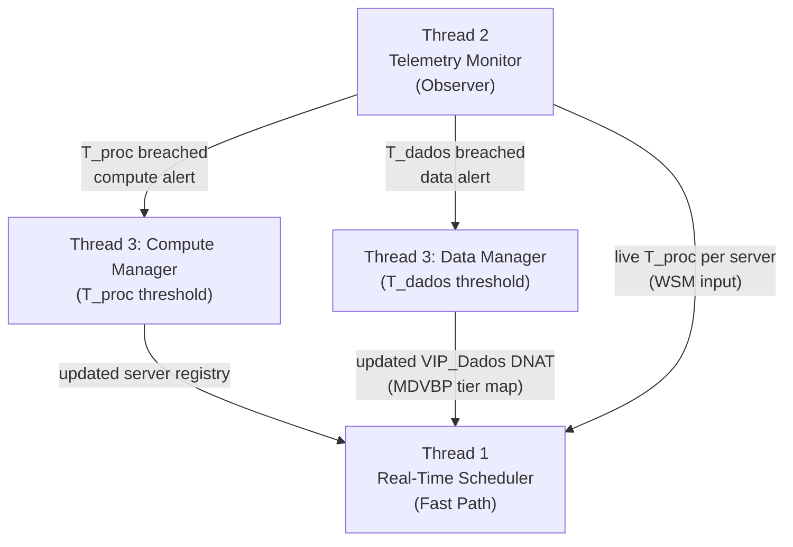
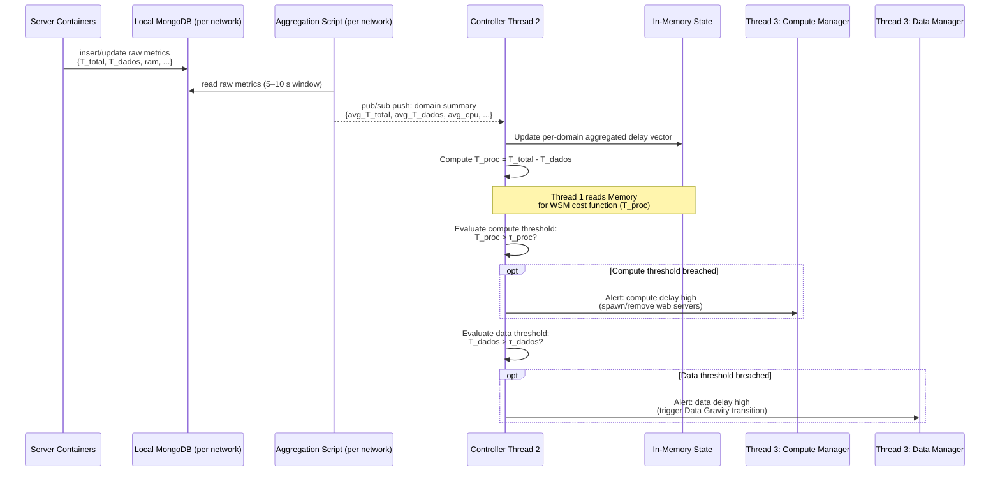
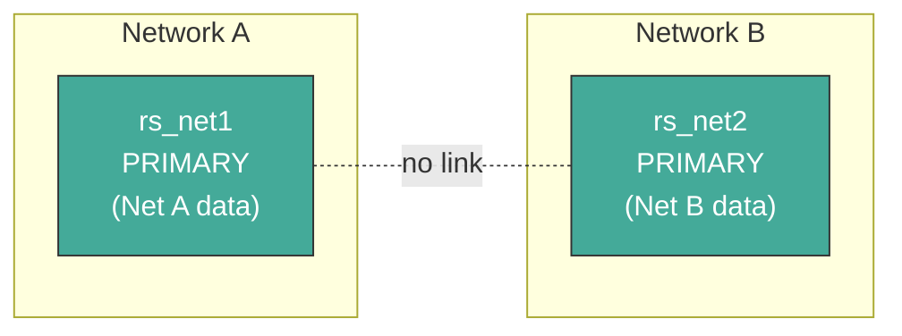
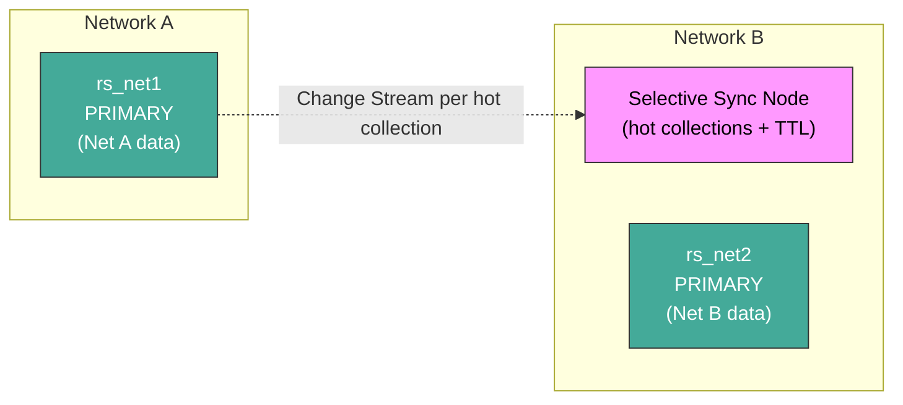
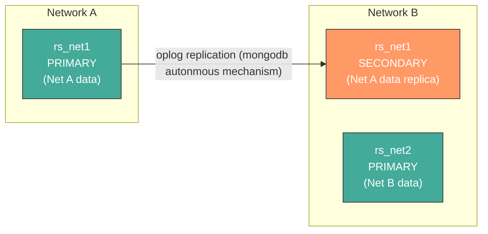
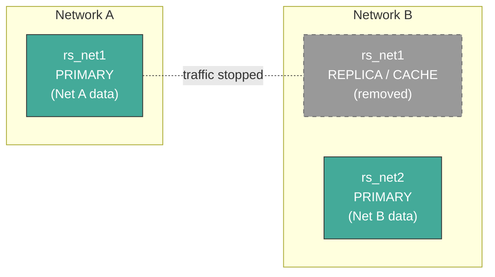
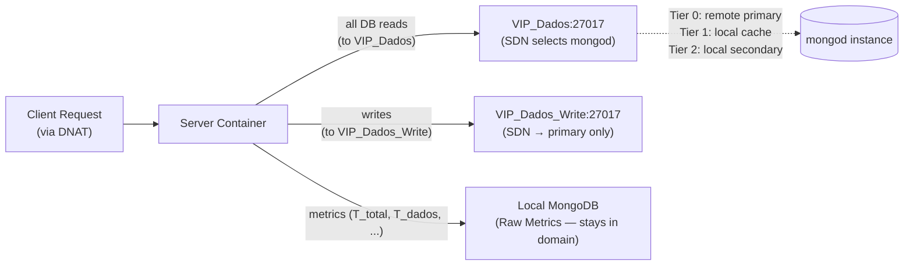

# System Mechanisms Reference

This document describes the high-level workflows of the SDN-based edge orchestration architecture — how the components interact, what triggers actions, and how data flows through the system.

For detailed implementation specifics, see the [details/](details/) subfolder:

- [Double-VIP Routing](details/double_vip_routing.md) — OpenFlow rule mechanics, DNAT/SNAT, step-by-step VIP operations
- [Controller Scheduling Algorithm](details/controller_scheduling_algorithm.md) — WSM cost function, MBFD heuristic, scale-out decision trees
- [Data Gravity Tiers](details/data_gravity_tiers.md) — Cache node deployment, tier transitions, smart data retention
- [Server Container Internals](details/server_container_internals.md) — Request processing, metrics reporting, SSR mode
- [MongoDB Role and Design](details/mongodb_role_and_design.md) — Design rationale, sharding comparison, Change Streams, full data flow

---

## Design Rationale: Metadata-Driven Orchestration

This system implements **Topology-Aware Hierarchical Storage** coupled with **Service Placement** through **Data Gravity**: data moves toward the services and consumers that need it, and only for as long as they need it.

The orchestration mechanisms are **workload-agnostic**: they react to measured demand metadata ($T_{proc}$, $T_{dados}$, cache hit ratio), not to assumptions about read/write ratios or specific application profiles.

**Core architectural principles:**

1. **Independent replica sets per network.** Each network segment hosts its own single-node replica set (`rs_net1`, `rs_net2`, etc.). Data is partitioned by network origin, not by a shard key.
2. **Three-tier data placement hierarchy.** Cross-network data demand is addressed progressively:
   - **Tier 0 — Direct routing:** Low demand is served by routing packets to the remote primary via SDN.
   - **Tier 1 — Selective Sync Node:** Burst demand triggers a standalone `mongod` seeded with only the hot collections identified by local access tracking. Ongoing writes to those collections are forwarded via per-collection Change Streams from the primary; documents carry a TTL and are auto-evicted when demand subsides.
   - **Tier 2 — Full replica:** Sustained high demand triggers `rs.add()` to place a full secondary in the requesting network. Removed when demand subsides.
3. **Write-path isolation.** Writes always go to the local primary of the originating network.
4. **Double-VIP model.** Two Virtual IPs cleanly separate the traffic planes: `VIP_Web` for client-to-server HTTP traffic and `VIP_Dados` for server-to-MongoDB traffic (one per network domain).

> For the sharding vs. orchestration comparison and MongoDB's specific utility in this design, see [MongoDB Role and Design](details/mongodb_role_and_design.md).

---

## 1. The Controller (SDN "Brain")

The controller is a Python-based OS-Ken (Ryu) SDN application that runs on the host machine. It manages the entire system through three concurrent threads, each with a distinct responsibility. None of the threads share mutable state unsafely; communication flows in one direction through in-memory data structures.

---

### 1.1 Thread 1 — Real-Time Scheduler (Fast Path)

**Purpose:** Handle every incoming packet that hits a table-miss or VIP punt rule, select the best destination, and install OpenFlow flow rules so that subsequent packets are forwarded entirely in the switch without controller involvement.

**Constraint:** Strictly non-blocking. Thread 1 never queries a database or executes scripts. It relies exclusively on in-memory state kept up to date by Threads 2 and 3.

Thread 1 handles two independent traffic planes:

| VIP                 | Address                               | Traffic Plane         | Selection Logic                                 |
| :------------------ | :------------------------------------ | :-------------------- | :---------------------------------------------- |
| **VIP_Web**   | `10.0.0.100:80`                     | Client → Web Server  | WSM cost weighted by$T_{proc}$ and hop count  |
| **VIP_Dados** | `10.0.X.200:27017` (one per domain) | Web Server → MongoDB | Data Gravity tier map (MDVBP) — Tier 0 / 1 / 2 |

$$
Cost_j^{web} = \theta \cdot \frac{T_{proc,j}}{T_{proc,max}} + (1 - \theta) \cdot \frac{Hops_j}{Hops_{max}}
$$

For each `VIP_Web` Packet-In, Thread 1 evaluates the cost function, installs a DNAT+SNAT rule pair, and sends a Packet-Out. For each `VIP_Dados` Packet-In, Thread 1 reads the MDVBP tier map, selects the target `mongod`, installs the DNAT+SNAT rule pair, and sends a Packet-Out. The MongoDB driver in each web server sees only `VIP_Dados:27017` — a single stable address — and never discovers the physical `mongod` topology.

| Active Tier      | VIP_Dados Routes To                    | Rationale                  |
| :--------------- | :------------------------------------- | :------------------------- |
| **Tier 0** | Remote primary (cross-network)         | No local data resource yet |
| **Tier 1** | Local selective sync node (same network) | Hot collections synced locally |
| **Tier 2** | Local replica secondary (same network) | Full replica present       |

> For packet-level detail (DNAT/SNAT rule specs, `src_port` omission rationale, ARP handling, step-by-step per-VIP operations, full lifecycle example), see [Double-VIP Routing](details/double_vip_routing.md).

---

### 1.2 Thread 2 — Telemetry & State Monitor (Observer)

**Purpose:** Continuously watch infrastructure metrics and data-placement state. Feed live data to Thread 1 and raise typed alerts to Thread 3 when delay thresholds are breached. Thread 2 is the **QoE sentinel**: its primary concern is not server resource utilization in isolation, but **observable latency** — the metric that directly determines whether the user's Quality of Experience is being maintained.

#### Inputs

| Source                 | Data                                                                | Method                                                  |
| ---------------------- | ------------------------------------------------------------------- | ------------------------------------------------------- |
| Aggregation Script (per network) | Per-domain aggregated delay averages: $\overline{T_{total}}$, $\overline{T_{dados}}$, $\overline{T_{proc}}$ | **Pub/sub push** (aggregation script publishes; controller subscribes) |
| Aggregation Script (per network) | Aggregated resource headroom: RAM, storage, active connections      | **Pub/sub push**     |
| OVS Switches           | Per-port byte/packet counters                                       | `OFPPortStatsRequest` / `OFPPortStatsReply` polling |

> Raw per-server metrics are written by server containers to the **Local MongoDB** of their network domain. A per-network **Aggregation Script** computes windowed summaries (5–10 s windows) and **pushes them directly to the controller via pub/sub**. Thread 2 is woken only when a summary is published — no polling, no database dependency in the telemetry path. See [Cross-Network State & Telemetry Architecture](../other/system_cross_network_state.md) for the full architecture.

**Latency decomposition** (computed by Thread 2 from the fields reported by each server):

$$
T_{proc} = T_{total} - T_{dados}
$$

- $T_{total}$: wall-clock time from HTTP request receipt to response sent (reported by the web server).
- $T_{dados}$: time the web server spent blocked waiting for `VIP_Dados:27017` to reply (the MongoDB query round-trip as seen from the application).
- $T_{proc}$: the residual — time consumed by CPU work (template rendering, serialisation, application logic).

#### What it does

1. **Subscribes** to the pub/sub channel for its network domain. The aggregation script publishes only when a windowed summary is ready (no polling, no database cursor).
2. **Updates shared in-memory state** with the latest per-domain delay averages and per-switch port bitrates (from OpenFlow stats polling).
3. **Evaluates two independent threshold conditions** and routes alerts to the two logical components of Thread 3:
   - **Compute alert** → triggered when $\overline{T_{proc}} > \tau_{proc}$. Sent to the **Compute Manager**.
   - **Data alert** → triggered when $\overline{T_{dados}} > \tau_{dados}$. Sent to the **Data Manager**.
4. **Thread 1** reads the in-memory state continuously for the $Cost_j^{web}$ formula and the MDVBP tier map.

> For Change Streams mechanics, the full metrics schema, and the end-to-end controller data flow, see [MongoDB Role and Design](details/mongodb_role_and_design.md).

---

### 1.3 Thread 3 — Elasticity & Placement Manager (Slow Path)

**Purpose:** Mutate the infrastructure by adding/removing server containers and MongoDB data resources when Thread 2 detects a threshold breach. Thread 3 is logically split into two **decoupled managers** that respond to different alert types:

- **Compute Manager** — responds to $T_{proc} > \tau_{proc}$ alerts. It adds or removes web server containers to control computation delay.
- **Data Manager** — responds to $T_{dados} > \tau_{dados}$ alerts. It triggers Data Gravity tier transitions (Selective Sync Node deployment, full replica addition, or teardown) to bring data closer to the demanding network.

This decoupling is the system's key architectural advance: a compute bottleneck does not entail a data placement change, and a data locality problem does not entail spawning more web servers. The two managers operate independently on their respective subsystems, driven by the latency signal most relevant to each domain.

Both managers use the **Multi-Dimensional Best-Fit Decreasing (MBFD)** heuristic, applied to different resource spaces (compute capacity for the Compute Manager, latency and cache metrics for the Data Manager). Both managers perform **Data-Coupled Task Scheduling**: a web server is never placed without ensuring low-latency data access in the same network.

> For the full MBFD heuristic steps, scoring formula ($Score_j$, $Cost_j^{web}$), tier escalation table, deployment sequences, and scale-in procedure, see [Controller Scheduling Algorithm](details/controller_scheduling_algorithm.md).

#### Elastic Lifecycle: Data Gravity in Action

The following diagrams show the three-phase lifecycle that distinguishes this system from static replication.

**Phase 1 — Base State (Tier 0):** Each network has its own primary. No cross-network replication or caching. Minimal infrastructure.

> Writes: local. Reads (own data): local. Reads (remote data): remote fetch. No secondaries, no caches.

**Phase 2 — Burst Demand (Tier 1):** Thread 2 detects that $T_{dados}$ from Network B clients to Network A data exceeds $\tau_{dados}$. Thread 3 deploys a Selective Sync Node in Network B, seeded with hot collections and kept current via Change Streams from the primary.

> Net B reads for Net A data: **served locally** from hot collections. Write propagation via Change Stream. Zero oplog overhead.

**Phase 3 — Sustained Demand (Tier 2):** Demand remains high despite Tier 1 (sustained rather than burst). Thread 3 decommissions the Selective Sync Node and adds a full secondary via `rs.add()` — MongoDB autonomous replication takes over.

> Net B reads for Net A data: **always local** (served by secondary). Net A's full oplog is replicated.

**Phase 4 — Demand Subsides (Scale-in):** Thread 2 detects $T_{dados}$ has dropped below $\tau_{dados}$ (cross-network demand subsided). Thread 3 executes `rs.remove()` to remove the Tier 2 secondary, or closes all Change Streams and decommissions the Tier 1 Selective Sync Node. Thread 1 reverts `VIP_Dados` DNAT to Tier 0. System returns to Phase 1.

> Edge storage freed, replication/cache traffic stopped. Back to base state.

> For the full MBFD decision steps, tier escalation table, concrete deployment sequences (replica set secondary and web server container), and scale-in procedure, see [Controller Scheduling Algorithm](details/controller_scheduling_algorithm.md).

### 1.4 Topology-Aware Selective Sync Node (The "Middle Path")

**Purpose:** Provide a lightweight, selective data access tier for burst cross-network demand — sitting between "route to remote primary" (cheap but slow) and "full replica via `rs.add()`" (fast but carries full oplog overhead). The Selective Sync Node replicates only the collections that are actually being accessed, identified by access tracking on the local MongoDB.

**Why this is novel:** Standard replication (MongoDB `rs.add()`) replicates the full dataset regardless of what is actually being accessed remotely. The Selective Sync Node is **demand-driven**: it seeds only the hot collections at the moment of deployment and expands/contracts that set dynamically via per-collection Change Streams. Intra-network data is never synced because the primary is already <1ms away.

#### The Data Placement Hierarchy

Thread 3 selects a strategy based on the relationship between the request origin and the data origin:

| Scenario                              | Relationship  | Strategy                              | Rationale                                                                                                  |
| ------------------------------------- | ------------- | ------------------------------------- | ---------------------------------------------------------------------------------------------------------- |
| User A reads Data A                   | Intra-network | Direct read from primary              | Primary is local. Latency is negligible. Syncing adds unnecessary complexity.                              |
| User B reads Data A (low volume)      | Cross-network | Direct routing to remote primary      | Demand is too low to justify any local infrastructure. SDN routes packets.                                 |
| User B reads Data A (burst demand)    | Cross-network | **Selective Sync Node**         | Primary is remote. Latency is high. Only hot collections seeded locally; Change Streams keep them current. |
| User B reads Data A (sustained demand)| Cross-network | **Full replica** (`rs.add()`) | Demand is sustained. Full autonomous replication justified; Selective Sync Node decommissioned. |

> For the full trigger conditions, Selective Sync Node deployment sequence, VIP_Dados DNAT configuration per tier, global `id_index` replication, tier transition state machine, timeouts, and scientific justification, see [Data Gravity Tiers](details/data_gravity_tiers.md).

---

## 2. The Server (Application Container)

Each server is a lightweight Docker container running an HTTP application (e.g., Flask/FastAPI). It handles each client request in a **dedicated thread** that follows a short-lived connection model: open connection → execute query → return response → close connection. Connection lifetime equals HTTP request lifetime — no connection pool management is required, and tier transitions take effect on the very next HTTP request after an OVS flow rule expires. Each thread selects the correct MongoDB domain VIP by reading the domain prefix embedded in the document ID (e.g., `"net2::sensor_xyz_002"` → `"net2"` → `VIP_Dados_Net2`), requiring no controller query and no extra RTT. The server also periodically reports its own resource usage to its network's Local MongoDB instance.

> For request processing flows (read/write mermaid sequences), metrics reporting schema, dual-mode SSR operation, and the Data Gravity amplification effect, see [Server Container Internals](details/server_container_internals.md).

---

## 3. Telemetry & Cross-Domain Coordination Architecture

Two distinct communication mechanisms are used, each chosen for what it is actually designed for:

- **Pub/sub (telemetry path):** Aggregation scripts push windowed summaries directly to the controller. No shared database in the telemetry path. Controllers are woken only when a summary is published — no polling, no persistent cursor, no database dependency for event delivery.
- **Shared MongoDB (coordination state):** VIP registry and topology snapshots require durable, readable state — pub/sub cannot serve a controller that needs to read current state after an event. The Shared MongoDB is retained exclusively for these concerns. Telemetry summaries do **not** pass through it.

> For the full architecture (layer responsibilities, pub/sub justification, cross-network flow rules, node self-registration), see [Cross-Network State & Telemetry Architecture](../other/system_cross_network_state.md).

> For the Local MongoDB metrics schema and the end-to-end data flow, see [MongoDB Role and Design](details/mongodb_role_and_design.md).

---

## 4. Final System Definition

> This thesis proposes a **Self-Optimizing Edge Orchestration Architecture**. It utilizes **SDN-driven Double-VIP control** to detect demand and **Programmable Containers** to fulfill it. By decomposing observed latency into $T_{proc}$ (compute delay) and $T_{dados}$ (data-access delay), the controller identifies the nature of each bottleneck and applies the correct remediation: compute scale-out or a Data Gravity tier transition. By embedding synchronization logic (`sync.py`) and lifecycle management (TTL/Hit-Counts) directly into edge containers, the system achieves scalable, autonomous orchestration of compute and storage resources that minimizes service latency while strictly bounding resource usage through a three-tier storage hierarchy.

The architecture's contribution to the state of the art is the integration of three layers that are traditionally managed independently:

| Layer             | Traditional Approach                        | This System                                                                                                                                    |
| ----------------- | ------------------------------------------- | ---------------------------------------------------------------------------------------------------------------------------------------------- |
| **Network** | Static routing or ECMP                      | Double-VIP SDN routing:`VIP_Web` selects best web server; `VIP_Dados` selects best `mongod` endpoint per data-gravity tier               |
| **Compute** | Manual scaling or load-balancer round-robin | MBFD Compute Manager driven by$T_{proc}$ delay threshold — QoE-aware scale-out/in                                                           |
| **Storage** | Static sharding or full replication         | Three-tier adaptive hierarchy (Tier 0: remote primary → Tier 1: selective sync node → Tier 2: full replica via `rs.add()`), triggered by $T_{dados}$ threshold |

**Clean Separation of Responsibilities.** Each layer performs only its designated function and requires no knowledge of the others:

| Layer                         | Responsibility                                                                     |
| :---------------------------- | :--------------------------------------------------------------------------------- |
| **Web server thread**   | Parse document ID prefix → connect to domain VIP → query → close connection     |
| **OVS**                 | DNAT rewrite on new connections using installed flow rules; no protocol inspection |
| **Controller Thread 1** | On `Packet-In` → install DNAT rule for the current tier (reads MDVBP map)       |
| **Controller Thread 3** | Decide tier transitions based on$T_{dados}$ → update OVS rules via MDVBP map    |
| **mongod / storage**    | Serve documents, maintain `id_index` collection                                  |

By coupling these three layers under a single control loop (Threads 1–3), the system eliminates the coordination gaps that arise when network, compute, and storage are managed by independent subsystems. The Double-VIP model ensures that routing intelligence resides entirely in the SDN layer: the MongoDB driver in each web server never performs topology discovery, never sends heartbeats, and never makes data-routing decisions. The network decides. This proves that programmable containers at the edge, orchestrated by an SDN controller using latency as the primary QoE signal, can autonomously participate in data distribution decisions.
