# System Mechanisms Reference

This document describes the mechanisms of a **Self-Optimizing Edge Storage Architecture** — a system that uses **SDN-driven control** to detect demand and **Programmable Containers** to fulfill it. Each section covers one component class, its role in the architecture, and how it interacts with the other components. Supporting diagrams accompany each mechanism.

---

## Design Rationale: Read-Heavy Optimization

Empirical studies on edge and CDN workloads consistently show that read requests dominate traffic patterns. For example, Zakhary et al. (Cache on Track) report that **99.8% of accesses are reads and only 0.2% are writes**, concluding that "the storage system has to be read optimized." This system adopts that premise as a foundational design constraint.

The central architectural conclusion is that **static data replication is insufficient** for modern edge workloads. Provisioning full replicas everywhere wastes resources when demand is sporadic, while routing every request to a remote primary wastes latency when demand is sustained. To achieve high efficiency, the storage layer must be **programmable, tiered, and autonomic** — an approach this document terms the **"Active Edge" Architecture**. Rather than the traditional "Sharded Cluster" model (which optimizes for write distribution), this system implements **Topology-Aware Hierarchical Storage** that couples **Service Placement** with **Data Gravity**: data moves toward the consumers that need it, and only for as long as they need it.

**Architectural consequences:**

1. **No sharding.** MongoDB sharding distributes write throughput across multiple primaries — a solution to a problem that does not exist when writes are negligible. The overhead of config servers, `mongos` routers, zone ranges, and chunk migrations is unjustified for 0.2% of traffic.
2. **Independent replica sets per network.** Each network segment hosts its own single-node replica set (`rs_net1`, `rs_net2`, etc.). Each `mongod` acts as the **primary** for data originating in its network. Data is partitioned by network origin, not by a shard key.
3. **Three-tier data placement hierarchy.** Cross-network read demand is addressed progressively, not with a single mechanism:

   - **Tier 0 — Direct routing:** Low cross-network demand is served by routing packets to the remote primary via SDN. No additional infrastructure.
   - **Tier 1 — Ephemeral cache:** Moderate demand triggers a lightweight, standalone `mongod` in the requesting network. It acts as a read-through cache with TTL-based expiration. Zero oplog overhead, bounded memory footprint, auto-eviction.
   - **Tier 2 — Full replica:** Sustained high demand (or high unique-data ratio) triggers `rs.add()` to place a secondary of the remote replica set in the requesting network. MongoDB's oplog replication syncs the data automatically. When demand subsides, the secondary is removed.

   This progression — from zero infrastructure through lightweight caching to full replication — is the system's core **data gravity** mechanism. The SDN controller selects the tier based on real-time telemetry (cross-network read rate, cache hit ratio, unique data percentage).
4. **Writes tolerate latency.** The rare write requests always go to the local primary of the originating network. Since each network's primary stores data produced in that network, writes are local by default and require no cross-network optimization.
5. **SDN-controlled topology, not driver-controlled.** Server containers connect to specific `mongod` instances using `directConnection=true`, bypassing MongoDB's driver-level replica set discovery and heartbeat traffic. The SDN controller (Thread 3) decides which `mongod` each container connects to and injects that decision at container boot time via environment variables. This eliminates redundant network traffic and ensures the network layer retains full authority over data routing.

| Component              | Sharded Design (Eliminated)    | Read-Optimized Design (Current)                 |
| ---------------------- | ------------------------------ | ----------------------------------------------- |
| Config Server          | Required                       | **Not used**                              |
| `mongos` Router      | Required per container         | **Not used**                              |
| Zone ranges            | Required                       | **Not used**                              |
| Shard key              | Required (`dpid`)            | **Not used**                              |
| Per-network `mongod` | As shard member                | As standalone replica set primary               |
| Elasticity             | `sh.moveChunk()` (heavy)     | Ephemeral cache +`rs.add()` / `rs.remove()` |
| Bootstrap              | Config server + mongos + zones | Two `rs.initiate()` commands                  |

### The Utility of MongoDB in this Architecture

MongoDB is leveraged not just as a static data store, but as an active, programmable infrastructure component. This thesis proves its utility in an SDN-edge context through several distinct features:

1. **Unstructured data ingestion (Document Model):** Its schema-less JSON/BSON document model maps perfectly to the unpredictable data formats typical of IoT scenarios, sensor telemetry, and diverse edge payloads without requiring complex, central schema migrations.
2. **Native TTL (Time-To-Live) indexes:** Powers the Tier 1 Ephemeral Cache natively. By automatically evicting documents after a set duration, it provides a self-managing, bounded edge footprint without requiring the developer to build custom application-level garbage collection.
3. **Autonomous oplog and replica sets:** When the SDN controller identifies the need to scale out to Tier 2 (Full Replica), it simply issues an `rs.add()` command. MongoDB's autonomous oplog tailing immediately takes over the heavy lifting of maintaining data synchronization and cross-network consistency.
4. **Change Streams for push-based telemetry:** Instead of the controller constantly polling databases for infrastructure metrics, MongoDB Change Streams allow the State Database to *push* real-time telemetry updates to the controller instantly, heavily optimizing CPU cycles and minimizing reaction latency.
5. **Explicit connection control (`directConnection=true`):** By enforcing this driver parameter, the system explicitly disables MongoDB's background topology discovery and heartbeat mechanisms. This prevents the database driver from making independent routing choices, ensuring the network (SDN) layer retains 100% authority over the traffic path.
6. **Concurrent read/write performance:** It handles edge-typical, high-concurrency read workloads smoothly while ensuring the occasional write operations remain highly available via local primary ownership.

---

## 1. The Controller (SDN "Brain")

The controller is a Python-based OS-Ken (Ryu) SDN application that runs on the host machine. It manages the entire system through three concurrent threads, each with a distinct responsibility. None of the threads share mutable state unsafely; communication flows in one direction through in-memory data structures.

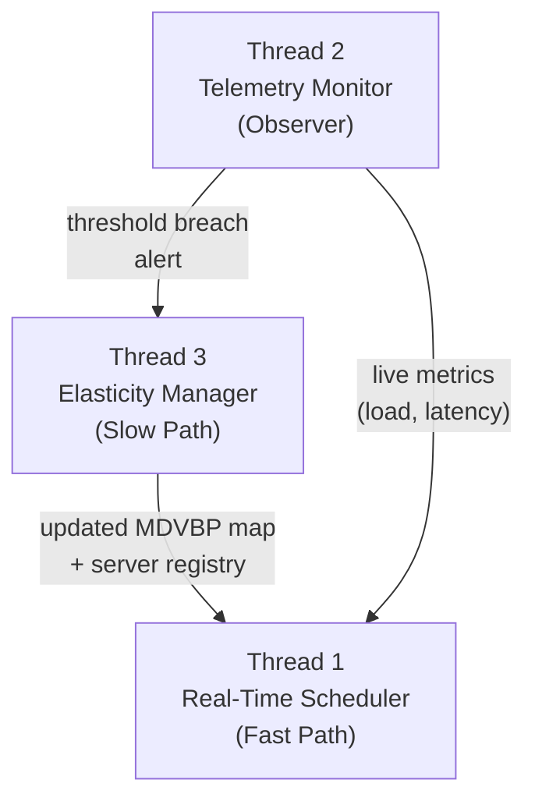
```mermaid
graph TD
    T1["Thread 1<br/>Real-Time Scheduler<br/>(Fast Path)"]
    T2["Thread 2<br/>Telemetry Monitor<br/>(Observer)"]
    T3["Thread 3<br/>Elasticity Manager<br/>(Slow Path)"]

    T2 -->|"threshold breach<br/>alert"| T3
    T3 -->|"updated MDVBP map<br/>+ server registry"| T1
    T2 -->|"live metrics<br/>(load, latency)"| T1
```

---

### 1.1 Thread 1 — Real-Time Scheduler (Fast Path)

**Purpose:** Handle every incoming packet that hits a table-miss or VIP punt rule, compute the best backend server, and install OpenFlow flow rules so that subsequent packets are forwarded entirely in hardware without controller involvement.

**Constraint:** Strictly non-blocking. Thread 1 never queries a database or executes a script. It relies exclusively on in-memory state that Thread 2 and Thread 3 keep up to date.

#### Intent-Based Port Mapping

To distinguish between raw data retrieval (low CPU), dynamic content generation (medium CPU + multi-fetch), and data ingestion, the system utilizes **L4 Destination Port** mapping. This allows Thread 1 to classify workload intent instantly without deep packet inspection via an $O(1)$ dictionary lookup:

| VIP Port | Service Type | Operation | Resource Profile | Routing Logic (Thread 1) |
| :--- | :--- | :--- | :--- | :--- |
| **5001** | **Data API** | READ (JSON) | **I/O Bound** | Prioritize **Network Hops** (closest data path). |
| **5002** | **Web View** | READ (HTML) | **CPU + I/O** | Prioritize **CPU Availability** + **Data Locality**. |
| **6001** | **Ingest** | WRITE | **Network** | Route to **Primary** (regardless of location). |

Port 5001 signals a simple data read: the server queries MongoDB once and returns raw JSON. Port 5002 signals **Server-Side Rendering (SSR)**: the server fetches an HTML template and content data (1–2 internal DB queries), merges them on the CPU, and returns fully rendered HTML. Port 6001 signals a write that must reach the primary. This port-based intent classification allows Thread 1 to apply workload-appropriate scoring weights (see Section 1.3) without inspecting payloads.

#### Step-by-step operation

1. A client sends a `TCP SYN` to the Virtual IP (VIP). The destination port encodes intent via **Intent-Based Port Mapping** (e.g., port `5001` = read JSON, port `5002` = read rendered HTML, port `6001` = write).
2. The OVS switch has a VIP punt rule (priority 100) that sends unmatched VIP traffic to the controller as a `Packet-In` event.
3. Thread 1 parses the packet headers (source IP/MAC, destination port) and determines:
   - **Intent:** which data domain the client is requesting and whether it is a read or write operation, derived from the destination port via an $O(1)$ dictionary lookup.
   - **Client location:** which switch (DPID) and ingress port the packet arrived on.
4. Thread 1 consults the in-memory **MDVBP assignment map** (populated by Thread 3) to find the list of eligible server nodes that can serve this intent. For reads, any server with access to a local data resource (primary, secondary, or ephemeral cache) of the target data domain is eligible. For writes, only servers connected to the **primary** of the target replica set are eligible.
5. Among eligible nodes, Thread 1 applies the **Weighted Sum Model (WSM)** cost function to select the best one:

$$
Cost_j = \theta \cdot \frac{Load_j}{Load_{max}} + (1 - \theta) \cdot \frac{Hops_j}{Hops_{max}}
$$

The server $j$ with the lowest $Cost_j$ is selected.
6. Thread 1 installs two OpenFlow rules on the client's edge switch (priority 200, with `idle_timeout`):

- **DNAT (forward path):** rewrites `dst_ip` from VIP to the selected server IP, `dst_mac` to server MAC, output to next-hop port.
- **SNAT (return path):** rewrites `src_ip` from server IP back to VIP, `src_mac` to VIP MAC, output to client port.

7. Thread 1 sends a `Packet-Out` for the first packet with the DNAT actions applied immediately.
8. All subsequent packets in both directions are handled entirely by the switch. The controller is not involved again until the flow's `idle_timeout` expires.

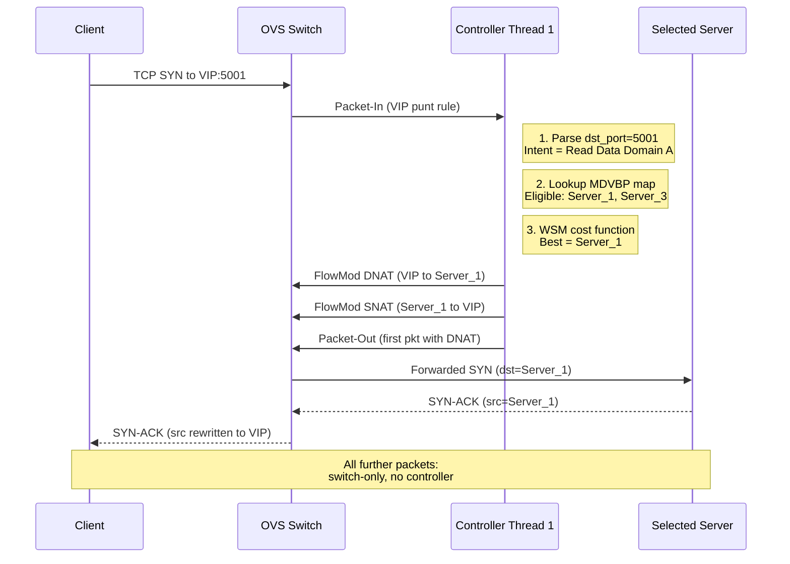
```mermaid
sequenceDiagram
    participant Client
    participant Switch as OVS Switch
    participant T1 as Controller Thread 1
    participant Server as Selected Server

    Client->>Switch: TCP SYN to VIP:5001
    Switch->>T1: Packet-In (VIP punt rule)
    Note right of T1: 1. Parse dst_port=5001<br/>Intent = Read Data Domain A
    Note right of T1: 2. Lookup MDVBP map<br/>Eligible: Server_1, Server_3
    Note right of T1: 3. WSM cost function<br/>Best = Server_1
    T1->>Switch: FlowMod DNAT (VIP to Server_1)
    T1->>Switch: FlowMod SNAT (Server_1 to VIP)
    T1->>Switch: Packet-Out (first pkt with DNAT)
    Switch->>Server: Forwarded SYN (dst=Server_1)
    Server-->>Switch: SYN-ACK (src=Server_1)
    Switch-->>Client: SYN-ACK (src rewritten to VIP)
    Note over Client,Server: All further packets:<br/>switch-only, no controller
```

#### Full VIP request lifecycle (concrete example)

The diagram above shows the conceptual flow. Below is the complete three-phase lifecycle with concrete IPs and all OpenFlow interactions, including ARP resolution handled entirely in-switch:

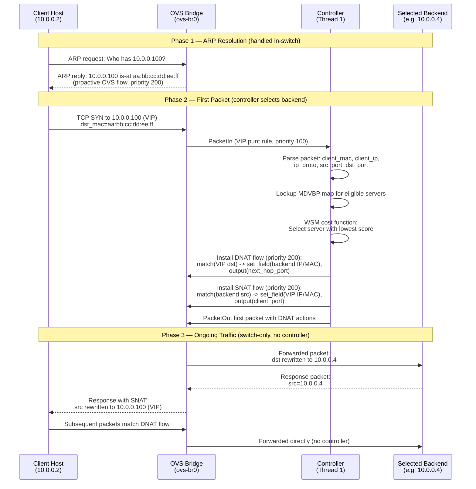
```mermaid
sequenceDiagram
    participant Client as Client Host<br/>(10.0.0.2)
    participant OVS as OVS Bridge<br/>(ovs-br0)
    participant Ctrl as Controller<br/>(Thread 1)
    participant Backend as Selected Backend<br/>(e.g. 10.0.0.4)

    Note over Client,Backend: Phase 1 — ARP Resolution (handled in-switch)
    Client->>OVS: ARP request: Who has 10.0.0.100?
    OVS-->>Client: ARP reply: 10.0.0.100 is-at aa:bb:cc:dd:ee:ff<br/>(proactive OVS flow, priority 200)

    Note over Client,Backend: Phase 2 — First Packet (controller selects backend)
    Client->>OVS: TCP SYN to 10.0.0.100 (VIP)<br/>dst_mac=aa:bb:cc:dd:ee:ff
    OVS->>Ctrl: PacketIn (VIP punt rule, priority 100)

    Ctrl->>Ctrl: Parse packet: client_mac, client_ip,<br/>ip_proto, src_port, dst_port
    Ctrl->>Ctrl: Lookup MDVBP map for eligible servers
    Ctrl->>Ctrl: WSM cost function:<br/>Select server with lowest score

    Ctrl->>OVS: Install DNAT flow (priority 200):<br/>match(VIP dst) -> set_field(backend IP/MAC),<br/>output(next_hop_port)
    Ctrl->>OVS: Install SNAT flow (priority 200):<br/>match(backend src) -> set_field(VIP IP/MAC),<br/>output(client_port)
    Ctrl->>OVS: PacketOut first packet with DNAT actions

    Note over Client,Backend: Phase 3 — Ongoing Traffic (switch-only, no controller)
    OVS->>Backend: Forwarded packet:<br/>dst rewritten to 10.0.0.4
    Backend-->>OVS: Response packet:<br/>src=10.0.0.4
    OVS-->>Client: Response with SNAT:<br/>src rewritten to 10.0.0.100 (VIP)
    Client->>OVS: Subsequent packets match DNAT flow
    OVS->>Backend: Forwarded directly (no controller)
```

**Phase 1 — ARP Resolution:**
The client ARPs for the VIP (`10.0.0.100`). A proactive OpenFlow rule (installed via `ovs-ofctl` in the setup scripts) makes the switch reply directly with `VIP_MAC = aa:bb:cc:dd:ee:ff`. The controller is not involved.

**Phase 2 — First Packet:**
The client sends the first `TCP SYN` to the VIP. The VIP punt flow (priority 100) sends this packet to the controller as a `PacketIn`. Thread 1 parses the headers, consults the MDVBP map, computes the WSM cost, and selects the best backend. It installs DNAT + SNAT flows (priority 200, with `idle_timeout`) and sends a `Packet-Out` for the first packet.

**Phase 3 — Ongoing Traffic:**
All subsequent packets in both directions are handled entirely by the switch using the installed DNAT/SNAT rules. The controller is not involved, and the client always sees traffic coming from the VIP address. When the `idle_timeout` expires, the flows are removed and the next packet triggers a new `Packet-In`, allowing Thread 1 to re-evaluate the backend selection with fresh metrics.

---

### 1.2 Thread 2 — Telemetry & State Monitor (Observer)

**Purpose:** Continuously watch infrastructure metrics and data-placement state. Feed live data to Thread 1 and raise alerts to Thread 3 when thresholds are breached.

#### Inputs

| Source                 | Data                                              | Method                                                  |
| ---------------------- | ------------------------------------------------- | ------------------------------------------------------- |
| State MongoDB instance | Server metrics (CPU, RAM, storage, request count) | MongoDB**Change Streams** (real-time push)        |
| OVS Switches           | Per-port byte/packet counters                     | `OFPPortStatsRequest` / `OFPPortStatsReply` polling |

#### What it does

1. **Listens** on a MongoDB Change Stream opened against the `metrics` collection in the State MongoDB instance.
2. Each time a server container inserts or updates its metrics document, the Change Stream pushes the event to Thread 2 in real-time.
3. Thread 2 **aggregates** the incoming metrics and updates the shared in-memory state variables:
   - Per-server load vector: `{server_id: {cpu: %, ram: %, bw_bps: int, storage: %}}`
   - Per-switch port bitrate (from OpenFlow stats polling)
4. Thread 2 continuously **evaluates** these metrics against configurable thresholds (e.g., CPU > 80%, latency > 50ms, storage > 90%).
5. If a threshold is breached, Thread 2 **triggers** Thread 3 by passing the current global state snapshot.

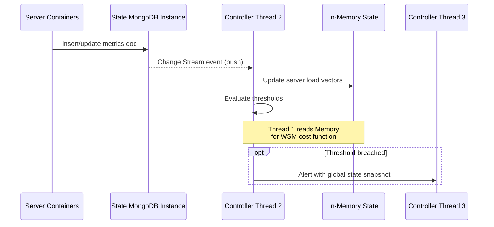
```mermaid
sequenceDiagram
    participant Servers as Server Containers
    participant StateMongo as State MongoDB Instance
    participant T2 as Controller Thread 2
    participant Memory as In-Memory State
    participant T3 as Controller Thread 3

    Servers->>StateMongo: insert/update metrics doc
    StateMongo-->>T2: Change Stream event (push)
    T2->>Memory: Update server load vectors
    T2->>T2: Evaluate thresholds
    Note over T2,Memory: Thread 1 reads Memory<br/>for WSM cost function
    opt Threshold breached
        T2->>T3: Alert with global state snapshot
    end
```

---

### 1.3 Thread 3 — Elasticity & Placement Manager (Slow Path)

**Purpose:** Mutate the infrastructure by adding/removing server containers and MongoDB replica set members when Thread 2 detects a threshold breach. Uses the **Multi-Dimensional Vector Bin Packing (MDVBP)** algorithm as its core decision engine.

In practice, Thread 3 performs **Data-Coupled Task Scheduling**: it treats compute placement and data placement as an inseparable unit. An application container is never placed on a node that lacks local access to the data it needs. If no local data resource exists, Thread 3 triggers **data orchestration** (cache deployment or `rs.add()`) *before* placing the service, ensuring that the compute and storage layers move together to guarantee QoS.

Thread 3 manages two types of resources:

- **Compute resources:** Server containers that handle HTTP requests.
- **Data resources:** Ephemeral cache nodes and MongoDB replica set secondaries that bring data closer to demanding networks.

Both decisions are driven by the same MDVBP model, but they serve different purposes: compute scaling addresses CPU/RAM/bandwidth exhaustion, while data placement addresses cross-network read latency.

#### MDVBP Decision Logic

When triggered, Thread 3 runs the **Multi-Dimensional Best-Fit Decreasing (MBFD)** heuristic:

1. **Collect** current state: active servers with their remaining capacity vectors, active user demands, and data domain locations (which replica set primaries, secondaries, and cache nodes exist in which networks).
2. **Filter** eligible servers for each demand: only those where the demand vector fits within remaining capacity and that have a local connection to the required data domain (primary, secondary, or ephemeral cache).
3. **Score** each candidate server: prefer the tightest fit (smallest remaining capacity after assignment) to consolidate load.

$$
Score_j = \|\vec{S}_{free,j} - \vec{u}_i\|
$$

4. **Assign** to the server with the smallest score. If no server has capacity, **spawn** a new one (scale-out).
5. If a server becomes idle (zero active sessions) and there is remaining capacity in the system to for example fit the largest user resource request up to date or the smallest user resource request up to date or the time it takes to bring a new server is fast enough to keep latency under QoS, **remove** it (scale-in).

#### Compute-Aware Scoring by Service Type

The MDVBP scoring adjusts its dimension weights based on the **service type** encoded in the VIP destination port. This ensures the algorithm selects servers that match the workload's resource profile:

$$
Score_{j} = \alpha \cdot (1 - \text{CPU}_{free}) + \beta \cdot \text{Data\_Distance}
$$

| Service Type (Port) | $\alpha$ (CPU weight) | $\beta$ (Data Distance weight) | Rationale |
| :--- | :--- | :--- | :--- |
| **Data API (5001)** | Low | High | I/O-bound. Proximity to data dominates. CPU is barely used. |
| **Web View (5002)** | High | High | CPU + I/O. The server must merge templates with data — needs both spare CPU cycles *and* local data access. |
| **Ingest (6001)** | Low | N/A (always primary) | Write path is fixed: route to the primary regardless of distance. |

This creates a meaningful constraint: **a CPU-starved node cannot be selected for Port 5002 traffic even if it has local data**, forcing Thread 3 to scale out compute. Conversely, a node with ample CPU but no local data will score poorly because template + data fetches would incur $2 \times \text{Remote RTT}$.

#### Elastic Lifecycle: Data Gravity in Action

The following diagrams show the three-phase lifecycle that distinguishes this system from static replication.

**Phase 1 — Base State (Tier 0):** Each network has its own primary. No cross-network replication or caching. Minimal infrastructure.

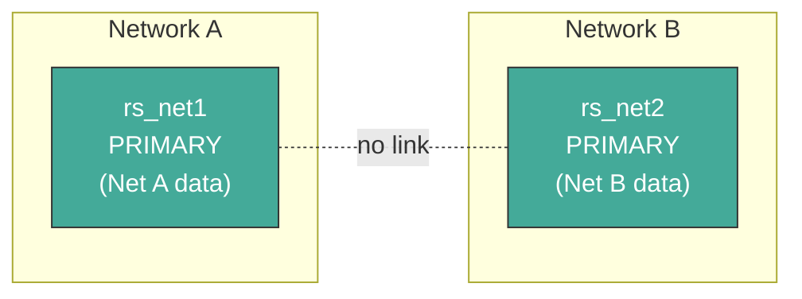
```mermaid
graph LR
    subgraph Network A
        RS1_P["rs_net1<br/>PRIMARY<br/>(Net A data)"]
    end
    subgraph Network B
        RS2_P["rs_net2<br/>PRIMARY<br/>(Net B data)"]
    end

    RS1_P -.-|"no link"| RS2_P

    style RS1_P fill:#4a9,stroke:#333,color:#fff
    style RS2_P fill:#4a9,stroke:#333,color:#fff
```

> Writes: local. Reads (own data): local. Reads (remote data): remote fetch. No secondaries, no caches.

**Phase 2 — Moderate Demand (Tier 1):** Thread 2 detects moderate cross-network read rate (≥ 10 req/s) from Network B clients requesting Network A data. Thread 3 deploys an Ephemeral Cache node in Network B.

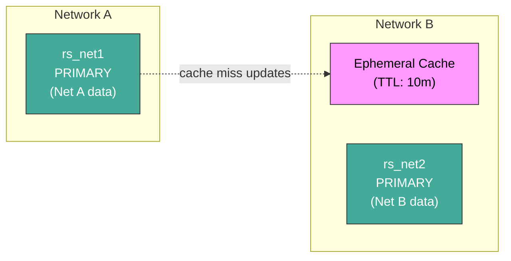
```mermaid
graph LR
    subgraph Network A
        RS1_P2["rs_net1<br/>PRIMARY<br/>(Net A data)"]
    end
    subgraph Network B
        RS1_C["Ephemeral Cache<br/>(TTL: 10m)"]
        RS2_P2["rs_net2<br/>PRIMARY<br/>(Net B data)"]
    end

    RS1_P2 -.->|"cache miss updates"| RS1_C

    style RS1_P2 fill:#4a9,stroke:#333,color:#fff
    style RS1_C fill:#f9f,stroke:#333,color:#000
    style RS2_P2 fill:#4a9,stroke:#333,color:#fff
```

> Net B reads for Net A data: **served from cache** if hit, or fetched remotely on miss. Zero oplog overhead.

**Phase 3 — High or Broad Demand (Tier 2):** Thread 2 detects high unique-data requests (> 50% of DB) or very poor cache hit rates. Thread 3 replaces the cache with a full secondary via `rs.add()`.

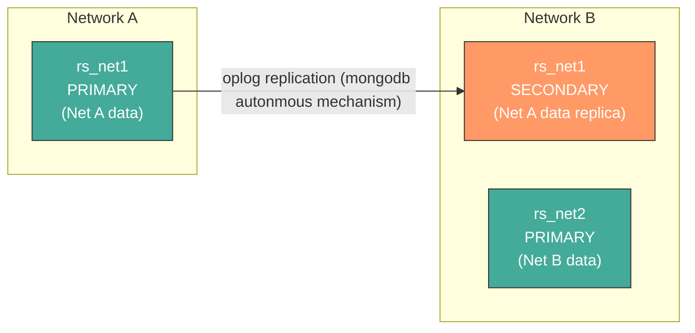
```mermaid
graph LR
    subgraph Network A
        RS1_P3["rs_net1<br/>PRIMARY<br/>(Net A data)"]
    end
    subgraph Network B
        RS1_S["rs_net1<br/>SECONDARY<br/>(Net A data replica)"]
        RS2_P3["rs_net2<br/>PRIMARY<br/>(Net B data)"]
    end

    RS1_P3 -->|"oplog replication (mongodb autonmous mechanism)"| RS1_S

    style RS1_P3 fill:#4a9,stroke:#333,color:#fff
    style RS1_S fill:#f96,stroke:#333,color:#fff
    style RS2_P3 fill:#4a9,stroke:#333,color:#fff
```

> Net B reads for Net A data: **always local** (served by secondary). Net A's full oplog is replicated.

**Phase 4 — Demand Subsides (Scale-in):** Thread 2 detects cross-network reads dropped below threshold. Thread 3 executes `rs.remove()` to remove the secondary or spin down the cache node. System returns to Phase 1.

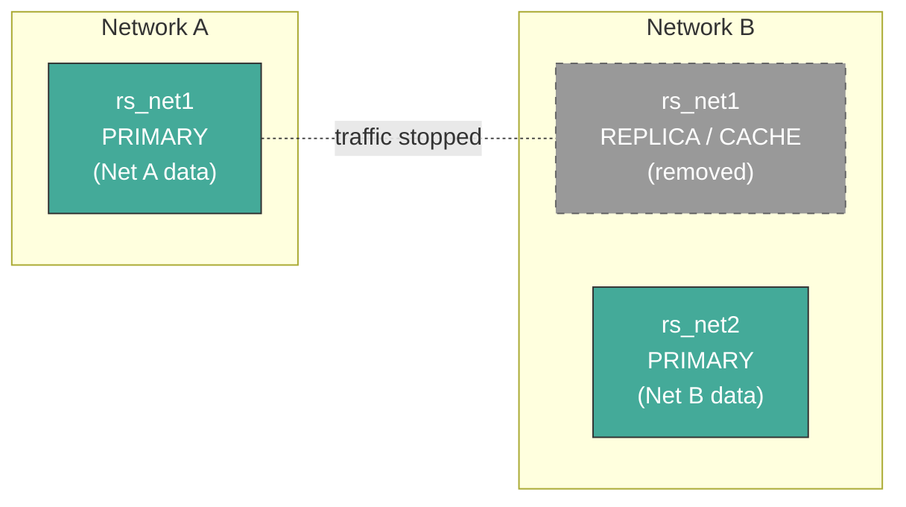
```mermaid
graph LR
    subgraph Network A
        RS1_P4["rs_net1<br/>PRIMARY<br/>(Net A data)"]
    end
    subgraph Network B
        RS1_S4["rs_net1<br/>REPLICA / CACHE<br/>(removed)"]
        RS2_P4["rs_net2<br/>PRIMARY<br/>(Net B data)"]
    end

    RS1_P4 -.-|"traffic stopped"| RS1_S4

    style RS1_P4 fill:#4a9,stroke:#333,color:#fff
    style RS1_S4 fill:#999,stroke:#666,color:#fff,stroke-dasharray: 5 5
    style RS2_P4 fill:#4a9,stroke:#333,color:#fff
```

> Edge storage freed, replication/cache traffic stopped. Back to base state.

This closed-loop behavior — observe demand → place replica → route locally → observe reduced cross-network traffic → remove when idle — is the system's core adaptive mechanism. The SDN controller makes the placement decision that MongoDB's driver layer cannot: it knows the network topology, link costs, and traffic patterns, and uses that knowledge to decide *when* and *where* data should be replicated.

#### Scale-Out Decision Tree

When Thread 2 triggers Thread 3, the decision process follows this order:

1. **Is the bottleneck CPU/RAM/bandwidth on existing servers?**
   - Yes → Scale out **compute** (spawn a server container in the same network).
2. **Is the bottleneck cross-network read latency (clients reading data from a remote primary)?**
   - Yes → Evaluate the **data placement tier** using the thresholds below:

| Metric                  | Threshold          | Action                            | Mechanism                                                                               |
| ----------------------- | ------------------ | --------------------------------- | --------------------------------------------------------------------------------------- |
| Cross-network reads     | < 10 req/s         | **Do nothing**              | Route packets to remote primary via SDN (Tier 0)                                        |
| Cross-network reads     | ≥ 10 req/s        | **Spawn ephemeral cache**   | Deploy standalone `mongod` with TTL index + inject cache env vars (Tier 1)            |
| Cache hit rate          | < 20%              | **Remove ephemeral cache**  | Data access is too random; caching is useless. Revert to Tier 0 or escalate to Tier 2   |
| Unique data % requested | > 50% of remote DB | **Upgrade to full replica** | Users want the whole dataset. Stop caching, start replicating via `rs.add()` (Tier 2) |

3. **Tier 1 path (Ephemeral Cache):** Does the target network already have a cache node for the remote data domain?
   - Yes → Scale out compute only (the cache is already local).
   - No → First: spawn a standalone `mongod` with TTL indexes in the target network. Then: reconfigure app server env vars to use read-through caching. Thread 1 routes reads to the local app server, which reads from cache (or fetches on miss).
4. **Tier 2 path (Full Replica):** Does the target network already have a secondary of the remote replica set?
   - Yes → Scale out compute only (the data is already local).
   - No → First: `rs.add()` a secondary in the target network. Wait for initial sync to complete. Then: spawn a server container pointing at the new local secondary.
5. **Is the secondary caught up (replication lag < threshold)?**
   - Yes → Thread 1 can route reads to the local network immediately.
   - No → Keep routing reads to the remote primary (or cache, if present) until sync completes.

#### Scale-Out (Tier 2): Adding a Replica Set Secondary

When Thread 3 determines that a network segment needs a full local replica (e.g., Tier 1 cache missed too often or requested data volume is too large), it adds a **secondary** to the remote data domain's replica set in the target network:

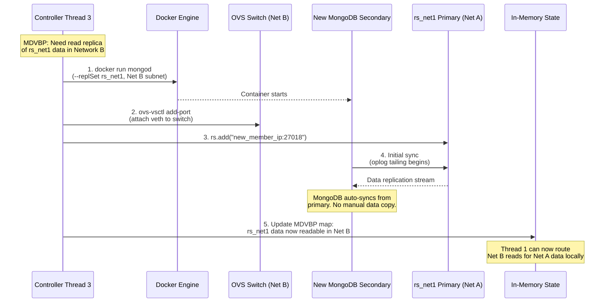
```mermaid
sequenceDiagram
    participant T3 as Controller Thread 3
    participant Docker as Docker Engine
    participant OVS as OVS Switch (Net B)
    participant NewMongo as New MongoDB Secondary
    participant Primary as rs_net1 Primary (Net A)
    participant Memory as In-Memory State

    Note over T3: MDVBP: Need read replica<br/>of rs_net1 data in Network B

    T3->>Docker: 1. docker run mongod<br/>(--replSet rs_net1, Net B subnet)
    Docker-->>NewMongo: Container starts
    T3->>OVS: 2. ovs-vsctl add-port<br/>(attach veth to switch)
    T3->>Primary: 3. rs.add("new_member_ip:27018")
    NewMongo->>Primary: 4. Initial sync<br/>(oplog tailing begins)
    Primary-->>NewMongo: Data replication stream
    Note over NewMongo: MongoDB auto-syncs from<br/>primary. No manual data copy.
    T3->>Memory: 5. Update MDVBP map:<br/>rs_net1 data now readable in Net B
    Note over Memory: Thread 1 can now route<br/>Net B reads for Net A data locally
```

**Why this works without sharding:**

- The new `mongod` only needs the `--replSet rs_net1` flag. No sharding configuration, no config server awareness, no `mongos` involvement.
- `rs.add()` is executed on the **primary** of `rs_net1`. The new secondary automatically discovers the primary via the replica set protocol and begins oplog tailing.
- Once the initial sync completes, the secondary holds a full copy of `rs_net1`'s data and can serve reads immediately.
- Server containers in Network B connect to this secondary using `directConnection=true`, bypassing driver-level replica set discovery entirely.

#### Scale-Out: Adding a Server Container (Compute Placement)

When MDVBP detects that all existing server nodes are at capacity and new client requests cannot be assigned, Thread 3 spawns a new application server container. The key difference from prior designs is that the container receives **direct connection strings** rather than replica set URIs:

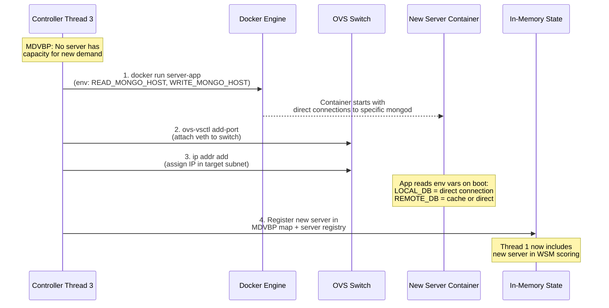
```mermaid
sequenceDiagram
    participant T3 as Controller Thread 3
    participant Docker as Docker Engine
    participant OVS as OVS Switch
    participant Server as New Server Container
    participant Memory as In-Memory State

    Note over T3: MDVBP: No server has<br/>capacity for new demand

    T3->>Docker: 1. docker run server-app<br/>(env: READ_MONGO_HOST, WRITE_MONGO_HOST)
    Docker-->>Server: Container starts with<br/>direct connections to specific mongod
    T3->>OVS: 2. ovs-vsctl add-port<br/>(attach veth to switch)
    T3->>OVS: 3. ip addr add<br/>(assign IP in target subnet)
    Note over Server: App reads env vars on boot:<br/>LOCAL_DB = direct connection<br/>REMOTE_DB = cache or direct
    T3->>Memory: 4. Register new server in<br/>MDVBP map + server registry
    Note over Memory: Thread 1 now includes<br/>new server in WSM scoring
```

**Environment variables injected by Thread 3:**

```bash
# Local data: direct to primary, no caching
DB_CONNECTION_LOCAL="mongodb://10.0.1.4:27018/?directConnection=true"

# Remote data: use the ephemeral cache or point to remote primary
DB_CONNECTION_REMOTE_A="mongodb://10.0.1.15:27018/?directConnection=true"
DB_SOURCE_REMOTE_A="mongodb://10.0.0.4:27018/?directConnection=true"
```

Using `directConnection=true` means:

- **Zero heartbeat traffic** — the driver does not ping other replica set members.
- **Zero discovery traffic** — no topology scanning.
- **SDN retains full authority** — Thread 3 decides which `mongod` each container talks to, not the MongoDB driver.

#### Scale-In: Removing Resources

When an existing server has zero active sessions (all flow rules have expired via `idle_timeout`), Thread 3 removes it to save energy:

1. Thread 3 verifies no active flows reference the server (via OpenFlow stats or its own session tracking).
2. `docker stop` and `docker rm` the container.
3. `ovs-vsctl del-port` the veth pair.
4. If the removed server was the only consumer of a local data resource (MongoDB secondary or Ephemeral Cache), Thread 3 evaluates whether the resource should also be removed (`rs.remove()` or container shutdown).
5. Update the in-memory MDVBP map.

#### Why Not Sharding?

The system deliberately avoids MongoDB sharding for the following reasons:

| Concern                        | Sharding Approach                                       | Topology-Aware Approach (Current)                                |
| ------------------------------ | ------------------------------------------------------- | ---------------------------------------------------------------- |
| **Write distribution**   | Distributes writes across primaries                     | Not needed — writes are ~0.2% of traffic                        |
| **Infrastructure**       | Config server + mongos + zone ranges required           | Local replica sets + standalone cache nodes                      |
| **Elasticity mechanism** | `sh.moveChunk()` — locks chunks, heavyweight         | Ephemeral Cache or `rs.add()` / `rs.remove()` — lightweight |
| **Data locality**        | Zone ranges pin data to shards                          | Data stays where it's produced by default                        |
| **Read optimization**    | Reads go through mongos routing layer                   | Direct connection to local cache or primary — no middleware     |
| **Network overhead**     | Driver heartbeats to all members + mongos metadata sync | `directConnection=true` — zero discovery traffic              |
| **Reversibility**        | `moveChunk` back is complex                           | Cache eviction or `rs.remove()` is instant                     |
| **Thesis alignment**     | Solves write scaling (the 0.2%)                         | Solves read locality and latency masking (the 99.8%)             |

---

### 1.4 Topology-Aware Ephemeral Caching (The "Middle Path")

**Purpose:** Provide a lightweight, zero-replication data access tier for moderate cross-network read demand — sitting between "route to remote primary" (cheap but slow) and "full replica via `rs.add()`" (fast but heavy).

**Why this is novel:** Standard caching (e.g., a generic Redis layer) caches everything frequently accessed regardless of network topology. This system is **topology-aware**: it only caches data when the cost of fetching it exceeds a network boundary. Intra-network data is never cached because the primary is already <1ms away — caching it would introduce consistency risk (stale data), RAM waste, and invalidation complexity for zero latency gain.

#### The Data Placement Hierarchy

Thread 3 selects a strategy based on the relationship between the request origin and the data origin:

| Scenario                              | Relationship  | Strategy                              | Rationale                                                                                                  |
| ------------------------------------- | ------------- | ------------------------------------- | ---------------------------------------------------------------------------------------------------------- |
| User A reads Data A                   | Intra-network | Direct read from primary              | Primary is local. Latency is negligible. Caching adds unnecessary complexity.                              |
| User B reads Data A (low volume)      | Cross-network | Direct routing to remote primary      | Demand is too low to justify any local infrastructure. SDN routes packets.                                 |
| User B reads Data A (moderate volume) | Cross-network | **Ephemeral cache**             | Primary is remote. Latency is high. Cache creates a temporary "bridge" to mask latency.                    |
| User B reads Data A (high volume)     | Cross-network | **Full replica** (`rs.add()`) | Demand is so high that maintaining a cache (eviction/misses) is more expensive than replicating the oplog. |

#### Trigger Condition

Thread 2 detects that clients in Network B are pulling data from a VIP whose data domain resides in Network A:

- **Packet analysis:** `src_ip` $\in$ Net B, `dst_VIP` $\in$ Net A data domain.
- **Metric:** Cross-network read rate exceeds the Tier 1 threshold (e.g., ≥ 10 req/s).
- **Action:** Thread 3 identifies this as a "high cost" flow and deploys an ephemeral cache node.

#### Deployment: The Cache Node

Thread 3 spins up a lightweight container in the target network. Rather than being a passive datastore that waits for the app server to populate it on cache misses, the cache node is a **Self-Hydrating Programmable Container** — a sidecar composite that carries its own synchronization intelligence.

- **Configuration:** Standalone `mongod` (no `--replSet` flag). It is not a replica set member and has zero oplog overhead.
- **Sidecar agent (`sync.py`):** An intelligent synchronization script that runs alongside `mongod` inside the same container. Upon instantiation, it connects to the Remote Primary, opens a **Change Stream**, and begins proactively pulling recently modified documents into the local `mongod` instance. This pre-populates the cache with fresh data, reducing cache-miss rates from the first request onward. The app server's read-through logic (Section 2.1) handles misses for data that `sync.py` has not yet pulled.
- **Indexes:** `expireAfterSeconds` TTL index on all cached collections, combined with **frequency-aware TTL extension** (see Smart Data Retention below).
- **Memory:** Capped footprint. The TTL index ensures auto-eviction; the cache never grows unboundedly.
- **Lifecycle:** Entirely managed by Thread 3. The controller issues a single **"Fire and Forget"** command (`docker run`), and the container autonomously handles data synchronization via its embedded `sync.py` agent. Created when demand crosses the threshold, removed when demand drops or cache hit rate falls below usefulness.

**Why "Programmable Container" matters:** The infrastructure is not a static binary image. The container carries its own replication and synchronization logic, validating the thesis premise that containers can be active participants in data distribution — not merely passive hosts for application code.

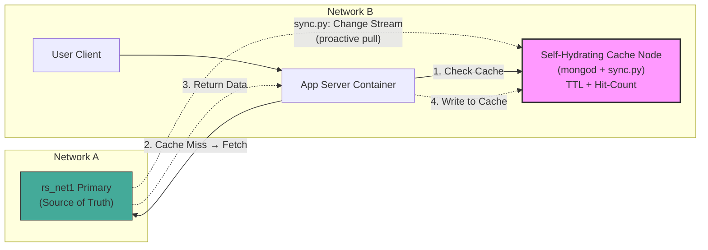
```mermaid
graph LR
    subgraph Network A
        PrimaryA["rs_net1 Primary<br/>(Source of Truth)"]
    end

    subgraph Network B
        ClientB[User Client]
        AppB[App Server Container]
        CacheB["Self-Hydrating Cache Node<br/>(mongod + sync.py)<br/>TTL + Hit-Count"]
    end

    PrimaryA -.->|"sync.py: Change Stream<br/>(proactive pull)"| CacheB
    ClientB --> AppB
    AppB -->|"1. Check Cache"| CacheB
    AppB -->|"2. Cache Miss → Fetch"| PrimaryA
    PrimaryA -.->|"3. Return Data"| AppB
    AppB -.->|"4. Write to Cache"| CacheB

    style CacheB fill:#f9f,stroke:#333,stroke-width:2px
    style PrimaryA fill:#4a9,stroke:#333
```

#### Cache Node Deployment Sequence

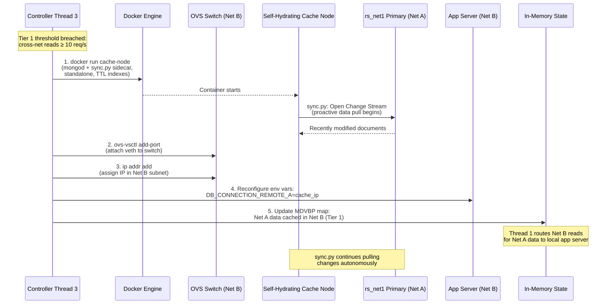
```mermaid
sequenceDiagram
    participant T3 as Controller Thread 3
    participant Docker as Docker Engine
    participant OVS as OVS Switch (Net B)
    participant Cache as Self-Hydrating Cache Node
    participant Primary as rs_net1 Primary (Net A)
    participant AppServer as App Server (Net B)
    participant Memory as In-Memory State

    Note over T3: Tier 1 threshold breached:<br/>cross-net reads ≥ 10 req/s

    T3->>Docker: 1. docker run cache-node<br/>(mongod + sync.py sidecar,<br/>standalone, TTL indexes)
    Docker-->>Cache: Container starts
    Cache->>Primary: sync.py: Open Change Stream<br/>(proactive data pull begins)
    Primary-->>Cache: Recently modified documents
    T3->>OVS: 2. ovs-vsctl add-port<br/>(attach veth to switch)
    T3->>OVS: 3. ip addr add<br/>(assign IP in Net B subnet)
    T3->>AppServer: 4. Reconfigure env vars:<br/>DB_CONNECTION_REMOTE_A=cache_ip
    T3->>Memory: 5. Update MDVBP map:<br/>Net A data cached in Net B (Tier 1)
    Note over Memory: Thread 1 routes Net B reads<br/>for Net A data to local app server
    Note over Cache,Primary: sync.py continues pulling<br/>changes autonomously
```

#### Environment Variables (Cache-Aware)

Thread 3 injects a split-brain configuration into the app server container, distinguishing local data (strong consistency) from remote data (eventual consistency via cache):

```bash
# Local data: direct to primary, no caching (strong consistency)
DB_CONNECTION_LOCAL="mongodb://rs_net2_primary:27017/?directConnection=true"

# Remote data: use the ephemeral cache (read-through, eventual consistency)
DB_CONNECTION_REMOTE_A="mongodb://cache_node_net_b:27017/?directConnection=true"
DB_SOURCE_REMOTE_A="mongodb://rs_net1_primary:27017/?directConnection=true"
```

#### Tier Transitions

The system does not just scale up — it **changes strategy** based on observed demand:

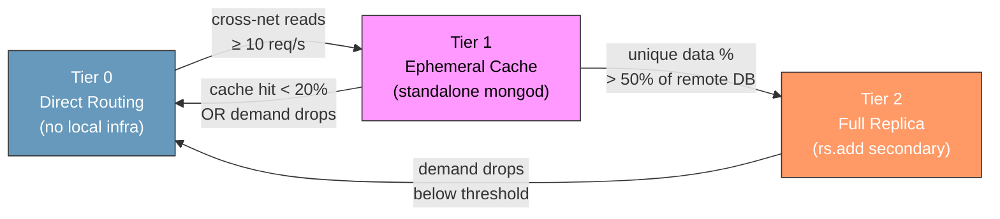
```mermaid
graph LR
    T0["Tier 0<br/>Direct Routing<br/>(no local infra)"] -->|"cross-net reads<br/>≥ 10 req/s"| T1["Tier 1<br/>Ephemeral Cache<br/>(standalone mongod)"]
    T1 -->|"cache hit < 20%<br/>OR demand drops"| T0
    T1 -->|"unique data %<br/>> 50% of remote DB"| T2["Tier 2<br/>Full Replica<br/>(rs.add secondary)"]
    T2 -->|"demand drops<br/>below threshold"| T0

    style T0 fill:#69b,stroke:#333,color:#fff
    style T1 fill:#f9f,stroke:#333,color:#000
    style T2 fill:#f96,stroke:#333,color:#fff
```

**Transition rules:**

- **Tier 0 → Tier 1:** Cross-network reads exceed threshold. Deploy cache node.
- **Tier 1 → Tier 0:** Cache hit rate falls below 20% (data is too random, caching is useless) or demand drops below threshold. Remove cache node.
- **Tier 1 → Tier 2:** Unique data percentage exceeds 50% of the remote database (users want the whole dataset — stop caching, start replicating).
- **Tier 2 → Tier 0:** Cross-network read demand subsides. Execute `rs.remove()` and return to base state.

#### Scientific Justification

1. **Latency vs. freshness trade-off.** For remote data, users accept a bounded risk of staleness (TTL window) in exchange for local-network latency. For local data, freshness is guaranteed by direct primary access. This is a principled distributed systems decision, not a blanket cache-everything approach.
2. **Resource bounding.** The TTL index ensures the cache node self-cleans. It holds only the "working set" — documents actually requested — rather than growing unboundedly like a full replica that receives every oplog entry.
3. **Zero oplog overhead.** A full replica processes the oplog for every write on the primary, even if that data is never read in the target network. The ephemeral cache has zero replication overhead: it only stores what is explicitly fetched.
4. **Topology awareness.** Unlike generic caching layers (Redis, Memcached) that cache indiscriminately, this mechanism is activated **only** when the SDN controller detects cross-network traffic patterns. The network topology is the trigger, not application-level access frequency alone.
5. **Autonomous edge intelligence.** The Self-Hydrating Container pattern shifts synchronization complexity from the centralized controller into the container image itself. The controller issues a single `docker run`; the container's embedded `sync.py` agent handles the ongoing complexity of Change Stream consumption, document filtering, and local insertion. This "Fire and Forget" model prevents the controller from becoming a bottleneck as the number of edge cache nodes grows.

#### Smart Data Retention: Frequency-Aware Sliding Window

The system goes beyond flat TTL expiration to implement a **frequency-aware sliding window** that ensures expensive edge storage is only consumed by the working set currently relevant to the local user base.

**Mechanism:** TTL indexes combined with **hit-count logic**.

- Each cached document carries a `last_accessed` timestamp field (indexed with `expireAfterSeconds`).
- Every time a client reads a document from the cache, the app server atomically updates `last_accessed` to the current time, effectively **resetting the TTL clock**:

```javascript
db.cache.updateOne(
  { _id: doc_id },
  { $set: { last_accessed: new Date() }, $inc: { hit_count: 1 } }
)
```

- **Hot data** (frequently accessed) has its TTL continuously refreshed and naturally stays resident in the cache.
- **Cold data** (never re-accessed after the initial fetch) expires automatically when the TTL window elapses.

**Result:** The cache implements a self-managing LRU-like eviction policy entirely within MongoDB's TTL machinery — no external eviction daemon, no application-level garbage collection. The `hit_count` field provides Thread 2 with an additional telemetry signal for tier transition decisions: a high hit rate with high hit counts confirms the cache is effective (stay at Tier 1), while a low hit rate signals escalation to Tier 2 or reversion to Tier 0.

---

## 2. The Server (Application Container)

Each server is a lightweight Docker container running an HTTP application (e.g., Flask/FastAPI). It handles client GET and POST requests, connecting to the appropriate MongoDB instance via **direct connections** configured at boot time. It also periodically reports its own resource usage to the State MongoDB instance.

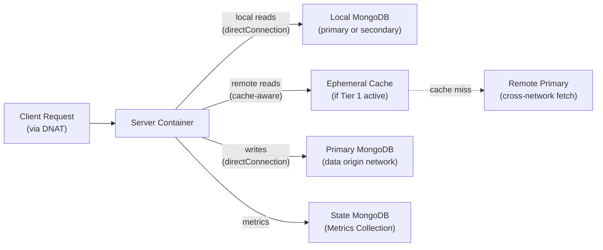
```mermaid
graph LR
    Client["Client Request<br/>(via DNAT)"] --> Server["Server Container"]
    Server -->|"local reads<br/>(directConnection)"| ReadMongo["Local MongoDB<br/>(primary or secondary)"]
    Server -->|"remote reads<br/>(cache-aware)"| CacheMongo["Ephemeral Cache<br/>(if Tier 1 active)"]
    CacheMongo -.->|"cache miss"| RemotePrimary["Remote Primary<br/>(cross-network fetch)"]
    Server -->|"writes<br/>(directConnection)"| WriteMongo["Primary MongoDB<br/>(data origin network)"]
    Server -->|"metrics"| StateMongo["State MongoDB<br/>(Metrics Collection)"]
```

---

### 2.1 Receiving and Processing HTTP Requests

When a server container receives an HTTP request (routed via the VIP DNAT rules), it uses the **destination port** to determine the operation type and target data domain. This is the "Context-Aware Application" pattern: the server was configured at boot time (via environment variables injected by Thread 3) with direct connection strings to specific `mongod` instances.

**Read requests (GET) — Local data (intra-network):** The server connects directly to the local `mongod` primary. The connection uses `directConnection=true`, so the MongoDB driver sends queries directly to that one host without discovering other replica set members or generating heartbeat traffic. No caching is involved — the primary is already <1ms away.

**Read requests (GET) — Remote data (cross-network):** The server's behavior depends on the active data placement tier:

- **Tier 0:** No local data resource exists. The server fetches directly from the remote primary (cross-network hop). SDN routes the packet.
- **Tier 1 (Ephemeral Cache):** The server implements a **read-through cache** pattern. It first queries the local ephemeral cache node (`DB_CONNECTION_REMOTE_A`). On a cache hit, the document is returned immediately at local-network latency. On a cache miss, the server fetches from the remote primary (`DB_SOURCE_REMOTE_A`), writes the result into the cache (with TTL auto-expiration), and returns it to the client.
- **Tier 2 (Full Replica):** A local secondary of the remote replica set exists. The server reads from it directly via `directConnection=true`, identical to reading from a local primary.

**Write requests (POST):** The server writes to the **primary** of the data domain's replica set. If the server is in the same network as the primary, this is a local operation. If the server is in a different network (e.g., it exists to serve cross-network reads), the write traverses the network to reach the primary. Since writes are ~0.2% of traffic, this cross-network latency is acceptable.

**Read flow — Local data (intra-network, direct read):**

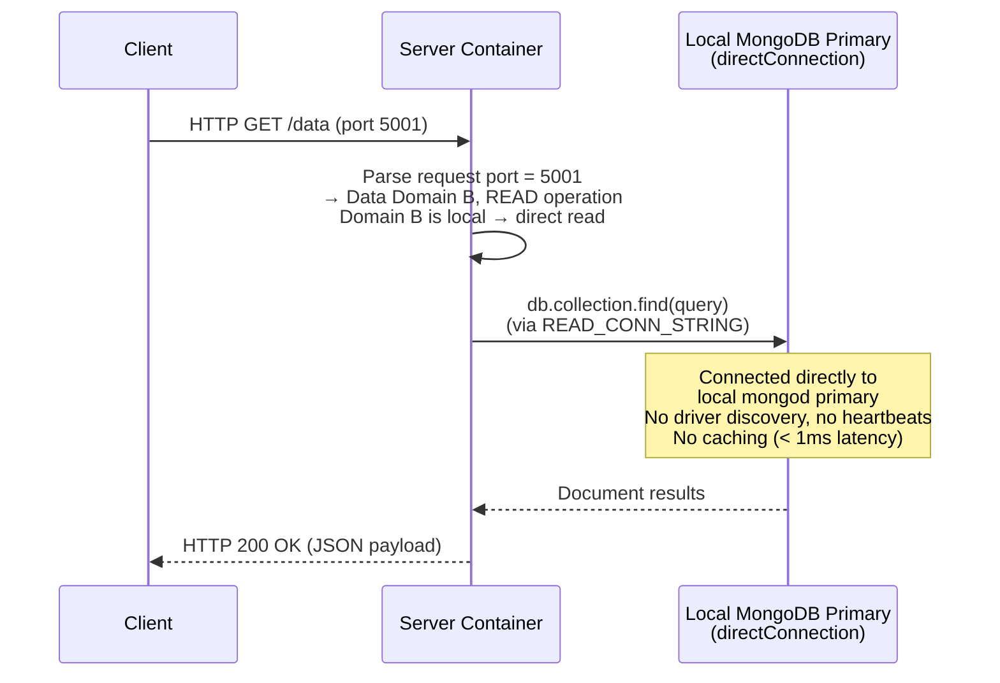
```mermaid
sequenceDiagram
    participant Client
    participant Server as Server Container
    participant LocalMongo as Local MongoDB Primary<br/>(directConnection)

    Client->>Server: HTTP GET /data (port 5001)
    Server->>Server: Parse request port = 5001<br/>→ Data Domain B, READ operation<br/>Domain B is local → direct read
    Server->>LocalMongo: db.collection.find(query)<br/>(via READ_CONN_STRING)
    Note over LocalMongo: Connected directly to<br/>local mongod primary<br/>No driver discovery, no heartbeats<br/>No caching (< 1ms latency)
    LocalMongo-->>Server: Document results
    Server-->>Client: HTTP 200 OK (JSON payload)
```

**Read flow — Remote data with Ephemeral Cache (Tier 1):**

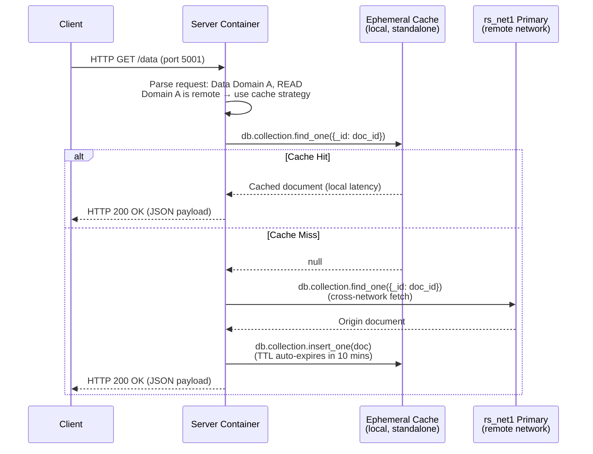
```mermaid
sequenceDiagram
    participant Client
    participant Server as Server Container
    participant Cache as Ephemeral Cache<br/>(local, standalone)
    participant Primary as rs_net1 Primary<br/>(remote network)

    Client->>Server: HTTP GET /data (port 5001)
    Server->>Server: Parse request: Data Domain A, READ<br/>Domain A is remote → use cache strategy
    Server->>Cache: db.collection.find_one({_id: doc_id})
    alt Cache Hit
        Cache-->>Server: Cached document (local latency)
        Server-->>Client: HTTP 200 OK (JSON payload)
    else Cache Miss
        Cache-->>Server: null
        Server->>Primary: db.collection.find_one({_id: doc_id})<br/>(cross-network fetch)
        Primary-->>Server: Origin document
        Server->>Cache: db.collection.insert_one(doc)<br/>(TTL auto-expires in 10 mins)
        Server-->>Client: HTTP 200 OK (JSON payload)
    end
```

**Write flow (rare, ~0.2% of traffic):**

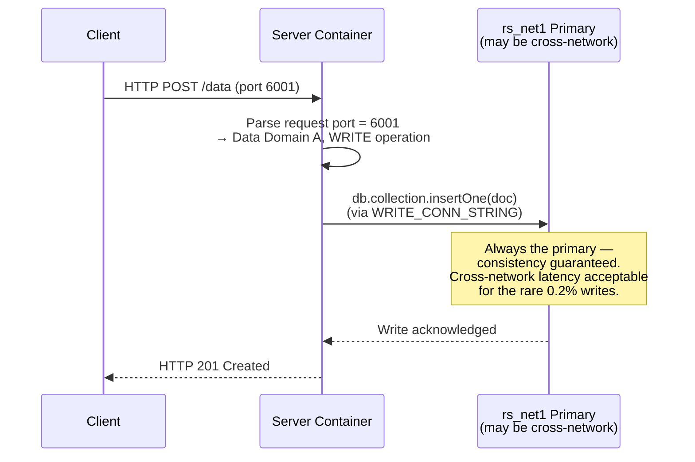
```mermaid
sequenceDiagram
    participant Client
    participant Server as Server Container
    participant Primary as rs_net1 Primary<br/>(may be cross-network)

    Client->>Server: HTTP POST /data (port 6001)
    Server->>Server: Parse request port = 6001<br/>→ Data Domain A, WRITE operation
    Server->>Primary: db.collection.insertOne(doc)<br/>(via WRITE_CONN_STRING)
    Note over Primary: Always the primary —<br/>consistency guaranteed.<br/>Cross-network latency acceptable<br/>for the rare 0.2% writes.
    Primary-->>Server: Write acknowledged
    Server-->>Client: HTTP 201 Created
```

---

### 2.2 Reporting Metrics to the State MongoDB

Each server container runs a background process (or periodic timer) that collects its own resource utilization and writes it to the **State MongoDB** instance. This is the data source that Thread 2 (Observer) watches via Change Streams.

**Metrics collected:**

| Metric             | Source                          | Unit               |
| ------------------ | ------------------------------- | ------------------ |
| CPU usage          | `/proc/stat` or `psutil`    | Percentage (0-100) |
| RAM usage          | `/proc/meminfo` or `psutil` | Percentage (0-100) |
| Storage usage      | `df` or `shutil.disk_usage` | Percentage (0-100) |
| Active connections | Application counter             | Integer            |

**Reporting flow:**

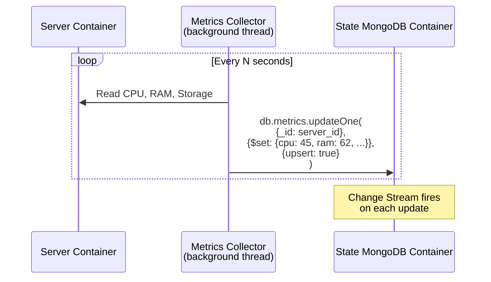
```mermaid
sequenceDiagram
    participant Server as Server Container
    participant Collector as Metrics Collector<br/>(background thread)
    participant StateMongo as State MongoDB Container

    loop Every N seconds
        Collector->>Server: Read CPU, RAM, Storage
        Collector->>StateMongo: db.metrics.updateOne(<br/>  {_id: server_id},<br/>  {$set: {cpu: 45, ram: 62, ...}},<br/>  {upsert: true}<br/>)
    end
    Note over StateMongo: Change Stream fires<br/>on each update
```

The server uses `updateOne` with `upsert: true` keyed by its own `server_id`. This ensures a single document per server (no unbounded growth) and triggers a Change Stream event on every update, which Thread 2 receives in real-time.

---

### 2.3 Context-Aware Content Generation (Server-Side Rendering)

The server containers implement a **dual-mode** operation based on the requested port, effectively functioning as both a Data Proxy and an Edge Renderer.

**Mode A — Raw Data Proxy (Port 5001):**

- **Action:** Single DB query → return JSON.
- **Use case:** IoT sensors, mobile app data sync, machine-to-machine APIs.
- **Bottleneck:** Strictly network latency (I/O bound).

**Mode B — Dynamic HTML Composition (Port 5002):**

- **Action:** The container performs **Server-Side Rendering (SSR)**.
- **Workflow:**
  1. **Fetch Template:** Retrieve the HTML skeleton (e.g., `layout_main`) from the `templates` collection.
  2. **Fetch Content:** Retrieve the specific data (e.g., `user_profile`) from the `data` collection.
  3. **Merge (Compute):** Use a lightweight templating engine to inject data into the HTML placeholders.
  4. **Response:** Return `Content-Type: text/html`.

This dual-mode design limits each SSR request to **1–2 internal DB queries** (one for the template, one for the data), keeping the system demonstrable and measurable while still proving the core thesis.

#### Thesis Alignment — Data Gravity Amplification Effect

Dynamic rendering introduces a **latency amplification effect.** A single user HTTP request triggers multiple internal database queries (Template + Data). This makes the Data Gravity mechanism disproportionately more valuable for SSR workloads:

- **Without Data Gravity (Tier 0):** The container fetches the heavy HTML template and content data across the network for *every* request. Latency stacks up: $2 \times \text{Remote RTT}$.
- **With Data Gravity (Tier 1 — Ephemeral Cache):** The HTML template (which changes infrequently) is cached locally with TTL. The content data may also be cached. The container fetches both from `localhost` or the local LAN ($< 1\text{ms}$). CPU merging happens at the edge. The user receives the final HTML instantly.
- **With Data Gravity (Tier 2 — Full Replica):** Both template and content collections are fully replicated locally. Every SSR request resolves at LAN speed with zero cache misses.

This amplification effect is the strongest empirical argument for topology-aware data placement: the system does not just move bytes — it enables **edge compute** that would otherwise be impossible at acceptable latency.

#### Edge-Based Rendering Flow

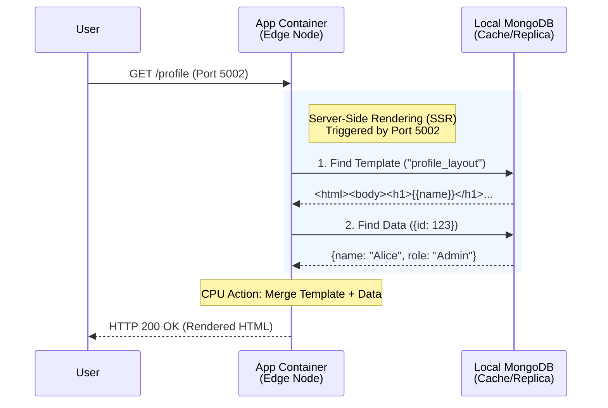
```mermaid
sequenceDiagram
    participant User
    participant App as App Container<br/>(Edge Node)
    participant LocalDB as Local MongoDB<br/>(Cache/Replica)

    User->>App: GET /profile (Port 5002)

    rect rgb(240, 248, 255)
        Note right of App: Server-Side Rendering (SSR)<br/>Triggered by Port 5002
        App->>LocalDB: 1. Find Template ("profile_layout")
        LocalDB-->>App: <html><body><h1>{{name}}</h1>...
        App->>LocalDB: 2. Find Data ({id: 123})
        LocalDB-->>App: {name: "Alice", role: "Admin"}
    end

    Note over App: CPU Action: Merge Template + Data
    App-->>User: HTTP 200 OK (Rendered HTML)
```

#### SSR with Remote Data (Tier 0 — No Local Data)

When no local cache or replica exists, the latency penalty is clear:

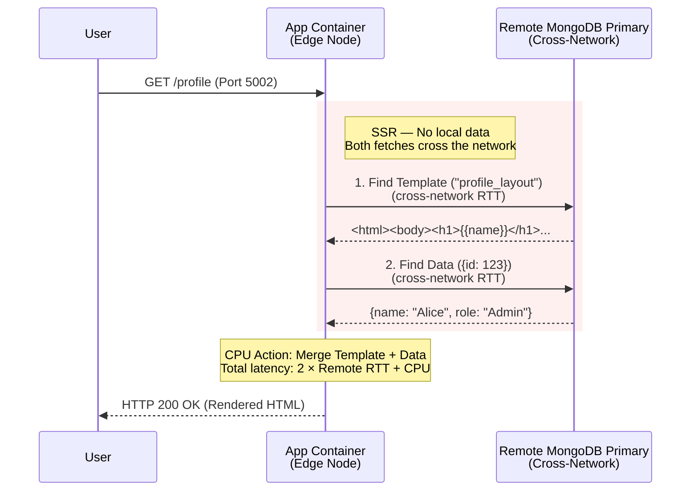
```mermaid
sequenceDiagram
    participant User
    participant App as App Container<br/>(Edge Node)
    participant RemoteDB as Remote MongoDB Primary<br/>(Cross-Network)

    User->>App: GET /profile (Port 5002)

    rect rgb(255, 240, 240)
        Note right of App: SSR — No local data<br/>Both fetches cross the network
        App->>RemoteDB: 1. Find Template ("profile_layout")<br/>(cross-network RTT)
        RemoteDB-->>App: <html><body><h1>{{name}}</h1>...
        App->>RemoteDB: 2. Find Data ({id: 123})<br/>(cross-network RTT)
        RemoteDB-->>App: {name: "Alice", role: "Admin"}
    end

    Note over App: CPU Action: Merge Template + Data<br/>Total latency: 2 × Remote RTT + CPU
    App-->>User: HTTP 200 OK (Rendered HTML)
```

The contrast between these two diagrams — local data ($< 1\text{ms} \times 2 + \text{CPU}$) versus remote data ($\text{RTT} \times 2 + \text{CPU}$) — is the measurable proof point for the Data Gravity thesis.

---

## 3. The State MongoDB Instance

The State MongoDB is a dedicated MongoDB instance (or small replica set) that acts as the **shared memory bus** between all server containers and the controller. It does **not** store application data. Its sole purpose is to hold real-time metrics from every server and to propagate updates to the controller via Change Streams.

```mermaid
graph TD
    S1["Server 1"] -->|"updateOne<br/>(metrics)"| StateMongo["State MongoDB<br/>(metrics collection)"]
    S2["Server 2"] -->|"updateOne<br/>(metrics)"| StateMongo
    S3["Server N"] -->|"updateOne<br/>(metrics)"| StateMongo
    StateMongo -->|"Change Stream<br/>(push)"| T2["Controller Thread 2"]
```

---

### 3.1 Receiving Metrics from All Servers

The State MongoDB instance stores a single `metrics` collection. Each document represents the latest snapshot of one server:

```json
{
    "_id": "server_1",
    "network": "net_1",
    "cpu_percent": 45.2,
    "ram_percent": 62.0,
    "storage_percent": 30.5,
    "active_connections": 12,
    "timestamp": "2026-02-28T10:30:00Z"
}
```

Every server writes to this collection at a regular interval. Because the write uses `_id` as the key, the document is replaced in-place (not appended), keeping the collection size proportional to the number of active servers rather than growing unboundedly.

---

### 3.2 Change Streams — Real-Time Push to the Controller

MongoDB **Change Streams** allow a client to subscribe to a collection and receive real-time notifications whenever a document is inserted, updated, replaced, or deleted.

When the State MongoDB instance receives an `updateOne` from any server, the Change Stream **immediately pushes** the event to Thread 2 of the controller without Thread 2 needing to poll.

```mermaid
sequenceDiagram
    participant Server as Server Container
    participant StateMongo as State MongoDB
    participant CS as Change Stream Cursor
    participant T2 as Controller Thread 2
    participant Memory as In-Memory State

    Note over T2,CS: On startup: Thread 2 opens<br/>db.metrics.watch()

    Server->>StateMongo: updateOne({_id: "srv_1"}, {cpu: 85, ...})
    StateMongo->>CS: Change event: {operationType: "update",<br/>documentKey: {_id: "srv_1"},<br/>updateDescription: {updatedFields: {cpu: 85}}}
    CS-->>T2: Push event
    T2->>Memory: Update srv_1.cpu = 85
    T2->>T2: Check thresholds:<br/>cpu=85 > threshold=80
    T2->>T2: Trigger Thread 3 alert
```

**Key properties:**

- **Push-based:** Zero polling. Thread 2's `watch()` cursor blocks until the next event arrives, using minimal CPU.
- **Ordered:** Events arrive in the order they were committed to the oplog, ensuring consistency.
- **Resumable:** If the connection drops, Thread 2 can resume from a `resumeToken` without missing events.
- **Granular:** The Change Stream event includes `updateDescription.updatedFields`, so Thread 2 knows exactly which metric changed without re-reading the full document.

---

### 3.3 Full Data Flow — End to End

The complete cycle from server metric generation to controller action:

```mermaid
sequenceDiagram
    participant Server as Server Container
    participant StateMongo as State MongoDB
    participant T2 as Controller Thread 2
    participant T3 as Controller Thread 3
    participant T1 as Controller Thread 1
    participant Docker as Docker Engine
    participant OVS as OVS Switch

    Server->>StateMongo: Periodic metric update
    StateMongo-->>T2: Change Stream push
    T2->>T2: Update in-memory state
    T2->>T2: Evaluate thresholds

    Note over T2,T1: Normal: Thread 1 uses latest<br/>state for WSM cost function

    alt Threshold breached (scale-out)
        T2->>T3: Alert: server overloaded
        T3->>T3: Run MDVBP algorithm
        T3->>Docker: Spawn new server, cache, or replica
        T3->>OVS: Attach to network
        T3->>T1: Update MDVBP map
        Note over T1: New resource available<br/>for future Packet-In routing
    else Threshold breached (scale-in)
        T2->>T3: Alert: server idle
        T3->>Docker: Remove container
        T3->>OVS: Remove port
        T3->>T1: Update MDVBP map
    end
```

---

## 4. Final System Definition

> This thesis proposes a **Self-Optimizing Edge Storage Architecture**. It utilizes **SDN-driven control** to detect demand and **Programmable Containers** to fulfill it. By embedding synchronization logic (`sync.py`) and lifecycle management (TTL/Hit-Counts) directly into edge containers, the system achieves a scalable, autonomous distribution of data that minimizes latency for read-heavy workloads while strictly bounding resource usage through a three-tier storage hierarchy.

The architecture's contribution to the state of the art is the integration of three layers that are traditionally managed independently:

| Layer | Traditional Approach | This System |
| --- | --- | --- |
| **Network** | Static routing or ECMP | SDN-driven, intent-aware VIP routing with per-flow backend selection |
| **Compute** | Manual scaling or load-balancer round-robin | MDVBP data-coupled task scheduling with topology awareness |
| **Storage** | Static sharding or full replication | Three-tier adaptive hierarchy (Direct → Ephemeral Cache → Full Replica) |

By coupling these three layers under a single control loop (Threads 1–3), the system eliminates the coordination gaps that arise when network, compute, and storage are managed by independent subsystems — and proves that programmable containers at the edge can autonomously participate in data distribution decisions.
