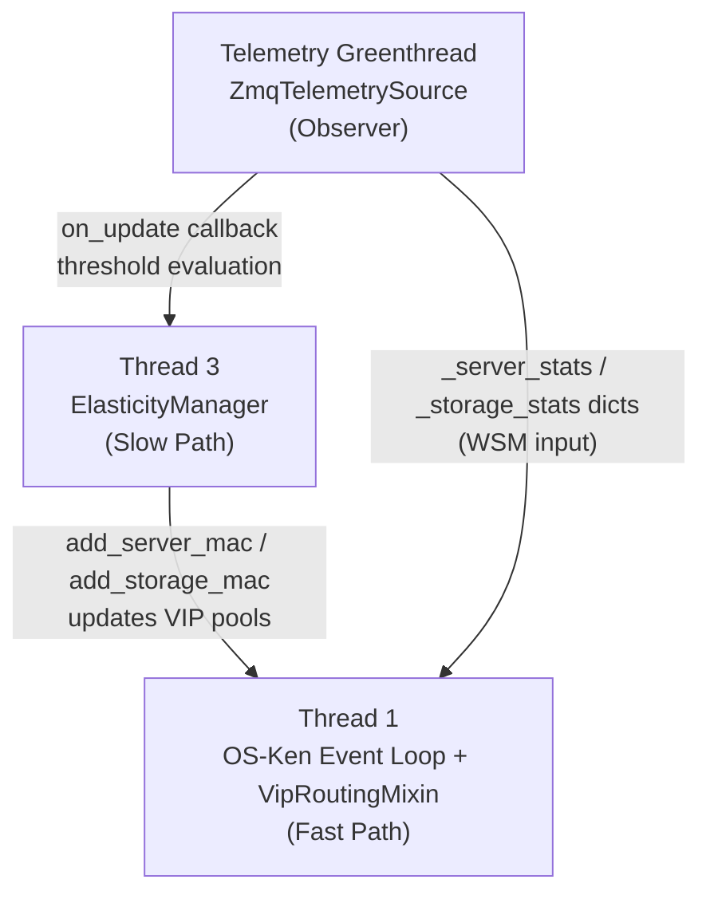
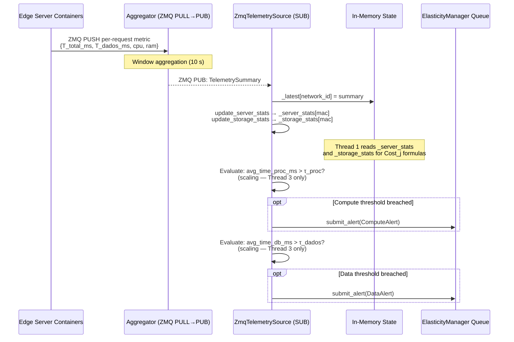
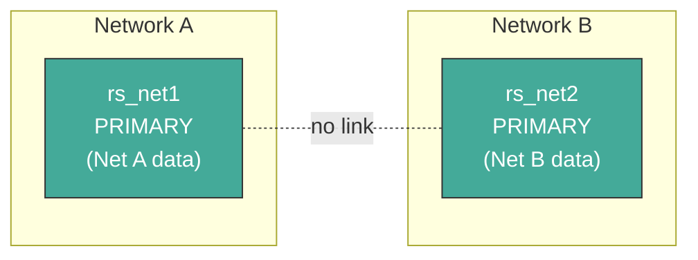
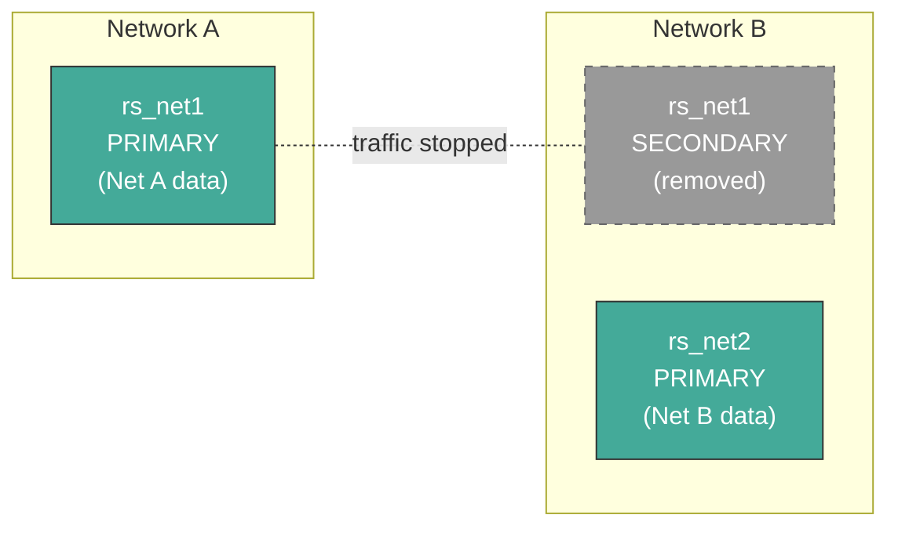
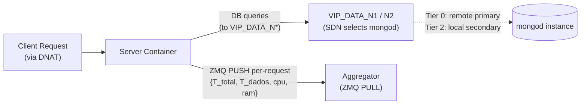
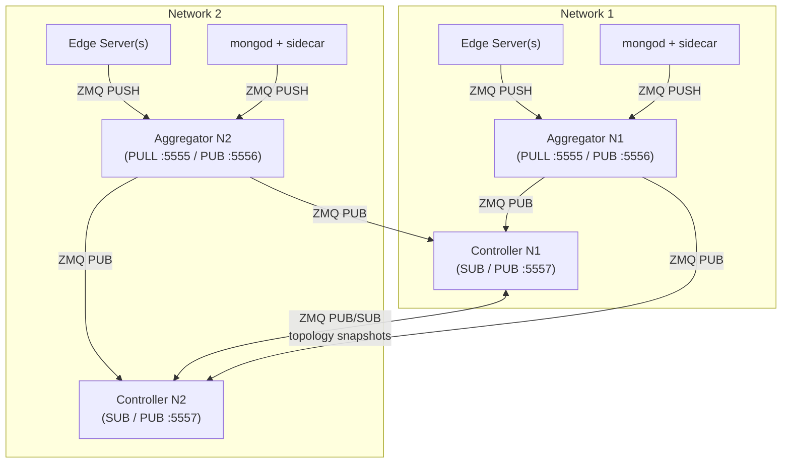

# System Mechanisms Reference

This document describes the high-level workflows of the SDN-based edge orchestration architecture — how the components interact, what triggers actions, and how data flows through the system.

For detailed implementation specifics, see the [implementation plans](implementation_plans/) subfolder.

---

## Design Rationale: Metadata-Driven Orchestration

This system implements **Topology-Aware Hierarchical Storage** coupled with **Service Placement** through **Data Gravity**: data moves toward the services and consumers that need it, and only for as long as they need it.

The orchestration mechanisms are **workload-agnostic**: they react to measured demand metadata ($T_{proc}$, $T_{dados}$), not to assumptions about read/write ratios or specific application profiles.

### Why the Architecture Is Workload-Agnostic

The system's decision signals are **latency measurements**, not application semantics:

- **Routing** (Thread 1) observes CPU %, RAM, request count, active connections, replication lag, and hop distance — all generic resource metrics that any containerized service produces.
- **Scaling** (Thread 3) observes $T_{proc}$ and $T_{dados}$ — decomposed processing and data-access latency that any request/response service exhibits.
- **Tier transitions** respond to sustained $T_{dados}$ threshold breaches — a signal that depends only on data proximity, not on what the data represents.

None of these signals encode knowledge of the application domain. The same architecture could orchestrate:

- An **IoT edge monitoring platform** (the experimental workload used for validation)
- A **video transcoding service** where $T_{proc}$ dominates and $T_{dados}$ reflects asset retrieval latency
- A **recommendation engine** where $T_{dados}$ reflects cross-region user-profile lookups
- A **geospatial query platform** where data gravity follows physical proximity of map tiles

The architecture is the thesis contribution. The experimental workload — an IoT monitoring platform — is chosen because it naturally produces cross-domain data requests, heterogeneous compute demands, and phase-shifting access patterns that exercise all orchestration mechanisms. It is deliberately replaceable.

**Core architectural principles:**

1. **Independent replica sets per network.** Each network segment hosts its own single-node replica set (`rs_net1`, `rs_net2`, etc.). Data is partitioned by network origin, not by a shard key.
2. **Data placement hierarchy.** Cross-network data demand is addressed progressively:
   - **Tier 0 — Direct routing:** Low demand is served by routing packets to the remote primary via SDN.
   - **Tier 1 — Selective Sync Node** *(future work — not yet implemented):* Burst demand would trigger a standalone `mongod` seeded with only hot collections identified by local access tracking, kept current via per-collection Change Streams. See [§1.6](#16-future-work-selective-sync-node-tier-1) for the planned design.
   - **Tier 2 — Full replica:** Sustained high demand triggers `rs.add()` to place a full secondary in the requesting network. Removed when demand subsides.
3. **Write-path isolation.** Writes always go to the local primary of the originating network.
4. **Double-VIP model.** Two VIP types cleanly separate the traffic planes: `VIP_SERVER` for client-to-server HTTP traffic and `VIP_DATA` (per-domain: `VIP_DATA_N1`, `VIP_DATA_N2`) for server-to-MongoDB traffic.

---

## 1. The Controller (SDN "Brain")

The controller is a Python-based OS-Ken (Ryu) SDN application that runs on the host machine. It is composed via multiple-inheritance mixins:

```python
class KenLearnAndLog(VipRoutingMixin, TopologyMixin, app_manager.OSKenApp):
```

The system's logic is distributed across three concurrent execution contexts — each with a distinct responsibility. None of them share mutable state unsafely; communication flows in one direction through in-memory data structures and a thread-safe `Queue`.



---

### 1.1 Thread 1 — Real-Time Scheduler (Fast Path)

**Purpose:** Handle every incoming packet that hits a table-miss or VIP punt rule, select the best destination, and install OpenFlow flow rules so that subsequent packets are forwarded entirely in the switch without controller involvement.

**Constraint:** Strictly non-blocking. Thread 1 never queries a database or executes scripts. It relies exclusively on in-memory state kept up to date by the telemetry greenthread and Thread 3.

Thread 1 handles two independent traffic planes via `VipRoutingMixin`:

| VIP | Default Address | Traffic Plane | Selection Logic |
| :-- | :-------------- | :------------ | :-------------- |
| **VIP_SERVER** | `10.0.0.100` (env: `VIP_SERVER_IP`) | Client → Web Server | Multi-dimensional WSM cost: CPU utilization, RAM usage, request count, and hop distance |
| **VIP_DATA_N1** | `10.0.0.200` (env: `VIP_DATA_N1_IP`) | Web Server → MongoDB (LAN 1) | Multi-dimensional WSM cost: CPU utilization, RAM usage, active connections, replication lag, and hop distance |
| **VIP_DATA_N2** | `10.0.1.200` (env: `VIP_DATA_N2_IP`) | Web Server → MongoDB (LAN 2) | Multi-dimensional WSM cost: CPU utilization, RAM usage, active connections, replication lag, and hop distance |

Each VIP also has a virtual MAC address (`VIP_SERVER_MAC`, `VIP_DATA_N1_MAC`, `VIP_DATA_N2_MAC`) configured via environment variables, used for ARP replies and DNAT/SNAT rewriting.

#### VIP Server Selection — Multi-Dimensional WSM Cost Formula

The system uses **two separate concerns** for its telemetry metrics: **resource-based indicators** for real-time *routing* (Thread 1), and **latency-based thresholds** for *scaling* decisions (Thread 3).

- **Routing** (Thread 1 — `select_server`): uses instantaneous resource metrics — CPU utilization, RAM usage, request count, plus network hop distance — as **leading indicators** of server load. These predict where to send the *next* request before congestion manifests as high latency.
- **Scaling** (Thread 3 — `ElasticityManager`): uses windowed latency averages — $T_{proc}$ and $T_{dados}$ — as **lagging indicators** that confirm sustained QoE degradation, triggering infrastructure mutations (spawn/remove containers).

This separation is deliberate: a server reporting high CPU has not *yet* degraded user experience — the router should simply avoid it. A server reporting sustained high $T_{proc}$ has *already* degraded QoE — the system should add capacity.

##### Server Cost Function

$$
Cost_j^{web} = w_{cpu} \cdot \frac{CPU_j}{CPU_{max}} + w_{ram} \cdot \frac{RAM_j}{RAM_{max}} + w_{req} \cdot \frac{Req_j}{Req_{max}} + w_{hops} \cdot \frac{Hops_j}{Hops_{max}}
$$

Per-dimension weights are configurable via environment variables:

| Env Var | Default | Dimension | Rationale |
| :--- | :---: | :--- | :--- |
| `W_CPU` | `0.2` | CPU utilization % | Leading indicator of compute saturation |
| `W_RAM` | `0.2` | RAM usage (MB) | Memory pressure / swapping risk |
| `W_REQUESTS` | `0.2` | Request count (current window) | Active load / queuing pressure |
| `W_HOPS` | `0.4` | Network hop distance | Spatial locality — dominates when resource metrics are similar |

- **Unknown telemetry:** backends without stats are assigned worst-case normalized scores (`1.0`) across all resource dimensions, preventing unmeasured nodes from being accidentally preferred over measured ones.
- **Round-robin tie-breaking:** when multiple candidates share the same lowest cost (common during cold start when same-hop servers all score identically), a monotonic counter (`_rr_server_idx`) cycles through tied candidates instead of always picking the first dict entry.
- `select_server()` iterates over `vip_server_pool`, scores each candidate, collects ties, and round-robin picks among them.

```python
def select_server(self, client_mac: str) -> dict | None:
    pool = self.vip_server_pool
    if not pool:
        return None

    pool_stats = [self._server_stats[m] for m in pool if m in self._server_stats]
    cpu_max = max((s.avg_cpu_percent for s in pool_stats), default=0.0) or 1.0
    ram_max = max((s.avg_ram_used_mb  for s in pool_stats), default=0.0) or 1.0
    req_max = max((s.request_count    for s in pool_stats), default=0)   or 1
    hops_max = max(self._hop_cache_max, 1)

    best_cost = float("inf")
    tied: list[dict] = []

    for mac, entry in pool.items():
        stats = self._server_stats.get(mac)

        cpu_norm = (stats.avg_cpu_percent / cpu_max) if stats else 1.0
        ram_norm = (stats.avg_ram_used_mb  / ram_max) if stats else 1.0
        req_norm = (stats.request_count    / req_max) if stats else 1.0

        hops = (self.hop_cache.get(client_mac) or {}).get(mac)
        if hops is None:
            if mac in self.peer_hosts:
                hops = max(self._avg_hop_count, 1.0) + max(self._peer_avg_hop_count, 1.0)
            elif mac in self.host_attachment:
                hops = max(self._avg_hop_count, 1.0)
            else:
                hops = hops_max
        hop_norm = hops / hops_max

        cost = (_W_CPU * cpu_norm + _W_RAM * ram_norm
                + _W_REQUESTS * req_norm + _W_HOPS * hop_norm)
        if cost < best_cost:
            best_cost = cost
            tied = [entry]
        elif cost == best_cost:
            tied.append(entry)

    if not tied:
        return None
    chosen = tied[self._rr_server_idx % len(tied)]
    self._rr_server_idx += 1
    return chosen
```

##### Storage Cost Function

$$
Cost_j^{data} = w_{cpu}^{s} \cdot \frac{CPU_j}{CPU_{max}} + w_{ram}^{s} \cdot \frac{RAM_j}{RAM_{max}} + w_{conn}^{s} \cdot \frac{Conn_j}{Conn_{max}} + w_{lag}^{s} \cdot \frac{Lag_j}{Lag_{max}} + w_{hops}^{s} \cdot \frac{Hops_j}{Hops_{max}}
$$

| Env Var | Default | Dimension | Rationale |
| :--- | :---: | :--- | :--- |
| `W_STORAGE_CPU` | `0.2` | CPU utilization % | mongod compute saturation |
| `W_STORAGE_RAM` | `0.2` | RAM usage (MB) | WiredTiger cache pressure |
| `W_STORAGE_CONNECTIONS` | `0.1` | Active connections | Connection pool exhaustion risk |
| `W_STORAGE_LAG` | `0.2` | Replication lag (s) | Data freshness for secondaries |
| `W_STORAGE_HOPS` | `0.3` | Network hop distance | Data locality |

- `select_storage(domain, client_mac)` iterates over the domain's storage pool, scores each entry, collects ties, and round-robin picks among them.
- **Round-robin tie-breaking:** identical to `select_server`, but uses a per-domain counter (`_rr_storage_idx[domain]`) so that N1 and N2 storage pools cycle independently.
- **Unknown telemetry:** backends without stats are assigned worst-case normalized scores (`1.0`) across all resource dimensions. Same-hop candidates are round-robin'd.

```python
def select_storage(self, domain: str, client_mac: str) -> dict | None:
    pool = self.vip_storage_pool_n1 if domain == "n1" else self.vip_storage_pool_n2
    if not pool:
        return None

    pool_stats = [self._storage_stats[m] for m in pool if m in self._storage_stats]
    cpu_max  = max((s.avg_cpu_percent   for s in pool_stats), default=0.0) or 1.0
    ram_max  = max((s.avg_ram_used_mb    for s in pool_stats), default=0.0) or 1.0
    conn_max = max((s.avg_connections     for s in pool_stats), default=0.0) or 1.0
    lag_max  = max((s.avg_repl_lag_s or 0 for s in pool_stats), default=0.0) or 1.0
    hops_max = max(self._hop_cache_max, 1)

    best_cost = float("inf")
    tied: list[dict] = []

    for mac, entry in pool.items():
        stats = self._storage_stats.get(mac)

        cpu_norm  = (stats.avg_cpu_percent      / cpu_max)  if stats else 1.0
        ram_norm  = (stats.avg_ram_used_mb       / ram_max)  if stats else 1.0
        conn_norm = (stats.avg_connections        / conn_max) if stats else 1.0
        lag_norm  = ((stats.avg_repl_lag_s or 0) / lag_max)  if stats else 1.0

        hops = (self.hop_cache.get(client_mac) or {}).get(mac)
        if hops is None:
            if mac in self.peer_hosts:
                hops = max(self._avg_hop_count, 1.0) + max(self._peer_avg_hop_count, 1.0)
            elif mac in self.host_attachment:
                hops = max(self._avg_hop_count, 1.0)
            else:
                hops = hops_max
        hop_norm = hops / hops_max

        cost = (_W_STORAGE_CPU * cpu_norm + _W_STORAGE_RAM * ram_norm
                + _W_STORAGE_CONNECTIONS * conn_norm
                + _W_STORAGE_LAG * lag_norm + _W_STORAGE_HOPS * hop_norm)
        if cost < best_cost:
            best_cost = cost
            tied = [entry]
        elif cost == best_cost:
            tied.append(entry)

    if not tied:
        return None
    rr_idx = self._rr_storage_idx.get(domain, 0)
    chosen = tied[rr_idx % len(tied)]
    self._rr_storage_idx[domain] = rr_idx + 1
    return chosen
```

#### VIP Packet-In Flow

For each `VIP_SERVER` Packet-In, Thread 1 evaluates the multi-dimensional WSM cost function, installs a DNAT+SNAT rule pair (priority 200, with configurable idle/hard timeouts via `VIP_IDLE_TIMEOUT` / `VIP_HARD_TIMEOUT`), and sends a Packet-Out for the first packet. For each `VIP_DATA_N1` or `VIP_DATA_N2` Packet-In, Thread 1 evaluates the storage WSM cost function for the corresponding domain and installs an analogous DNAT+SNAT pair.

The MongoDB driver in each web server sees only `VIP_DATA_N*:<port>` — a stable per-domain VIP address — and never discovers the physical `mongod` topology.

#### OpenFlow Rule Priority Hierarchy

| Priority | Rule Type | Purpose |
| :------- | :-------- | :------ |
| 200 | Reactive DNAT+SNAT | Installed per-connection by `handle_vip_packet_in()` after server selection; idle/hard timeout causes expiry and re-selection |
| 100 | VIP ARP punt | Matches ARP requests for VIP addresses → sends to controller for reactive ARP reply via `_reply_vip_arp()` |
| 100 | VIP IP punt | Matches IP packets destined for VIP addresses → sends to controller for backend selection |
| 10 | Reactive L2 learning | Installed by `packet_in_handler` for learned MAC-port mappings |
| 5 | Proactive L2 forwarding | Topology-based forwarding installed by `TopologyMixin` |
| 1 | ARP flood | Floods all ARP traffic (installed by `TopologyMixin`) |
| 0 | Table-miss | Sends unmatched packets to controller (installed by `TopologyMixin`) |

#### IP ↔ MAC Learning

`VipRoutingMixin` snoops every ARP packet that passes through the switch (via `_snoop_arp()`) to build an `_ip_to_mac` / `_mac_to_ip` mapping. This is required because DNAT actions need the backend's IP address, which is not known from the VIP Packet-In alone.

#### Cross-Network VIP Routing

When the WSM cost function selects a backend that lives on the **peer network** (learned via `TopologyMixin.peer_hosts`), the controller must route the DNAT'd packet across the inter-LAN router instead of delivering it to a local OVS port.

##### How peer backends enter the VIP pools

1. The peer controller publishes its topology via ZMQ PUB (see §1.4).
2. The local controller's `ZmqTelemetrySource` receives it and calls `on_topology_update()`, which populates `peer_hosts` (MAC → {dpid, port_no}) and replaces `_peer_server_macs` / `_peer_storage_macs_*` with the peer's MAC role sets.
3. Every topology tick, `_rebuild_vip_pools()` merges `host_attachment` (local) with `peer_hosts` (remote) and filters by `_server_macs` (which is `_local_server_macs ∪ _peer_server_macs`). Peer server MACs therefore appear in `vip_server_pool` alongside local ones.

##### Hop cost for peer backends

`select_server()` and `select_storage()` use `hop_cache` for local backends, but `hop_cache` is built from the local NetworkX graph and has no entries for peer MACs. Hops are resolved in priority order:

| Condition | Hops assigned |
|---|---|
| Path in `hop_cache` | Real shortest-path length |
| Local, no path yet | `max(_avg_hop_count, 1.0)` |
| Cross-network (peer) | `max(_avg_hop_count, 1.0) + max(_peer_avg_hop_count, 1.0)` |
| Truly unknown MAC | `hops_max` (worst case) |

The `_avg_hop_count` is computed by `TopologyMixin._rebuild_hop_cache()` and published in `TopologySnapshot.avg_hop_count`. The peer's value is stored as `_peer_avg_hop_count` on receipt. The `max(..., 1.0)` guard prevents cold-start zero values from making cross-network backends appear free.

##### Output port resolution (3-step fallback)

When `_install_vip_dnat_snat()` determines where to send the rewritten packet, it follows a 3-step fallback:

1. **`get_next_hop_port(dpid, client_mac, backend_mac)`** — shortest path in the local NetworkX graph. Works for local multi-switch topologies. Returns `None` for peer MACs (not in the local graph).
2. **`host_attachment.get(backend_mac)`** — direct port lookup for single-switch setups. Returns `None` for peer MACs (not locally attached).
3. **`peer_hosts` + `ROUTER_OVS_PORT`** — if the MAC is in `peer_hosts` and `ROUTER_OVS_PORT > 0`, the packet is output to the OVS port connected to the inter-LAN router.

If none of the three steps resolve a port, the packet is dropped with a warning log.

##### End-to-end packet path

```
Client ──► Local OVS (PacketIn → controller)
               │
               ├─ Controller: select_server() picks peer backend
               ├─ Controller: DNAT rewrite (eth_dst=ROUTER_MAC, ipv4_dst=real_IP)
               ├─ Controller: output=ROUTER_OVS_PORT
               │
               ▼
         Inter-LAN Router ──► Peer OVS Switch ──► Peer Backend
                                (L2 forwarding)    (no second PacketIn)
```

For cross-network backends, the SNAT return rule matches on `eth_src=ROUTER_MAC, eth_dst=client_mac` (not the real backend MAC, since the router rewrites `eth_src` during L3 forwarding) and rewrites the source back to the VIP MAC/IP before forwarding to the client's ingress port. For local backends, the SNAT rule matches `eth_src=backend_mac` directly.

Because the DNAT'd packet carries the real destination IP (and the router resolves the final backend MAC via its own ARP), the peer OVS switch delivers it via normal L2 forwarding — no second VIP PacketIn is triggered on the remote controller.

> See [vip_interception_plan.md](implementation_plans/vip_interception_plan.md) for the full mixin implementation.

---

### 1.2 Telemetry Source (Observer Greenthread)

**Purpose:** Receive infrastructure metrics from the per-network aggregator containers and feed live data to Thread 1 (for WSM scoring) and Thread 3 (for threshold evaluation). This is the **QoE sentinel**: its primary concern is **observable latency** — the metric that directly determines whether the user's Quality of Experience is being maintained.

#### Architecture

The telemetry path is fully ZeroMQ-based. There is no database in the telemetry pipeline.

```
Edge Servers ──(ZMQ PUSH)──► Aggregator (per network) ──(ZMQ PUB)──► Controller (ZMQ SUB)
                                                                        ├─ _latest dict (Thread 1 reads)
                                                                        └─ on_update callback (→ Thread 3 queue)
```

The implementation uses a `TelemetryEventSource` abstract interface with a single concrete implementation — `ZmqTelemetrySource`:

- **`TelemetryEventSource` (ABC):** Exposes `start()` and `get_latest(network_id) -> TelemetrySummary | None`. Transport-agnostic — the controller never calls `receive()` or manages sockets directly.
- **`ZmqTelemetrySource`:** Owns a `zmq.green` SUB socket that subscribes to aggregator PUB endpoints. A background eventlet greenthread (via `hub.spawn`) runs `_receive_loop()`, parsing each incoming JSON into a Pydantic `TelemetrySummary` model and caching the latest per `network_id`. Uses `zmq.green` (pyzmq's eventlet backend) so `recv_json()` yields cooperatively instead of blocking the OS-Ken event loop.

Both controllers subscribe to **both** aggregators because `VIP_SERVER` selection is cross-domain — a controller may route a client to a server in the peer network, so it needs $T_{proc}$ values for all servers.

The same ZMQ SUB socket also receives **topology snapshots** from the peer controller (disambiguated by a `"type": "topology"` field in the JSON payload — see §1.4).

#### Telemetry Payload (from aggregator)

The aggregator publishes windowed summaries conforming to the `TelemetrySummary` Pydantic model:

```json
{
  "network_id": "net1",
  "window_end": 1742300400.0,
  "servers": {
    "server-1": {
      "avg_time_total_ms": 44.0,
      "avg_time_db_ms": 11.5,
      "avg_time_proc_ms": 32.5,
      "request_count": 120,
      "error_rate": 0.0,
      "avg_cpu_percent": 22.4,
      "avg_ram_used_mb": 310.0
    }
  },
  "domain_summary": {
    "total_requests": 360,
    "avg_time_proc_ms": 33.1,
    "avg_time_db_ms": 12.1,
    "average_cpu_percent": 21.8,
    "peak_time_total_ms": 98.3
  }
}
```

**Latency decomposition:**

$$
T_{proc} = T_{total} - T_{dados}
$$

- $T_{total}$ (`avg_time_total_ms`): wall-clock time from HTTP request receipt to response sent.
- $T_{dados}$ (`avg_time_db_ms`): time the web server spent blocked waiting for MongoDB to reply.
- $T_{proc}$ (`avg_time_proc_ms`): the residual — compute work (template rendering, serialisation, application logic).

#### Threshold Evaluation and Alert Routing

The telemetry `on_update` callback evaluates two independent threshold conditions (configurable via `TAU_PROC_MS` and `TAU_DADOS_MS` environment variables) and submits typed alerts to the `ElasticityManager` queue:

- **Compute alert** → triggered when `avg_time_proc_ms > TAU_PROC_MS`. Submits a `ComputeAlert`.
- **Data alert** → triggered when `avg_time_db_ms > TAU_DADOS_MS`. Submits a `DataAlert`.

Thread 1 reads the `_server_stats` and `_storage_stats` dicts (updated by `VipRoutingMixin.update_server_stats()` and `update_storage_stats()` on each telemetry arrival) for the multi-dimensional WSM cost functions.

**Telemetry → Routing vs Scaling split:**

| Metric | Used by Thread 1 (Routing) | Used by Thread 3 (Scaling) |
| :--- | :---: | :---: |
| `avg_cpu_percent` | ✅ Server + Storage WSM | — |
| `avg_ram_used_mb` | ✅ Server + Storage WSM | — |
| `request_count` | ✅ Server WSM | — |
| `avg_connections` | ✅ Storage WSM | — |
| `avg_repl_lag_s` | ✅ Storage WSM | — |
| `avg_time_proc_ms` ($T_{proc}$) | — | ✅ ComputeAlert threshold |
| `avg_time_db_ms` ($T_{dados}$) | — | ✅ DataAlert threshold |
| Hop distance | ✅ Server + Storage WSM | — |

#### Server-ID ↔ MAC Mapping

Telemetry payloads identify servers by `server_id` (container name, e.g. `"edge_server_n1"`), but VIP pools are keyed by MAC address. A bidirectional mapping (`_id_to_mac` / `_mac_to_id`) bridges these two namespaces:

- **Static nodes:** parsed from `SERVER_ID_MAP` env var at boot (e.g. `"edge_server_n1=aa:bb:cc:dd:ee:ff,mongo_n1=11:22:33:44:55:66"`).
- **Dynamic nodes:** registered by `ElasticityManager` when Thread 3 adds a container — it knows both the container name and the MAC from the `NodeResult`.

```python
# VipRoutingMixin.__init__
self._id_to_mac: dict[str, str] = {}   # server_id -> mac
self._mac_to_id: dict[str, str] = {}   # mac -> server_id

# Seed from env var for static nodes
for pair in os.environ.get("SERVER_ID_MAP", "").split(","):
    if "=" in pair:
        sid, mac = pair.strip().split("=", 1)
        self._id_to_mac[sid.strip()] = mac.strip()
        self._mac_to_id[mac.strip()] = sid.strip()
```

`update_server_stats()` resolves each `server_id` → MAC before storing the full `ServerSummary`:

```python
def update_server_stats(self, servers: dict[str, ServerSummary]) -> None:
    for server_id, summary in servers.items():
        mac = self._id_to_mac.get(server_id)
        if mac is None:
            logger.warning("server stats: no MAC mapping for %s", server_id)
            continue
        self._server_stats[mac] = summary
```

The same pattern applies to `update_storage_stats()` for `StorageServerSummary` objects.



> **Not yet implemented:** OVS per-port byte/packet counter polling via `OFPPortStatsRequest` / `OFPPortStatsReply`.

> See [telemetry_event_source_plan.md](implementation_plans/telemetry_event_source_plan.md) and [telemetry_aggregator_integration_plan.md](implementation_plans/telemetry_aggregator_integration_plan.md) for the full implementation.

---

### 1.3 Thread 3 — Elasticity & Placement Manager (Slow Path)

**Purpose:** Mutate the infrastructure by adding/removing server containers and MongoDB data resources when the telemetry callback detects a threshold breach. Thread 3 is implemented as the `ElasticityManager` class — a long-lived daemon thread that blocks on a `threading.Queue`, receiving typed alert objects.

Thread 3 responds to two independent alert types:

- **`ComputeAlert`** — responds to $T_{proc} > \tau_{proc}$. Spawns a new `edge_server` container.
- **`DataAlert`** — responds to $T_{dados} > \tau_{dados}$. Spawns a new `edge_storage_server` container and joins it to the replica set.

This decoupling is a key architectural property: a compute bottleneck does not entail a data placement change, and a data locality problem does not entail spawning more web servers. The two concerns operate independently, driven by the latency signal most relevant to each domain.

> **Future work:** The current threshold evaluation is a simple breach check. A more sophisticated **Multi-Dimensional Best-Fit Decreasing (MBFD)** heuristic could be layered on top to evaluate multi-dimensional resource vectors (CPU, RAM, latency) when making placement decisions.

#### Node Addition Lifecycle — `NodeAdder`

The `NodeAdder` class provides per-step, timed, idempotent lifecycle methods. Each method produces a `NodeResult` with full timing and state tracking:

**Compute node (`add_edge_server`):**
1. `docker run --network none --name <name> edge_server` → `RUNNING_CONTAINER`
2. `add_network_node.sh --lan <N> --name <name>` (veth pair + OVS port + IP/MAC config) → `ATTACHING_NETWORK`
3. Returns `NodeResult` → `DONE`

**Storage node (`add_storage_node`):**
1. `docker run --network none --name <name> edge_storage_server mongod --replSet <rs>` → `RUNNING_CONTAINER`
2. `add_network_storage_node.sh --lan <N> --name <name> --rs-name <rs> --primary <primary>` (veth + OVS + `rs.add()` + wait for SECONDARY) → `ATTACHING_NETWORK` / `JOINING_RS`
3. Returns `NodeResult` → `DONE`

Each step has idempotency guards: if the container already exists and is running, `docker run` is skipped; if stopped, it is cleaned up and recreated. The shell scripts check for pre-existing veth pairs and OVS ports.

Both shell scripts emit machine-readable lines (`RESULT_IP=<ip>`, `RESULT_MAC=<mac>`) at the end of a successful run; `NodeAdder._run_script()` parses these via regex to populate `NodeResult.ip` and `NodeResult.mac`. On a successful result, `ElasticityManager` calls `TopologyMixin.add_server_mac()` or `add_storage_mac()` and `register_backend_ip()` — which updates the VIP pool that Thread 1 reads on the next Packet-In.

#### Observability — `StepTimings` and `NodeOperationState`

Every operation produces structured timing data:

| Field | What it measures | Typical range |
|---|---|---|
| `docker_run_s` | Container creation to running state | 0.1 – 1 s |
| `network_attach_s` | veth creation → OVS → IP config (+ `rs.add` for storage) | 1 – 10 s |
| `total_s` | Wall clock from first step to last | 1.5 – 15 s |

`NodeOperationState` enum tracks progress: `PENDING` → `RUNNING_CONTAINER` → `ATTACHING_NETWORK` → `JOINING_RS` (storage only) → `DONE` / `FAILED`.

#### Node Removal — Two-Phase Cooperative Drain

Removal follows a **two-phase cooperative drain** to avoid cutting active connections mid-flight:

**Phase A — Controller-side isolation (immediate):**
1. Remove MAC from VIP pool (`remove_server_mac` / `remove_storage_mac`) — no new connections routed to this node.
2. Storage only: `rs.remove(IP:PORT)` via the replica set primary — node leaves RS before shutdown.

**Phase B — Node drain + cleanup:**

| | Compute (`edge_server`) | Storage (`edge_storage_server`) |
|---|---|---|
| **Drain signal** | `docker exec <name> curl -sS -X POST http://localhost:5000/drain` | Phase A is sufficient — `rs.remove()` + VIP removal stop new work |
| **Idle detection** | Flask active-request counter hits 0 → container calls `os._exit(0)` | Controller reads `connections_current` from telemetry pipeline |
| **Timeout fallback** | Force-stop after 30 s | Force-stop after 15 s |

After the container stops: flush OVS flows for the MAC (`dl_src` + `dl_dst`), remove OVS port, delete veth pair, `docker rm`, optionally `docker volume rm` for storage.

Scale-down alert types (`ScaleDownComputeAlert`, `ScaleDownDataAlert`) are dispatched through the same `ElasticityManager` queue. The scale-down **detection policy** (when to scale down) is a separate concern, deferred until the removal mechanism is validated.

#### Elastic Lifecycle: Data Gravity in Action

**Phase 1 — Base State (Tier 0):** Each network has its own primary. No cross-network replication. Minimal infrastructure.



> Writes: local. Reads (own data): local. Reads (remote data): remote fetch. No secondaries.

**Phase 2 — Sustained Cross-Network Demand (Tier 2):** Thread 3 detects that $T_{dados}$ from Network B to Network A data exceeds $\tau_{dados}$. A full secondary is deployed via `add_storage_node()` → `rs.add()` in Network B.


> Net B reads for Net A data: **always local** (served by secondary). Net A's full oplog is replicated.

**Phase 3 — Demand Subsides (Scale-in):** $T_{dados}$ drops below $\tau_{dados}$. Thread 3 executes the two-phase drain: `rs.remove()`, wait for idle, stop container, clean up OVS/veth. VIP routes revert to Tier 0. System returns to Phase 1.



> Edge storage freed, replication traffic stopped. Back to base state.

> See [thread3_node_addition_plan.md](implementation_plans/thread3_node_addition_plan.md) and [node_removal_plan.md](implementation_plans/node_removal_plan.md) for the full implementation.

---

### 1.4 Topology Discovery & Peer Sharing

**Purpose:** Discover the local network topology (switches, links, hosts), compute shortest-path hop distances, maintain VIP backend pools, and share topology state with the peer controller — all without any database dependency.

The `TopologyMixin` mixin handles all topology concerns. It is mixed into the main controller class and does not run as a separate OS thread — it uses an eventlet greenthread via `hub.spawn`.

#### Local Topology — `_topology_worker` Greenthread

A background greenthread runs every `TOPOLOGY_INTERVAL` seconds (default 5 s):

1. Queries the OS-Ken topology API (`get_all_link`, `get_host`) to discover switches, links, and hosts.
2. Builds a NetworkX `DiGraph` (`self.net`) for shortest-path computation.
3. Records host-to-switch attachment in `self.host_attachment` (MAC → (dpid, port_no)).
4. Rebuilds `hop_cache`: for every known host MAC and every server/storage MAC, computes the shortest-path hop count.
5. Rebuilds VIP pools (`vip_server_pool`, `vip_storage_pool_n1`, `vip_storage_pool_n2`) by filtering the combined local + peer host attachment by registered MAC sets.
6. On topology change: installs proactive L2 forwarding rules (priority 5) on all switches.

Router MACs (configured via `ROUTER_MAC_BLOCKLIST` env var) are blocklisted from the host list to avoid treating inter-network router ports as service endpoints.

#### Peer Topology Sharing — ZMQ PUB/SUB

Each controller binds a ZMQ PUB socket on port `TOPOLOGY_PUB_PORT` (default 5557). The `_topology_worker` publishes the full topology snapshot:
- On every detected change (hosts/links/switches differ from previous tick).
- Every `TOPOLOGY_HEARTBEAT_INTERVAL` seconds (default 15) even without change — so a restarted peer gets current state within seconds.
- Immediately when the peer's snapshot reveals it has a stale view of this controller's local network.

The peer controller's `ZmqTelemetrySource` SUB socket subscribes to this PUB endpoint (in addition to aggregator endpoints). Messages are disambiguated by the `"type"` field:
- No `"type"` field → telemetry summary (from aggregator) → `TelemetrySummary` model.
- `"type": "topology"` → topology snapshot → routed to `TopologyMixin.on_topology_update()`.

Published snapshots carry the controller's **global view** (its own local network + the peer's network as received from the peer). The receiver uses this to detect if the sender has a stale copy of the receiver's own network and triggers a correction republish.

#### MAC Role Sharing

Each controller maintains **separate** local and peer MAC sets:

```
_local_server_macs  (from env vars + Thread 3 additions)
_peer_server_macs   (replaced wholesale on each peer topology update)
─────────────────────────────────────────────────────────
_server_macs (property) = _local | _peer   ← used by VIP pool rebuild
```

This design ensures:
- **Additions propagate:** Thread 3 calls `add_server_mac()` → MAC is added to `_local_*` → included in next published snapshot → peer receives it.
- **Removals propagate:** `remove_server_mac()` removes from `_local_*` → next snapshot no longer includes it → peer replaces its `_peer_*` set wholesale → MAC disappears on both sides.
- **No stale accumulation:** Full replacement (not union) of peer sets on each update; old MACs are automatically dropped.

> See [topology_mixin_plan.md](implementation_plans/topology_mixin_plan.md) and [peer_mac_role_sharing_plan.md](implementation_plans/peer_mac_role_sharing_plan.md) for the full implementation.

---

### 1.5 Environment Variable Reference

All per-network configuration is injected via environment variables:

| Variable | Default | Description |
|---|---|---|
| `VIP_SERVER_IP` | `10.0.0.100` | Virtual IP for the compute/app server pool |
| `VIP_SERVER_MAC` | `aa:bb:cc:dd:ee:01` | Virtual MAC for the server VIP |
| `VIP_DATA_N1_IP` | `10.0.0.200` | Virtual IP for LAN 1 MongoDB storage |
| `VIP_DATA_N1_MAC` | — | Virtual MAC for VIP_DATA_N1 |
| `VIP_DATA_N2_IP` | `10.0.1.200` | Virtual IP for LAN 2 MongoDB storage |
| `VIP_DATA_N2_MAC` | — | Virtual MAC for VIP_DATA_N2 |
| `NETWORK_ID` | `lan1` | Identifies this controller's domain |
| `SERVER_MACS` | `""` | Comma-separated MACs of compute servers behind the VIP |
| `STORAGE_MACS_N1` | `""` | Comma-separated MACs of LAN 1 storage servers |
| `STORAGE_MACS_N2` | `""` | Comma-separated MACs of LAN 2 storage servers |
| `VIP_IDLE_TIMEOUT` | `30` | Seconds of idle before a DNAT rule expires |
| `VIP_HARD_TIMEOUT` | `120` | Maximum seconds a DNAT rule persists |
| `ROUTER_OVS_PORT` | `0` | OVS port connected to the inter-LAN router; `0` = cross-network routing disabled |
| `ROUTER_MAC` | — | Router's LAN-side interface MAC (per controller) |
| `ROUTER_MAC_BLOCKLIST` | — | Comma-separated MACs to exclude from host discovery |
| `TAU_PROC_MS` | `600` | Compute threshold: alert when `avg_time_proc_ms` exceeds this |
| `TAU_DADOS_MS` | `150000` | Data threshold: alert when `avg_time_db_ms` exceeds this |
| `TOPOLOGY_INTERVAL` | `5` | Seconds between topology worker polls |
| `TOPOLOGY_PUB_PORT` | `5557` | Port for this controller's topology PUB socket |
| `TOPOLOGY_HEARTBEAT_INTERVAL` | `15` | Seconds before publishing a heartbeat update |
| `AGGREGATOR_ENDPOINTS` | `tcp://127.0.0.1:5556` | Comma-separated aggregator PUB addresses |
| `PEER_TOPOLOGY_ENDPOINTS` | `""` | Comma-separated peer controller PUB addresses |

---

### 1.6 Future Work: Selective Sync Node (Tier 1)

> **Status: NOT YET IMPLEMENTED — planned as future extension.**

The Selective Sync Node is intended as a lightweight intermediate tier between direct routing (Tier 0) and full replication (Tier 2). Its purpose is to provide a "middle path" for burst cross-network demand — replicating only the collections that are actually being accessed, identified by access tracking on the local MongoDB.

**Planned design:**

- A standalone `mongod` seeded with only the hot collections at deployment time.
- Ongoing writes forwarded via per-collection Change Streams from the remote primary.
- Documents carry a TTL and are auto-evicted when demand subsides.
- Intra-network data is never synced because the primary is already local.

**Planned data placement hierarchy (with Tier 1):**

| Scenario | Relationship | Strategy | Rationale |
|---|---|---|---|
| User A reads Data A | Intra-network | Direct read from primary | Primary is local |
| User B reads Data A (low volume) | Cross-network | Direct routing to remote primary (Tier 0) | Demand too low for local infrastructure |
| User B reads Data A (burst demand) | Cross-network | **Selective Sync Node (Tier 1)** | Only hot collections synced locally |
| User B reads Data A (sustained demand) | Cross-network | **Full replica via `rs.add()` (Tier 2)** | Full autonomous replication justified |

When implemented, this would also require a **MDVBP (Metadata-Driven VIP Backend Picker)** tier map in Thread 1's `VIP_DATA_N*` selection logic, replacing the current first-available strategy with tier-aware routing.

---

## 2. The Server (Application Container)

Each server is a lightweight Docker container running an HTTP application (Flask). It handles each client request in a **dedicated thread** that follows a short-lived connection model: open connection → execute query → return response → close connection. Connection lifetime equals HTTP request lifetime — no connection pool management is required, and tier transitions take effect on the very next HTTP request after an OVS flow rule expires.

### 2.1 Request Handling

Each thread connects to the appropriate domain VIP (`VIP_DATA_N1` or `VIP_DATA_N2`) for MongoDB queries. The MongoDB driver sees only the VIP — a stable per-domain address — and never discovers the physical `mongod` topology. The SDN network performs the DNAT rewrite transparently.

### 2.2 Telemetry Reporting — ZMQ PUSH

Each server pushes a metric event **directly via ZeroMQ PUSH** to its network's aggregator container after every HTTP request. There is no database in the telemetry path.

The Flask app uses `@app.before_request` / `@app.after_request` hooks:
- `before_request`: records `t_start = time.monotonic()` and initialises `t_dados_elapsed = 0.0`.
- `after_request`: computes `t_total`, calls `push_metric()` which builds an event dict (including `cpu_percent` and `ram_used_mb` via `psutil`) and sends it via `zmq.NOBLOCK`.

Per-request metric event:

```json
{
  "server_id": "edge-server-net1-1",
  "ts": 1742126400.0,
  "T_total_ms": 85.2,
  "T_dados_ms": 47.1,
  "status_code": 200,
  "request_type": "read",
  "cpu_percent": 34.7,
  "ram_used_mb": 128.3
}
```

`zmq.NOBLOCK` ensures the hook never blocks the HTTP response even if the aggregator is temporarily unavailable — events are simply dropped.



### 2.3 Graceful Drain Endpoint

For safe scale-down, each server exposes a `/drain` endpoint:

- `POST /drain` — sets `_draining = True`, returns 200. Subsequent non-drain requests receive 503.
- `GET /drain/status` — returns `{"draining": bool, "active_requests": int}`.
- A background drain monitor thread checks every 0.5 s: when `_draining and active_requests == 0`, calls `os._exit(0)`.

The drain signal is sent via `docker exec curl` (not through the network stack) to bypass potentially stale OVS flow rules.

> See [telemetry_aggregator_integration_plan.md](implementation_plans/telemetry_aggregator_integration_plan.md) and [node_removal_plan.md](implementation_plans/node_removal_plan.md) for the full implementation.

---

## 2b. MongoDB Storage Telemetry

Each `edge_storage_server` container runs a bare `mongod` with a Python sidecar (`mongo_telemetry.py`) that pushes periodic snapshots to the same aggregator PULL socket used by edge servers.

### Activity-Based Push

The sidecar uses `serverStatus.opcounters` delta tracking to avoid flooding the aggregator with identical snapshots when MongoDB is idle:
- **Active:** client operations detected (insert/query/update/delete/getmore delta > 0, or command delta > 2 to exclude the sidecar's own admin commands) → push `mongo_stats` event.
- **Idle:** no client activity → push a `heartbeat` event every 60 s (liveness only, not forwarded to controller).

```json
{
  "event_type": "mongo_stats",
  "server_id": "mongo-net1",
  "ts": 1742126400.0,
  "repl_lag_s": 1.2,
  "connections_current": 4,
  "cpu_percent": 12.3,
  "ram_used_mb": 256.7
}
```

The aggregator routes events by the `event_type` field: absent → edge server per-request metric (windowed averaging); `"mongo_stats"` → latest snapshot per `server_id`; `"heartbeat"` → liveness only.

The aggregator's published summary includes a `"storage_nodes"` section with the latest snapshot per MongoDB instance.

> See [telemetry_aggregator_integration_plan.md](implementation_plans/telemetry_aggregator_integration_plan.md) for the full sidecar and aggregator implementation.

---

## 3. Telemetry & Cross-Domain Communication Architecture

All inter-component communication uses **ZeroMQ** exclusively. There is no shared database in the system's control or telemetry paths.

### 3.1 Telemetry Path — ZMQ PUSH/PUB/SUB

```
Edge Servers ──(ZMQ PUSH)──┐
                            ├──► Aggregator (per network) ──(ZMQ PUB :5556)──► Controller SUB
MongoDB Sidecars ─(PUSH)───┘         │
                                     └─ Windowed summary every WINDOW_S (default 10 s)
```

One aggregator container per network, deployed by `build_network_*.sh`, attached to the OVS bridge like any other node. The aggregator:
- Binds a ZMQ PULL socket (port 5555) — receives per-request events from edge servers and periodic snapshots from MongoDB sidecars.
- Binds a ZMQ PUB socket (port 5556) — publishes windowed domain summaries.
- Computes per-server averages over a configurable window (`WINDOW_S`, default 10 s).
- Keeps the latest MongoDB snapshot per `server_id` in a separate buffer (not windowed — latest value only).

### 3.2 Topology Path — ZMQ PUB/SUB

```
Controller A ──(ZMQ PUB :5557)──► Controller B (SUB)
Controller B ──(ZMQ PUB :5557)──► Controller A (SUB)
```

Each controller's topology PUB socket is an additional `connect()` on the existing SUB socket in `ZmqTelemetrySource`. Messages are disambiguated by `"type"`:
- No `"type"` field → `TelemetrySummary` (from aggregator).
- `"type": "topology"` → topology snapshot (from peer controller) → routed to `TopologyMixin.on_topology_update()`.

### 3.3 End-to-End Data Flow



---

## 4. Network Infrastructure

All network attachment is performed **externally** by admin shell scripts — containers never "self-register". The scripts create veth pairs, move one end into the OVS namespace (attaching to the bridge), move the other end into the container's namespace, and configure IP/MAC/gateway via `nsenter`.

### 4.1 Static Topology — `build_network_*.sh`

The base topology for each network (OVS bridge, router, initial edge servers, initial storage nodes, aggregator) is built by `build_network_1.sh` and `build_network_2.sh`. These scripts are run once to establish the initial infrastructure.

### 4.2 Dynamic Node Addition — `add_network_node.sh` / `add_network_storage_node.sh`

Thread 3 (`NodeAdder`) calls these scripts at runtime to attach dynamically provisioned containers:

- **`add_network_node.sh`** — pure Layer 2/3 wiring: allocate IP (auto-scan for next free), derive MAC, create veth pair, attach to OVS bridge, configure container interface. Does not start containers or modify MongoDB.
- **`add_network_storage_node.sh`** — same networking, plus `rs.add()` to join the replica set and waits for the member to reach SECONDARY state.

Both scripts emit `RESULT_IP=<ip>` on success for machine-readable parsing by `NodeAdder`.

**IP auto-assignment:** scans all running container PIDs via `nsenter` to find taken addresses, reserves `.1` (gateway) and VIP addresses, picks the lowest free host octet.

**MAC derivation:** deterministic from LAN index and host octet: `00:00:00:00:0L:HH`.

### 4.3 Node Removal — `remove_network_node.sh` / `remove_network_storage_node.sh`

Support `--graceful` and `--drain-timeout` flags for cooperative shutdown. Without `--graceful`, immediate removal (backward compatible).

### 4.4 Test Clients — Namespace-Based

For testing VIP routing, lightweight `ip netns` namespaces (no Docker image needed) can be created via `create_test_clients.sh` / `remove_test_clients.sh`. These use separate veth ranges (50–69 for LAN 1, 70–89 for LAN 2) to avoid conflicting with Thread 3's dynamic node allocation ranges (10–19 / 30–49).

> See [build_network_add_node_plan.md](implementation_plans/build_network_add_node_plan.md), [node_removal_plan.md](implementation_plans/node_removal_plan.md), and [test_client_scripts_plan.md](implementation_plans/test_client_scripts_plan.md) for the full implementation.

---

## 5. Final System Definition

> This thesis proposes a **Self-Optimizing Edge Orchestration Architecture**. It utilizes **SDN-driven Double-VIP control** to detect demand and **Programmable Containers** to fulfill it. By decomposing observed latency into $T_{proc}$ (compute delay) and $T_{dados}$ (data-access delay), the controller identifies the nature of each bottleneck and applies the correct remediation: compute scale-out or data placement via replica set expansion. The system achieves autonomous orchestration of compute and storage resources that minimizes service latency while bounding resource usage.

The architecture's contribution to the state of the art is the integration of three layers that are traditionally managed independently:

| Layer | Traditional Approach | This System |
|---|---|---|
| **Network** | Static routing or ECMP | Double-VIP SDN routing: `VIP_SERVER` selects best web server (WSM); `VIP_DATA_N1`/`VIP_DATA_N2` selects per-domain `mongod` endpoint |
| **Compute** | Manual scaling or load-balancer round-robin | `ElasticityManager` driven by $T_{proc}$ threshold — QoE-aware scale-out/in with cooperative drain |
| **Storage** | Static sharding or full replication | Adaptive hierarchy: Tier 0 (remote primary) → Tier 2 (full replica via `rs.add()`), triggered by $T_{dados}$ threshold. *(Tier 1 selective sync: future work)* |

**Clean Separation of Responsibilities.** Each layer performs only its designated function and requires no knowledge of the others:

| Layer | Responsibility |
|:---|:---|
| **Web server thread** | Connect to `VIP_DATA_N*` → query → push ZMQ metric → close connection |
| **OVS** | DNAT/SNAT rewrite on new connections using installed flow rules; no protocol inspection |
| **Controller Thread 1** (`VipRoutingMixin`) | On `Packet-In` → select backend via WSM/pool → install DNAT+SNAT rule |
| **Telemetry greenthread** (`ZmqTelemetrySource`) | Receive and cache telemetry summaries → evaluate thresholds → submit alerts |
| **Controller Thread 3** (`ElasticityManager`) | Receive alerts → spawn/drain containers → update VIP pools |
| **`TopologyMixin`** | Discover topology → compute hop cache → share with peer via ZMQ PUB |
| **mongod / storage** | Serve documents; sidecar reports telemetry via ZMQ |

By coupling these three layers under a single control loop, the system eliminates the coordination gaps that arise when network, compute, and storage are managed by independent subsystems. The Double-VIP model ensures that routing intelligence resides entirely in the SDN layer: the MongoDB driver in each web server never performs topology discovery, never sends heartbeats, and never makes data-routing decisions. The network decides.
