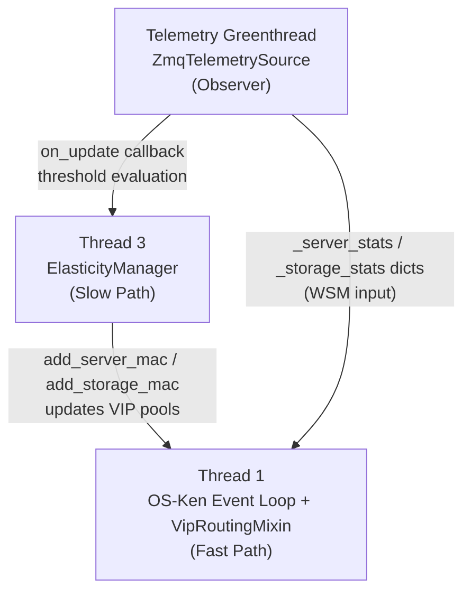
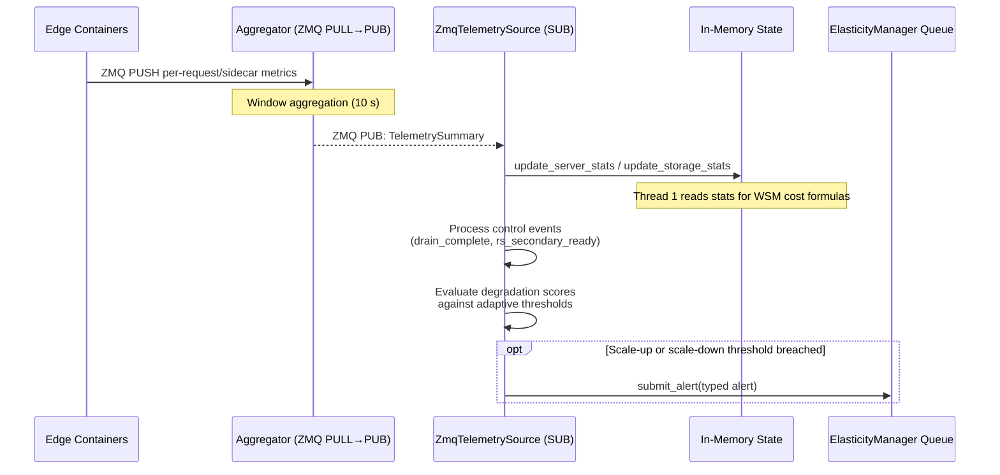
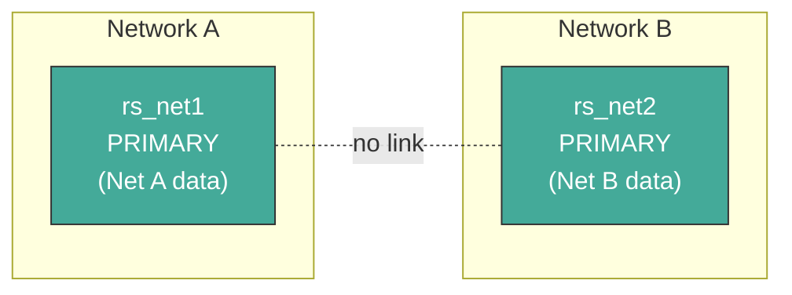
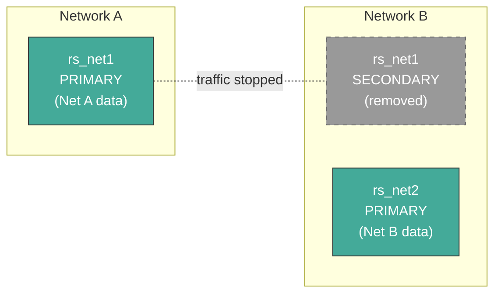
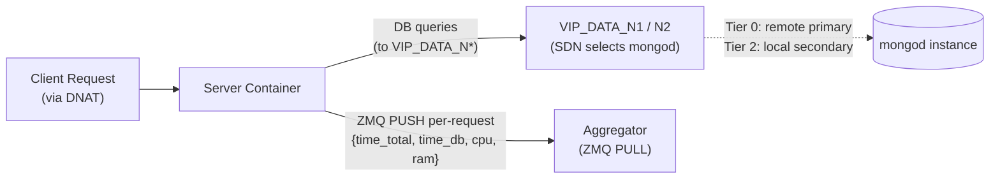
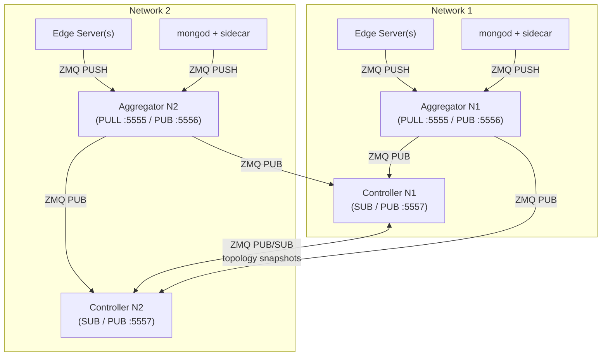

# System Mechanisms Reference

This document describes the high-level workflows of the SDN-based edge orchestration architecture — how the components interact, what triggers actions, and how data flows through the system.

For detailed implementation specifics, see the [implementation plans](implementation_plans/) subfolder.

---

## Design Rationale: Metadata-Driven Orchestration

This system implements **Topology-Aware Hierarchical Storage** coupled with **Service Placement** through **Data Gravity**: data moves toward the services and consumers that need it, and only for as long as they need it.

The orchestration mechanisms are **workload-agnostic**: they react to measured demand metadata ($T_{proc}$, $T_{dados}$), not to assumptions about read/write ratios or specific application profiles.

### Why the Architecture Is Workload-Agnostic

The system's decision signals are **latency measurements**, not application semantics:

- **Routing** (Thread 1) observes CPU %, RAM, request count, active connections, replication lag, and hop distance — all generic resource metrics that any containerized service produces.
- **Scaling** (Thread 3) observes $T_{proc}$ and $T_{dados}$ — decomposed processing and data-access latency that any request/response service exhibits.
- **Tier transitions** respond to sustained $T_{dados}$ threshold breaches — a signal that depends only on data proximity, not on what the data represents.

None of these signals encode knowledge of the application domain. The same architecture could orchestrate:

- An **IoT edge monitoring platform** (the experimental workload used for validation)
- A **video transcoding service** where $T_{proc}$ dominates and $T_{dados}$ reflects asset retrieval latency
- A **recommendation engine** where $T_{dados}$ reflects cross-region user-profile lookups
- A **geospatial query platform** where data gravity follows physical proximity of map tiles

The architecture is the thesis contribution. The experimental workload — an IoT monitoring platform — is chosen because it naturally produces cross-domain data requests, heterogeneous compute demands, and phase-shifting access patterns that exercise all orchestration mechanisms. It is deliberately replaceable.

**Core architectural principles:**

1. **Independent replica sets per network.** Each network segment hosts its own single-node replica set (`rs_net1`, `rs_net2`, etc.). Data is partitioned by network origin, not by a shard key.
2. **Data placement hierarchy.** Cross-network data demand is addressed progressively:
   - **Tier 0 — Direct routing:** Low demand is served by routing packets to the remote primary via SDN.
   - **Tier 1 — Selective Sync Node:** Burst demand triggers a standalone `mongod` seeded with only the hot collections identified by client-side access tracking, kept current via one Change Stream per collection. Feature-flagged behind `SS_ENABLED` (default off). See [§1.6](#16-tier-1-selective-sync-node) for the implemented design.
   - **Tier 2 — Full replica:** Sustained high demand triggers `rs.add()` to place a full secondary in the requesting network. Removed when demand subsides.
3. **Write-path isolation.** Writes always go to the local primary of the originating network.
4. **Double-VIP model.** Two VIP types cleanly separate the traffic planes: `VIP_SERVER` for client-to-server HTTP traffic and `VIP_DATA` (per-domain: `VIP_DATA_N1`, `VIP_DATA_N2`) for server-to-MongoDB traffic.

---

## 1. The Controller (SDN "Brain")

The controller is a Python-based OS-Ken (Ryu) SDN application that runs on the host machine. It is composed via multiple-inheritance mixins:

```python
class KenLearnAndLog(VipRoutingMixin, TopologyMixin, app_manager.OSKenApp):
```

The system's logic is distributed across three concurrent execution contexts — each with a distinct responsibility. None of them share mutable state unsafely; communication flows in one direction through in-memory data structures and a thread-safe `Queue`.



---

### 1.1 Thread 1 — Real-Time Scheduler (Fast Path)

**Purpose:** Handle every incoming packet that hits a table-miss or VIP punt rule, select the best destination, and install OpenFlow flow rules so that subsequent packets are forwarded entirely in the switch without controller involvement.

**Constraint:** Strictly non-blocking. Thread 1 never queries a database or executes scripts. It relies exclusively on in-memory state kept up to date by the telemetry greenthread and Thread 3.

Thread 1 handles two independent traffic planes via `VipRoutingMixin`:

| VIP | Default Address | Traffic Plane | Selection Logic |
| :-- | :-------------- | :------------ | :-------------- |
| **VIP_SERVER** | `10.0.0.253` (env: `VIP_SERVER_IP`) | Client → Web Server | Multi-dimensional WSM cost: CPU utilization, RAM usage, request count, and hop distance |
| **VIP_DATA_N1** | `10.0.0.254` (env: `VIP_DATA_N1_IP`) | Web Server → MongoDB (LAN 1) | Multi-dimensional WSM cost: CPU utilization, RAM usage, active connections, replication lag, and hop distance |
| **VIP_DATA_N2** | `10.0.1.254` (env: `VIP_DATA_N2_IP`) | Web Server → MongoDB (LAN 2) | Multi-dimensional WSM cost: CPU utilization, RAM usage, active connections, replication lag, and hop distance |

Each VIP also has a virtual MAC address (`VIP_SERVER_MAC`, `VIP_DATA_N1_MAC`, `VIP_DATA_N2_MAC`) configured via environment variables, used for ARP replies and DNAT/SNAT rewriting.

#### VIP Server Selection — Multi-Dimensional WSM Cost Formula

The system uses **two separate concerns** for its telemetry metrics: **resource-based indicators** for real-time *routing* (Thread 1), and **latency-based thresholds** for *scaling* decisions (Thread 3).

- **Routing** (Thread 1 — `select_server`): uses instantaneous resource metrics — CPU utilization, RAM usage, request count, plus network hop distance — as **leading indicators** of server load. These predict where to send the *next* request before congestion manifests as high latency.
- **Scaling** (Thread 3 — `ElasticityManager`): uses windowed latency averages — $T_{proc}$ and $T_{dados}$ — as **lagging indicators** that confirm sustained QoE degradation, triggering infrastructure mutations (spawn/remove containers).

This separation is deliberate: a server reporting high CPU has not *yet* degraded user experience — the router should simply avoid it. A server reporting sustained high $T_{proc}$ has *already* degraded QoE — the system should add capacity.

##### Server Cost Function

$$
Cost_j^{web} = w_{cpu} \cdot \frac{CPU_j}{CPU_{max}} + w_{ram} \cdot \frac{RAM_j}{RAM_{max}} + w_{req} \cdot \frac{Req_j}{Req_{max}} + w_{hops} \cdot \frac{Hops_j}{Hops_{max}}
$$

Per-dimension weights (configurable via `W_CPU`, `W_RAM`, `W_REQUESTS`, `W_HOPS`):

| Dimension | Default Weight | Rationale |
| :--- | :---: | :--- |
| CPU utilization % | `0.3` | Leading indicator of compute saturation |
| RAM usage (MB) | `0.1` | Memory pressure / swapping risk |
| Request count (current window) | `0.2` | Active load / queuing pressure |
| Network hop distance | `0.28` | Spatial locality — lowered to allow cross-LAN spillover when the peer LAN is healthy enough to absorb traffic |

- **Unknown telemetry:** backends without stats are assigned worst-case normalized scores (`1.0`) across all resource dimensions, preventing unmeasured nodes from being accidentally preferred over measured ones.
- **Round-robin tie-breaking:** when multiple candidates share the same lowest cost (common during cold start when same-hop servers all score identically), a monotonic counter (`_rr_server_idx`) cycles through tied candidates instead of always picking the first dict entry.
- `select_server()` iterates over `vip_server_pool`, scores each candidate, collects ties, and round-robin picks among them. See the [VIP Routing Overview](vip_routing/vip_routing_overview.md) for the full implementation.

##### Storage Cost Function

$$
Cost_j^{data} = w_{cpu}^{s} \cdot \frac{CPU_j}{CPU_{max}} + w_{ram}^{s} \cdot \frac{RAM_j}{RAM_{max}} + w_{conn}^{s} \cdot \frac{Conn_j}{Conn_{max}} + w_{lag}^{s} \cdot \frac{Lag_j}{Lag_{max}} + w_{hops}^{s} \cdot \frac{Hops_j}{Hops_{max}}
$$

Per-dimension weights (configurable via `W_STORAGE_CPU`, `W_STORAGE_RAM`, `W_STORAGE_CONNECTIONS`, `W_STORAGE_LAG`, `W_STORAGE_HOPS`):

| Dimension | Default Weight | Rationale |
| :--- | :---: | :--- |
| CPU utilization % | `0.2` | mongod compute saturation |
| RAM usage (MB) | `0.2` | WiredTiger cache pressure |
| Active connections | `0.1` | Connection pool exhaustion risk |
| Replication lag (s) | `0.2` | Data freshness for secondaries |
| Network hop distance | `0.3` | Data locality |

- `select_storage(domain, client_mac)` iterates over the domain's storage pool, scores each entry, collects ties, and round-robin picks among them.
- **Round-robin tie-breaking:** identical to `select_server`, but uses a per-domain counter so that N1 and N2 storage pools cycle independently.
- **Unknown telemetry:** backends without stats are assigned worst-case normalized scores (`1.0`) across all resource dimensions.

#### VIP Packet-In Flow

For each `VIP_SERVER` Packet-In, Thread 1 evaluates the multi-dimensional WSM cost function, installs a DNAT+SNAT rule pair (priority 200, with configurable idle/hard timeouts via `VIP_IDLE_TIMEOUT` / `VIP_HARD_TIMEOUT`), and sends a Packet-Out for the first packet. For each `VIP_DATA_N1` or `VIP_DATA_N2` Packet-In, Thread 1 evaluates the storage WSM cost function for the corresponding domain and installs an analogous DNAT+SNAT pair.

The MongoDB driver in each web server sees only `VIP_DATA_N*:<port>` — a stable per-domain VIP address — and never discovers the physical `mongod` topology.

#### OpenFlow Rule Priority Hierarchy

| Priority | Rule Type | Purpose |
| :------- | :-------- | :------ |
| 200 | Reactive DNAT+SNAT | Installed per-connection by `handle_vip_packet_in()` after server selection; idle/hard timeout causes expiry and re-selection |
| 100 | VIP ARP punt | Matches ARP requests for VIP addresses → sends to controller for reactive ARP reply via `_reply_vip_arp()` |
| 100 | VIP IP punt | Matches IP packets destined for VIP addresses → sends to controller for backend selection |
| 10 | Reactive L2 learning | Installed by `packet_in_handler` for learned MAC-port mappings |
| 5 | Proactive L2 forwarding | Topology-based forwarding installed by `TopologyMixin` |
| 1 | ARP flood | Floods all ARP traffic (installed by `TopologyMixin`) |
| 0 | Table-miss | Sends unmatched packets to controller (installed by `TopologyMixin`) |

#### IP ↔ MAC Learning

`VipRoutingMixin` snoops every ARP packet that passes through the switch (via `_snoop_arp()`) to build an `_ip_to_mac` / `_mac_to_ip` mapping. This is required because DNAT actions need the backend's IP address, which is not known from the VIP Packet-In alone.

#### Cross-Network VIP Routing

When the WSM cost function selects a backend that lives on the **peer network** (learned via `TopologyMixin.peer_hosts`), the controller must route the DNAT'd packet across the inter-LAN router instead of delivering it to a local OVS port.

##### How peer backends enter the VIP pools

1. The peer controller publishes its topology via ZMQ PUB (see §1.4).
2. The local controller's `ZmqTelemetrySource` receives it and calls `on_topology_update()`, which populates `peer_hosts` (MAC → {dpid, port_no}) and replaces `_peer_server_macs` / `_peer_storage_macs_*` with the peer's MAC role sets.
3. Every topology tick, `_rebuild_vip_pools()` merges `host_attachment` (local) with `peer_hosts` (remote) and filters by `_server_macs` (which is `_local_server_macs ∪ _peer_server_macs`). Peer server MACs therefore appear in `vip_server_pool` alongside local ones.

##### Hop cost for peer backends

`select_server()` and `select_storage()` use `hop_cache` for local backends, but `hop_cache` is built from the local NetworkX graph and has no entries for peer MACs. Hops are resolved in priority order:

| Condition | Hops assigned |
|---|---|
| Path in `hop_cache` | Real shortest-path length |
| Local, no path yet | `max(_avg_hop_count, 1.0)` |
| Cross-network (peer) | `max(_avg_hop_count, 1.0) + max(_peer_avg_hop_count, 1.0)` |
| Truly unknown MAC | `hops_max` (worst case) |

The `_avg_hop_count` is computed by `TopologyMixin._rebuild_hop_cache()` and published in `TopologySnapshot.avg_hop_count`. The peer's value is stored as `_peer_avg_hop_count` on receipt. The `max(..., 1.0)` guard prevents cold-start zero values from making cross-network backends appear free.

##### Output port resolution (3-step fallback)

When `_install_vip_dnat_snat()` determines where to send the rewritten packet, it follows a 3-step fallback:

1. **`get_next_hop_port(dpid, client_mac, backend_mac)`** — shortest path in the local NetworkX graph. Works for local multi-switch topologies. Returns `None` for peer MACs (not in the local graph).
2. **`host_attachment.get(backend_mac)`** — direct port lookup for single-switch setups. Returns `None` for peer MACs (not locally attached).
3. **`peer_hosts` + `ROUTER_OVS_PORT`** — if the MAC is in `peer_hosts` and `ROUTER_OVS_PORT > 0`, the packet is output to the OVS port connected to the inter-LAN router.

If none of the three steps resolve a port, the packet is dropped with a warning log.

##### End-to-end packet path

```
Client ──► Local OVS (PacketIn → controller)
               │
               ├─ Controller: select_server() picks peer backend
               ├─ Controller: DNAT rewrite (eth_dst=ROUTER_MAC, ipv4_dst=real_IP)
               ├─ Controller: output=ROUTER_OVS_PORT
               │
               ▼
         Inter-LAN Router ──► Peer OVS Switch ──► Peer Backend
                                (L2 forwarding)    (no second PacketIn)
```

For cross-network backends, the SNAT return rule matches on `eth_src=ROUTER_MAC, eth_dst=client_mac` (not the real backend MAC, since the router rewrites `eth_src` during L3 forwarding) and rewrites the source back to the VIP MAC/IP before forwarding to the client's ingress port. For local backends, the SNAT rule matches `eth_src=backend_mac` directly.

Because the DNAT'd packet carries the real destination IP (and the router resolves the final backend MAC via its own ARP), the peer OVS switch delivers it via normal L2 forwarding — no second VIP PacketIn is triggered on the remote controller.

> See [vip_interception_plan.md](implementation_plans/vip_interception_plan.md) for the full mixin implementation.

---

### 1.2 Telemetry Source (Observer Greenthread)

**Purpose:** Receive infrastructure metrics from the per-network aggregator containers and feed live data to Thread 1 (for WSM scoring) and Thread 3 (for threshold evaluation). This is the **QoE sentinel**: its primary concern is **observable latency** — the metric that directly determines whether the user's Quality of Experience is being maintained.

#### Architecture

The telemetry path is fully ZeroMQ-based. There is no database in the telemetry pipeline.

```
Edge Servers ──(ZMQ PUSH)──┐
                            ├──► Aggregator (per network) ──(ZMQ PUB)──► Controller (ZMQ SUB)
Storage Sidecars ─(PUSH)───┘                                              ├─ _latest dict (Thread 1 reads)
                                                                           └─ on_update callback (→ Thread 3 queue)
```

The implementation uses a `TelemetryEventSource` abstract interface with a single concrete implementation — `ZmqTelemetrySource`:

- **`TelemetryEventSource` (ABC):** Exposes `start()` and `get_latest(network_id) -> TelemetrySummary | None`. Transport-agnostic — the controller never manages sockets directly.
- **`ZmqTelemetrySource`:** Owns a ZMQ SUB socket that subscribes to aggregator PUB endpoints. A background eventlet greenthread (via `hub.spawn`) runs the receive loop, using `eventlet.tpool.execute(self._socket.recv_json)` to bridge blocking ZMQ recv into eventlet's cooperative scheduler — this ensures the OpenFlow event loop continues processing PacketIn events while waiting for the next telemetry summary.

Both controllers subscribe to **both** aggregators because `VIP_SERVER` selection is cross-domain — a controller may route a client to a server in the peer network, so it needs telemetry for all servers.

The same ZMQ SUB socket also receives **topology snapshots** from the peer controller (disambiguated by a `"type": "topology"` field in the JSON payload — see §1.4).

#### Telemetry Events

Each container identifies itself by its **MAC address**, discovered from `/sys/class/net/eth0/address` (or the first non-loopback interface). The MAC is used as `server_id` throughout the pipeline and matches the key in the controller's VIP pool — no separate ID-to-MAC mapping is needed.

**Per-request events** are emitted via ZMQ PUSH after every HTTP request using Flask `before_request`/`after_request` hooks. Each event includes `time_total_ms`, `time_db_ms`, `cpu_percent`, `ram_used_mb`, `status_code`, and `request_type`. The `time_db_ms` field is accumulated via a `timed_db()` context manager wrapping all MongoDB calls. `zmq.NOBLOCK` ensures the hook never blocks the HTTP response — events are silently dropped if the aggregator is temporarily unavailable.

**Heartbeat events** are sent by a daemon thread every 60 s when the server is idle. The countdown resets after every request-driven event, so a busy server never sends redundant heartbeats. These carry CPU and RAM and serve primarily as liveness signals. **Only static nodes** (`edge_server_n{1,2}`, `edge_storage_server_n{1,2}`) emit periodic heartbeats: the image default is `HEARTBEAT_ENABLED=false`, and static containers opt in explicitly with `HEARTBEAT_ENABLED=true` in their docker run commands. Dynamic nodes keep the default disabled and emit nothing while idle — their lifecycle is handled by scale-down plus the telemetry-window absence timeout — see [other/heartbeat_dynamic_node_gate_plan.md](other/heartbeat_dynamic_node_gate_plan.md). Each dynamic edge server still sends one bootstrap `heartbeat`-shape sample after MAC discovery, and each storage sidecar sends one bootstrap `mongo_stats` sample on first `SECONDARY`, so newly added backends become visible without reviving periodic idle heartbeats.

**MongoDB sidecar events** (`mongo_stats`) are pushed by the `mongo_telemetry.py` sidecar in each storage container. The sidecar uses opcounter delta tracking to detect real client activity — only CRUD opcounters (`insert`, `query`, `update`, `delete`, `getmore`) are checked; the `command` opcounter is ignored because internal replica set heartbeats inflate it every cycle even when idle. The first poll captures a baseline without reporting, preventing the sidecar's own admin connections from producing a spurious event. Each `mongo_stats` event includes `repl_lag_s`, `member_state` (RS state string, e.g. `"SECONDARY"`, `"PRIMARY"`), `connections_current`, `cpu_percent`, and `ram_used_mb`.

#### Aggregator — Windowed Summaries

One aggregator container runs per network. It collects events via ZMQ PULL, drains them into a per-window buffer every `WINDOW_S` seconds (default 10), and publishes a `TelemetrySummary` via ZMQ PUB. The summary contains:

- **Per-server HTTP stats** — averaged over the window: `avg_time_total_ms`, `avg_time_db_ms`, `avg_time_proc_ms` (derived), `request_count`, `error_rate`, `avg_cpu_percent`, `avg_ram_used_mb`, `last_report_ts`.
- **Per-server storage stats** — latest snapshot per `server_id`: `avg_repl_lag_s`, `avg_connections`, `avg_cpu_percent`, `avg_ram_used_mb`, `member_state`.
- **Domain summary** — across all HTTP events: `total_requests`, `avg_time_proc_ms`, `avg_time_db_ms`, `p95_time_db_ms`, `average_cpu_percent`, `peak_time_total_ms`.
- **Control events** — forwarded from container sidecars (e.g. `drain_complete`, `rs_secondary_ready`), consumed by Thread 3 for lifecycle management.
- **Heartbeat-only nodes** — static nodes that sent only heartbeats (no data events) still appear with `request_count=0`, so the controller knows they are alive. Dynamic nodes do not emit periodic heartbeats (keep the default `HEARTBEAT_ENABLED=false`); an idle dynamic node is reclaimed via the scale-down path (graceful) or, on crash, via the 180 s absence timeout. For compute scale-down ranking, the controller reuses the retained `_server_stats` snapshot and treats a quiet dynamic compute node as eligible only while its cached `last_report_ts` remains inside `SCALE_DOWN_CANDIDATE_MAX_STALENESS_S` (default 90 s).

All per-node dicts are keyed by MAC address. Pydantic validates the incoming JSON at the transport boundary — invalid messages are caught and logged before reaching controller logic.

#### Latency Decomposition

$$
T_{proc} = T_{total} - T_{dados}
$$

- $T_{total}$ (`avg_time_total_ms`): wall-clock time from HTTP request receipt to response sent.
- $T_{dados}$ (`avg_time_db_ms`): mean time the web server spent blocked waiting for MongoDB to reply. Storage scale-up also tracks the tail with `p95_time_db_ms` and scores against `max(avg_time_db_ms, p95_time_db_ms)` so Tier 2 can react before the mean fully catches up.
- $T_{proc}$ (`avg_time_proc_ms`): the residual — compute work (template rendering, serialisation, application logic).

#### Feeding Thread 1 and Thread 3

The telemetry `on_update` callback performs two functions:

1. **Routing (Thread 1):** Calls `update_server_stats()` and `update_storage_stats()` to store per-server summaries keyed by MAC. Thread 1 reads these for the WSM cost functions.
2. **Scaling (Thread 3):** Evaluates domain-level degradation scores using adaptive thresholds with configurable sliding windows, and submits typed alerts to the `ElasticityManager` queue. Also processes control events (`drain_complete` → cleanup alert, `rs_secondary_ready` → storage VIP promotion) and tracks node liveness for absent-node detection with a birth grace period for newly added nodes.

| Metric | Thread 1 (Routing) | Thread 3 (Scaling) |
| :--- | :---: | :---: |
| CPU %, RAM | ✅ Server + Storage WSM | Part of degradation score |
| Request count | ✅ Server WSM | — |
| Connections, replication lag | ✅ Storage WSM | — |
| $T_{proc}$ | — | ✅ Compute degradation score |
| $T_{dados}$ | — | ✅ Storage degradation score |
| Hop distance | ✅ Server + Storage WSM | — |



> For full telemetry pipeline details, see the [Telemetry Overview](telemetry/telemetry_overview.md).

---

### 1.3 Thread 3 — Elasticity & Placement Manager (Slow Path)

**Purpose:** Mutate the infrastructure by adding/removing server containers and MongoDB data resources in response to sustained threshold breaches or underutilisation signals. Thread 3 is implemented as the `ElasticityManager` class — a long-lived daemon thread blocking on a `queue.PriorityQueue`, receiving typed alert objects from Thread 2.

This decoupling between compute and data is a key architectural property: a compute bottleneck does not entail a data placement change, and a data locality problem does not entail spawning more web servers. The two concerns operate independently, driven by the latency signal most relevant to each domain.

#### Alert Types and Priority

Thread 2 (storage / compute scaling policy) and the consumer-side `PromotionCoordinator` (Tier 1) both feed the same priority queue consumed by Thread 3. The table below follows `_ALERT_PRIORITY` in [`elasticity.py`](../../source/sdn_controller/elasticity/elasticity.py) — lower numbers win.

| Priority | Alert | Trigger | Action |
| :---: | :--- | :--- | :--- |
| 1 | `DataAlert` | Adaptive storage degradation threshold (2-of-5 sliding window) | Spawn `edge_storage_server`, async RS join (Tier 2) |
| 2 | `SelectiveSyncAlert` | `PromotionCoordinator` M-of-N sustained QoE breach + cross-region footprint + read-heavy op mix | Spawn `edge_selective_storage`, start Change-Stream forwarders, broadcast first Tier 1 manifest |
| 3 | `SelectiveSyncReconfigureAlert` | Coordinator detects growth / shrink in the hot doc set | Manifest-first rebroadcast, then live `POST /forwarder_config` on the supervisor |
| 4 | `ComputeAlert` | Adaptive compute degradation threshold with peer-aware bias (3-of-5 sliding window) | Spawn `edge_server` |
| 5 | `CleanupComputeAlert` | `drain_complete` ZMQ event or telemetry timeout (compute) | Teardown drained compute node |
| 6 | `CleanupSelectiveAlert` | `drain_complete` event (Tier 1 supervisor) or telemetry timeout | OVS teardown + `docker rm` of the drained Tier 1 container (Phase B) |
| 7 | `CancelComputeDrainAlert` | Compute scale-up fired while a compute drain is pending | Cancel the pending compute drain and re-add the MAC to the VIP pool |
| 8 | `ScaleDownDataAlert` | Storage underutilisation (7-of-12 sliding window) or telemetry timeout | Remove storage node from RS and teardown |
| 9 | `ScaleDownSelectiveAlert` | Coordinator: cold set, staleness, or (dormant) Tier 2 supersede of a cross-LAN `DataAlert` | Phase A drain — revoke manifest, `POST /drain`, record `PendingDrain` |
| 10 | `ScaleDownComputeAlert` | Compute underutilisation (7-of-12 sliding window) or telemetry timeout | Drain and teardown compute node |

Tie-breaking within the same priority uses a monotonic sequence counter (FIFO). Full alert-lifecycle write-up: [`selective_sync/selective_sync_overview.md`](selective_sync/selective_sync_overview.md#elasticity-alerts).

#### Scale-Up — Weighted Degradation Score

Scale-up decisions use a **weighted degradation score** per tier that combines CPU and latency:

$$
score = 0.3 \times cpu_{component} + 0.7 \times latency_{component}
$$

where each component is normalised as $\max(0, \text{value} - \text{floor}) / \text{span}$.

**Compute scaling** uses a **local-first adaptive threshold** with a small peer-health bias:

$$
\tau_{compute} = \min(\text{base} + N_{dynamic} \times \text{increment} + \text{peer\_relief}, \tau_{max})
$$

The effective threshold rises with each dynamically added compute node (defaults: base=0.33, increment=0.10, max=0.70). When the peer LAN's cached compute score is healthy (≤ 0.35), a small relief bias (0.03) is added — reflecting that the peer can absorb spillover traffic via cross-LAN VIP routing. This scaling logic is paired with the reduced `W_HOPS` (0.28) in the server WSM, making cross-LAN server selection more willing when the local server is clearly more loaded. The trigger requires 3 of the last 5 windows, with a 45 s cooldown after each scale-up.

**Storage scaling** uses a **diminishing-increment adaptive threshold**: each successive dynamic storage node raises the effective threshold by an increment that halves with every node added (floored at a minimum), so early nodes face a rapidly rising bar while later nodes face a near-flat ceiling. The trigger requires 2 of the last 5 windows, with a 120 s cooldown after each scale-up.

#### Scale-Down — AND-Gate Sliding Window

Scale-down uses a separate sliding window per tier. Both CPU **and** latency must be below threshold simultaneously for a window to count as "idle" (AND-gate — prevents false positives from data-bound latency spikes with low CPU). Compute and storage both fire when 7 of the last 12 windows are idle. Windows where latency exceeds a timeout ceiling (default 5 000 ms) are treated as indeterminate and skipped — preventing RS election or connectivity timeouts from poisoning the signal.

Only dynamically added nodes are eligible for removal — static servers and primary DB containers are never removed.

#### Anti-Thrashing Mechanisms

Six mechanisms prevent scale-up / scale-down oscillation:

| Mechanism | Description |
| :--- | :--- |
| Active + pending-drain gates | Active Thread 3 handlers block all scaling evaluation. Pending drains still block scale-down globally. Pending compute drains do not block compute scale-up; they are subtracted from the effective dynamic compute count and canceled after `ComputeAlert` is submitted. Pending Tier 1 selective drains block neither compute nor storage scale-up |
| Sliding window | Requires sustained signal (not single-window spikes) |
| Cross-direction reset | Scale-up clears the scale-down window (and vice versa) |
| Compute scale-up cooldown | Suppress compute scale-up evaluation for 45 s after each compute scale-up |
| Per-tier cooldowns | After scale-up: storage 120 s / compute 40 s before scale-down resumes |
| Birth grace | Newly added nodes skip absent-node detection for 60 s during bootstrap |

#### Node Addition Lifecycle

Dynamic containers are named `{prefix}_{network_id}_dyn{counter}` (e.g. `edge_server_lan1_dyn1`). IP and MAC are pre-assigned from a per-LAN `IpAllocator` pool (suffixes 6–55, deterministic MACs), eliminating the O(N) container scan previously required by the shell scripts. Each step is individually timed and produces a `NodeResult` with full timing and state tracking.

**Compute node (`ComputeNodeAdder.add_edge_server`):**

1. `docker run --network none --name <name> edge_server` → container running.
2. `add_network_node.sh --lan <N> --name <name> --ip <ip> --mac <mac>` → veth pair + OVS port + IP/MAC config.
3. On success: `add_server_mac(mac)` + `register_backend_ip(mac, ip)` — the new server enters the VIP web pool immediately.

**Storage node (`StorageNodeAdder.add_storage_node`):**

1. `docker run --network none --name <name> -e RS_ADD_SELF=true edge_storage_server` → container running with sidecar.
2. `add_network_node.sh --lan <N> --name <name> --ip <ip> --mac <mac>` → veth + OVS.
3. Controller returns (~5-12 s) — **RS join is performed asynchronously by the sidecar** inside the container. The `mongo_telemetry.py` sidecar discovers the primary via `RS_SEED_HOST`, performs `rs.add()` with retry/exponential backoff, and waits for SECONDARY state. This avoids blocking Thread 3 for the ~34-45 s initial sync.
4. VIP registration is **deferred** until the node is ready, via dual-path promotion:
   - **Fast path:** sidecar emits `rs_secondary_ready` control event → controller immediately calls `add_storage_mac()`.
   - **Fallback path:** aggregator propagates `member_state` from telemetry → controller detects `SECONDARY` and promotes (~2-4 s delay).

Before `docker run`, the node manager checks existing container state: running → skip creation; stopped → remove and recreate. For storage, stale volumes are cleaned up to avoid replica-set ID clashes.

#### Node Removal

**Compute — Async Two-Phase Drain:**

Phase A (Thread 3, <1 s): Remove MAC from VIP pool → discover veth → `docker exec curl -X POST http://localhost:5000/drain` → return (Thread 3 is free).

Phase B (triggered by `drain_complete` ZMQ event or telemetry timeout): Run `remove_network_node.sh` → `docker stop` + flow flush + OVS/veth cleanup + `docker rm` → release IP.

The drain endpoint sets `_draining = True` (new requests get 503), and when `active_requests == 0` the container exits itself via `os._exit(0)`.

**Storage — Synchronous (~50 s worst case):**

1. `remove_storage_mac(mac, domain)` — no new DNAT flows.
2. `rs.remove(IP:PORT)` via the RS primary (Python-side, with retries).
3. `remove_network_storage_node.sh` — flow flush + `docker stop` + OVS/veth + `docker rm` + `docker volume rm`.
4. Release IP.

#### Elastic Lifecycle: Data Gravity in Action

**Phase 1 — Base State (Tier 0):** Each network has its own primary. No cross-network replication. Minimal infrastructure.



> Writes: local. Reads (own data): local. Reads (remote data): remote fetch. No secondaries.

**Phase 2 — Sustained Cross-Network Demand (Tier 2):** The storage degradation score for cross-network data access exceeds the adaptive threshold. Thread 3 deploys a full secondary via `add_storage_node()` → async `rs.add()` in the requesting network.


> Net B reads for Net A data: **always local** (served by secondary). Net A's full oplog is replicated.

**Phase 3 — Demand Subsides (Scale-in):** The scale-down sliding window detects sustained underutilisation. Thread 3 executes `rs.remove()`, waits for idle, stops the container, and cleans up. VIP routes revert to Tier 0.



> Edge storage freed, replication traffic stopped. Back to base state.

> For full elasticity details, see the [Elasticity Overview](elasticy_manager/elasticity_overview.md).

---

### 1.4 Topology Discovery & Peer Sharing

**Purpose:** Discover the local network topology (switches, links, hosts), compute shortest-path hop distances, maintain VIP backend pools, and share topology state with the peer controller — all without any database dependency.

The `TopologyMixin` mixin handles all topology concerns. It is mixed into the main controller class and does not run as a separate OS thread — it uses an eventlet greenthread via `hub.spawn`.

#### Local Topology — `_topology_worker` Greenthread

A background greenthread runs every `TOPOLOGY_INTERVAL` seconds (default 1 s):

1. Queries the OS-Ken topology API (`get_all_link`, `get_host`) to discover switches, links, and hosts.
2. Builds a NetworkX `DiGraph` (`self.net`) for shortest-path computation.
3. Records host-to-switch attachment in `self.host_attachment` (MAC → (dpid, port_no)).
4. Rebuilds `hop_cache`: for every known host MAC and every server/storage MAC, computes the shortest-path hop count.
5. Rebuilds VIP pools (`vip_server_pool`, `vip_storage_pool_n1`, `vip_storage_pool_n2`) by filtering the combined local + peer host attachment by registered MAC sets.
6. On topology change: installs proactive L2 forwarding rules (priority 5) on all switches.

Router MACs (configured via `ROUTER_MAC_BLOCKLIST` env var) are blocklisted from the host list to avoid treating inter-network router ports as service endpoints. A deduplication set (`_installed_flow_keys`) prevents reinstalling identical proactive rules. When a switch reconnects, `_on_datapath_connected` flushes stale flows, reinstalls the table-miss rule, and notifies mixins higher in the MRO (e.g. `VipRoutingMixin`) to reinstall their own rules.

#### Peer Topology Sharing — ZMQ PUB/SUB

Each controller binds a ZMQ PUB socket on port `TOPOLOGY_PUB_PORT` (default 5557). The `_topology_worker` publishes the full topology snapshot:
- On every detected change (hosts/links/switches differ from previous tick).
- Every `TOPOLOGY_HEARTBEAT_TICKS` topology ticks with no change (default 30 ticks × 1 s interval = 30 s) — so a restarted peer gets current state quickly.
- Immediately when the peer's snapshot reveals it has a stale view of this controller's local network.

The peer controller's `ZmqTelemetrySource` SUB socket subscribes to this PUB endpoint (in addition to aggregator endpoints). Messages are disambiguated by the `"type"` field:
- No `"type"` field → telemetry summary (from aggregator) → `TelemetrySummary` model.
- `"type": "topology"` → topology snapshot → routed to `TopologyMixin.on_topology_update()`.

Published snapshots carry the controller's **global view** (its own local network + the peer's network as received from the peer). The receiver uses this to detect if the sender has a stale copy of the receiver's own network and triggers a correction republish.

#### MAC Role Sharing

Each controller maintains **separate** local and peer MAC sets:

```
_local_server_macs  (from env vars + Thread 3 additions)
_peer_server_macs   (replaced wholesale on each peer topology update)
─────────────────────────────────────────────────────────
_server_macs (property) = _local | _peer   ← used by VIP pool rebuild
```

This design ensures:
- **Additions propagate:** Thread 3 calls `add_server_mac()` → MAC is added to `_local_*` → included in next published snapshot → peer receives it.
- **Removals propagate:** `remove_server_mac()` removes from `_local_*` → next snapshot no longer includes it → peer replaces its `_peer_*` set wholesale → MAC disappears on both sides.
- **No stale accumulation:** Full replacement (not union) of peer sets on each update; old MACs are automatically dropped.

> See [topology_mixin_plan.md](implementation_plans/topology_mixin_plan.md) and [peer_mac_role_sharing_plan.md](implementation_plans/peer_mac_role_sharing_plan.md) for the full implementation.

---

### 1.5 Configuration

All per-network configuration is injected via environment variables. Each subsystem's variables are documented in the corresponding overview:

- **VIP routing** (VIP addresses, WSM weights, timeouts): [VIP Routing Overview](vip_routing/vip_routing_overview.md)
- **Topology** (discovery interval, heartbeat, MAC role seeds, PUB port): [Topology Overview](topology/topology_overview.md)
- **Telemetry** (aggregator endpoints, peer topology endpoints): [Telemetry Overview](telemetry/telemetry_overview.md)
- **Elasticity** (scale-up degradation thresholds, scale-down windows, cooldowns): [Elasticity Overview](elasticy_manager/elasticity_overview.md)

---

### 1.6 Tier 1 Selective Sync Node

> **Status: implemented, feature-flagged behind `SS_ENABLED`** (default `0`).
> Authoritative subsystem docs: [`selective_sync/selective_sync_overview.md`](selective_sync/selective_sync_overview.md).

The Selective Sync Node is the lightweight intermediate tier between direct routing (Tier 0) and full replication (Tier 2). Its purpose is a "middle path" for burst cross-network demand — replicating only the collections that are actually being accessed, identified by an edge-server `cached_collection` wrapper that reports per-request access stats on the existing telemetry frame.

**Design:**

- A standalone `mongod` (no `--replSet`) seeded with only the hot collections at spawn time.
- One `ForwarderWorker` per hot collection, each tailing a Change Stream on the owner-region primary with a `$match` filter bounded by the hot-doc set.
- `directConnection=true` on the remote `MongoClient` URI pins the stream to the primary at grant time; no implicit re-election handoff.
- Live reconfiguration via `POST /forwarder_config` on the supervisor admin port (5001).
- Two-phase teardown via `POST /drain`: workers persist final resume tokens under lock, supervisor emits `drain_complete` over the existing ZMQ control-event channel, then `mongod` shuts down cleanly. Phase B (OVS teardown + `docker rm`) runs on the `drain_complete` event.
- Client-side Tier 1 selection — the edge-server wrapper consults a `tier1_manifest` and short-circuits point-lookups; VIP routing is not involved (no MongoDB wire-protocol inspection in the controller).

**Data placement hierarchy:**

| Scenario | Relationship | Strategy | Rationale |
|---|---|---|---|
| User A reads Data A | Intra-network | Direct read from primary | Primary is local |
| User B reads Data A (low volume) | Cross-network | Direct routing to remote primary (Tier 0) | Demand too low for local infrastructure |
| User B reads Data A (burst demand) | Cross-network | **Selective Sync Node (Tier 1)** | Only hot collections synced locally |
| User B reads Data A (sustained demand) | Cross-network | **Full replica via `rs.add()` (Tier 2)** | Full autonomous replication justified |

When implemented, this would also require a **MDVBP (Metadata-Driven VIP Backend Picker)** tier map in Thread 1's `VIP_DATA_N*` selection logic if Tier 1 were ever VIP-routed. It is not — Tier 1 selection is **client-side** in the edge-server `cached_collection` wrapper, which consults the `tier1_manifest` broadcast by the controller.

---

## 2. The Server (Application Container)

Each server is a lightweight Docker container running an HTTP application (Flask). It handles each client request in a **dedicated thread** that follows a short-lived connection model: open connection → execute query → return response → close connection. Connection lifetime equals HTTP request lifetime — no connection pool management is required, and tier transitions take effect on the very next HTTP request after an OVS flow rule expires.

### 2.1 Request Handling

Each thread connects to the appropriate domain VIP (`VIP_DATA_N1` or `VIP_DATA_N2`) for MongoDB queries. The MongoDB driver sees only the VIP — a stable per-domain address — and never discovers the physical `mongod` topology. The SDN network performs the DNAT rewrite transparently.

### 2.2 Telemetry Reporting — ZMQ PUSH

Each server pushes a metric event **directly via ZeroMQ PUSH** to its network's aggregator container after every HTTP request. There is no database in the telemetry path.

Each container identifies itself by its **MAC address**, discovered from `/sys/class/net/eth0/address`. The MAC is used as `server_id` throughout the pipeline, matching the key in the controller's VIP pool directly — no separate ID-to-MAC mapping is needed.

The Flask app uses `@app.before_request` / `@app.after_request` hooks:
- `before_request`: records `t_start = time.monotonic()` and initialises `t_dados_elapsed = 0.0`.
- `after_request`: computes `t_total`, calls `push_metric()` which builds an event dict (including `cpu_percent` and `ram_used_mb` via `psutil`) and sends it via `zmq.NOBLOCK`.

Per-request metric event:

```json
{
  "server_id": "00:00:00:00:00:02",
  "ts": 1742126400.0,
  "time_total_ms": 85.2,
  "time_db_ms": 47.1,
  "status_code": 200,
  "request_type": "read",
  "cpu_percent": 34.7,
  "ram_used_mb": 128.3
}
```

A daemon thread also sends a **heartbeat event** every 60 s when the server is idle (the countdown resets after every request-driven event), carrying CPU and RAM for liveness detection.

`zmq.NOBLOCK` ensures the hook never blocks the HTTP response even if the aggregator is temporarily unavailable — events are simply dropped.

#### Edge Server Connection Model

Each edge server maintains a module-level `MongoClient` per LAN with `maxPoolSize=1` and `maxIdleTimeMS` aligned with the VIP idle timeout. This amortises TCP handshake + MongoDB hello cost across requests while preserving DNAT re-evaluation: after the idle window, the driver closes the socket, and the next request opens a fresh TCP SYN → `packet_in` → controller re-evaluates WSM.

Two mechanisms protect edge servers from lingering connections to unreachable storage nodes:

- **Per-LAN circuit breaker:** trips on `AutoReconnect`, stays OPEN for a configurable cooldown (default 5 s), then allows one probe request (HALF_OPEN). This prevents repeated 3 s timeout blocks.
- **Per-LAN threshold eviction:** the `_check_tdados_threshold` after-request hook tracks cumulative MongoDB time per LAN. Only the LAN(s) whose individual time exceeds the threshold have their singleton client evicted; healthy LAN clients are preserved.



### 2.3 Graceful Drain Endpoint

For safe scale-down, each server exposes a `/drain` endpoint:

- `POST /drain` — sets `_draining = True`, returns 200. Subsequent non-drain requests receive 503.
- `GET /drain/status` — returns `{"draining": bool, "active_requests": int}`.
- A background drain monitor thread checks every 0.5 s: when `_draining and active_requests == 0`, calls `os._exit(0)`.

The drain signal is sent via `docker exec curl` (not through the network stack) to bypass potentially stale OVS flow rules.

> See [telemetry_aggregator_integration_plan.md](implementation_plans/telemetry_aggregator_integration_plan.md) and [node_removal_plan.md](implementation_plans/node_removal_plan.md) for the full implementation.

---

## 2b. MongoDB Storage Telemetry

Each `edge_storage_server` container runs a bare `mongod` with a Python sidecar (`mongo_telemetry.py`) that pushes periodic snapshots to the same aggregator PULL socket used by edge servers.

### Activity-Based Push

The sidecar uses `serverStatus.opcounters` delta tracking to avoid flooding the aggregator with identical snapshots when MongoDB is idle:
- **Active:** CRUD opcounters (`insert`, `query`, `update`, `delete`, `getmore`) delta > 0 → push `mongo_stats` event. The `command` opcounter is ignored because internal replica set heartbeats inflate it every cycle even when idle. The first poll captures a baseline without reporting, preventing the sidecar's own admin connections from producing a spurious event.
- **Idle:** no client activity → push a `heartbeat` event every 60 s (liveness only). Emitted only by the **static primary DB** container (opts in with `HEARTBEAT_ENABLED=true`). Dynamic secondaries keep the default `HEARTBEAT_ENABLED=false` and emit nothing while idle, relying on scale-down for graceful removal and the 180 s absence timeout for failure detection.

```json
{
  "event_type": "mongo_stats",
  "server_id": "00:00:00:00:00:06",
  "ts": 1742126400.0,
  "repl_lag_s": 1.2,
  "member_state": "SECONDARY",
  "connections_current": 4,
  "cpu_percent": 12.3,
  "ram_used_mb": 256.7
}
```

The aggregator routes events by the `event_type` field: absent → edge server per-request metric (windowed averaging); `"mongo_stats"` → latest snapshot per `server_id`; `"heartbeat"` → liveness only.

The aggregator's published summary includes a `"storage_nodes"` section with the latest snapshot per MongoDB instance.

> See [telemetry_aggregator_integration_plan.md](implementation_plans/telemetry_aggregator_integration_plan.md) for the full sidecar and aggregator implementation.

---

## 3. Telemetry & Cross-Domain Communication Architecture

All inter-component communication uses **ZeroMQ** exclusively. There is no shared database in the system's control or telemetry paths.

### 3.1 Telemetry Path — ZMQ PUSH/PUB/SUB

```
Edge Servers ──(ZMQ PUSH)──┐
                            ├──► Aggregator (per network) ──(ZMQ PUB :5556)──► Controller SUB
MongoDB Sidecars ─(PUSH)───┘         │
                                     └─ Windowed summary every WINDOW_S (default 10 s)
```

One aggregator container per network, deployed by `build_network_*.sh`, attached to the OVS bridge like any other node. The aggregator:
- Binds a ZMQ PULL socket (port 5555) — receives per-request events from edge servers and periodic snapshots from MongoDB sidecars.
- Binds a ZMQ PUB socket (port 5556) — publishes windowed domain summaries.
- Computes per-server averages over a configurable window (`WINDOW_S`, default 10 s).
- Keeps the latest MongoDB snapshot per `server_id` in a separate buffer (not windowed — latest value only).

### 3.2 Topology Path — ZMQ PUB/SUB

```
Controller A ──(ZMQ PUB :5557)──► Controller B (SUB)
Controller B ──(ZMQ PUB :5557)──► Controller A (SUB)
```

Each controller's topology PUB socket is an additional `connect()` on the existing SUB socket in `ZmqTelemetrySource`. Messages are disambiguated by `"type"`:
- No `"type"` field → `TelemetrySummary` (from aggregator).
- `"type": "topology"` → topology snapshot (from peer controller) → routed to `TopologyMixin.on_topology_update()`.

### 3.3 End-to-End Data Flow



---

## 4. Network Infrastructure

All network attachment is performed **externally** by admin shell scripts — containers never "self-register". The scripts create veth pairs, move one end into the OVS namespace (attaching to the bridge), move the other end into the container's namespace, and configure IP/MAC/gateway via `nsenter`.

### 4.1 Static Topology — `build_network_*.sh`

The base topology for each network (OVS bridge, router, initial edge servers, initial storage nodes, aggregator) is built by `build_network_1.sh` and `build_network_2.sh`. These scripts are run once to establish the initial infrastructure.

### 4.2 Dynamic Node Addition — `add_network_node.sh` / `add_network_storage_node.sh`

Thread 3 (`NodeAdder`) calls `add_network_node.sh` at runtime to attach dynamically provisioned containers (both compute and storage):

- **`add_network_node.sh`** — pure Layer 2/3 wiring: allocate IP, derive MAC, create veth pair, attach to OVS bridge, configure container interface. Does not start containers or modify MongoDB. Used for both compute and storage nodes — RS join is handled asynchronously by the `mongo_telemetry.py` sidecar inside the storage container.

The script emits `RESULT_IP=<ip>` and `RESULT_MAC=<mac>` on success for machine-readable parsing by the node manager.

**IP auto-assignment:** scans all running container PIDs via `nsenter` to find taken addresses, reserves `.1` (gateway) and VIP addresses, picks the lowest free host octet.

**MAC derivation:** deterministic from LAN index and host octet: `00:00:00:00:0L:HH`.

### 4.3 Node Removal — `remove_network_node.sh` / `remove_network_storage_node.sh`

Support `--graceful` and `--drain-timeout` flags for cooperative shutdown. Without `--graceful`, immediate removal (backward compatible).

### 4.4 Test Clients — Namespace-Based

For testing VIP routing, lightweight `ip netns` namespaces (no Docker image needed) can be created via `create_test_clients.sh` / `remove_test_clients.sh`. These use separate veth ranges (50–69 for LAN 1, 70–89 for LAN 2) to avoid conflicting with Thread 3's dynamic node allocation ranges (10–19 / 30–49).

> See [build_network_add_node_plan.md](implementation_plans/build_network_add_node_plan.md), [node_removal_plan.md](implementation_plans/node_removal_plan.md), and [test_client_scripts_plan.md](implementation_plans/test_client_scripts_plan.md) for the full implementation.

---

## 5. Final System Definition

> This thesis proposes a **Self-Optimizing Edge Orchestration Architecture**. It utilizes **SDN-driven Double-VIP control** to detect demand and **Programmable Containers** to fulfill it. By decomposing observed latency into $T_{proc}$ (compute delay) and $T_{dados}$ (data-access delay), the controller identifies the nature of each bottleneck and applies the correct remediation: compute scale-out or data placement via replica set expansion. The system achieves autonomous orchestration of compute and storage resources that minimizes service latency while bounding resource usage.

The architecture's contribution to the state of the art is the integration of three layers that are traditionally managed independently:

| Layer | Traditional Approach | This System |
|---|---|---|
| **Network** | Static routing or ECMP | Double-VIP SDN routing: `VIP_SERVER` selects best web server (WSM); `VIP_DATA_N1`/`VIP_DATA_N2` selects per-domain `mongod` endpoint |
| **Compute** | Manual scaling or load-balancer round-robin | `ElasticityManager` driven by adaptive compute degradation score with peer-aware bias — QoE-aware scale-out/in with async cooperative drain |
| **Storage** | Static sharding or full replication | Adaptive hierarchy: Tier 0 (remote primary) → Tier 1 (selective sync node — standalone `mongod` + Change Stream forwarders) → Tier 2 (full replica via async `rs.add()`), triggered by diminishing-increment storage degradation score. Tier 1 is feature-flagged behind `SS_ENABLED`. |

**Clean Separation of Responsibilities.** Each layer performs only its designated function and requires no knowledge of the others:

| Layer | Responsibility |
|:---|:---|
| **Web server thread** | Connect to `VIP_DATA_N*` → query → push ZMQ metric → close connection |
| **OVS** | DNAT/SNAT rewrite on new connections using installed flow rules; no protocol inspection |
| **Controller Thread 1** (`VipRoutingMixin`) | On `Packet-In` → select backend via WSM/pool → install DNAT+SNAT rule |
| **Telemetry greenthread** (`ZmqTelemetrySource`) | Receive and cache telemetry summaries → evaluate thresholds → submit alerts |
| **Controller Thread 3** (`ElasticityManager`) | Receive alerts → spawn/drain containers → update VIP pools |
| **`TopologyMixin`** | Discover topology → compute hop cache → share with peer via ZMQ PUB |
| **mongod / storage** | Serve documents; sidecar reports telemetry via ZMQ |

By coupling these three layers under a single control loop, the system eliminates the coordination gaps that arise when network, compute, and storage are managed by independent subsystems. The Double-VIP model ensures that routing intelligence resides entirely in the SDN layer: the MongoDB driver in each web server never performs topology discovery, never sends heartbeats, and never makes data-routing decisions. The network decides.

**Client-side exception — Tier 1 manifest routing.** Tier 0 and Tier 2 are fully network-decided (driver sees only `VIP_DATA_N*`). Tier 1 is the only case where the data path is shaped inside the edge-server container: `source/docker/edge_server/source/platform_cache.py`'s `cached_collection(...)` wrapper consults the controller-broadcast `tier1_manifest` and short-circuits point-lookups in the hot set to the local standalone `mongod`; everything else still falls through to `VIP_DATA`. This is deliberate — routing Tier 1 through the SDN layer would require MongoDB wire-protocol inspection in the controller, which is rejected on principle. Tier 1 is therefore the first (and only) example of platform-assisted data-path logic in this architecture. Details: [`selective_sync/selective_sync_overview.md`](selective_sync/selective_sync_overview.md).
