# System Mechanisms Reference

This document describes each mechanism that composes the system, organized by component. Each section includes a short explanation and supporting diagrams.

---

## 1. The Controller (SDN "Brain")

The controller is a Python-based OS-Ken (Ryu) SDN application that runs on the host machine. It manages the entire system through three concurrent threads, each with a distinct responsibility. None of the threads share mutable state unsafely; communication flows in one direction through in-memory data structures.

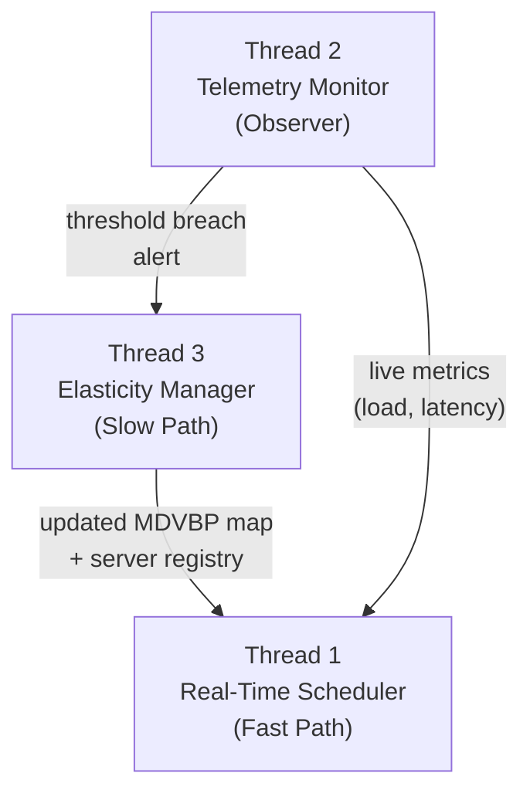

---

### 1.1 Thread 1 — Real-Time Scheduler (Fast Path)

**Purpose:** Handle every incoming packet that hits a table-miss or VIP punt rule, compute the best backend server, and install OpenFlow flow rules so that subsequent packets are forwarded entirely in hardware without controller involvement.

**Constraint:** Strictly non-blocking. Thread 1 never queries a database or executes a script. It relies exclusively on in-memory state that Thread 2 and Thread 3 keep up to date.

#### Step-by-step operation

1. A client sends a `TCP SYN` to the Virtual IP (VIP). The destination port encodes intent via **Intent-Based Port Mapping** (e.g., port `5001` = read Shard A).
2. The OVS switch has a VIP punt rule (priority 100) that sends unmatched VIP traffic to the controller as a `Packet-In` event.
3. Thread 1 parses the packet headers (source IP/MAC, destination port) and determines:
   - **Intent:** which data shard or resource profile the client is requesting, derived from the destination port via an $O(1)$ dictionary lookup.
   - **Client location:** which switch (DPID) and ingress port the packet arrived on.
4. Thread 1 consults the in-memory **MDVBP assignment map** (populated by Thread 3) to find the list of eligible server nodes that can serve this intent.
5. Among eligible nodes, Thread 1 applies the **Weighted Sum Model (WSM)** cost function to select the best one:

$$
Cost_j = \theta \cdot \frac{Load_j}{Load_{max}} + (1 - \theta) \cdot \frac{Hops_j}{Hops_{max}}
$$

The server $j$ with the lowest $Cost_j$ is selected.
6. Thread 1 installs two OpenFlow rules on the client's edge switch (priority 200, with `idle_timeout`):

- **DNAT (forward path):** rewrites `dst_ip` from VIP to the selected server IP, `dst_mac` to server MAC, output to next-hop port.
- **SNAT (return path):** rewrites `src_ip` from server IP back to VIP, `src_mac` to VIP MAC, output to client port.

7. Thread 1 sends a `Packet-Out` for the first packet with the DNAT actions applied immediately.
8. All subsequent packets in both directions are handled entirely by the switch. The controller is not involved again until the flow's `idle_timeout` expires.

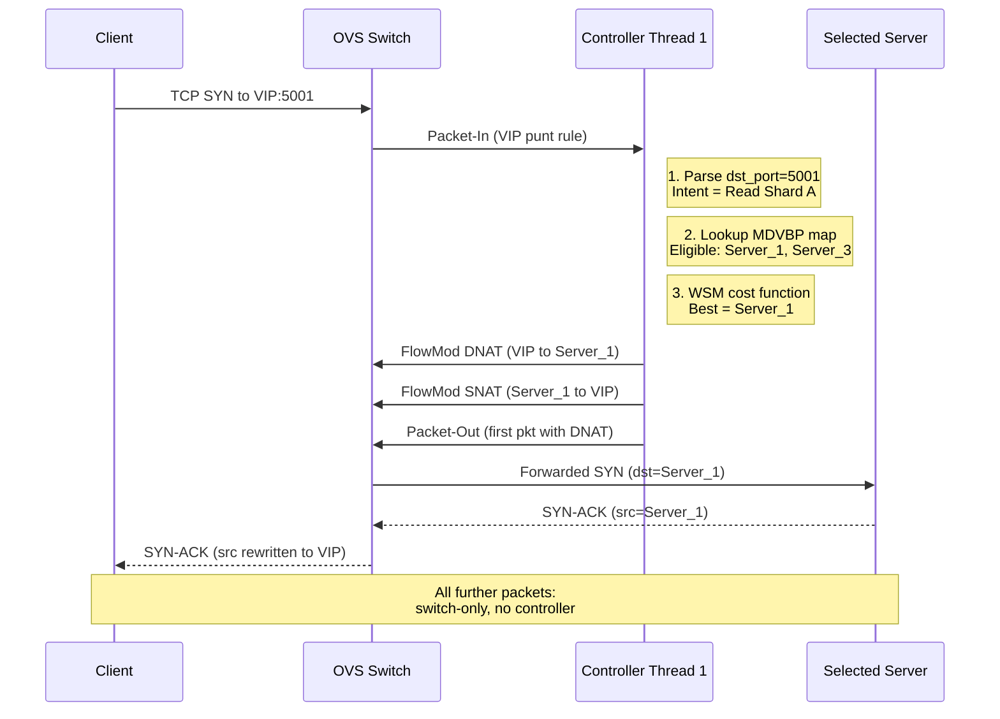

#### OpenFlow rules involved in Thread 1

Before the first client packet arrives, the switch already has a set of proactively installed rules that work together with Thread 1's reactive flow installation:

| Rule                  | Priority | Match                          | Action                                        | Installed by                  |
| --------------------- | -------- | ------------------------------ | --------------------------------------------- | ----------------------------- |
| **Table-Miss**  | 0        | Any unmatched packet           | `OUTPUT:CONTROLLER`                         | Controller on switch connect  |
| **ARP Reply**   | 200      | `ARP, dst=VIP`               | Switch replies directly with `VIP_MAC`      | `ovs-ofctl` (setup scripts) |
| **VIP Punt**    | 100      | `ipv4_dst=VIP, TCP/UDP/ICMP` | `OUTPUT:CONTROLLER`                         | Controller proactively        |
| **DNAT**        | 200      | `ipv4_dst=VIP, tp_dst=port`  | Rewrite dst IP/MAC to server, output next-hop | Thread 1 (reactively)         |
| **SNAT**        | 200      | `ipv4_src=server`            | Rewrite src IP/MAC to VIP, output client port | Thread 1 (reactively)         |
| **L2 Learning** | 10       | `in_port, eth_src, eth_dst`  | `OUTPUT:learned_port`                       | Controller reactively         |

#### Full VIP request lifecycle (concrete example)

The diagram above shows the conceptual flow. Below is the complete three-phase lifecycle with concrete IPs and all OpenFlow interactions, including ARP resolution handled entirely in-switch:

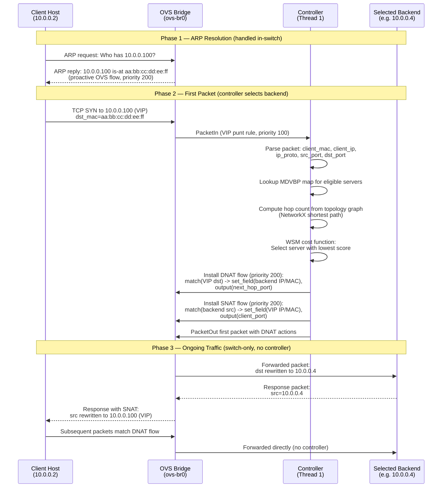

**Phase 1 — ARP Resolution:**
The client ARPs for the VIP (`10.0.0.100`). A proactive OpenFlow rule (installed via `ovs-ofctl` in the setup scripts) makes the switch reply directly with `VIP_MAC = aa:bb:cc:dd:ee:ff`. The controller is not involved.

**Phase 2 — First Packet:**
The client sends the first `TCP SYN` to the VIP. The VIP punt flow (priority 100) sends this packet to the controller as a `PacketIn`. Thread 1 parses the headers, consults the MDVBP map, computes the WSM cost, and selects the best backend. It installs DNAT + SNAT flows (priority 200, with `idle_timeout`) and sends a `Packet-Out` for the first packet.

**Phase 3 — Ongoing Traffic:**
All subsequent packets in both directions are handled entirely by the switch using the installed DNAT/SNAT rules. The controller is not involved, and the client always sees traffic coming from the VIP address. When the `idle_timeout` expires, the flows are removed and the next packet triggers a new `Packet-In`, allowing Thread 1 to re-evaluate the backend selection with fresh metrics.

---

### 1.2 Thread 2 — Telemetry & State Monitor (Observer)

**Purpose:** Continuously watch infrastructure metrics and data-placement state. Feed live data to Thread 1 and raise alerts to Thread 3 when thresholds are breached.

#### Inputs

| Source                 | Data                                              | Method                                                  |
| ---------------------- | ------------------------------------------------- | ------------------------------------------------------- |
| State MongoDB instance | Server metrics (CPU, RAM, storage, request count) | MongoDB**Change Streams** (real-time push)        |
| OVS Switches           | Per-port byte/packet counters                     | `OFPPortStatsRequest` / `OFPPortStatsReply` polling |

#### What it does

1. **Listens** on a MongoDB Change Stream opened against the `metrics` collection in the State MongoDB instance.
2. Each time a server container inserts or updates its metrics document, the Change Stream pushes the event to Thread 2 in real-time.
3. Thread 2 **aggregates** the incoming metrics and updates the shared in-memory state variables:
   - Per-server load vector: `{server_id: {cpu: %, ram: %, bw_bps: int, storage: %}}`
   - Per-switch port bitrate (from OpenFlow stats polling)
4. Thread 2 continuously **evaluates** these metrics against configurable thresholds (e.g., CPU > 80%, latency > 50ms, storage > 90%).
5. If a threshold is breached, Thread 2 **triggers** Thread 3 by passing the current global state snapshot.

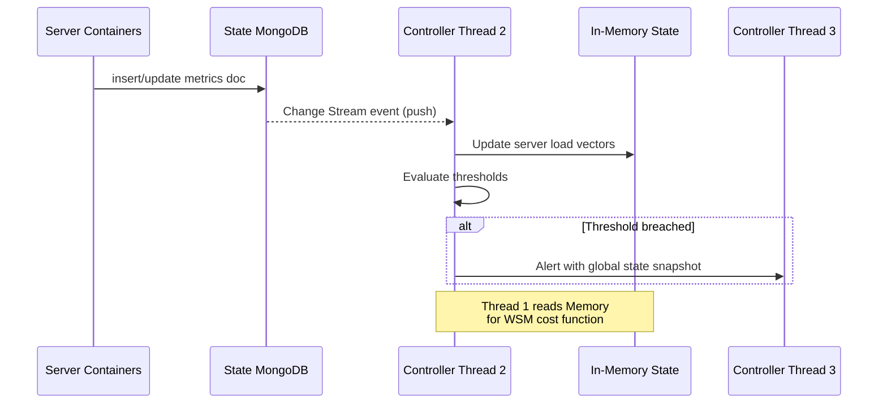

---

### 1.3 Thread 3 — Elasticity & Placement Manager (Slow Path)

**Purpose:** Mutate the infrastructure by adding/removing server containers and MongoDB instances when Thread 2 detects a threshold breach. Uses the **Multi-Dimensional Vector Bin Packing (MDVBP)** algorithm as its core decision engine.

#### MDVBP Decision Logic

When triggered, Thread 3 runs the **Multi-Dimensional Best-Fit Decreasing (MBFD)** heuristic:

1. **Collect** current state: active servers with their remaining capacity vectors, active user demands, data shard locations.
2. **Filter** eligible servers for each demand: only those where the demand vector fits within remaining capacity and that can access the required data shard.
3. **Score** each candidate server: prefer the tightest fit (smallest remaining capacity after assignment) to consolidate load.

$$
Score_j = \|\vec{S}_{free,j} - \vec{u}_i\|
$$

4. **Assign** to the server with the smallest score. If no server has capacity, **spawn** a new one (scale-out).
5. If a server becomes idle (zero active sessions) and there is remaining capacity in the system to for example fit the largest user resource request up to date or the smallest user resource request up to date or the time it takes to bring a new server is fast enough to keep latency under QoS, **remove** it (scale-in).

#### Scale-Out: Adding a Replica Set Member

When Thread 3 determines that a specific network segment needs local read access to data that currently only exists in another network, the simplest and most practical approach is to **add a new replica set member** to the existing shard's replica set in the target network.

**Why Replica Sets (not new Shards)?**

- Adding a replica member (`rs.add()`) is a lightweight operation. The new member syncs data automatically from the primary via MongoDB's internal replication protocol (oplog tailing).
- Adding a new shard would require redistributing chunk ranges across the entire cluster, which is a heavyweight operation involving `sh.addShard()`, new zone range definitions, and chunk migration. This approach may make sense for long-term capacity planning, but not for real-time elasticity in response to transient demand spikes.
- With replica sets, **writes always go to the primary** (consistency is preserved), and **reads can be served locally** from the new secondary (low latency).

**Sharding with `sh.moveChunk()` — When does it make sense?**
Chunk migration (`sh.moveChunk()`) is relevant when the goal is to permanently relocate a range of data from one shard to another. This is useful when:

- A network segment consistently serves a specific data range and the system can tolerate a brief migration window.
- The shard key aligns with a **network-location-based partitioning strategy** (e.g., `dpid` ranges 1-100 go to `rs_net1`, 101-200 go to `rs_net2`).
- However, `moveChunk` is **not suited for real-time elasticity**: it locks the chunk being migrated, introduces latency during the transfer, and requires `mongos` metadata refresh. It is a planning-time operation, not a reaction-time one.

**Recommendation:** Use Replica Sets for elastic scale-out (Thread 3 reacting to demand), and reserve sharding/chunk migration for initial data partitioning or periodic rebalancing during maintenance windows.

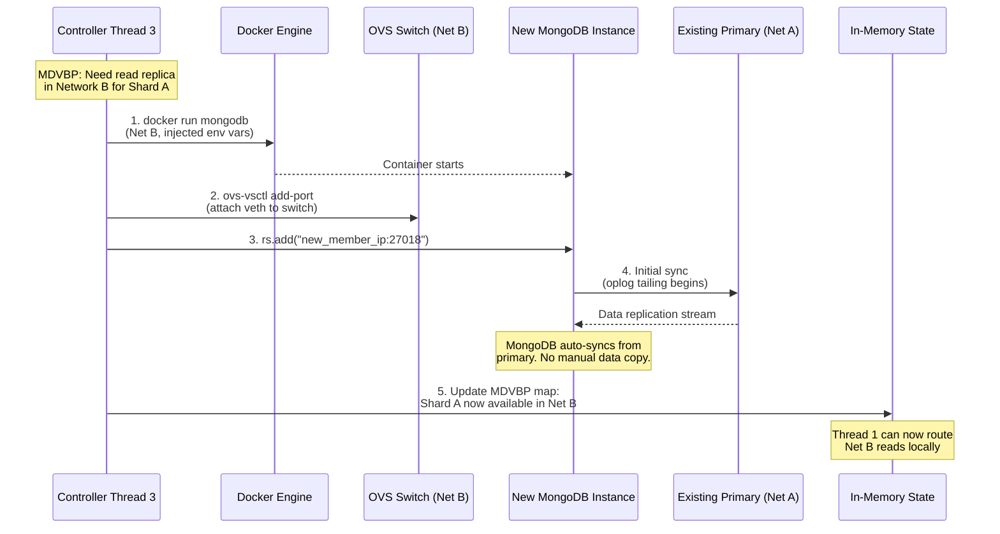

#### Scale-Out: Adding a Server Container

When MDVBP detects that all existing server nodes are at capacity and new client requests cannot be assigned, Thread 3 spawns a new application server container.

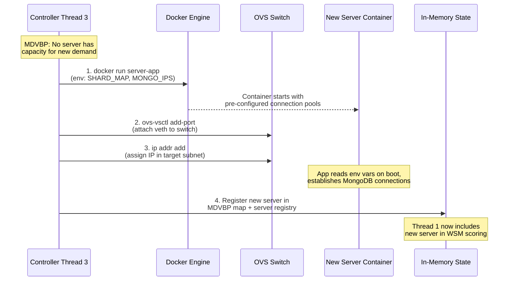

#### Scale-In: Removing Resources

When an existing server has zero active sessions (all flow rules have expired via `idle_timeout`), Thread 3 removes it to save energy:

1. Thread 3 verifies no active flows reference the server (via OpenFlow stats or its own session tracking).
2. `docker stop` and `docker rm` the container.
3. `ovs-vsctl del-port` the veth pair.
4. If the removed server was the only consumer of a local MongoDB replica, Thread 3 evaluates whether the replica should also be removed (`rs.remove()`).
5. Update the in-memory MDVBP map.

#### Sharding vs. Replica Sets — Decision Summary

| Criteria                      | Replica Set (`rs.add`)                            | Sharding (`sh.moveChunk`)          |
| ----------------------------- | --------------------------------------------------- | ------------------------------------ |
| **Use case**            | Elastic scale-out for read demand                   | Permanent data redistribution        |
| **Latency impact**      | Zero (async replication)                            | High (chunk lock during migration)   |
| **Write path**          | Unchanged (primary only)                            | Unchanged (primary only)             |
| **Read path**           | Local secondary reads (`readPreference: nearest`) | Reads from new shard location        |
| **Shard key relevance** | Not affected                                        | Must align with location-based zones |
| **Thread 3 trigger**    | Transient demand spike                              | Periodic rebalancing / planning      |
| **Reversibility**       | Easy (`rs.remove`)                                | Complex (move chunk back)            |

---

## 2. The Server (Application Container)

Each server is a lightweight Docker container running an HTTP application (e.g., Flask/FastAPI). It handles client GET and POST requests and connects to the appropriate MongoDB shard. It also periodically reports its own resource usage to the State MongoDB instance.

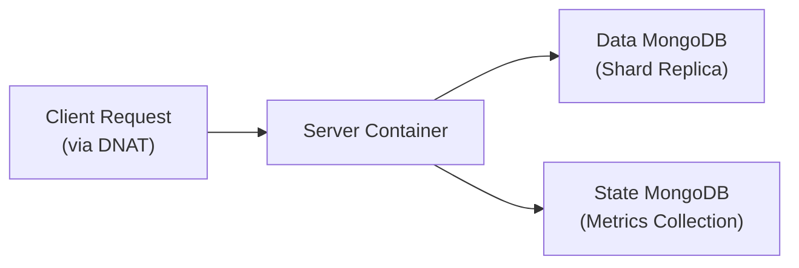

---

### 2.1 Receiving and Processing HTTP Requests

When a server container receives an HTTP request (routed via the VIP DNAT rules), it uses the **destination port** to determine which MongoDB shard connection pool to use. This is the "Context-Aware Application" pattern: the server was configured at boot time (via environment variables injected by Thread 3) with a mapping of ports to shard connection strings.

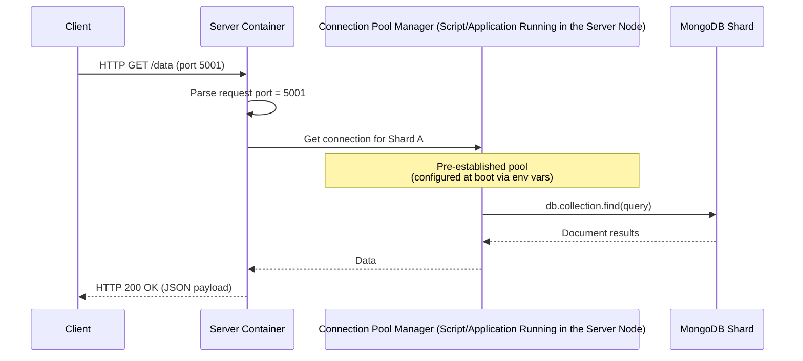

For **POST (write)** requests, the same mechanism applies. The server determines the target shard from the port and writes to the primary of that replica set. The SDN controller ensures that write requests are always routed to a server that has a direct connection to the primary node (not a secondary), preserving MongoDB's write consistency guarantee.

---

### 2.2 Reporting Metrics to the State MongoDB

Each server container runs a background process (or periodic timer) that collects its own resource utilization and writes it to the **State MongoDB** instance. This is the data source that Thread 2 (Observer) watches via Change Streams.

**Metrics collected:**

| Metric             | Source                          | Unit               |
| ------------------ | ------------------------------- | ------------------ |
| CPU usage          | `/proc/stat` or `psutil`    | Percentage (0-100) |
| RAM usage          | `/proc/meminfo` or `psutil` | Percentage (0-100) |
| Storage usage      | `df` or `shutil.disk_usage` | Percentage (0-100) |
| Active connections | Application counter             | Integer            |

**Reporting flow:**

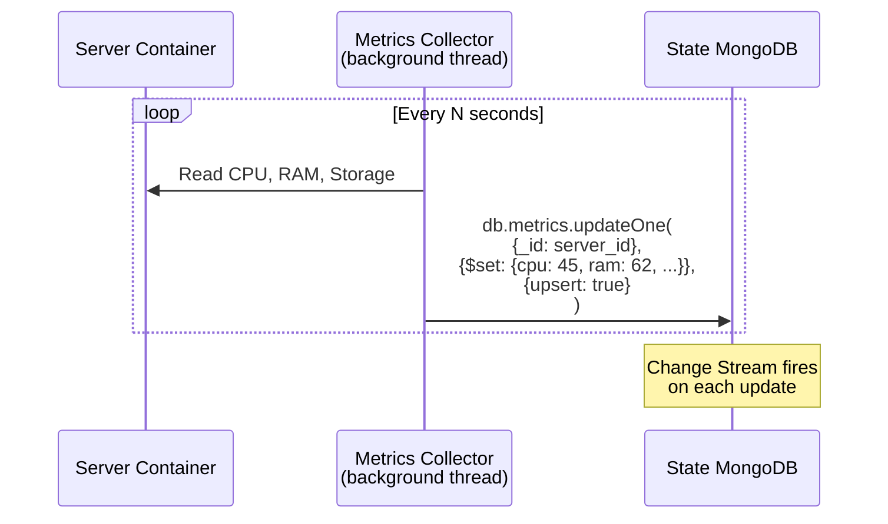

The server uses `updateOne` with `upsert: true` keyed by its own `server_id`. This ensures a single document per server (no unbounded growth) and triggers a Change Stream event on every update, which Thread 2 receives in real-time.

---

## 3. The State MongoDB Instance

The State MongoDB is a dedicated MongoDB instance (or small replica set) that acts as the **shared memory bus** between all server containers and the controller. It does **not** store application data. Its sole purpose is to hold real-time metrics from every server and to propagate updates to the controller via Change Streams.

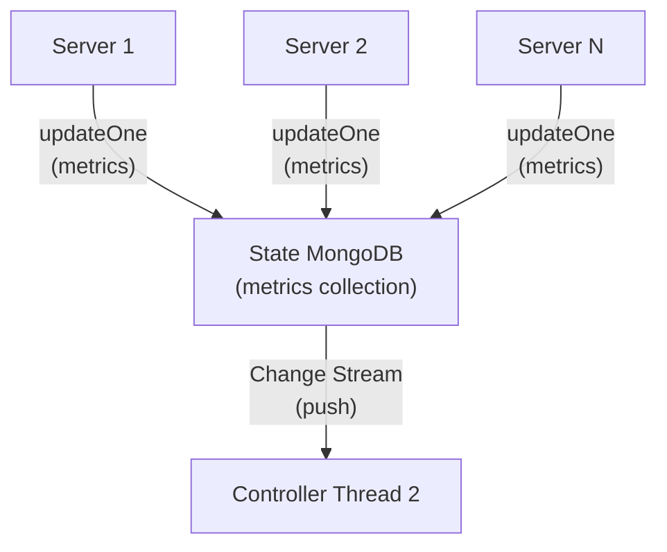

---

### 3.1 Receiving Metrics from All Servers

The State MongoDB instance stores a single `metrics` collection. Each document represents the latest snapshot of one server:

```json
{
    "_id": "server_1",
    "network": "net_1",
    "cpu_percent": 45.2,
    "ram_percent": 62.0,
    "storage_percent": 30.5,
    "active_connections": 12,
    "timestamp": "2026-02-28T10:30:00Z"
}
```

Every server writes to this collection at a regular interval. Because the write uses `_id` as the key, the document is replaced in-place (not appended), keeping the collection size proportional to the number of active servers rather than growing unboundedly.

---

### 3.2 Change Streams — Real-Time Push to the Controller

MongoDB **Change Streams** allow a client to subscribe to a collection and receive real-time notifications whenever a document is inserted, updated, replaced, or deleted.

When the State MongoDB instance receives an `updateOne` from any server, the Change Stream **immediately pushes** the event to Thread 2 of the controller without Thread 2 needing to poll.

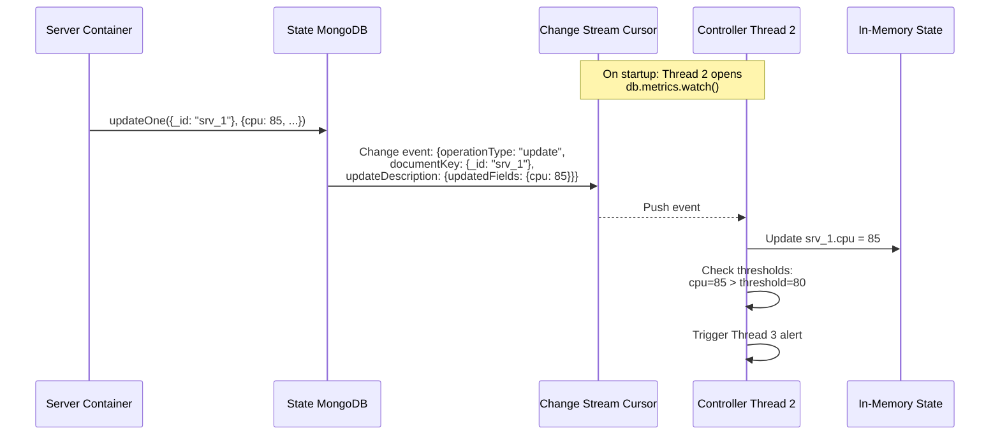

**Key properties:**

- **Push-based:** Zero polling. Thread 2's `watch()` cursor blocks until the next event arrives, using minimal CPU.
- **Ordered:** Events arrive in the order they were committed to the oplog, ensuring consistency.
- **Resumable:** If the connection drops, Thread 2 can resume from a `resumeToken` without missing events.
- **Granular:** The Change Stream event includes `updateDescription.updatedFields`, so Thread 2 knows exactly which metric changed without re-reading the full document.

---

### 3.3 Full Data Flow — End to End

The complete cycle from server metric generation to controller action:

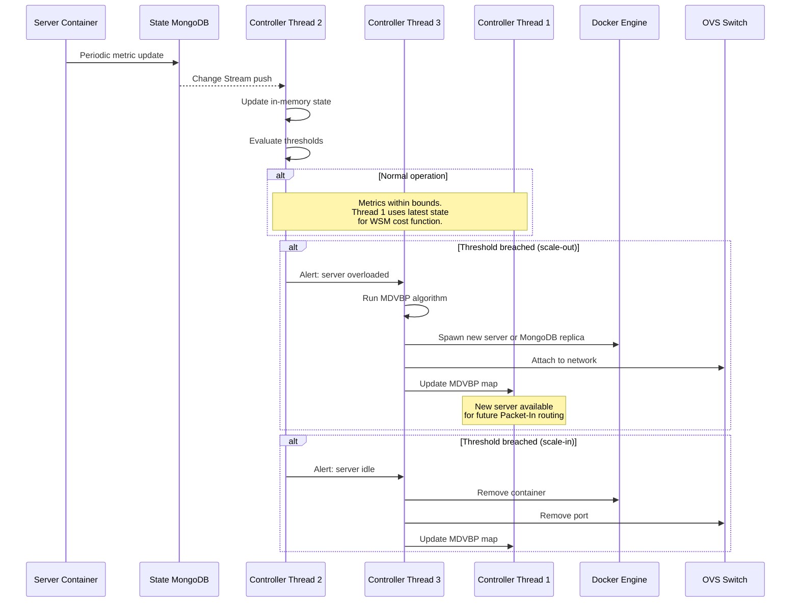
