# System Scenarios — Quick Reference

Condensed scenario descriptions to accompany the diagrams in `system_mechanisms.md`. Each entry states what is happening and which components are involved, without rationale or justification.

---

## Controller Thread Layout

Three concurrent execution contexts. The Telemetry Greenthread feeds Thread 1 in real-time and raises alerts to Thread 3 when thresholds are breached. Thread 3 mutates infrastructure and notifies Thread 1 of the change.

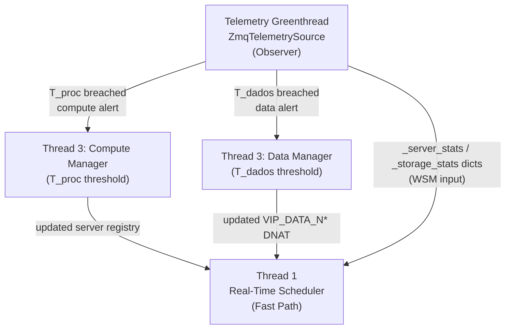

---

## Scenario 1 — New Client Request (VIP_SERVER + VIP_DATA_N*, First Packet)

A client opens a connection to `VIP_SERVER:80`. The OVS switch punts the SYN to Thread 1. Thread 1 selects the best web server using the WSM cost formula and installs DNAT/SNAT rules. The web server then opens a connection to `VIP_DATA_N1:27018`; Thread 1 intercepts that too, evaluates the storage WSM cost function for the corresponding domain, and installs DNAT/SNAT rules to the correct `mongod`. Both flows are then handled switch-only.

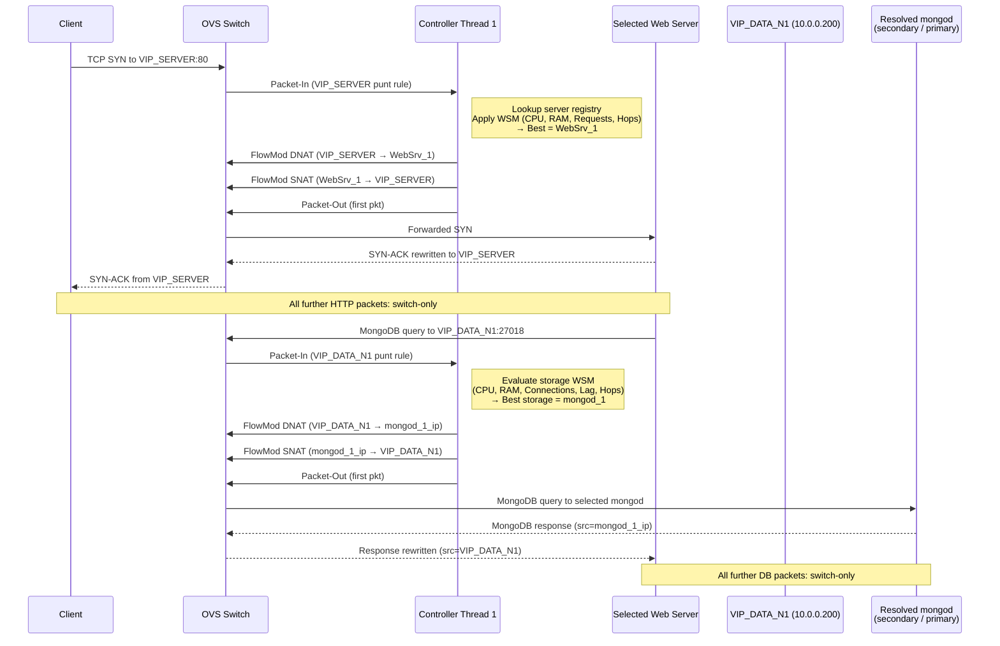

---

## Scenario 2 — Full Packet Lifecycle (ARP through HTTP Response)

Shows what happens from ARP resolution through a complete HTTP request/response cycle with both VIPs active.

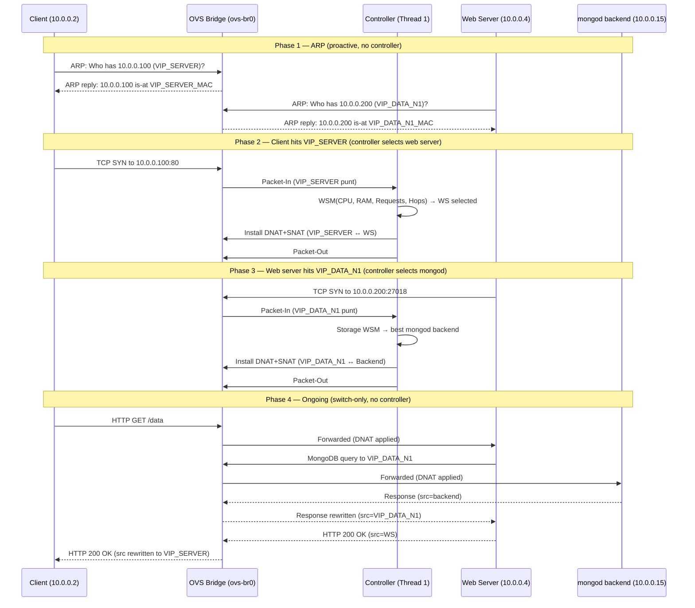

---

## Scenario 3 — Telemetry Greenthread Observes a Threshold Breach

Edge servers push per-request metrics via ZMQ PUSH to the per-network Aggregator. The Aggregator publishes windowed summaries via ZMQ PUB. The Telemetry Greenthread (ZmqTelemetrySource) subscribes, updates in-memory state for Thread 1's WSM cost functions, computes $T_{proc}$ from each summary, and fires the appropriate alert to Thread 3 (ElasticityManager).

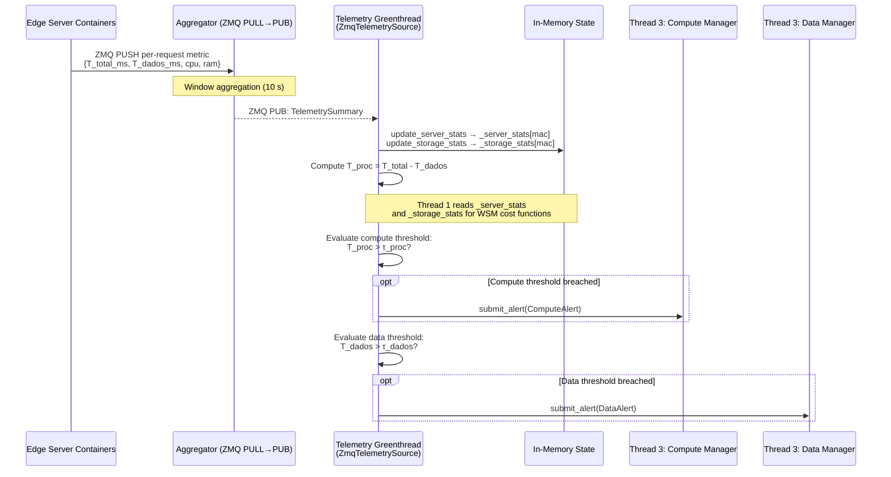

---

## Scenario 4 — Data Gravity Lifecycle (Tier 0 → 1 → 2 → 0)

Each network starts with only its own primary. As cross-network demand grows, Thread 3 deploys a cache, then a full secondary. When demand drops, resources are removed.

> **Note:** Tier 1 (Selective Sync Node) is implemented and feature-flagged behind `SS_ENABLED` (default `0`). With the flag off, only the Tier 0 → Tier 2 → Tier 0 lifecycle is exercised.

**Tier 0 — Base State:** Two isolated primaries, no replication, no caching.

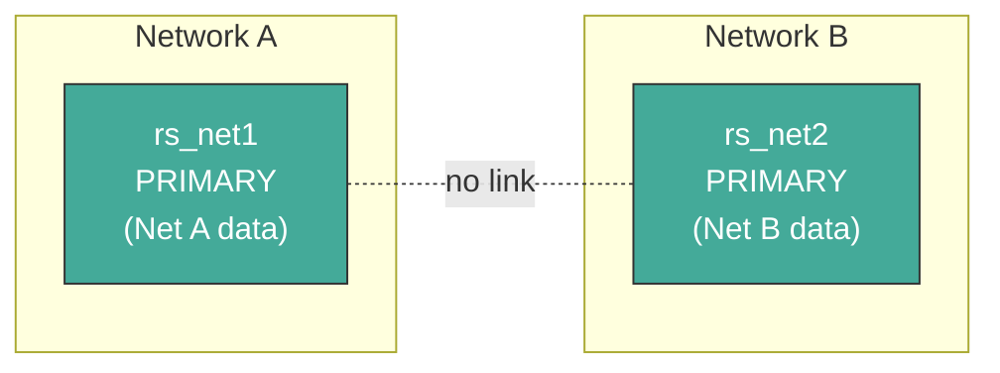

**Tier 1 — Selective Sync Node deployed in Net B:** `VIP_DATA_N*` now routes to the Selective Sync Node. Hot collections are seeded via `mongodump | mongorestore` and kept current by one Change Stream per hot collection opened on the remote primary. A TTL index expires documents automatically.

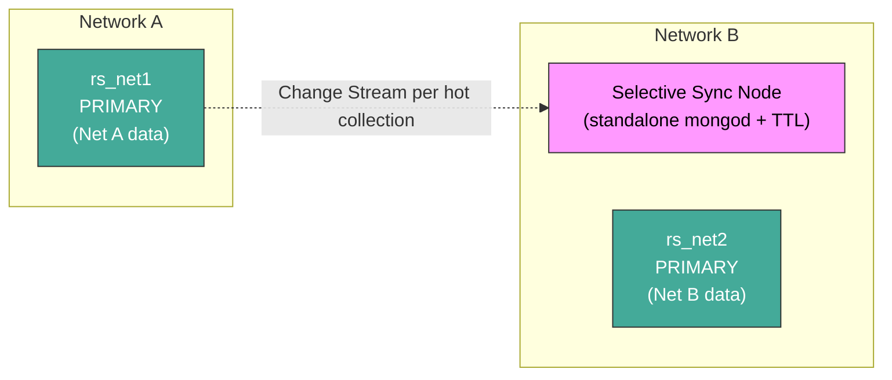

**Tier 2 — Full Replica added in Net B:** `rs.add()` places a secondary of `rs_net1` in Net B. MongoDB oplog replication runs autonomously. `VIP_DATA_N*` routes to the secondary.

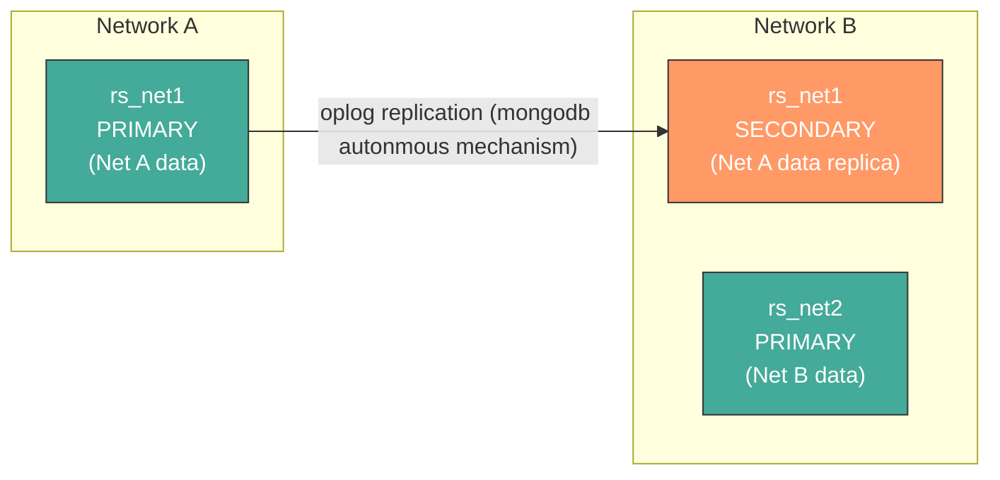

**Tier 0 again — Demand dropped:** `rs.remove()` is called. `VIP_DATA_N*` DNAT reverts to the remote primary. Edge storage freed.

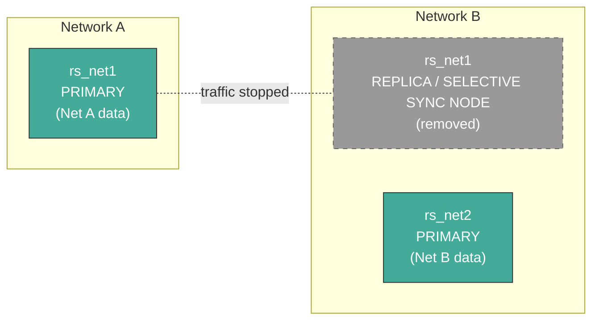

---

## Scenario 5 — Tier Transition Map

> **Note:** Tier 1 transitions require `SS_ENABLED=1`; with the default flag off, only Tier 0 ↔ Tier 2 transitions occur.

Which metric triggers which transition, and what Thread 1 does to `VIP_DATA_N*` on each.

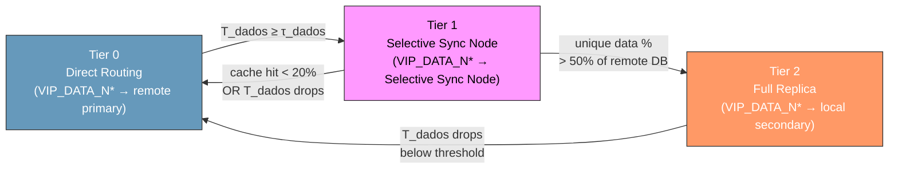

---

## Scenario 6 — Scale-Out: Adding a Replica Secondary (Tier 2)

Thread 3 (ElasticityManager, Data Manager alert) runs `docker run` for a new `mongod`, attaches it to the OVS switch via `add_network_storage_node.sh`, calls `rs.add()` on the primary, waits for initial sync, and notifies Thread 1 to update the `VIP_DATA_N*` DNAT rule.

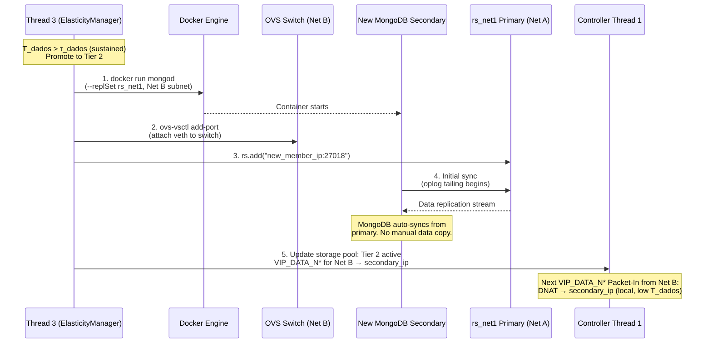

---

## Scenario 7 — Scale-Out: Spawning a New Web Server (Compute)

Thread 3 (ElasticityManager) runs a new web server container with the two VIP connection strings pre-configured, attaches it to the switch, and registers it with Thread 1 for `VIP_SERVER` routing.

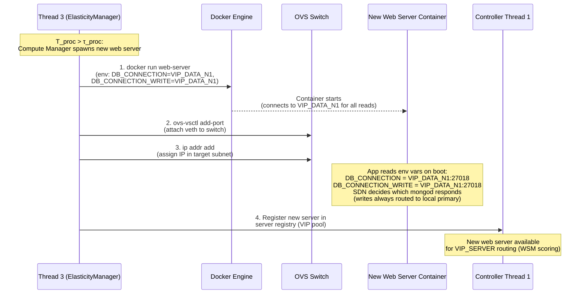

---

## Scenario 8 — Selective Sync Node Layout

> **Note:** Tier 1 is feature-flagged behind `SS_ENABLED`. See `system_mechanisms.md` §1.6 and [`selective_sync/selective_sync_overview.md`](selective_sync/selective_sync_overview.md) for the implementation.

A standalone `mongod` (not a replica set member) is deployed as the Selective Sync Node. Hot collections are identified by an access tracking script that tails `system.profile` on Local MongoDB, seeded via `mongodump | mongorestore`, and kept current by one Change Stream per hot collection opened on the remote primary. A Change Stream consumer script writes incoming documents with a `ttl_expires` field; MongoDB's TTL index handles expiry. The OVS switch applies the `VIP_DATA_N*` DNAT rule to route queries to the node.

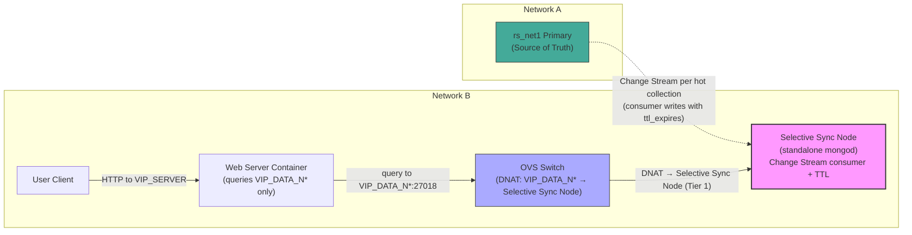

---

## Scenario 9 — Selective Sync Node Deployment Sequence

> **Note:** Tier 1 is feature-flagged behind `SS_ENABLED`. See `system_mechanisms.md` §1.6 and [`selective_sync/selective_sync_overview.md`](selective_sync/selective_sync_overview.md) for the implementation.

Thread 3 (Data Manager) deploys the Selective Sync Node: identifies hot collections via an access tracking script that tails `system.profile` on Local MongoDB, seeds them from the remote primary using `mongodump | mongorestore`, opens one Change Stream per hot collection via the Change Stream consumer, attaches the node to the network, and signals Thread 1 to switch the `VIP_DATA_N*` DNAT rule.

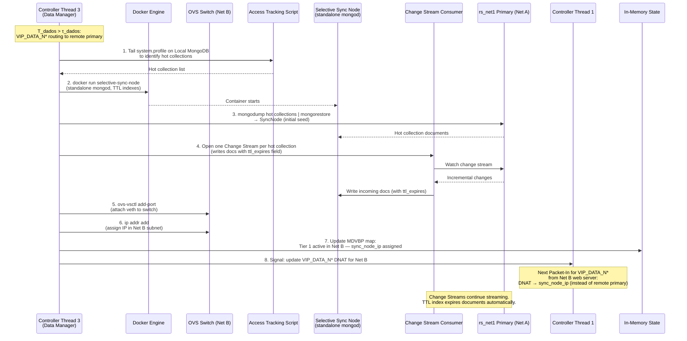

---

## Scenario 10 — Server: Read Request Flow

The web server receives an HTTP GET, queries `VIP_DATA_N*:27018` (unaware of which `mongod` actually answers), measures $T_{dados}$, and returns the response. The OVS switch applies the active DNAT rule transparently.

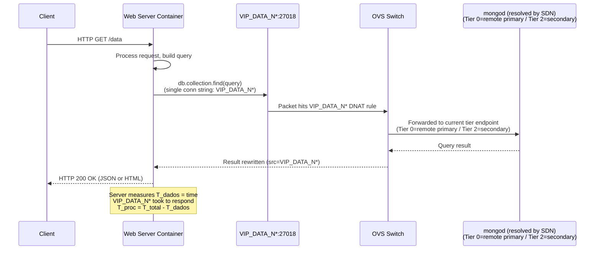

---

## Scenario 11 — Server: Write Request Flow

The web server sends a write to the local primary. The SDN routes writes directly to the local primary via static DNAT rules (write-path isolation). The primary acknowledges the write.

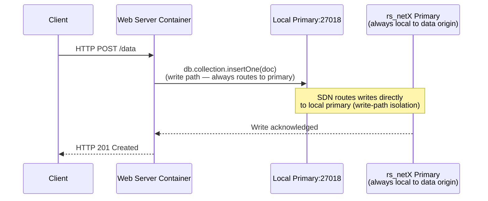

---

## Scenario 12 — Server: Metric Reporting (ZMQ PUSH)

After each HTTP request, the web server pushes a per-request metric event via ZMQ PUSH to the per-network Aggregator. There is no database in the telemetry path.

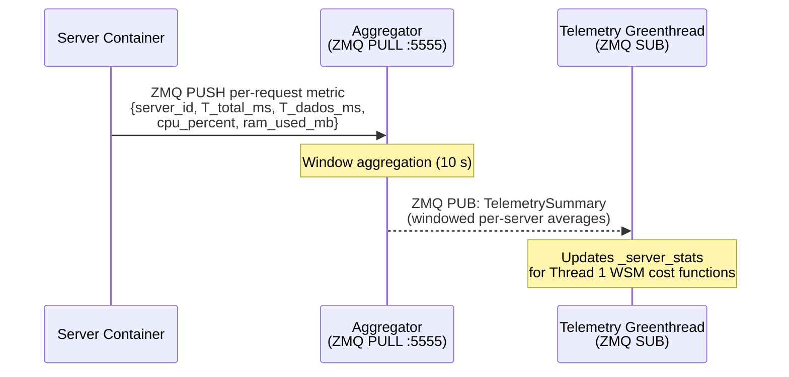

---

## Scenario 13 — ZMQ Telemetry Pipeline Overview

All server containers push per-request metrics via ZMQ PUSH to the per-network Aggregator. MongoDB sidecars also push periodic snapshots. The Aggregator publishes windowed summaries via ZMQ PUB. The Telemetry Greenthread subscribes and updates in-memory state.

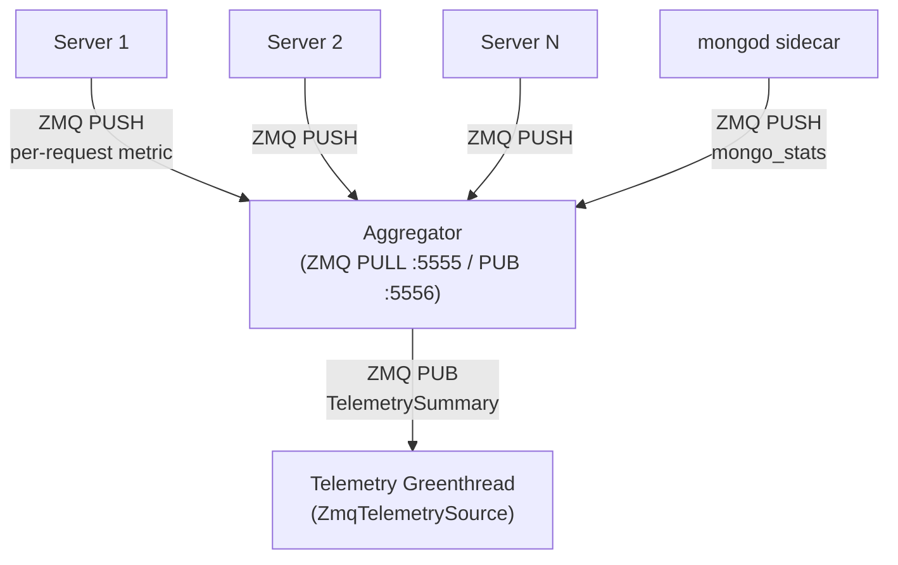

---

## Scenario 14 — Telemetry: Threshold Breach Detected

A server reports high $T_{dados}$. The Aggregator publishes the windowed summary. The Telemetry Greenthread receives it, computes $T_{proc}$, finds $T_{dados}$ above threshold, and submits a DataAlert to the ElasticityManager queue.

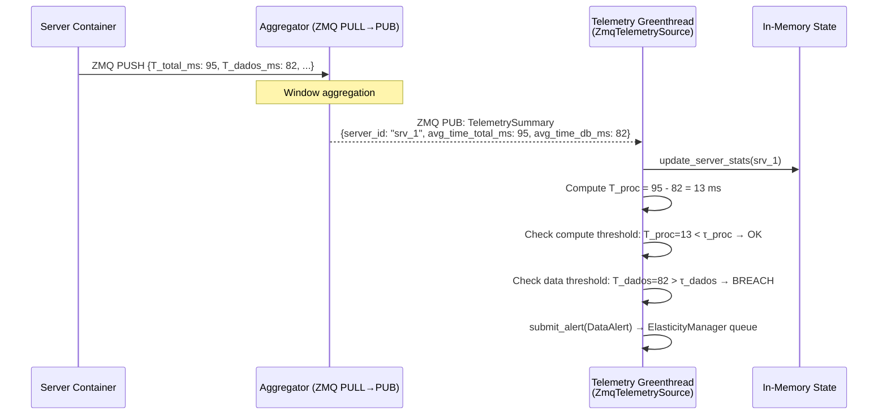

---

## Scenario 15 — SSR: Edge-Based (Tier 2 active; Tier 1 feature-flagged)

A `GET /view/profile` request triggers two `VIP_DATA_N*` queries (template + data). Both are served locally because the SDN DNAT rule routes `VIP_DATA_N*` to a local cache or secondary. $T_{dados} \approx 2 \times \text{LAN latency}$.

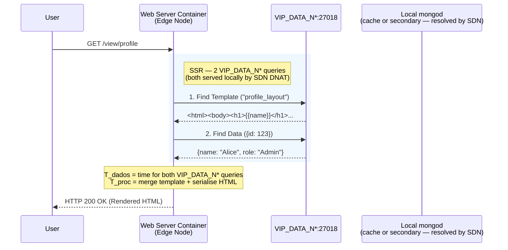

---

## Scenario 16 — SSR: No Local Data (Tier 0)

Same `GET /view/profile` request, but `VIP_DATA_N*` is routing to the remote primary. Both queries cross the network. $T_{dados} \approx 2 \times \text{Remote RTT}$.

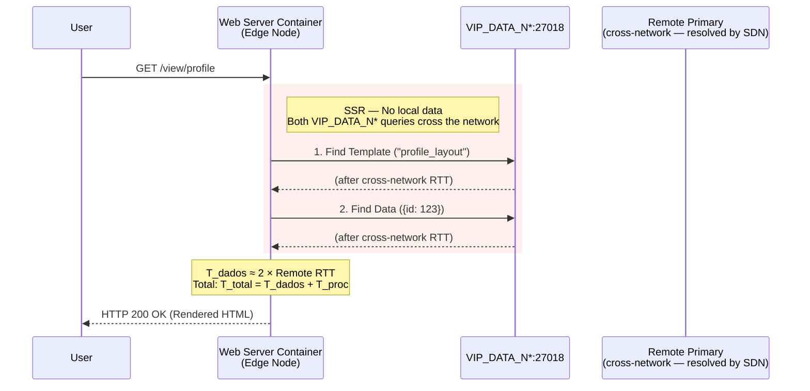

---

## Scenario 17 — End-to-End: Full Control Loop

The complete cycle from a server pushing a metric to the controller taking infrastructure action.

```mermaid
sequenceDiagram
    participant Server as Server Container
    participant Agg as Aggregator (ZMQ PULL→PUB)
    participant T2 as Telemetry Greenthread<br/>(ZmqTelemetrySource)
    participant T3comp as Thread 3: ElasticityManager<br/>(ComputeAlert)
    participant T3data as Thread 3: ElasticityManager<br/>(DataAlert)
    participant T1 as Controller Thread 1
    participant Docker as Docker Engine
    participant OVS as OVS Switch

    Server->>Agg: ZMQ PUSH per-request metric<br/>{T_total_ms, T_dados_ms, cpu, ram}
    Note over Agg: Window aggregation (10 s)
    Agg-->>T2: ZMQ PUB: TelemetrySummary
    T2->>T2: Update _server_stats / _storage_stats
    T2->>T2: Compute T_proc = T_total - T_dados

    Note over T2,T1: Normal: Thread 1 uses _server_stats<br/>for WSM cost function (VIP_SERVER routing)

    alt T_proc > τ_proc (compute bottleneck)
        T2->>T3comp: submit_alert(ComputeAlert)
        T3comp->>Docker: Spawn new web server (NodeAdder)
        T3comp->>OVS: Attach to network (add_network_node.sh)
        T3comp->>T1: add_server_mac → update VIP pool
        Note over T1: New web server available<br/>for VIP_SERVER routing
    else T_dados > τ_dados (data bottleneck)
        T2->>T3data: submit_alert(DataAlert)
        T3data->>T3data: Evaluate tier transition
        T3data->>Docker: Spawn replica (NodeAdder)
        T3data->>OVS: Attach to network (add_network_storage_node.sh)
        T3data->>T1: add_storage_mac → update VIP_DATA_N* pool
        Note over T1: Next VIP_DATA_N* Packet-In<br/>routes to new local endpoint
    else idle (scale-in)
        T2->>T3comp: submit_alert(ScaleDownComputeAlert)
        T3comp->>Docker: Two-phase drain → remove container
        T3comp->>OVS: Flush flows, remove port
        T3comp->>T1: remove_server_mac → update VIP pool
    end
```
