# System Scenarios — Quick Reference

Condensed scenario descriptions to accompany the diagrams in `system_mechanisms.md`. Each entry states what is happening and which components are involved, without rationale or justification.

---

## Controller Thread Layout

Three concurrent threads. Thread 2 feeds Thread 1 in real-time and raises alerts to Thread 3 when thresholds are breached. Thread 3 mutates infrastructure and notifies Thread 1 of the change.

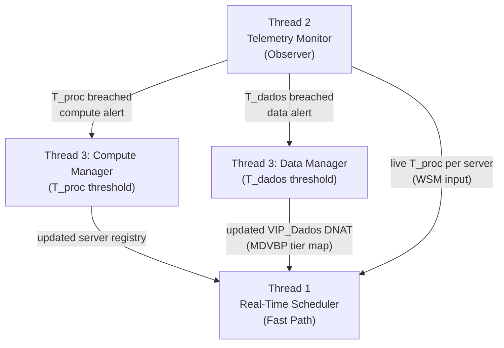

---

## Scenario 1 — New Client Request (VIP_Web + VIP_Dados, First Packet)

A client opens a connection to `VIP_Web:80`. The OVS switch punts the SYN to Thread 1. Thread 1 selects the best web server using the WSM cost formula and installs DNAT/SNAT rules. The web server then opens a connection to `VIP_Dados:27017`; Thread 1 intercepts that too, checks the active data-gravity tier from the MDVBP map, and installs DNAT/SNAT rules to the correct `mongod`. Both flows are then handled switch-only.

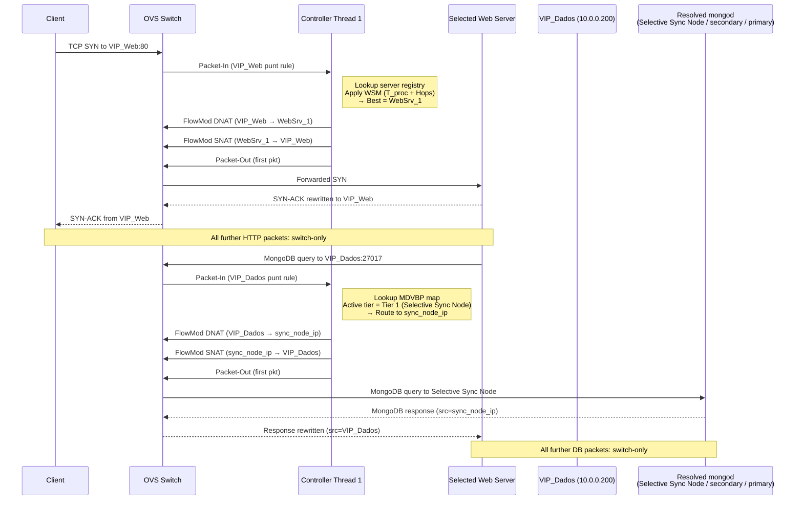

---

## Scenario 2 — Full Packet Lifecycle (ARP through HTTP Response)

Shows what happens from ARP resolution through a complete HTTP request/response cycle with both VIPs active.

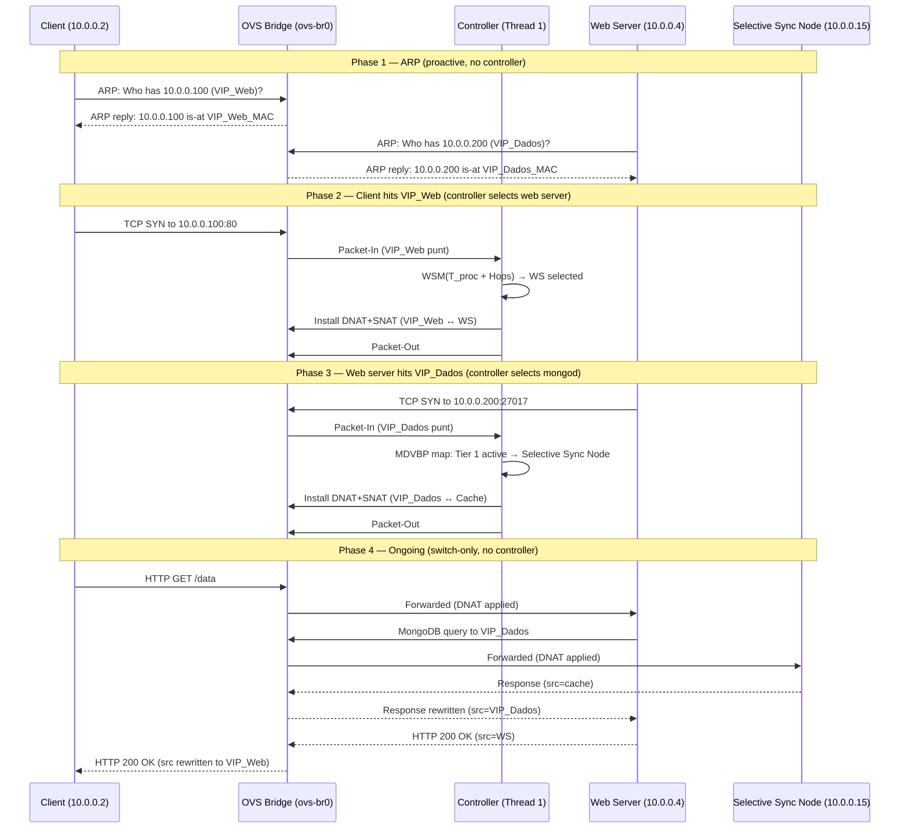

---

## Scenario 3 — Thread 2 Observes a Threshold Breach

An Aggregation Script periodically reads per-server metrics from Local MongoDB and pushes summarised vectors to a pub/sub channel. Thread 2 subscribes to that channel, computes $T_{proc}$ from each summary, and fires the appropriate alert to Thread 3.

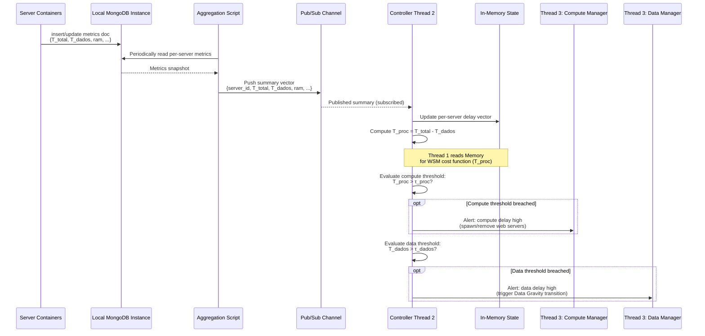

---

## Scenario 4 — Data Gravity Lifecycle (Tier 0 → 1 → 2 → 0)

Each network starts with only its own primary. As cross-network demand grows, Thread 3 deploys a cache, then a full secondary. When demand drops, resources are removed.

**Tier 0 — Base State:** Two isolated primaries, no replication, no caching.

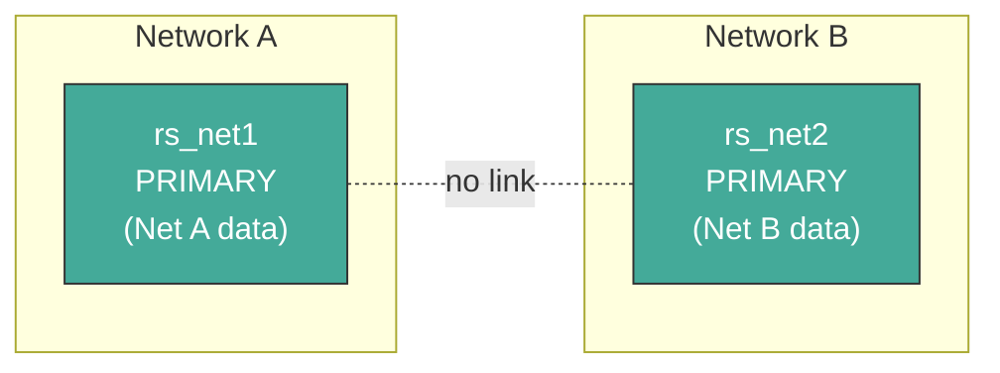

**Tier 1 — Selective Sync Node deployed in Net B:** `VIP_Dados` now routes to the Selective Sync Node. Hot collections are seeded via `mongodump | mongorestore` and kept current by one Change Stream per hot collection opened on the remote primary. A TTL index expires documents automatically.

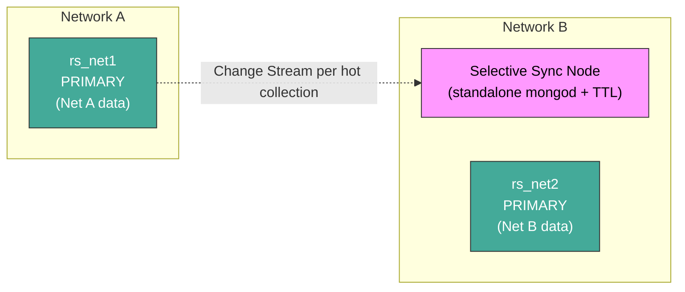

**Tier 2 — Full Replica added in Net B:** `rs.add()` places a secondary of `rs_net1` in Net B. MongoDB oplog replication runs autonomously. `VIP_Dados` routes to the secondary.

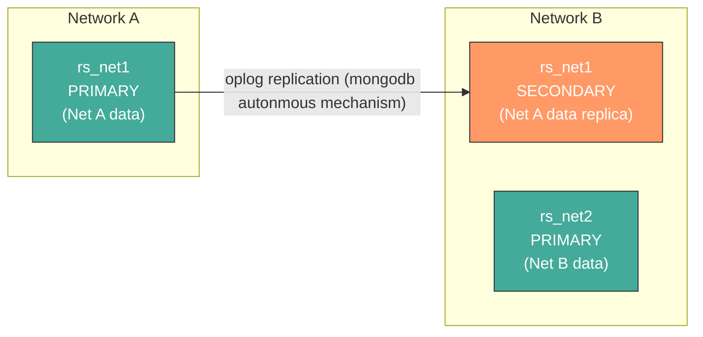

**Tier 0 again — Demand dropped:** `rs.remove()` is called. `VIP_Dados` DNAT reverts to the remote primary. Edge storage freed.

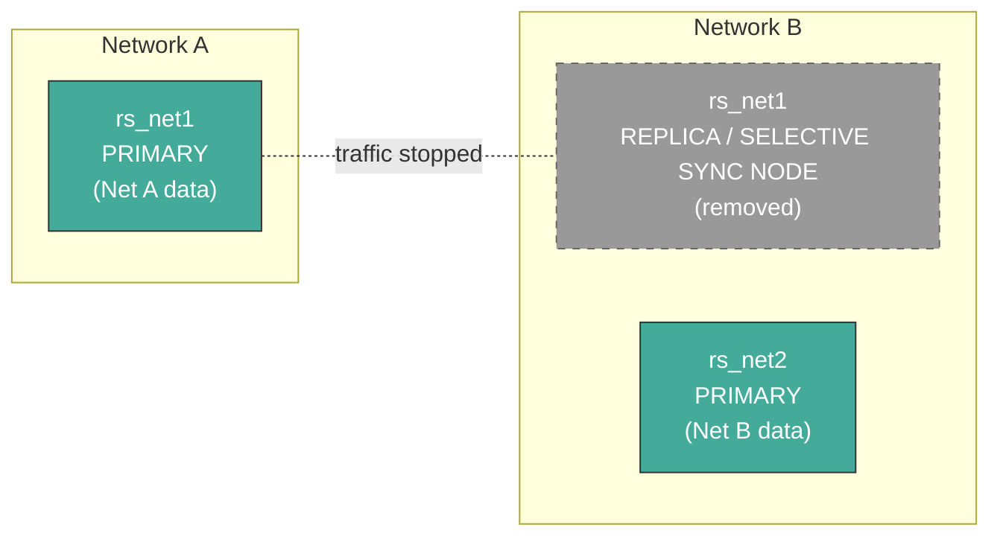

---

## Scenario 5 — Tier Transition Map

Which metric triggers which transition, and what Thread 1 does to `VIP_Dados` on each.

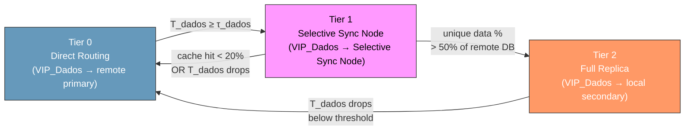

---

## Scenario 6 — Scale-Out: Adding a Replica Secondary (Tier 2)

Thread 3 (Data Manager) first decommissions the Selective Sync Node (closes its Change Streams and lets the TTL index expire remaining docs), then runs `docker run` for a new `mongod`, attaches it to the OVS switch, calls `rs.add()` on the primary, waits for initial sync, and notifies Thread 1 to update the `VIP_Dados` DNAT rule.

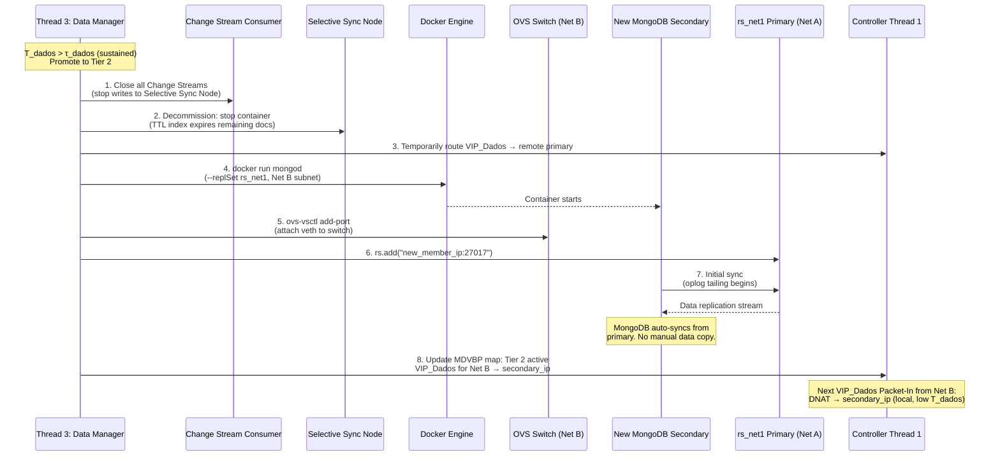

---

## Scenario 7 — Scale-Out: Spawning a New Web Server (Compute)

Thread 3 (Compute Manager) runs a new web server container with the two VIP connection strings pre-configured, attaches it to the switch, and registers it with Thread 1 for `VIP_Web` routing.

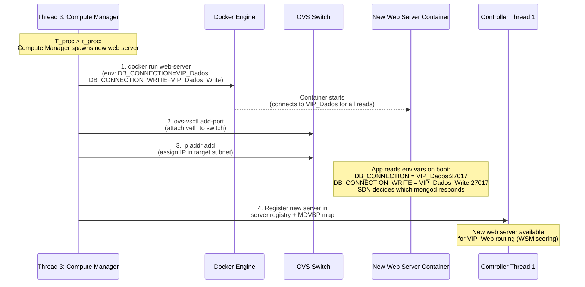

---

## Scenario 8 — Selective Sync Node Layout

A standalone `mongod` (not a replica set member) is deployed as the Selective Sync Node. Hot collections are identified by an access tracking script that tails `system.profile` on Local MongoDB, seeded via `mongodump | mongorestore`, and kept current by one Change Stream per hot collection opened on the remote primary. A Change Stream consumer script writes incoming documents with a `ttl_expires` field; MongoDB's TTL index handles expiry. The OVS switch applies the `VIP_Dados` DNAT rule to route queries to the node.

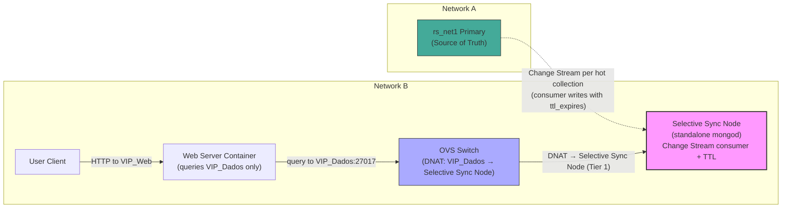

---

## Scenario 9 — Selective Sync Node Deployment Sequence

Thread 3 (Data Manager) deploys the Selective Sync Node: identifies hot collections via an access tracking script that tails `system.profile` on Local MongoDB, seeds them from the remote primary using `mongodump | mongorestore`, opens one Change Stream per hot collection via the Change Stream consumer, attaches the node to the network, and signals Thread 1 to switch the `VIP_Dados` DNAT rule.

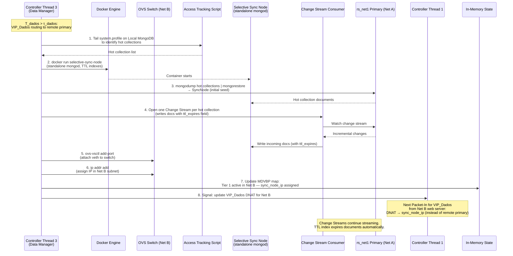

---

## Scenario 10 — Server: Read Request Flow

The web server receives an HTTP GET, queries `VIP_Dados:27017` (unaware of which `mongod` actually answers), measures $T_{dados}$, and returns the response. The OVS switch applies the active DNAT rule transparently.

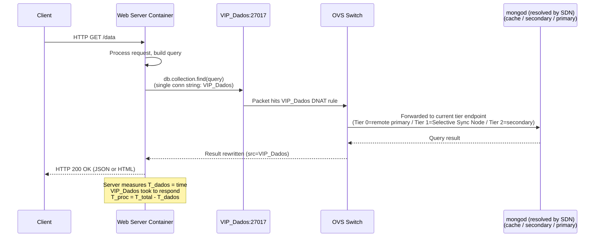

---

## Scenario 11 — Server: Write Request Flow

The web server sends a write to `VIP_Dados_Write:27017`. The SDN routes this VIP via a static DNAT rule to the local primary. The primary acknowledges the write.

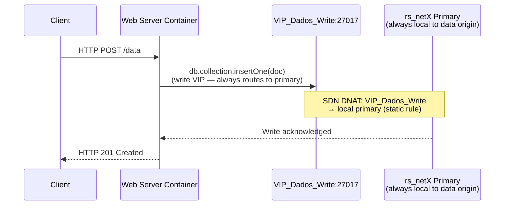

---

## Scenario 12 — Server: Metric Reporting

A background collector thread in the web server snapshots the delay ring buffers and resource metrics and writes a single document (upsert by `_id`) to Local MongoDB. The Aggregation Script periodically reads from Local MongoDB and pushes a summary to the pub/sub channel that Thread 2 subscribes to.

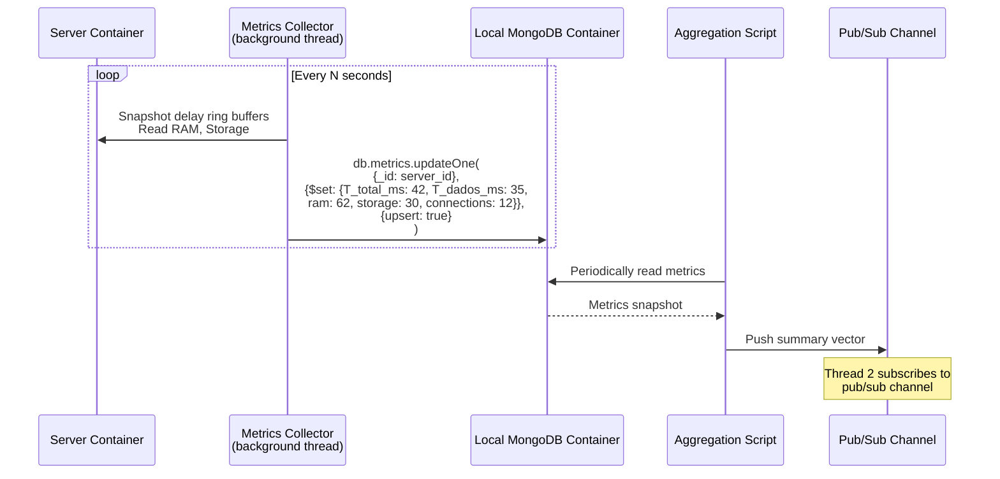

---

## Scenario 13 — Local MongoDB and Pub/Sub Overview

All server containers write to the same `metrics` collection in Local MongoDB. An Aggregation Script reads from this collection and pushes summarised vectors to a pub/sub channel. Thread 2 subscribes to that channel and receives the summaries.

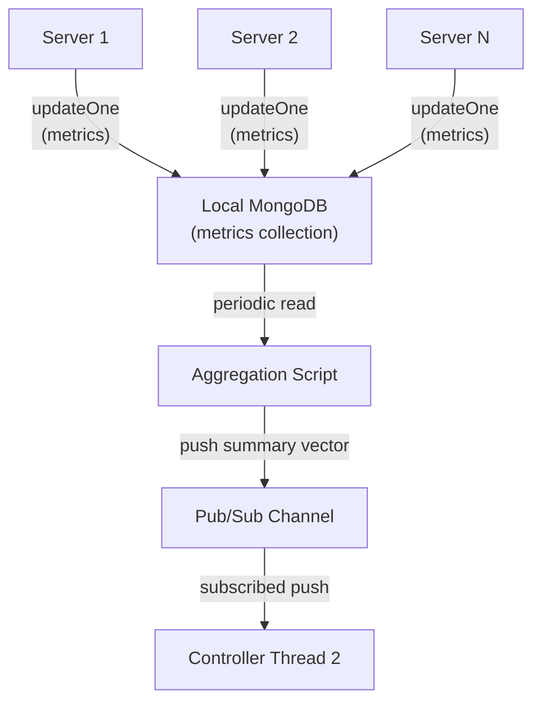

---

## Scenario 14 — Pub/Sub: Threshold Breach Detected

A server reports high $T_{dados}$. The Aggregation Script reads from Local MongoDB and publishes the summary to the pub/sub channel. Thread 2 receives the published message, computes $T_{proc}$, finds $T_{dados}$ above threshold, and triggers the Data Manager.

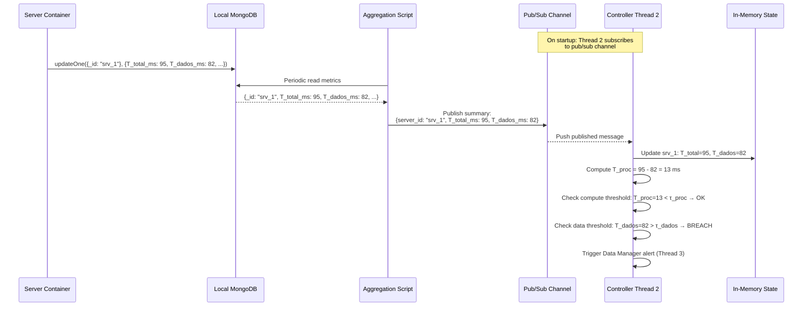

---

## Scenario 15 — SSR: Edge-Based (Tier 1 or Tier 2 active)

A `GET /view/profile` request triggers two `VIP_Dados` queries (template + data). Both are served locally because the SDN DNAT rule routes `VIP_Dados` to a local cache or secondary. $T_{dados} \approx 2 \times \text{LAN latency}$.


---

## Scenario 16 — SSR: No Local Data (Tier 0)

Same `GET /view/profile` request, but `VIP_Dados` is routing to the remote primary. Both queries cross the network. $T_{dados} \approx 2 \times \text{Remote RTT}$.

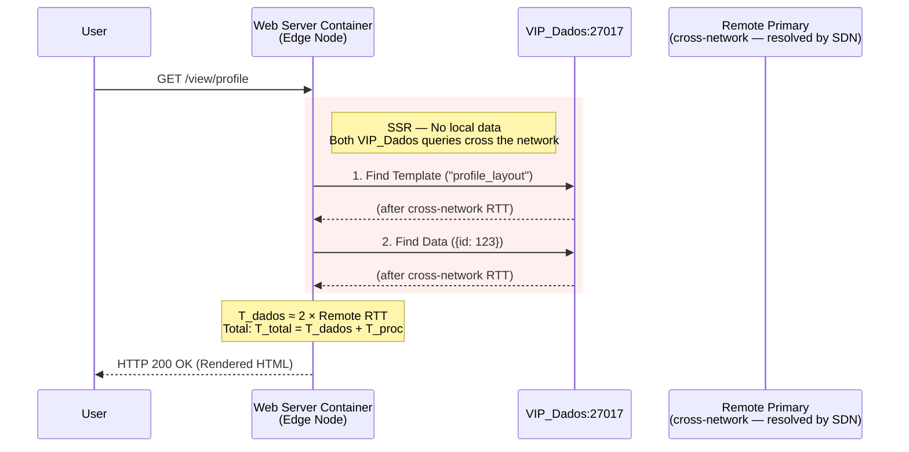

---

## Scenario 17 — End-to-End: Full Control Loop

The complete cycle from a server reporting a metric to the controller taking infrastructure action.

```mermaid
sequenceDiagram
    participant Server as Server Container
    participant LocalMongo as Local MongoDB
    participant AggScript as Aggregation Script
    participant PubSub as Pub/Sub Channel
    participant T2 as Controller Thread 2
    participant T3comp as Thread 3: Compute Manager
    participant T3data as Thread 3: Data Manager
    participant T1 as Controller Thread 1
    participant Docker as Docker Engine
    participant OVS as OVS Switch

    Server->>LocalMongo: Periodic metric update (T_total, T_dados, ram, ...)
    AggScript->>LocalMongo: Read metrics
    LocalMongo-->>AggScript: Metrics snapshot
    AggScript->>PubSub: Push summary vector
    PubSub-->>T2: Published message (subscribed)
    T2->>T2: Update in-memory state
    T2->>T2: Compute T_proc = T_total - T_dados

    Note over T2,T1: Normal: Thread 1 uses T_proc<br/>for WSM cost function (VIP_Web routing)

    alt T_proc > τ_proc (compute bottleneck)
        T2->>T3comp: Alert: compute delay high
        T3comp->>T3comp: Run MBFD on compute space
        T3comp->>Docker: Spawn new web server
        T3comp->>OVS: Attach to network
        T3comp->>T1: Update server registry
        Note over T1: New web server available<br/>for VIP_Web routing
    else T_dados > τ_dados (data bottleneck)
        T2->>T3data: Alert: data delay high
        T3data->>T3data: Evaluate tier transition
        T3data->>Docker: Spawn cache or replica
        T3data->>OVS: Attach to network
        T3data->>T1: Update VIP_Dados DNAT in MDVBP map
        Note over T1: Next VIP_Dados Packet-In<br/>routes to new local endpoint
    else idle (scale-in)
        T2->>T3comp: Alert: server idle
        T3comp->>Docker: Remove container
        T3comp->>OVS: Remove port
        T3comp->>T1: Update server registry
    end
```
