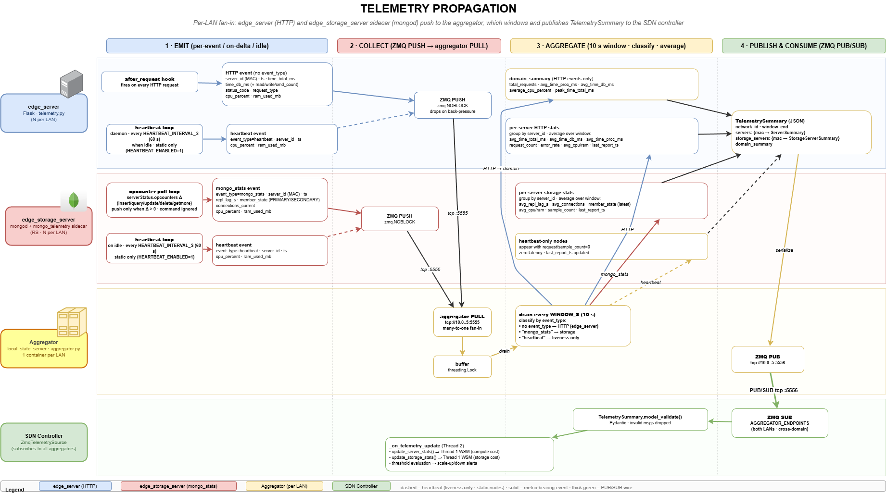

# Telemetry Pipeline — Overview

## Purpose

The telemetry pipeline collects latency, resource-usage, and liveness data
from every edge container, aggregates it per-network in time windows, and
delivers structured summaries to the SDN controller.

---

## End-to-End Flow

```
Producer Side                       Aggregation                   Controller Side
─────────────────────────────────   ────────────────────────      ───────────────────────
edge_server         (Flask) ──┐
edge_storage_server (mongod) ─┤  ┌──────────────────────┐        ┌──────────────────────┐
edge_selective_storage       ─┘  │  aggregator.py       │        │  controller           │
        │                        │  ZMQ PULL (raw events)│        │  ZMQ SUB (summaries)  │
        └── ZMQ PUSH ──────────► │  windowed averaging  │ ──►    │  VIP routing           │
                                 │  ZMQ PUB (summaries)  │        │  elasticity decisions  │
                                 └──────────────────────┘        │  storage-role sync     │
                                                                 │  selective-sync coord  │
                                                                 └──────────────────────┘
```

One aggregator runs per network. Each controller retrieves summaries from both
aggregators because VIP routing is cross-domain.

**Transport:** summaries are delivered via ZMQ PUB/SUB (push, default) or
HTTP polling (`TELEMETRY_SOURCE=poll`, see § Future Work). Control events and
topology snapshots always use ZMQ push regardless of the telemetry source mode.



---

## Document Map

Detailed behaviour is split by pipeline stage:

| Stage | Document |
| ----- | -------- |
| Producer side — compute | [producer_side/compute_telemetry.md](producer_side/compute_telemetry.md) |
| Producer side — storage | [producer_side/storage_telemetry.md](producer_side/storage_telemetry.md) |
| Producer side — selective sync | [producer_side/selective_sync_telemetry.md](producer_side/selective_sync_telemetry.md) |
| Aggregation & publication | [aggregation_publication/aggregator.md](aggregation_publication/aggregator.md) |
| Controller-side consumer | [controller_side/controller_telemetry_consumer.md](controller_side/controller_telemetry_consumer.md) |
| Polling mechanism (RQ1) | [implementation/rq1_polling_mechanism/rq1_polling_mechanism_plan.md](implementation/rq1_polling_mechanism/rq1_polling_mechanism_plan.md) |

---

## Controller Consumption Summary

The controller consumes aggregated telemetry summaries for:

- **VIP routing** — per-server stats feed WSM cost-function scoring in Thread 1.
- **Elasticity** — domain-level averages trigger scale-up / scale-down in
  Thread 2 → Thread 3.
- **Storage-role synchronisation** — `member_state` transitions drive VIP
  promotion of storage nodes.
- **Selective-sync coordination** — per-collection access counters and lag
  figures feed hotness evaluation and coordinator-state publication.

---

## Future Work

- **Staleness cost function** — `last_report_ts` is threaded through the
  pipeline but not yet consumed by WSM scoring.
- **HTTP polling transport** — implemented (2026-06-11). The aggregator
  caches each `TelemetrySummary` in memory and serves it via HTTP on port
  `5558` (`GET /latest_summary`). The controller-side `PollingTelemetrySource`
  polls both aggregators concurrently at a configurable interval
  (`POLL_INTERVAL_S`, default 10 s). Enabled via `TELEMETRY_SOURCE=poll`.
  See `implementation/rq1_polling_mechanism/rq1_polling_mechanism_plan.md`.
