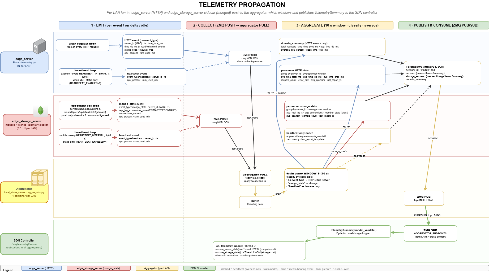

# Telemetry Pipeline — Overview

## Purpose

The telemetry pipeline collects latency, resource-usage, and liveness data
from every edge container, aggregates it per-network in time windows, and
delivers structured summaries to the SDN controller.

---

## End-to-End Flow

```
Producer Side                       Aggregation                   Controller Side
─────────────────────────────────   ────────────────────────      ───────────────────────
edge_server         (Flask) ──┐
edge_storage_server (mongod) ─┤  ┌──────────────────────┐        ┌──────────────────────┐
edge_selective_storage       ─┘  │  aggregator.py       │        │  controller           │
        │                        │  ZMQ PULL (raw events)│        │  ZMQ SUB (summaries)  │
        └── ZMQ PUSH ──────────► │  windowed averaging  │ ──►    │  VIP routing           │
                                 │  ZMQ PUB (summaries)  │        │  elasticity decisions  │
                                 └──────────────────────┘        │  storage-role sync     │
                                                                 │  selective-sync coord  │
                                                                 └──────────────────────┘
```

One aggregator runs per network. Each controller retrieves summaries from both
aggregators because VIP routing is cross-domain.

**Transport:** summaries are delivered via ZMQ PUB/SUB (push, default,
`TELEMETRY_SOURCE=zmq`) or over HTTP — latest-state polling
(`TELEMETRY_SOURCE=poll`) and the RQ1 window-log delivery modes
(`TELEMETRY_SOURCE=event_preserving`, `delayed_event_preserving`). See
§ RQ1 Delivery Semantics. Control events and topology snapshots always use
ZMQ push regardless of the telemetry source mode.



---

## Document Map

Detailed behaviour is split by pipeline stage:

| Stage | Document |
| ----- | -------- |
| Producer side — compute | [producer_side/compute_telemetry.md](producer_side/compute_telemetry.md) |
| Producer side — storage | [producer_side/storage_telemetry.md](producer_side/storage_telemetry.md) |
| Producer side — selective sync | [producer_side/selective_sync_telemetry.md](producer_side/selective_sync_telemetry.md) |
| Aggregation & publication | [aggregation_publication/aggregator.md](aggregation_publication/aggregator.md) |
| Controller-side consumer | [controller_side/controller_telemetry_consumer.md](controller_side/controller_telemetry_consumer.md) |
| Delivery semantics (RQ1) | [implementation/rq1_delivery_semantics/rq1_delivery_semantics_plan.md](implementation/rq1_delivery_semantics/rq1_delivery_semantics_plan.md) |

---

## Controller Consumption Summary

The controller consumes aggregated telemetry summaries for:

- **VIP routing** — per-server stats feed WSM cost-function scoring in Thread 1.
- **Elasticity** — domain-level averages trigger scale-up / scale-down in
  Thread 2 → Thread 3.
- **Storage-role synchronisation** — `member_state` transitions drive VIP
  promotion of storage nodes.
- **Selective-sync coordination** — per-collection access counters and lag
  figures feed hotness evaluation and coordinator-state publication.

---

## RQ1 Delivery Semantics (Design B)

Implemented 2026-07-31 for RQ1 (the "required extension" from
`tese/Notes/thesis_overview.md`). Full spec:
`implementation/rq1_delivery_semantics/rq1_delivery_semantics_plan.md`.

- **Window universe** — every `WINDOW_S` interval is a window with a
  monotonic `window_seq` (`window_id = f"{NETWORK_ID}:{window_seq}"`). Every
  window is **always published**, including empty/idle windows
  (`servers={}`, `storage_servers={}`, `domain_summary=None`,
  `overload=False`). Control mini-summaries (`drain_complete`,
  `rs_secondary_ready`) keep `window_seq=None` and are never part of the
  window universe.
- **Overload labelling** — each real window carries a producer-side
  `overload: bool` label computed from pre-registered thresholds
  (`OVERLOAD_CPU_PCT`, `OVERLOAD_PEAK_LATENCY_MS`, `OVERLOAD_ERROR_RATE`),
  identical across arms/runs.
- **Window log** — every published window is appended to a durable JSONL
  (`WINDOW_LOG_PATH`, default `/tmp/window_log.jsonl`) and an in-memory ring
  (`WINDOW_LOG_RETENTION`), with boot-time tail reload so `window_seq` is
  restart-continuous. Served over HTTP on port `5558` via
  `ThreadingHTTPServer`: `GET /latest_summary`, `GET /window?seq=N`,
  `GET /windows?after_seq=N&limit=K`, `POST /ack` (appends to a separate
  `ack_log.jsonl`).
- **Delivery log** — the controller records every observed window (per
  network) to a shared CSV (`DELIVERY_LOG_PATH`, default
  `/tmp/telemetry_delivery_log.csv`) with columns
  `network_id, window_seq, window_id, window_end, delivery_ts, delay_s,
  mode, release_ts`.
- **Delivery modes** — `TELEMETRY_SOURCE ∈ {zmq, poll, event_preserving,
  delayed_event_preserving}`. `zmq` remains the default; `event_preserving`
  pulls windows in order from the log and acks each one;
  `delayed_event_preserving` holds windows in a FIFO queue and releases them
  at `window_end + DELAY_S`. Control events + topology always arrive via ZMQ
  regardless of mode.
- **Design-B housekeeping split** — absent-node detection and scale-down
  evaluation moved off telemetry arrival to a fixed ticker
  (`_housekeeping_loop`, `CONTROL_TICK_S`, default 10 s), evaluated once per
  delivered `window_seq`.

---

## Future Work

- **Staleness cost function** — `last_report_ts` is threaded through the
  pipeline but not yet consumed by WSM scoring.
- **HTTP polling transport** — implemented (2026-06-11) and now one of the
  RQ1 delivery modes (see § RQ1 Delivery Semantics). The aggregator caches
  each `TelemetrySummary` in memory and serves it via HTTP on port `5558`
  (`GET /latest_summary`). The controller-side `PollingTelemetrySource` polls
  both aggregators concurrently at a configurable interval
  (`POLL_INTERVAL_S`, default 10 s). Enabled via `TELEMETRY_SOURCE=poll`.
  See `implementation/rq1_delivery_semantics/rq1_delivery_semantics_plan.md`.
