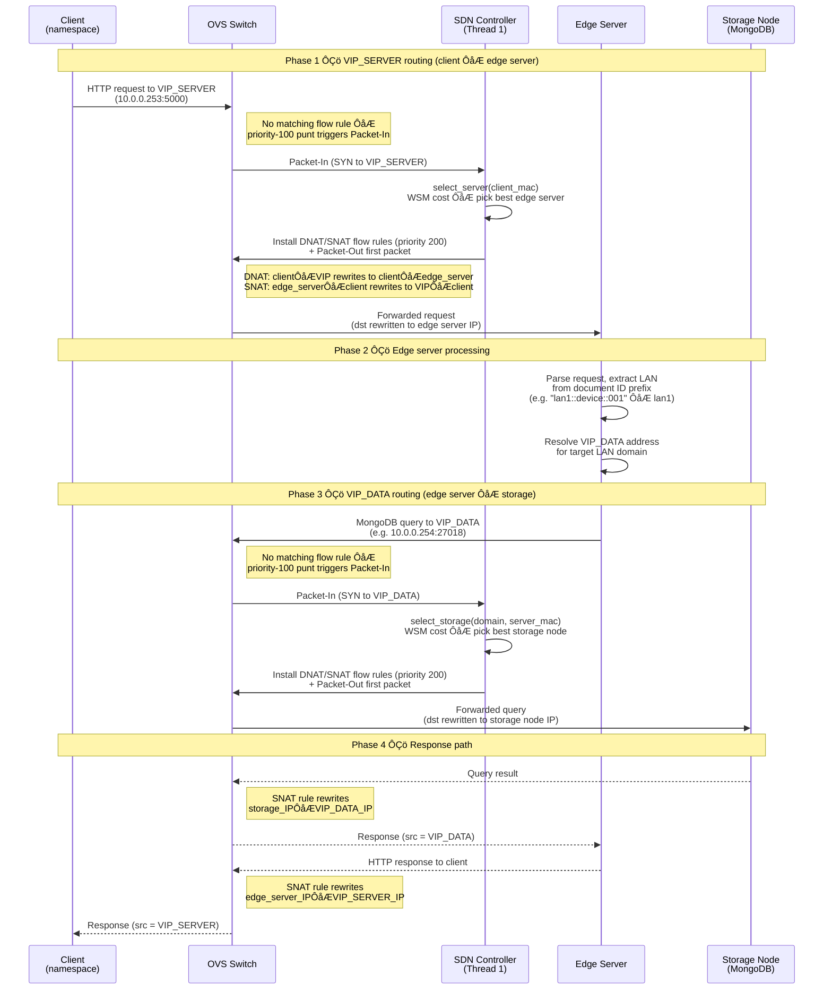

# VIP Routing ÔÇö Overview

## Purpose

`VipRoutingMixin` intercepts traffic destined for virtual IP addresses and
load-balances it across backend containers using multi-dimensional WSM (Weighted
Sum Model) cost functions. It handles ARP virtualization, DNAT/SNAT flow rule
installation, and cross-network forwarding via the inter-LAN router.

This is **not a new thread**. All methods run inline in Thread 1's
`packet_in_handler` ÔÇö same greenthread, same event loop. State written by
Thread 2 (`_server_stats`, `_storage_stats`) is read here without locks because
eventlet uses cooperative switching and these dicts are only mutated between
yield points.

---

## Architecture

```
KenLearnAndLog(VipRoutingMixin, TopologyMixin, OSKenApp)
       Ôöé
       Ôö£ÔöÇÔöÇ Thread 1 (OS-Ken event loop) ÔöÇÔöÇÔöÇ packet_in_handler()
       Ôöé       Ôöé
       Ôöé       Ôö£ÔöÇ snoop_arp()  ÔöÇÔöÇÔöÇÔöÇÔöÇÔöÇÔöÇÔöÇÔöÇÔöÇÔöÇÔöÇÔöÇÔû║ learn IP Ôåö MAC
       Ôöé       Ôöé
       Ôöé       Ôö£ÔöÇ Is VIP packet? ÔöÇÔöÇYesÔöÇÔöÇÔû║ handle_vip_packet_in()
                                             ARP for VIP?  _reply_vip_arp()
                                             VIP_SERVER?    select_server() + DNAT/SNAT
                                             VIP_DATA_N1?   select_storage("n1") + DNAT/SNAT
                                             VIP_DATA_N2?   select_storage("n2") + DNAT/SNAT
       Ôöé       Ôöé
       Ôöé       ÔööÔöÇ Not VIP ÔöÇÔöÇÔöÇÔöÇÔöÇÔöÇÔöÇÔöÇÔöÇÔöÇÔöÇÔöÇÔû║ existing L2 learning logic
       Ôöé
      Ôö£ÔöÇÔöÇ Thread 2 (ZMQ subscriber) ÔöÇÔöÇ _on_telemetry_update()
      Ôöé       Ôö£ÔöÇ process_secondary_events() / telemetry fallback
                  _promote_storage_backend()
                  add_storage_mac() + mark_storage_backend_warm()
      Ôöé       Ôö£ÔöÇ update_server_stats() / update_storage_stats()
      Ôöé       ÔööÔöÇ maintain controller-side warm-lease inputs for later
      Ôöé            fresh storage selections
      Ôöé
      ÔööÔöÇÔöÇ Thread 3 (elasticity) ÔöÇÔöÇ register_new_server_backend() after spawning new containers
```

`VipRoutingMixin` must sit **before** `TopologyMixin` in the class MRO so that
its `_on_datapath_connected` hook runs first and installs VIP punt rules after
a switch reconnect.

---

## File Layout

```
source/sdn_controller/
Ôö£ÔöÇÔöÇ main_n1.py / main_n2.py       # Controller entry points ÔÇö class MRO:
Ôöé                                 #   KenLearnAndLog(VipRoutingMixin, TopologyMixin, OSKenApp)
                                 #   _on_telemetry_update()  update stats + threshold alerts
Ôö£ÔöÇÔöÇ vip_routing.py                # VipRoutingMixin ÔÇö ARP snooping, VIP intercept,
Ôöé                                 #   WSM cost functions, DNAT/SNAT rule pairs
```

---

## VIP Addresses

Three steady-state virtual IP addresses are managed today. The IPs and MACs are configured via
environment variables and stored as attributes on `TopologyMixin` (see the
[Topology Overview](../topology/topology_overview.md)):

| VIP                   | Env Vars (IP / MAC)                     | Purpose                                   |
| --------------------- | --------------------------------------- | ----------------------------------------- |
| **VIP_SERVER**  | `VIP_SERVER_IP`, `VIP_SERVER_MAC`   | HTTP edge servers (shared across domains) |
| **VIP_DATA_N1** | `VIP_DATA_N1_IP`, `VIP_DATA_N1_MAC` | MongoDB storage on LAN 1                  |
| **VIP_DATA_N2** | `VIP_DATA_N2_IP`, `VIP_DATA_N2_MAC` | MongoDB storage on LAN 2                  |
| **VIP_DATA_RECOVERY_N1** | `VIP_DATA_RECOVERY_N1_IP`, `VIP_DATA_RECOVERY_N1_MAC` | Temporary MongoDB recovery reconnect on LAN 1 |
| **VIP_DATA_RECOVERY_N2** | `VIP_DATA_RECOVERY_N2_IP`, `VIP_DATA_RECOVERY_N2_MAC` | Temporary MongoDB recovery reconnect on LAN 2 |

VIP_DATA is per-domain: edge servers on LAN 1 connect to `VIP_DATA_N1` to reach
LAN 1's MongoDB replica set, and to `VIP_DATA_N2` to reach LAN 2's. This
separation allows the WSM cost function to independently select the best storage
node in each domain.

The storage-recovery path still uses separate `VIP_DATA_RECOVERY_N1` and
`VIP_DATA_RECOVERY_N2` addresses after a real storage-path connection failure,
but the edge server no longer relies on a one-shot recovery client model.
`app.py` now seeds a fixed startup-defined LAN registry and tracks one current
epoch plus draining retired epochs per LAN. Each request now holds at most one
request-local lease per owner LAN, and that lease points to the bound epoch.
The epoch still owns mode (`normal` or `recovery`), bound VIP, lazy
`MongoClient`, lease counts, and bounded recovery expiry. Repeated DB blocks in
the same request reuse the same request-owned lease, request teardown releases
held leases once per LAN, and `AutoReconnect` rotates the current epoch to a
recovery epoch with compare-and-swap semantics for future admissions. Old
requests keep their leased epoch, new admitted requests lease the new current
epoch, and background housekeeping rolls expired recovery epochs back to
normal. `T_dados` is now observation-only and never forces reconnection. See
[../other/edge_storage_connection_hard_failure_epoch_plan.md](../other/edge_storage_connection_hard_failure_epoch_plan.md).
The design background remains documented in
[implementation/vip_data_recovery_vip_arming_plan.md](./implementation/vip_data_recovery_vip_arming_plan.md)
and
[implementation/vip_data_recovery_epoch_model.md](./implementation/vip_data_recovery_epoch_model.md).

### Scope ÔÇö Tier 0 and Tier 2 only

VIP routing covers the Tier 0 (direct cross-region read over `VIP_DATA_N*`) and
Tier 2 (full replica-set member behind the owner LAN's `VIP_DATA`) paths. It
does **not** participate in Tier 1 selective-sync selection. Tier 1 is routed
**client-side** inside the edge-server container: the `cached_collection(...)`
wrapper in `source/docker/edge_server/source/platform_cache.py` consults the
controller-broadcast `tier1_manifest` and short-circuits point-lookups on hot
doc ids to the local standalone `mongod` on port `27018`; all other reads and
every write fall through to `VIP_DATA_N*` as normal. Routing Tier 1 at the SDN
layer would require MongoDB wire-protocol inspection in the controller, which
is rejected on principle. See
[`selective_sync/selective_sync_overview.md`](../selective_sync/selective_sync_overview.md).

---

## MAC  IP Resolution

For DNAT/SNAT rules the controller needs both the MAC and IP of the selected
backend. The `_mac_to_ip` / `_ip_to_mac` dictionaries (defined in
`VipRoutingMixin.__init__`) are populated from three sources:

1. **ARP snooping** (`snoop_arp()`) ÔÇö any ARP packet that reaches the controller
   has its sender IP/MAC recorded. This is the authoritative source and
   overwrites static seeds.
2. **Flush + ping bootstrap** ÔÇö instead of `arping` (which may not be installed
   in containers), the network setup scripts use flush + ping to force ARP
   resolution at startup.
3. **Peer topology seeding** ÔÇö `TopologyMixin.on_topology_update()` calls
   `register_backend_ip(mac, ip)` for every peer host that carries an `ip`
   field in its `TopologyHostEntry`. This ensures the controller can route to
   peer backends immediately without waiting for cross-network ARP traffic.

Thread 3 uses `register_new_server_backend()` for compute nodes so VIP routing
adds the MAC to `VIP_SERVER`, seeds the backend IP, and creates the compute
warm lease in one controller-side step. Storage additions still pre-seed
`_mac_to_ip` via `register_backend_ip()` before the node is admitted into
`VIP_DATA`.

---

## ARP Interception

When a client sends an ARP request for any VIP address, the controller generates
a crafted ARP reply with the VIP's virtual MAC address. This is reactive
(triggered by `packet_in` via `_reply_vip_arp()`).

To ensure VIP ARP requests always reach the controller instead of being flooded
by the topology layer's ARP flood rule (priority 1), persistent punt rules are
installed at priority 100:

- `install_vip_arp_punt_rules()` ÔÇö matches `eth_type=0x0806, arp_tpa=<VIP_IP>`,
  outputs to controller.
- `install_vip_punt_rules()` ÔÇö matches `eth_type=0x0800, ipv4_dst=<VIP_IP>`,
  outputs to controller.

Both are reinstalled automatically via the `_on_datapath_connected` hook
whenever a switch reconnects and stale flows are flushed.

Only ICMP (1), TCP (6), and UDP (17) are handled as valid `ip_proto` match
values. Other protocols (ESP, GRE, etc.) are passed through to normal L2
processing.

---

## Backend Selection ÔÇö WSM Cost Functions

### Server Selection (VIP_SERVER)

`select_server(client_mac)` picks the HTTP server with the lowest cost:

$$
Cost_j = w_{cpu} \cdot \frac{CPU_j}{CPU_{max}} + w_{ram} \cdot \frac{RAM_j}{RAM_{max}} + w_{req} \cdot \frac{Req_j}{Req_{max}} + w_{hops} \cdot \frac{Hops_j}{Hops_{max}}
$$

Default weights: `W_CPU=0.2`, `W_RAM=0.2`, `W_REQUESTS=0.2`, `W_HOPS=0.4`.

### Storage Selection (VIP_DATA)

`select_storage(domain, client_mac, *, recovery=False)` picks the storage node with the lowest cost
from the domain's pool (`vip_storage_pool_n1` or `vip_storage_pool_n2`):

$$
Cost_j = w_{cpu} \cdot \frac{CPU_j}{CPU_{max}} + w_{ram} \cdot \frac{RAM_j}{RAM_{max}} + w_{conn} \cdot \frac{Conn_j}{Conn_{max}} + w_{lag} \cdot \frac{Lag_j}{Lag_{max}} + w_{hops} \cdot \frac{Hops_j}{Hops_{max}}
$$

Default weights: `W_STORAGE_CPU=0.2`, `W_STORAGE_RAM=0.2`,
`W_STORAGE_CONNECTIONS=0.1`, `W_STORAGE_LAG=0.2`, `W_STORAGE_HOPS=0.3`.

### Cold-Start and Tie-Breaking

- **Unknown telemetry:** backends without stats are assigned worst-case
  normalized scores (1.0) across all resource dimensions, preventing
  unmeasured nodes from being accidentally preferred over measured ones.
- **Round-robin:** when multiple backends share the lowest cost (common during
  cold start when all values are 0.0), a round-robin counter distributes
  traffic evenly. Each domain's storage pool has its own counter.
- **Last-normal attribution:** normal `VIP_DATA` selections remember the chosen
   backend per `(edge_server_mac, domain)` inside `VipRoutingMixin`. Recovery
   selections pass `recovery=True`, exclude that remembered normal backend when
   another candidate exists, then run the same warm-first/WSM selector stack
   without overwriting the remembered normal backend. Local storage removal via
   `unregister_storage_backend(...)` clears remembered entries that still point
   at the removed backend, while peer disappearance remains safe because the
   recovery filter falls back whenever the remembered backend is no longer in
   the current pool.

### Warm Leases

Newly admitted compute backends and newly promoted storage secondaries receive
bounded warm leases in `VipRoutingMixin`. Each lease is governed by a monotonic
expiry time only, and it is claimable only when the backend is already visible
in the concrete VIP pool and has a known backend IP.

Selection order is therefore:

1. Claim a warm lease if one is currently usable.
2. Fall back to the normal WSM cost function unchanged.

If multiple warm leases are claimable at once, the newest lease wins first.
This keeps the brief post-scale-up preference aligned with the latest admitted
backend under sustained load.

Compute warm leases are created by Thread 3 through
`register_new_server_backend(mac, ip)`. Storage warm leases are created by
Thread 2 when `_promote_storage_backend()` admits a `SECONDARY` into the
appropriate `VIP_DATA` membership set.

The current implementation plan also requires explicit warm-lease invalidation
on backend removal because dynamic MAC/IP identities are allocator-recycled.
Later admission still overwrites any prior lease before the backend becomes
claimable. See
[implementation/vip_warm_leases_plan.md](./implementation/vip_warm_leases_plan.md).

### Hop Estimation

Hops for each backend are resolved in priority order:

| Condition             | Hops assigned                                                |
| --------------------- | ------------------------------------------------------------ |
| Path in `hop_cache` | Real shortest-path length                                    |
| Local, no path yet    | `max(_avg_hop_count, 1.0)`                                 |
| Cross-network (peer)  | `max(_avg_hop_count, 1.0) + max(_peer_avg_hop_count, 1.0)` |
| Truly unknown MAC     | `hops_max` (worst case)                                    |

The `_avg_hop_count` is computed by `TopologyMixin._rebuild_hop_cache()` and
published in `TopologySnapshot.avg_hop_count`. The peer's value is stored as
`_peer_avg_hop_count` on receipt. The `max(..., 1.0)` guard prevents cold-start
zero values from making cross-network backends appear free.

---

## DNAT / SNAT Rule Installation

Once a backend is selected, `_install_vip_dnat_snat()` installs a flow rule
pair and Packet-Outs the first packet:

| Rule           | Priority | Match                                                                                          | Actions                                                                         |
| -------------- | -------- | ---------------------------------------------------------------------------------------------- | ------------------------------------------------------------------------------- |
| **DNAT** | 200      | `eth_src=client_mac, eth_dst=VIP_MAC, ipv4_src=client_ip, ipv4_dst=VIP_IP, ip_proto`         | `set_field(eth_dst=backend_mac, ipv4_dst=backend_ip)`, output to backend port |
| **SNAT** | 200      | `eth_src=backend_mac, eth_dst=client_mac, ipv4_src=backend_ip, ipv4_dst=client_ip, ip_proto` | `set_field(eth_src=VIP_MAC, ipv4_src=VIP_IP)`, output to client port          |

Both rules have configurable idle/hard timeouts (`VIP_IDLE_TIMEOUT=30s`,
`VIP_HARD_TIMEOUT=120s`). When the DNAT rule expires, the priority-100 punt
rule resumes and triggers fresh backend selection.

**Source port exclusion:** TCP/UDP source port is intentionally omitted from the
match. For VIP_DATA, one rule per `(web_server_ip, domain_VIP)` pair covers all
concurrent MongoDB connections from that server, preventing tier-transition read
inconsistency. For VIP_SERVER, it ensures per-client server affinity across
parallel HTTP sub-connections.

**Output port resolution:** `get_next_hop_port()` is preferred for multi-switch
topologies. Falls back to `host_attachment` for single-switch (backend directly
connected). For cross-network backends, falls back to `ROUTER_OVS_PORT`.

---

## Cross-Network Routing

When the selected backend resides on the peer LAN (MAC found in `peer_hosts`),
the packet must traverse the inter-LAN router:

### Forward Path (Client  VIP  Cross-Network Backend)

1. DNAT rule outputs to `ROUTER_OVS_PORT` (OVS port connected to the router).
2. `eth_dst` is set to `ROUTER_MAC` (the router's LAN-side interface MAC) ÔÇö not
   the final backend MAC ÔÇö so the router's kernel accepts the frame for L3
   forwarding.
3. Router forwards based on `ipv4_dst`, rewrites MACs (standard L3 hop-by-hop).
4. Packet arrives at the peer LAN's OVS as a normal L2 frame addressed to the
   backend ÔÇö no second VIP interception occurs.

### Return Path (Backend  Client)

1. Backend responds normally; peer LAN forwards to router.
2. Router rewrites `eth_src` to its own LAN MAC.
3. SNAT rule on the originating controller matches `eth_src=ROUTER_MAC`
   (not the real backend MAC) and rewrites `eth_srcVIP_MAC`,
   `ipv4_srcVIP_IP`.
4. Client sees the response from the VIP address.

### Configuration

| Variable            | Purpose                                                          |
| ------------------- | ---------------------------------------------------------------- |
| `ROUTER_OVS_PORT` | OVS port number connected to the inter-LAN router (0 = disabled) |
| `ROUTER_MAC`      | Router's LAN-side interface MAC (per controller)                 |

Each controller receives its own `ROUTER_MAC` via `-e ROUTER_MAC=...` in the
`docker run` command in `build_network_setup.sh`.

---

## Edge Server Connection Model

Edge servers (`app.py`) connect to VIP_DATA addresses to reach MongoDB storage.
Since device documents are partitioned by LAN ÔÇö each seeded only into its origin
LAN's replica set ÔÇö the edge server routes each query to the correct VIP_DATA
address based on the `lan1`/`lan2` prefix in the document `_id` (e.g.
`lan1::device::042`  `VIP_DATA_N1`, `lan2::device::007`  `VIP_DATA_N2`).

### Per-LAN Epoch Clients

Each edge server now seeds a fixed startup-defined LAN registry at module
initialization. Startup requires matching normal and recovery VIP mappings for
every supported LAN; missing or mismatched LAN sets fail fast before telemetry
or background threads start.

For each LAN, `app.py` keeps LAN-local lifecycle state:

- current normal VIP and recovery VIP configuration
- one circuit breaker shared by all requests for that LAN
- one current epoch and zero or more retiring epochs

Each epoch owns the lazy `MongoClient`, the bound VIP path, recovery expiry,
and request lease counts. `maxPoolSize=1` still ensures exactly one DNAT
selection per LAN per edge server for each live epoch, while the epoch model
reduces the blast radius of a damaged connection by separating newer requests
from older leased client state.

The request boundary is now `timed_db(lan)`: it leases the current epoch,
materializes that epoch's client lazily, and records the leased epoch in the
request context for failure attribution. If a later VIP update or connection
failure rotates the current epoch, already leased requests keep using their old
epoch and bound VIP while new admitted requests move onto the new current epoch.

### LAN Resolution from Document IDs

Device and node IDs follow `{lan}::{type}::{number}` ÔÇö the LAN is
`id.split("::")[0]`. Each workload route resolves the target LAN:

| Route | `sensor_reports` / `device_registry` LAN | Local support state |
| ----------------- | -------------------------------------------------------------------- | -------------------- |
| `device_latest` | Parsed from `device_id` / `node_id` prefix | Local edge buffer only |
| `service_pressure` | ÔÇö | Local edge buffer only |
| `dashboard` | `node_id` prefix for registry; **both LANs** for sensor data | Local edge buffer only |

`service_pressure` never traverses `VIP_DATA`: it summarizes only the recent
request activity already buffered inside the serving edge process.

### Current VIP Update Surface and Recovery Path

`app.py` exposes a `/vip_data` PUT route that validates the full payload up
front, rejects malformed input or unknown LANs with JSON `400` responses, and
updates LAN-local normal VIP configuration under the owning LAN's lifecycle
lock. When a LAN's normal VIP changes, the edge server immediately replaces the
current epoch for that LAN with a new normal epoch bound to the new VIP.

The old leased epoch is moved to a retiring list and drains naturally; it is
not force-closed while requests still hold leases. This means `/vip_data`
changes only the storage path for newer admitted requests. The controller no
longer uses `/vip_data` refresh fan-out as the intended post-failure failover
mechanism.

Instead:

- a real `AutoReconnect` rotates the failed current epoch to a recovery epoch
   bound to `VIP_DATA_RECOVERY_*`
- the controller still installs narrow TCP-port-scoped recovery rules for that
   recovery VIP path
- background epoch housekeeping later rolls the current recovery epoch back to
   a normal epoch after its bounded local recovery window expires

See
[implementation/vip_data_recovery_vip_arming_plan.md](./implementation/vip_data_recovery_vip_arming_plan.md)
and
[implementation/vip_data_recovery_epoch_model.md](./implementation/vip_data_recovery_epoch_model.md).

### Storage Promotion and Recovery Path

When a dynamic storage node reaches `SECONDARY`, Thread 2 promotes it into the
correct `VIP_DATA` membership set and marks a short storage warm lease. That
controller-local Phase 1 work makes the promoted backend eligible to win the
next fresh storage selection that actually reaches Thread 1.

What it does not do by itself is force a distinct backend choice. Under the
current broad steady-state `VIP_DATA` rule, a fresh normal epoch still depends
on the controller's existing storage selection logic, and the selected backend
may be the same as before. The implemented recovery path therefore focuses on
edge-local blast-radius reduction rather than backend exclusion:

- failure or VIP updates rotate the LAN's current epoch onto a fresh local
   client object and a bound VIP path for newer requests
- already leased requests stay on their old epoch until they drain
- the controller's recovery VIP handling narrows the recovery flow, but it does
   not promise a different backend unless the chosen VIP path differs

See [../archive/vip_routing/implementation/vip_warm_leases_plan.md](../archive/vip_routing/implementation/vip_warm_leases_plan.md),
[../archive/vip_routing/implementation/vip_data_recovery_vip_arming_plan.md](../archive/vip_routing/implementation/vip_data_recovery_vip_arming_plan.md),
and
[implementation/vip_data_recovery_epoch_model.md](./implementation/vip_data_recovery_epoch_model.md).
The request-scoped lease baseline from the `02_` plan is now implemented: one
request-owned lease per owner LAN reuses the same epoch inside a request,
bounded replay-safe rebind governs failure cutover, and outcome visibility is
part of the serving-path model. The controller-side recovery-only avoidance
baseline from the `03_` plan is also implemented: recovery selection excludes
the remembered last normal backend when another candidate exists, local
unregister clears remembered entries, and peer disappearance remains safe via
pool-membership fallback. The `02_` and `03_` plan folders remain as phased
implementation history; use this overview,
[implementation/vip_data_recovery_epoch_model.md](./implementation/vip_data_recovery_epoch_model.md),
and [../system_mechanisms.md](../system_mechanisms.md) as the current baseline
reference. Only the optional replay-safety refinement in `02_` Phase 4 remains
open.

### Connection Failure Handling

Two mechanisms protect edge servers from lingering connections to
unreachable or overloaded storage nodes:

**Per-LAN Circuit Breaker.** Each LAN's MongoDB path has an independent
circuit breaker with three states:

| State     | Behaviour                                                            |
| --------- | -------------------------------------------------------------------- |
| CLOSED    | Normal operation ÔÇö queries proceed to `timed_db()` epoch checkout |
| OPEN      | Fail-fast ÔÇö`CircuitOpenError` raised immediately (no 3 s timeout) |
| HALF_OPEN | One probe request allowed; success  CLOSED, failure  re-OPEN     |

The circuit trips on `AutoReconnect` and stays OPEN for `CIRCUIT_COOLDOWN_S`
seconds (default 5).  Because `CircuitOpenError` inherits from `PyMongoError`,
existing endpoint `except PyMongoError` handlers return 503 without code
changes ÔÇö but the response is near-instant instead of blocking 3 seconds.

**Per-LAN T_dados Observation.** The `_check_tdados_threshold` after-request
hook still tracks cumulative MongoDB time **per LAN** in each request, but it
is now observation-only. Threshold breaches are logged and preserved for
telemetry or elasticity logic; they no longer rotate epochs or evict clients.

**Background Epoch Housekeeping.** A daemon housekeeping loop performs the two
runtime cleanup tasks that the old request-end hooks used to blur together:

- roll the current recovery epoch back to a normal epoch once its bounded local
   recovery window expires
- close retiring epochs only after their request leases drain, while logging
   overdue-drain warnings instead of force-closing active epochs

**Interaction with DNAT rules.** Rotating an epoch creates a fresh local client
object and a new connection attempt using the epoch's bound VIP, but it does
not itself claim backend exclusion. Under the broad steady-state `VIP_DATA`
match, a fresh normal epoch can still reach the same backend when the
controller's current selection rules choose it again. The recovery VIP path
still narrows the controller-visible recovery connection, and the circuit
breaker still prevents repeated immediate retries to the same dead path during
the cooldown window.

### Epoch Rationale

Epoch started here as a shared-client blast-radius reduction mechanism, but the
runtime only stays coherent if the same LAN-scoped object also owns request
attribution, bound VIP-path snapshots, bounded recovery lifecycle, `/vip_data`
validation cutover, and concurrency ownership. That is why the final edge
server model treats epoch, not the raw `MongoClient`, as the unit of
request-visible storage state over time.

---

## Telemetry Integration

Thread 2's `_on_telemetry_update()` callback (in `main_n*.py`) calls:

- `update_server_stats(servers)` ÔÇö stores per-server `ServerSummary` (CPU, RAM,
  request count) keyed by MAC. Read by `select_server()`.
- `update_storage_stats(storage_servers)` ÔÇö stores per-storage
  `StorageServerSummary` (CPU, RAM, connections, replication lag) keyed by MAC.
  Read by `select_storage()`.

Each container discovers its own MAC from `eth0` and includes it in telemetry
events. The aggregator forwards it as the dict key, establishing the link
between telemetry and VIP pool entries.

---

## Request Lifecycle ÔÇö Sequence Diagram

The following diagram shows the full end-to-end lifecycle of an HTTP request
through the double-VIP routing pipeline. It covers the first request (cold path)
where no DNAT/SNAT flow rules exist yet ÔÇö subsequent requests within the idle
timeout window bypass the controller entirely and hit the cached flow rules at
the switch.



---

## Flow Priority Summary

| Priority | Rule                          | Trigger             |
| -------- | ----------------------------- | ------------------- |
| 100      | VIP ARP punt  controller    | Switch connect      |
| 100      | VIP IP punt  controller     | Switch connect      |
| 200      | DNAT/SNAT (per-client, timed) | First VIP packet-in |

Lower-priority rules (0ÔÇô10) are installed by `TopologyMixin` ÔÇö see the
[Topology Overview](../topology/topology_overview.md).

---

## Environment Variables

| Variable                  | Default                      | Purpose                                                 |
| ------------------------- | ---------------------------- | ------------------------------------------------------- |
| `W_CPU`                 | `0.2`                      | Server WSM weight for CPU                               |
| `W_RAM`                 | `0.2`                      | Server WSM weight for RAM                               |
| `W_REQUESTS`            | `0.2`                      | Server WSM weight for request count                     |
| `W_HOPS`                | `0.4`                      | Server WSM weight for hop distance                      |
| `W_STORAGE_CPU`         | `0.2`                      | Storage WSM weight for CPU                              |
| `W_STORAGE_RAM`         | `0.2`                      | Storage WSM weight for RAM                              |
| `W_STORAGE_CONNECTIONS` | `0.1`                      | Storage WSM weight for connection count                 |
| `W_STORAGE_LAG`         | `0.2`                      | Storage WSM weight for replication lag                  |
| `W_STORAGE_HOPS`        | `0.3`                      | Storage WSM weight for hop distance                     |
| `VIP_IDLE_TIMEOUT`      | `30`                       | DNAT/SNAT idle timeout (seconds)                        |
| `VIP_HARD_TIMEOUT`      | `120`                      | DNAT/SNAT hard timeout (seconds)                        |
| `ROUTER_OVS_PORT`       | `0`                        | OVS port to inter-LAN router (0 = disabled)             |
| `ROUTER_MAC`            | ÔÇö                           | Router LAN-side MAC for cross-network SNAT match        |
| `LAN_ID`                | `lan1`                     | Edge server's home LAN (replaces `REGION`)            |
| `DB_PORT`               | `27018`                    | MongoDB port for VIP_DATA addresses                     |
| `MAX_IDLE_MS`           | `VIP_IDLE_TIMEOUT ├ù 1000` | PyMongo `maxIdleTimeMS` ÔÇö socket recycling window    |
| `CIRCUIT_COOLDOWN_S`    | `5`                        | Per-LAN circuit breaker cooldown before probe (seconds) |
| `TAU_DADOS_MS`          | `5000`                     | Per-request DB time threshold for client eviction (ms)  |

---

## Planned / Not Yet Implemented

- **Staleness cost function** ÔÇö an additional WSM dimension penalizing backends
  whose telemetry has gone stale, so idle or unresponsive nodes are
  deprioritized instead of frozen at their last known cost.
