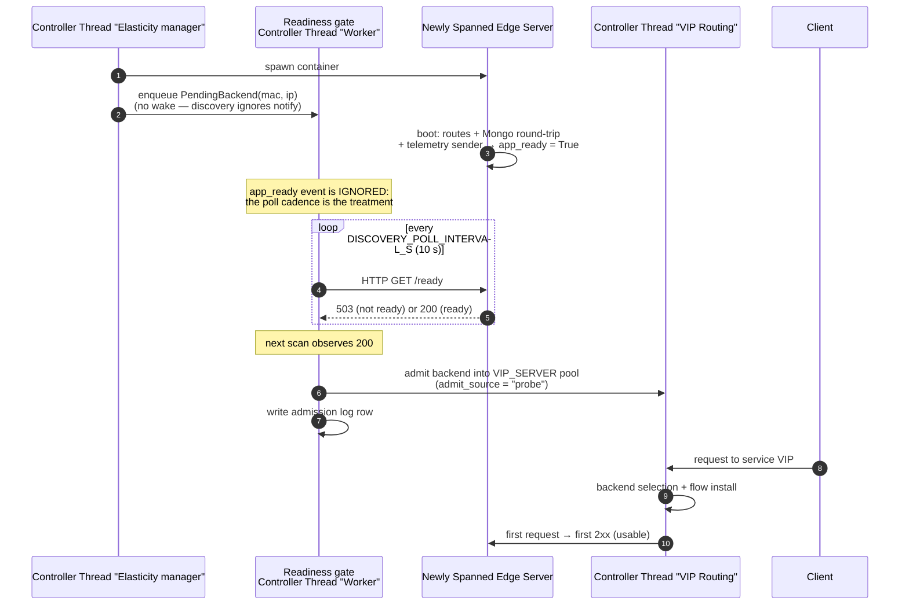
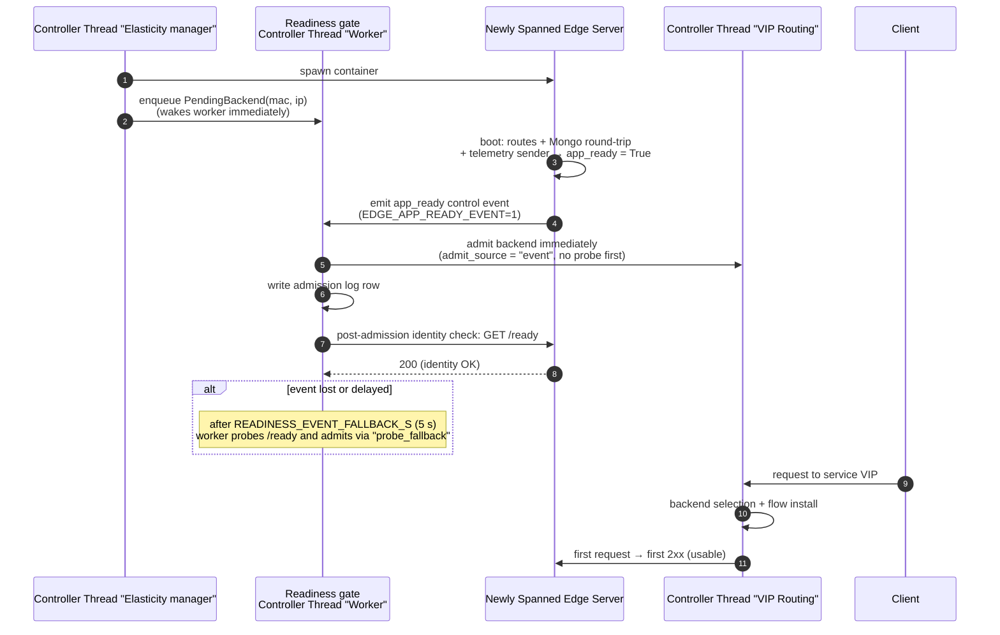

# RQ3 — Readiness Propagation: How It Works, in Simple Terms

> Companion diagrams for `rq3.md` (Readiness Propagation and Traffic Admission).
> One question, two modes: when a new compute backend is spawned, how does the
> controller learn that it is ready to serve traffic?

---

## The idea in one paragraph

When the controller decides to scale up, it spawns a new edge-server container.
That container takes time to become *usable*: it must boot, register its Flask
routes, complete a first MongoDB round-trip, and start its telemetry sender.
The moment it is usable is called **app-ready**. The question is how the
routing plane finds out that the new backend is ready to receive traffic:

- **Lifecycle notification (direct):** the new backend *tells* the controller
  "I'm ready", and the controller admits it into the pool immediately — like a
  colleague calling to say they've arrived.
- **Periodic discovery:** the controller *asks* on a fixed timer ("are you
  ready yet?") and admits the backend only on the next successful check — like
  checking the arrivals board every 10 minutes.

The difference shows up as **admission delay**: discovery can leave a ready
backend dark for up to one full poll period (the ~7 s quantization measured in
the campaign); notification admits essentially instantly (0.001 s median).

---

## Involved components

| Component                               | Role                                                                                                         |
| --------------------------------------- | ------------------------------------------------------------------------------------------------------------ |
| **Elasticity manager (Thread 3)** | Decides to scale up, spawns the container (`add_edge_server`)                                              |
| **Readiness gate**                | Registry of spawned-but-not-yet-admitted backends; owns the probe worker thread; decides admission           |
| **VIP routing plane**             | The pool that routes client traffic to backends (`VIP_SERVER`); "admission" = registration here            |
| **Edge server (new backend)**     | The spawned Flask app; exposes`/ready` (200 only when app-ready) and emits the `app_ready` control event |
| **Client**                        | Sends requests to the service VIP; the first successful request marks the backend "usable capacity"          |

---

## Mode 1 — Periodic discovery (10 s poll)

**Timing:** `spawn_complete → admitted` is quantized to `[0, 10 s]` — the
backend becomes ready at an arbitrary point in the cycle and is only observed
at the next scan.

---

## Mode 2 — Lifecycle notification (direct, event-driven)

**Timing:** admission happens on the event (~0.001 s median), with a safety
net — if the event never arrives, probing resumes after 5 s so a ready backend
is never left dark forever.

---

## Side-by-side

|                                   | Lifecycle notification (direct)                        | Periodic discovery                         |
| --------------------------------- | ------------------------------------------------------ | ------------------------------------------ |
| How readiness is learned          | Edge emits`app_ready` event; controller admits on it | Controller polls`/ready` every 10 s      |
| Admission delay (measured median) | 0.001 s                                                | ~7 s (up to one poll period)               |
| Failure mode                      | Lost/delayed event → fallback probe after 5 s         | Ready backend stays dark until next scan   |
| Robustness                        | Needs an event-absence safety net                      | Self-healing (re-checks state every cycle) |
| Admission log source              | `admit_source = "event"` / `"probe_fallback"`      | `admit_source = "probe"`                 |

---

## Where this lives in the system

- Implementation: `source/sdn_controller/readiness_gate.py` (`ReadinessGate`, `PendingBackend`).
- Plan: `docs/research_questions/v2/rq3/rq3_preparation.md`.
- Results: `tese/research_questions/rq3/rq3_evaluation_conclusions.md`, `docs/operation/testing/experiment/v2/rq3/results.md`.
